---

title: Bayesian Generative Models

type: mathematical_concept

status: draft

created: 2024-05-10

tags:

  - mathematics

  - probability

  - bayesian-inference

  - generative-models

  - machine-learning

  - probabilistic-programming

semantic_relations:

  - type: foundation

    links:

      - [[probability_theory]]

      - [[bayesian_inference]]

      - [[bayes_theorem]]

  - type: implements

    links:

      - [[latent_variable_models]]

      - [[bayesian_networks]]

      - [[variational_inference]]

  - type: related

    links:

      - [[bayesian_renormalization]]

      - [[continuous_discrete_inference]]

      - [[path_integral_bayesian_inference]]

      - [[markov_chain_monte_carlo]]

---

# Bayesian Generative Models

## Overview

Bayesian generative models represent a powerful framework for modeling complex data generation processes while maintaining explicit uncertainty quantification. These models leverage [[bayesian_inference|Bayesian inference]] principles to describe how observations arise from underlying latent variables through probabilistic mechanisms.

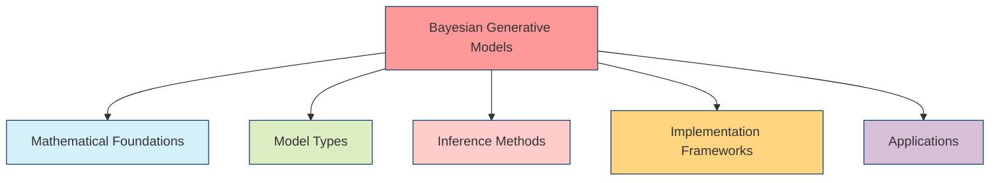

## Mathematical Foundations

### Generative Process

The core idea of a Bayesian generative model is to represent a data-generating process as:

```math

\begin{align}

\theta &\sim p(\theta) \quad \text{(Parameter Prior)}\\

z &\sim p(z|\theta) \quad \text{(Latent Variable)}\\

x &\sim p(x|z,\theta) \quad \text{(Observed Data)}

\end{align}

```

where:

- $\theta$ represents model parameters

- $z$ represents latent (unobserved) variables

- $x$ represents observed data

### Joint Distribution

The complete model specifies a joint distribution:

```math

p(x, z, \theta) = p(\theta)p(z|\theta)p(x|z,\theta)

```

Inference focuses on computing the posterior distribution:

```math

p(z, \theta|x) = \frac{p(x, z, \theta)}{p(x)} = \frac{p(\theta)p(z|\theta)p(x|z,\theta)}{\int\int p(\theta)p(z|\theta)p(x|z,\theta)d\theta dz}

```

### Hierarchical Structure

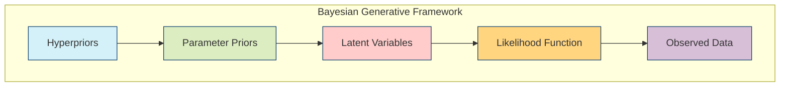

## Model Types

### Directed Graphical Models

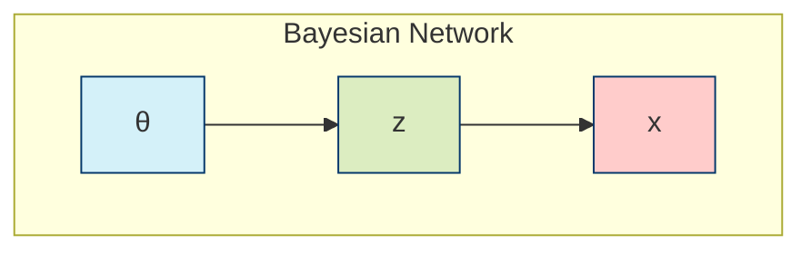

#### Latent Dirichlet Allocation (LDA)

```python

def lda_generative_process(alpha, beta, K, V, D, N):

    """

    Generative process for Latent Dirichlet Allocation

    Args:

        alpha: Dirichlet prior on document-topic distribution

        beta: Dirichlet prior on topic-word distribution

        K: Number of topics

        V: Vocabulary size

        D: Number of documents

        N: Number of words per document

    Returns:

        theta: Document-topic distributions

        phi: Topic-word distributions

        z: Topic assignments

        w: Generated words

    """

    import numpy as np

    from scipy.stats import dirichlet, multinomial

    # Sample topic-word distributions

    phi = np.zeros((K, V))

    for k in range(K):

        phi[k, :] = dirichlet.rvs(beta * np.ones(V), size=1)[0]

    # Initialize containers

    theta = np.zeros((D, K))

    z = np.zeros((D, N), dtype=int)

    w = np.zeros((D, N), dtype=int)

    # Generate documents

    for d in range(D):

        # Sample document-topic distribution

        theta[d, :] = dirichlet.rvs(alpha * np.ones(K), size=1)[0]

        # Generate words in the document

        for n in range(N):

            # Sample topic

            z[d, n] = np.random.choice(K, p=theta[d, :])

            # Sample word from topic

            w[d, n] = np.random.choice(V, p=phi[z[d, n], :])

    return theta, phi, z, w

```

### Hierarchical Models

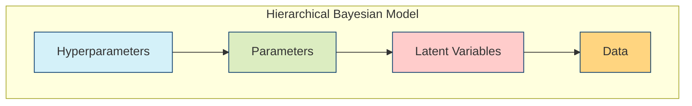

#### Hierarchical Linear Regression

```python

def hierarchical_linear_regression(X, group_idx, alpha_mu, alpha_sigma, 

                                   beta_mu, beta_sigma, sigma_shape, sigma_rate):

    """

    PyMC implementation of hierarchical linear regression

    Args:

        X: Feature matrix

        group_idx: Group indicators for each observation

        alpha_mu, alpha_sigma: Hyperprior parameters for intercepts

        beta_mu, beta_sigma: Hyperprior parameters for slopes

        sigma_shape, sigma_rate: Hyperprior parameters for noise

    Returns:

        Model object

    """

    import pymc as pm

    import numpy as np

    # Extract dimensions

    n_obs, n_features = X.shape

    n_groups = len(np.unique(group_idx))

    with pm.Model() as model:

        # Hyperpriors

        mu_alpha = pm.Normal('mu_alpha', mu=alpha_mu, sigma=alpha_sigma)

        sigma_alpha = pm.HalfNormal('sigma_alpha', sigma=1.0)

        mu_beta = pm.Normal('mu_beta', mu=beta_mu, sigma=beta_sigma, shape=n_features)

        sigma_beta = pm.HalfNormal('sigma_beta', sigma=1.0, shape=n_features)

        # Group-level parameters

        alpha = pm.Normal('alpha', mu=mu_alpha, sigma=sigma_alpha, shape=n_groups)

        beta = pm.Normal('beta', mu=mu_beta, sigma=sigma_beta, shape=(n_groups, n_features))

        # Likelihood error

        sigma = pm.Gamma('sigma', alpha=sigma_shape, beta=sigma_rate)

        # Expected value

        mu = alpha[group_idx] + pm.math.dot(X, beta[group_idx].T)

        # Likelihood

        Y = pm.Normal('Y', mu=mu, sigma=sigma, observed=None)  # Add data as observed later

    return model

```

### Deep Generative Models

```mermaid

graph TB

    subgraph "Deep Generative Model"

        A[Prior p(z)] --> B[Encoder Network q(z|x)]

        A --> C[Decoder Network p(x|z)]

        B --> D[Latent Space]

        D --> C

        C --> E[Reconstructed Data]

    end

    style A fill:#d4f1f9,stroke:#05386b

    style B fill:#dcedc1,stroke:#05386b

    style C fill:#ffcccb,stroke:#05386b

    style D fill:#ffd580,stroke:#05386b

    style E fill:#d8bfd8,stroke:#05386b

```

#### Variational Autoencoder (VAE)

```python

def variational_autoencoder(input_dim, latent_dim, hidden_dim):

    """

    TensorFlow implementation of a Variational Autoencoder

    Args:

        input_dim: Dimension of input data

        latent_dim: Dimension of latent space

        hidden_dim: Dimension of hidden layers

    Returns:

        encoder: Encoder model q(z|x)

        decoder: Decoder model p(x|z)

        vae: Full VAE model

    """

    import tensorflow as tf

    from tensorflow.keras import layers, Model

    # Encoder network

    encoder_inputs = tf.keras.Input(shape=(input_dim,))

    x = layers.Dense(hidden_dim, activation='relu')(encoder_inputs)

    z_mean = layers.Dense(latent_dim)(x)

    z_log_var = layers.Dense(latent_dim)(x)

    # Sampling layer

    def sampling(args):

        z_mean, z_log_var = args

        batch = tf.shape(z_mean)[0]

        dim = tf.shape(z_mean)[1]

        epsilon = tf.random.normal(shape=(batch, dim))

        return z_mean + tf.exp(0.5 * z_log_var) * epsilon

    z = layers.Lambda(sampling)([z_mean, z_log_var])

    encoder = Model(encoder_inputs, [z_mean, z_log_var, z], name="encoder")

    # Decoder network

    latent_inputs = tf.keras.Input(shape=(latent_dim,))

    x = layers.Dense(hidden_dim, activation='relu')(latent_inputs)

    decoder_outputs = layers.Dense(input_dim, activation='sigmoid')(x)

    decoder = Model(latent_inputs, decoder_outputs, name="decoder")

    # VAE model

    outputs = decoder(encoder(encoder_inputs)[2])

    vae = Model(encoder_inputs, outputs, name="vae")

    # Add KL divergence regularization loss

    kl_loss = -0.5 * tf.reduce_mean(

        z_log_var - tf.square(z_mean) - tf.exp(z_log_var) + 1

    )

    vae.add_loss(kl_loss)

    return encoder, decoder, vae

```

## Inference Methods

### Markov Chain Monte Carlo

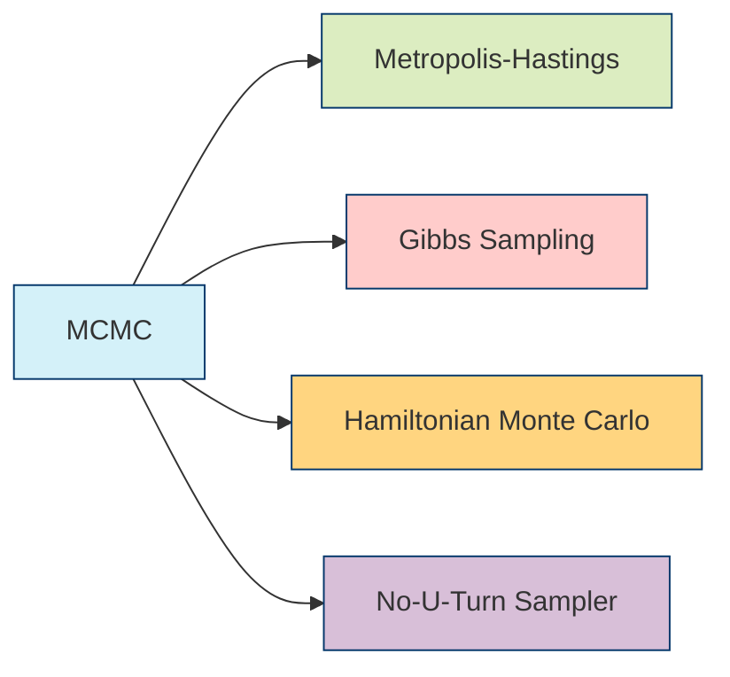

#### Hamiltonian Monte Carlo Implementation

```python

def hamiltonian_monte_carlo(log_prob_fn, initial_position, step_size, num_steps, num_samples):

    """

    Implement Hamiltonian Monte Carlo sampler

    Args:

        log_prob_fn: Function returning log probability and gradient

        initial_position: Starting point for the chain

        step_size: Leapfrog integrator step size

        num_steps: Number of leapfrog steps per iteration

        num_samples: Number of samples to generate

    Returns:

        samples: Generated samples

    """

    import numpy as np

    position = initial_position

    samples = [position.copy()]

    # Run HMC iterations

    for _ in range(num_samples):

        # Initialize momentum from standard Gaussian

        momentum = np.random.randn(*position.shape)

        current_momentum = momentum.copy()

        # Get initial log probability and gradient

        current_log_prob, current_gradient = log_prob_fn(position)

        # Initial half-step for momentum

        momentum += step_size * current_gradient / 2

        # Leapfrog steps

        for _ in range(num_steps):

            # Full step for position

            position += step_size * momentum

            # Recompute gradient at new position

            _, current_gradient = log_prob_fn(position)

            # Full step for momentum except at the end

            momentum += step_size * current_gradient

        # Final half-step for momentum

        momentum -= step_size * current_gradient / 2

        # Negate momentum for reversibility

        momentum = -momentum

        # Compute new log probability

        proposed_log_prob, _ = log_prob_fn(position)

        # Metropolis-Hastings acceptance criterion

        # Hamiltonian: H(p,q) = -log_prob(q) + 0.5*p^2

        current_hamiltonian = -current_log_prob + 0.5 * np.sum(current_momentum**2)

        proposed_hamiltonian = -proposed_log_prob + 0.5 * np.sum(momentum**2)

        acceptance_prob = min(1, np.exp(current_hamiltonian - proposed_hamiltonian))

        if np.random.rand() < acceptance_prob:

            # Accept the proposal

            samples.append(position.copy())

        else:

            # Reject and restore position

            position = samples[-1].copy()

            samples.append(position.copy())

    return np.array(samples)

```

### Variational Inference

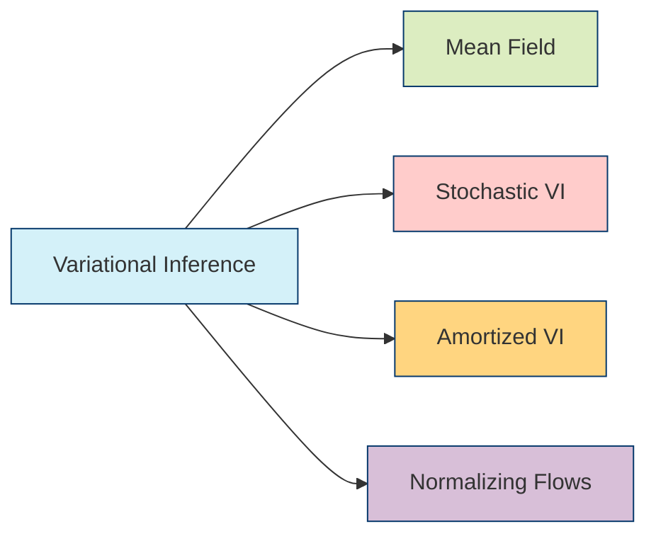

#### Automatic Differentiation Variational Inference (ADVI)

```python

def advi_implementation(model, data, learning_rate=0.01, num_iterations=10000):

    """

    PyMC implementation of ADVI

    Args:

        model: PyMC model

        data: Observed data

        learning_rate: Learning rate for optimizer

        num_iterations: Number of training iterations

    Returns:

        approximation: Variational approximation to posterior

    """

    import pymc as pm

    with model:

        # Set observed data if not already done

        pm.set_data(data)

        # Run ADVI

        approximation = pm.fit(

            method='advi',

            n=num_iterations,

            obj_optimizer=pm.adam(learning_rate=learning_rate)

        )

    return approximation

```

### Expectation-Maximization

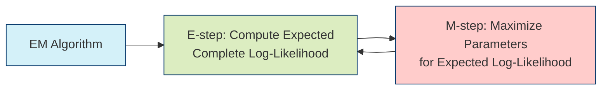

#### Gaussian Mixture Model with EM

```python

def gmm_em(X, K, max_iters=100, tol=1e-6):

    """

    Expectation-Maximization for Gaussian Mixture Models

    Args:

        X: Data matrix (n_samples, n_features)

        K: Number of mixture components

        max_iters: Maximum number of EM iterations

        tol: Convergence tolerance

    Returns:

        weights: Component weights

        means: Component means

        covs: Component covariance matrices

        responsibilities: Component assignments

    """

    import numpy as np

    from scipy.stats import multivariate_normal

    n_samples, n_features = X.shape

    # Initialize parameters

    weights = np.ones(K) / K

    means = X[np.random.choice(n_samples, K, replace=False)]

    covs = [np.eye(n_features) for _ in range(K)]

    log_likelihood = 0

    for iteration in range(max_iters):

        # E-step: Compute responsibilities

        responsibilities = np.zeros((n_samples, K))

        for k in range(K):

            responsibilities[:, k] = weights[k] * multivariate_normal.pdf(X, means[k], covs[k])

        # Normalize responsibilities

        responsibilities_sum = responsibilities.sum(axis=1, keepdims=True)

        responsibilities /= responsibilities_sum

        # M-step: Update parameters

        Nk = responsibilities.sum(axis=0)

        # Update weights

        weights = Nk / n_samples

        # Update means

        means = np.dot(responsibilities.T, X) / Nk[:, np.newaxis]

        # Update covariances

        for k in range(K):

            x_centered = X - means[k]

            covs[k] = np.dot(responsibilities[:, k] * x_centered.T, x_centered) / Nk[k]

            # Add regularization for numerical stability

            covs[k] += 1e-6 * np.eye(n_features)

        # Compute log-likelihood

        new_log_likelihood = 0

        for i in range(n_samples):

            log_likelihood_sample = 0

            for k in range(K):

                log_likelihood_sample += weights[k] * multivariate_normal.pdf(X[i], means[k], covs[k])

            new_log_likelihood += np.log(log_likelihood_sample)

        # Check convergence

        if abs(new_log_likelihood - log_likelihood) < tol:

            break

        log_likelihood = new_log_likelihood

    return weights, means, covs, responsibilities

```

## Implementation Frameworks

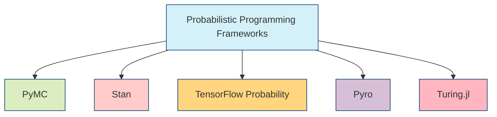

### PyMC Example: Gaussian Mixture Model

```python

def pymc_gmm(X, K):

    """

    PyMC implementation of Gaussian Mixture Model

    Args:

        X: Data matrix (n_samples, n_features)

        K: Number of mixture components

    Returns:

        model: PyMC model

    """

    import pymc as pm

    import numpy as np

    n_samples, n_features = X.shape

    with pm.Model() as model:

        # Mixture weights

        weights = pm.Dirichlet('weights', a=np.ones(K))

        # Component means

        means = pm.Normal('means', mu=0, sigma=10, shape=(K, n_features))

        # Component covariances (diagonal for simplicity)

        sigmas = pm.HalfNormal('sigmas', sigma=1, shape=(K, n_features))

        # Latent cluster assignments

        category = pm.Categorical('category', p=weights, shape=n_samples)

        # Likelihood

        obs = pm.Normal('obs', 

                       mu=means[category], 

                       sigma=sigmas[category],

                       observed=X)

    return model

```

### Stan Example: Hierarchical Model

```stan

// Hierarchical Normal Model in Stan

data {

  int<lower=0> N;            // Number of observations

  int<lower=0> J;            // Number of groups

  array[N] int<lower=1, upper=J> group;  // Group indicators

  vector[N] y;               // Observations

}

parameters {

  real mu_overall;           // Global mean

  real<lower=0> sigma_overall;  // Between-group standard deviation

  vector[J] mu_group;        // Group-specific means

  real<lower=0> sigma_within;   // Within-group standard deviation

}

model {

  // Priors

  mu_overall ~ normal(0, 10);

  sigma_overall ~ cauchy(0, 5);

  sigma_within ~ cauchy(0, 5);

  // Hierarchical structure

  mu_group ~ normal(mu_overall, sigma_overall);

  // Likelihood

  y ~ normal(mu_group[group], sigma_within);

}

generated quantities {

  vector[N] y_rep;           // Posterior predictive samples

  for (n in 1:N)

    y_rep[n] = normal_rng(mu_group[group[n]], sigma_within);

}

```

### TensorFlow Probability: Bayesian Neural Network

```python

def tfp_bayesian_neural_network(input_dim, hidden_units, output_dim):

    """

    TensorFlow Probability implementation of Bayesian Neural Network

    Args:

        input_dim: Input dimension

        hidden_units: Units per hidden layer

        output_dim: Output dimension

    Returns:

        model: Keras model with TFP layers

    """

    import tensorflow as tf

    import tensorflow_probability as tfp

    from tensorflow.keras import layers

    tfd = tfp.distributions

    tfpl = tfp.layers

    # Prior for weights: Normal(0, 1)

    prior_fn = lambda dtype, shape, name, trainable, add_variable_fn: tfd.Independent(

        tfd.Normal(loc=tf.zeros(shape, dtype),

                  scale=tf.ones(shape, dtype)),

        reinterpreted_batch_ndims=len(shape)

    )

    # Define model

    model = tf.keras.Sequential([

        tfpl.DenseVariational(

            hidden_units, 

            make_prior_fn=prior_fn,

            make_posterior_fn=tfpl.util.default_mean_field_normal_fn(),

            kl_weight=1/tf.cast(input_dim, tf.float32),

            activation='relu',

            input_shape=(input_dim,)

        ),

        tfpl.DenseVariational(

            hidden_units,

            make_prior_fn=prior_fn,

            make_posterior_fn=tfpl.util.default_mean_field_normal_fn(),

            kl_weight=1/tf.cast(hidden_units, tf.float32),

            activation='relu'

        ),

        tfpl.DenseVariational(

            output_dim * 2,  # Double for mean and variance

            make_prior_fn=prior_fn,

            make_posterior_fn=tfpl.util.default_mean_field_normal_fn(),

            kl_weight=1/tf.cast(hidden_units, tf.float32)

        ),

        tfpl.DistributionLambda(

            lambda t: tfd.Independent(

                tfd.Normal(loc=t[..., :output_dim],

                          scale=tf.nn.softplus(t[..., output_dim:])),

                reinterpreted_batch_ndims=1

            )

        )

    ])

    return model

```

### Turing.jl Example: Linear Mixed Effects Model

```julia

using Turing

using Random

using StatsPlots

using DataFrames

using Parameters

"""

Bayesian linear mixed effects model in Turing.jl

"""

@model function mixed_effects(X, groups, y; n_groups=length(unique(groups)))

    # Fixed effects priors

    n_predictors = size(X, 2)

    β ~ MvNormal(zeros(n_predictors), 10.0 * I)

    # Group-level effect priors

    σ_group ~ truncated(Cauchy(0, 5), 0, Inf)

    α ~ filldist(Normal(0, σ_group), n_groups)

    # Likelihood variance

    σ_y ~ truncated(Cauchy(0, 5), 0, Inf)

    # Likelihood

    μ = X * β + α[groups]

    y ~ MvNormal(μ, σ_y^2 * I)

    return nothing

end

"""

Fit mixed effects model and sample posterior

"""

function fit_mixed_effects(X, groups, y; n_chains=4)

    # Set up model

    model = mixed_effects(X, groups, y)

    # Run NUTS sampler

    chain = sample(model, NUTS(), MCMCThreads(), 1000, n_chains)

    return chain

end

"""

Generate predictions from posterior samples

"""

function predict_mixed_effects(chain, X_new, groups_new)

    # Extract posterior samples

    samples = Array(chain)

    n_samples = size(samples, 1)

    # Get parameters

    β_samples = samples[:, 1:size(X_new, 2)]

    α_samples = samples[:, (size(X_new, 2)+2):(size(X_new, 2)+1+length(unique(groups_new)))]

    σ_y_samples = samples[:, size(X_new, 2)+1]

    # Generate predictions

    predictions = zeros(n_samples, length(groups_new))

    for i in 1:n_samples

        μ = X_new * β_samples[i, :] + α_samples[i, groups_new]

        predictions[i, :] = μ

    end

    return predictions

end

```

## Applications

```mermaid

mindmap

  root((Bayesian<br>Generative<br>Models))

    Machine Learning

      Representation Learning

      Density Estimation

      Semi-supervised Learning

    Computer Vision

      Image Generation

      Scene Understanding

      3D Reconstruction

    Natural Language Processing

      Topic Modeling

      Language Generation

      Document Classification

    Science

      Physical Systems

      Computational Biology

      Causal Discovery

    Decision Making

      Reinforcement Learning

      Active Learning

      Experimental Design

```

### Scientific Discovery: Bayesian Model of Exoplanet Transit

```python

def exoplanet_transit_model(time, period, t0, depth, duration, baseline=1.0):

    """

    PyMC model for exoplanet transit light curve

    Args:

        time: Observation times

        period: Orbital period prior

        t0: Transit midpoint prior

        depth: Transit depth prior

        duration: Transit duration prior

        baseline: Out-of-transit flux level

    Returns:

        model: PyMC model object

    """

    import numpy as np

    import pymc as pm

    import exoplanet as xo

    with pm.Model() as model:

        # Orbital parameters

        log_period = pm.Normal("log_period", mu=np.log(period), sigma=0.1)

        period = pm.Deterministic("period", pm.math.exp(log_period))

        t0 = pm.Normal("t0", mu=t0, sigma=0.1)

        # Transit parameters

        log_depth = pm.Normal("log_depth", mu=np.log(depth), sigma=0.5)

        depth = pm.Deterministic("depth", pm.math.exp(log_depth))

        log_duration = pm.Normal("log_duration", mu=np.log(duration), sigma=0.5)

        duration = pm.Deterministic("duration", pm.math.exp(log_duration))

        # Set up orbit

        r = pm.Deterministic("r", pm.math.sqrt(depth))

        b = pm.Uniform("b", lower=0, upper=1+r)

        orbit = xo.orbits.KeplerianOrbit(period=period, t0=t0, b=b)

        # Compute light curve model

        light_curve = xo.LimbDarkLightCurve([0.3, 0.2])

        flux = baseline - light_curve.get_light_curve(

            orbit=orbit,

            r=r,

            t=time,

            texp=0.02

        )[:,0]

        # Noise model

        sigma = pm.InverseGamma("sigma", alpha=2.0, beta=1.0)

        # Likelihood

        pm.Normal("obs", mu=flux, sigma=sigma, observed=None)  # Add data as observed later

    return model

```

### Computer Vision: Variational Autoencoder with Convolutional Layers

```python

def convolutional_vae(input_shape, latent_dim):

    """

    Convolutional Variational Autoencoder for image generation

    Args:

        input_shape: Image shape (height, width, channels)

        latent_dim: Dimension of latent space

    Returns:

        encoder: Encoder model

        decoder: Decoder model

        vae: Full VAE model

    """

    import tensorflow as tf

    from tensorflow.keras import layers, Model

    import tensorflow_probability as tfp

    # Encoder network

    encoder_inputs = tf.keras.Input(shape=input_shape)

    x = layers.Conv2D(32, 3, activation="relu", strides=2, padding="same")(encoder_inputs)

    x = layers.Conv2D(64, 3, activation="relu", strides=2, padding="same")(x)

    x = layers.Flatten()(x)

    x = layers.Dense(256, activation="relu")(x)

    z_mean = layers.Dense(latent_dim, name="z_mean")(x)

    z_log_var = layers.Dense(latent_dim, name="z_log_var")(x)

    # Sampling layer

    def sampling(args):

        z_mean, z_log_var = args

        batch = tf.shape(z_mean)[0]

        dim = tf.shape(z_mean)[1]

        epsilon = tf.random.normal(shape=(batch, dim))

        return z_mean + tf.exp(0.5 * z_log_var) * epsilon

    z = layers.Lambda(sampling, name="z")([z_mean, z_log_var])

    encoder = Model(encoder_inputs, [z_mean, z_log_var, z], name="encoder")

    # Decoder network

    latent_inputs = tf.keras.Input(shape=(latent_dim,))

    # Calculate dimensions after encoding

    _, h, w, c = encoder.get_layer('conv2d_1').output_shape

    x = layers.Dense(h * w * c, activation="relu")(latent_inputs)

    x = layers.Reshape((h, w, c))(x)

    x = layers.Conv2DTranspose(64, 3, activation="relu", strides=2, padding="same")(x)

    x = layers.Conv2DTranspose(32, 3, activation="relu", strides=2, padding="same")(x)

    decoder_outputs = layers.Conv2DTranspose(input_shape[2], 3, activation="sigmoid", padding="same")(x)

    decoder = Model(latent_inputs, decoder_outputs, name="decoder")

    # Full VAE model

    outputs = decoder(encoder(encoder_inputs)[2])

    vae = Model(encoder_inputs, outputs, name="vae")

    # Add KL divergence loss

    kl_loss = -0.5 * tf.reduce_mean(z_log_var - tf.square(z_mean) - tf.exp(z_log_var) + 1)

    vae.add_loss(kl_loss)

    return encoder, decoder, vae

```

## Theoretical Extensions

### Information-Theoretic Perspectives

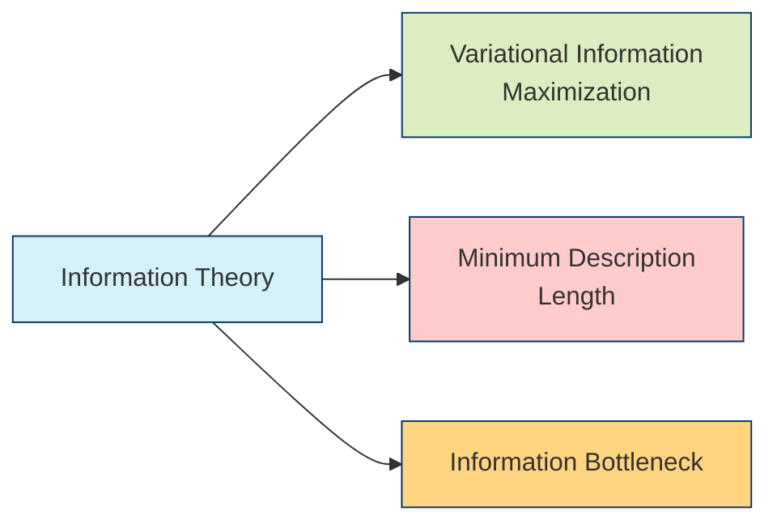

### Bayesian Decision Theory

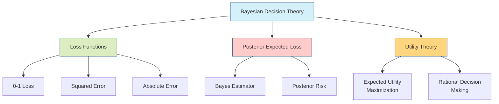

### Computational Complexity

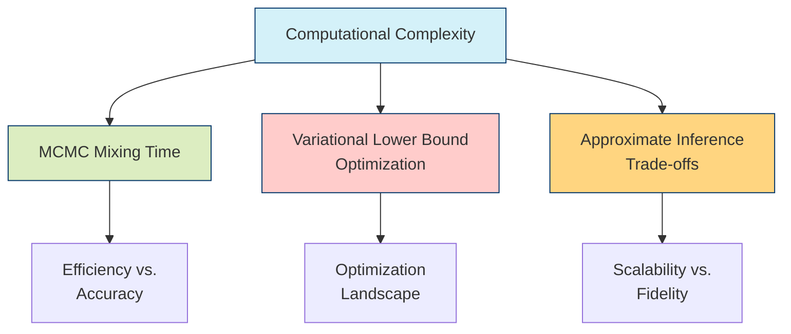

## References

1. Blei, D. M., Kucukelbir, A., & McAuliffe, J. D. (2017). Variational inference: A review for statisticians. Journal of the American statistical Association, 112(518), 859-877.

1. Gelman, A., Carlin, J. B., Stern, H. S., Dunson, D. B., Vehtari, A., & Rubin, D. B. (2013). Bayesian data analysis. CRC press.

1. Kingma, D. P., & Welling, M. (2013). Auto-encoding variational bayes. arXiv preprint arXiv:1312.6114.

1. Goodfellow, I., Pouget-Abadie, J., Mirza, M., Xu, B., Warde-Farley, D., Ozair, S., ... & Bengio, Y. (2014). Generative adversarial networks. Communications of the ACM, 63(11), 139-144.

1. Hoffman, M. D., & Gelman, A. (2014). The No-U-Turn sampler: adaptively setting path lengths in Hamiltonian Monte Carlo. Journal of Machine Learning Research, 15(1), 1593-1623.

1. Tran, D., Ranganath, R., & Blei, D. (2016). Hierarchical implicit models and likelihood-free variational inference. Advances in neural information processing systems, 29.

1. Salimans, T., Kingma, D., & Welling, M. (2015). Markov chain monte carlo and variational inference: Bridging the gap. International Conference on Machine Learning, 1218-1226.

