---

title: Bayesian Graph Theory

type: concept

status: stable

created: 2024-03-20

tags:

  - mathematics

  - probability

  - graph-theory

  - bayesian-inference

semantic_relations:

  - type: foundation

    links:

      - [[graph_theory]]

      - [[probability_theory]]

      - [[bayesian_inference]]

      - [[bayes_theorem]]

  - type: implements

    links:

      - [[bayesian_networks]]

      - [[factor_graphs]]

      - [[markov_random_fields]]

  - type: related

    links:

      - [[causal_inference]]

      - [[probabilistic_programming]]

      - [[message_passing]]

      - [[belief_updating]]

---

# Bayesian Graph Theory

## Overview

Bayesian Graph Theory unifies [[graph_theory|graph theory]] with [[bayesian_inference|Bayesian inference]], providing a mathematical framework for representing and reasoning about probabilistic relationships. This framework encompasses various graphical models including [[bayesian_networks|Bayesian Networks]], [[factor_graphs|Factor Graphs]], and [[markov_random_fields|Markov Random Fields]].

```mermaid

graph TD

    A[Bayesian Graph Theory] --> B[Mathematical Foundations]

    A --> C[Core Components]

    A --> D[Graph Operations]

    A --> E[Inference Methods]

    A --> F[Applications]

    A --> G[Integration with Other Methods]

    B --> B1[Graph Structures]

    B --> B2[Probabilistic Framework]

    C --> C1[Graph Structures]

    C --> C2[Probabilistic Operations]

    C --> C3[Inference Algorithms]

    D --> D1[Graph Transformations]

    D --> D2[Probabilistic Operations]

    D --> D3[Graph Algorithms]

    E --> E1[Exact Inference]

    E --> E2[Approximate Inference]

    F --> F1[Probabilistic Modeling]

    F --> F2[Causal Inference]

    F --> F3[Structure Learning]

    G --> G1[Deep Learning]

    G --> G2[Active Inference]

    G --> G3[Probabilistic Programming]

    style A fill:#ff9999,stroke:#05386b

    style B fill:#d4f1f9,stroke:#05386b

    style C fill:#dcedc1,stroke:#05386b

    style D fill:#ffcccb,stroke:#05386b

    style E fill:#ffd580,stroke:#05386b

    style F fill:#d8bfd8,stroke:#05386b

    style G fill:#ffb6c1,stroke:#05386b

```

## Mathematical Foundations

### 1. Graph Structures

```mermaid

graph LR

    subgraph "Graph Types in Bayesian Graph Theory"

        A[Directed Graphs<br>G_d = (V, E)] --- B[Undirected Graphs<br>G_u = (V, E)]

        B --- C[Factor Graphs<br>G_f = (V, F, E)]

        A --- C

    end

    subgraph "Application Models"

        D[Bayesian Networks] --- E[Markov Random Fields]

        E --- F[Factor Graphs]

        D --- F

    end

    A -.-> D

    B -.-> E

    C -.-> F

    style A fill:#d4f1f9,stroke:#05386b

    style B fill:#dcedc1,stroke:#05386b

    style C fill:#ffcccb,stroke:#05386b

    style D fill:#ffd580,stroke:#05386b

    style E fill:#d8bfd8,stroke:#05386b

    style F fill:#ffb6c1,stroke:#05386b

```

#### Directed Graphs

```math

G_d = (V, E) \text{ where } E \subseteq V \times V

```

#### Undirected Graphs

```math

G_u = (V, E) \text{ where } E = \{\{u,v\} : u,v \in V\}

```

#### Factor Graphs

```math

G_f = (V, F, E) \text{ where } E \subseteq (V \times F) \cup (F \times V)

```

### 2. Probabilistic Framework

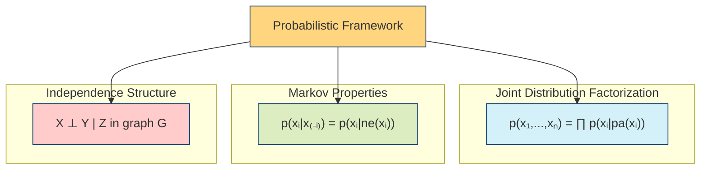

#### Joint Distribution

```math

p(x_1, ..., x_n) = \prod_{i=1}^n p(x_i | pa(x_i))

```

#### Markov Properties

```math

p(x_i | x_{-i}) = p(x_i | ne(x_i))

```

where ne(x_i) denotes the neighbors of x_i

## Core Components

### 1. [[graph_structures|Graph Structures]]

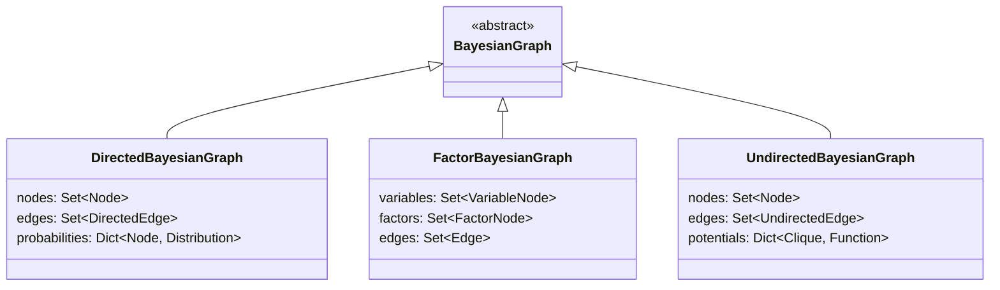

```julia

abstract type BayesianGraph end

struct DirectedBayesianGraph <: BayesianGraph

    nodes::Set{Node}

    edges::Set{DirectedEdge}

    probabilities::Dict{Node, Distribution}

end

struct FactorBayesianGraph <: BayesianGraph

    variables::Set{VariableNode}

    factors::Set{FactorNode}

    edges::Set{Edge}

end

struct UndirectedBayesianGraph <: BayesianGraph

    nodes::Set{Node}

    edges::Set{UndirectedEdge}

    potentials::Dict{Clique, Function}

end

```

### 2. [[probabilistic_operations|Probabilistic Operations]]

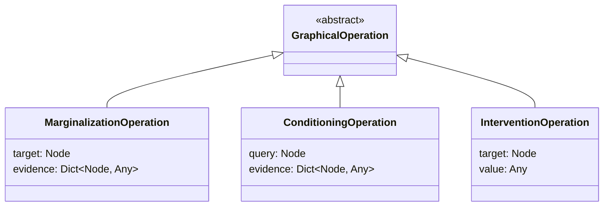

```julia

abstract type GraphicalOperation end

struct MarginalizationOperation <: GraphicalOperation

    target::Node

    evidence::Dict{Node, Any}

end

struct ConditioningOperation <: GraphicalOperation

    query::Node

    evidence::Dict{Node, Any}

end

struct InterventionOperation <: GraphicalOperation

    target::Node

    value::Any

end

```

### 3. [[inference_algorithms|Inference Algorithms]]

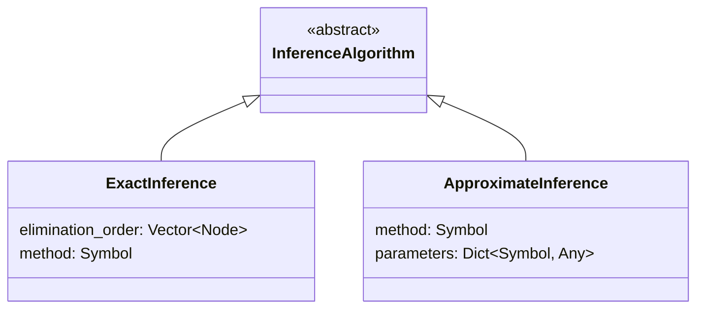

```julia

abstract type InferenceAlgorithm end

struct ExactInference <: InferenceAlgorithm

    elimination_order::Vector{Node}

    method::Symbol  # :variable_elimination or :junction_tree

end

struct ApproximateInference <: InferenceAlgorithm

    method::Symbol  # :importance_sampling or :variational

    parameters::Dict{Symbol, Any}

end

```

## Graph Operations

### 1. [[graph_transformations|Graph Transformations]]

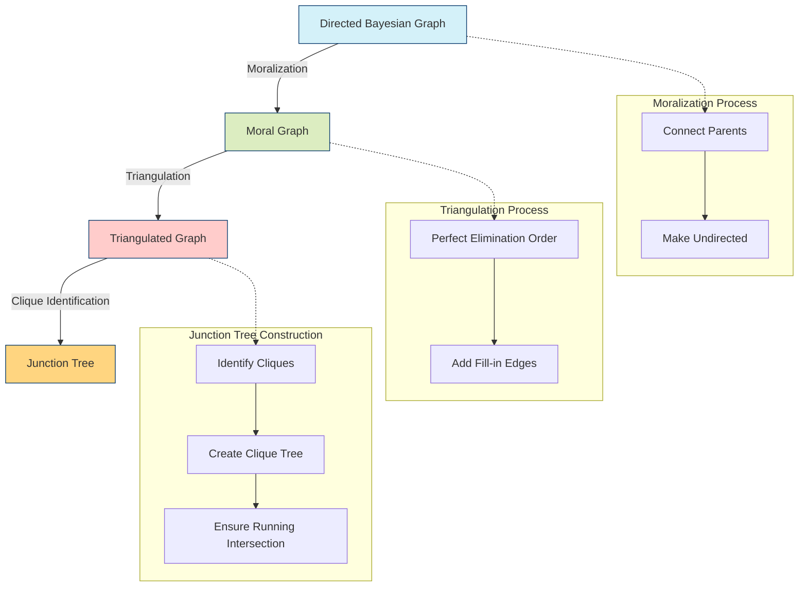

```julia

function moralize!(graph::DirectedBayesianGraph)

    # Add edges between parents

    for node in graph.nodes

        parents = get_parents(graph, node)

        for (p1, p2) in combinations(parents, 2)

            add_undirected_edge!(graph, p1, p2)

        end

    end

    # Convert directed to undirected edges

    convert_to_undirected!(graph)

end

function triangulate!(graph::UndirectedBayesianGraph)

    # Implement triangulation algorithm

    order = perfect_elimination_ordering(graph)

    for i in 1:length(order)-2

        node = order[i]

        neighbors = get_neighbors(graph, node)

        for (n1, n2) in combinations(neighbors, 2)

            if !has_edge(graph, n1, n2)

                add_edge!(graph, n1, n2)

            end

        end

    end

end

```

### 2. [[probabilistic_operations|Probabilistic Operations]]

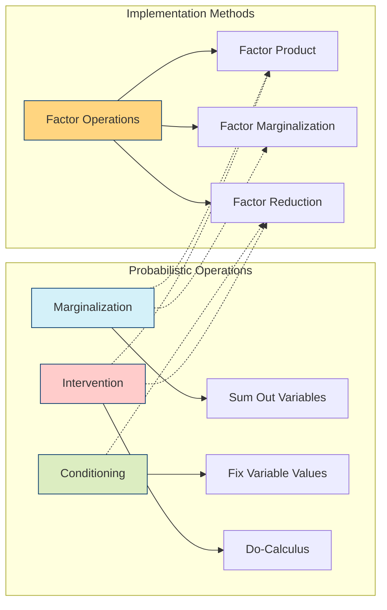

```julia

function marginalize(graph::BayesianGraph, 

                    variables::Set{Node})

    # Implement marginalization

    result = copy(graph)

    for var in variables

        factors = get_connected_factors(result, var)

        new_factor = multiply_and_marginalize(factors, var)

        update_graph!(result, new_factor, factors)

    end

    return result

end

function condition(graph::BayesianGraph,

                  evidence::Dict{Node, Any})

    # Implement conditioning

    result = copy(graph)

    for (node, value) in evidence

        factors = get_connected_factors(result, node)

        for factor in factors

            update_factor!(factor, node, value)

        end

    end

    return result

end

```

### 3. [[graph_algorithms|Graph Algorithms]]

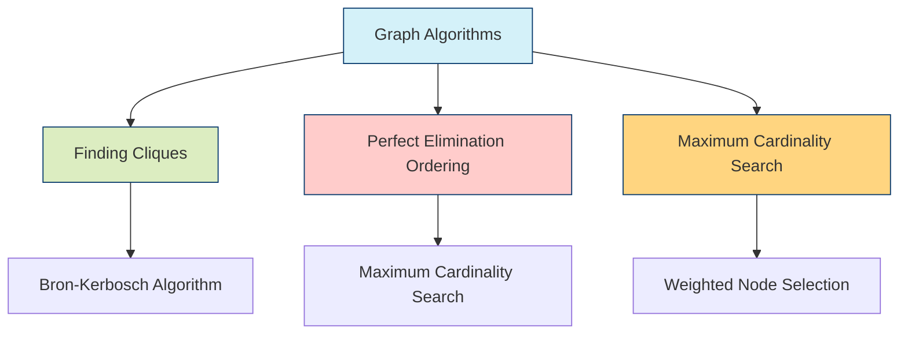

```julia

function find_cliques(graph::UndirectedBayesianGraph)

    # Implement Bron-Kerbosch algorithm

    cliques = Set{Set{Node}}()

    bron_kerbosch(Set{Node}(), 

                  Set(graph.nodes), 

                  Set{Node}(), 

                  cliques)

    return cliques

end

function perfect_elimination_ordering(graph::UndirectedBayesianGraph)

    # Implement maximum cardinality search

    order = Vector{Node}()

    weights = Dict(node => 0 for node in graph.nodes)

    while length(order) < length(graph.nodes)

        # Select node with maximum weight

        node = argmax(weights)

        push!(order, node)

        # Update weights of unmarked neighbors

        for neighbor in get_neighbors(graph, node)

            if neighbor ∉ order

                weights[neighbor] += 1

            end

        end

    end

    return order

end

```

## Inference Methods

### 1. [[exact_inference|Exact Inference]]

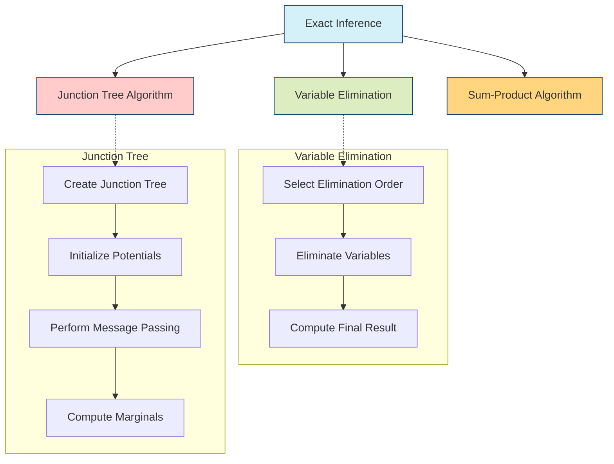

```julia

function variable_elimination(graph::BayesianGraph,

                            query::Node,

                            evidence::Dict{Node, Any},

                            order::Vector{Node})

    # Initialize factors

    factors = collect_factors(graph)

    # Incorporate evidence

    factors = apply_evidence(factors, evidence)

    # Eliminate variables

    for var in order

        if var != query && var ∉ keys(evidence)

            relevant_factors = filter(f -> var in scope(f), factors)

            new_factor = multiply_factors(relevant_factors)

            new_factor = marginalize(new_factor, var)

            factors = setdiff(factors, relevant_factors)

            push!(factors, new_factor)

        end

    end

    # Compute final result

    return normalize(multiply_factors(factors))

end

```

### 2. [[approximate_inference|Approximate Inference]]

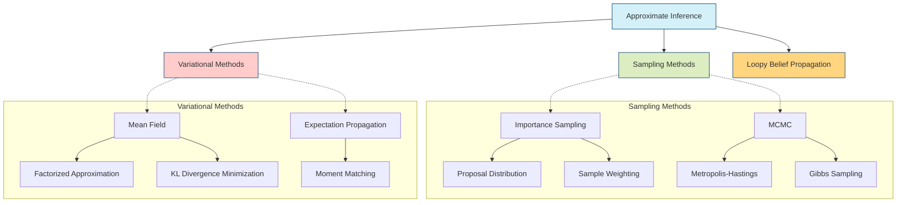

```julia

function importance_sampling(graph::BayesianGraph,

                           query::Node,

                           evidence::Dict{Node, Any},

                           n_samples::Int)

    samples = Vector{Float64}(undef, n_samples)

    weights = Vector{Float64}(undef, n_samples)

    for i in 1:n_samples

        # Generate sample

        sample = generate_sample(graph, evidence)

        # Compute weight

        weights[i] = compute_weight(sample, evidence, graph)

        # Store query value

        samples[i] = sample[query]

    end

    return weighted_average(samples, weights)

end

```

## Applications

### 1. [[probabilistic_modeling|Probabilistic Modeling]]

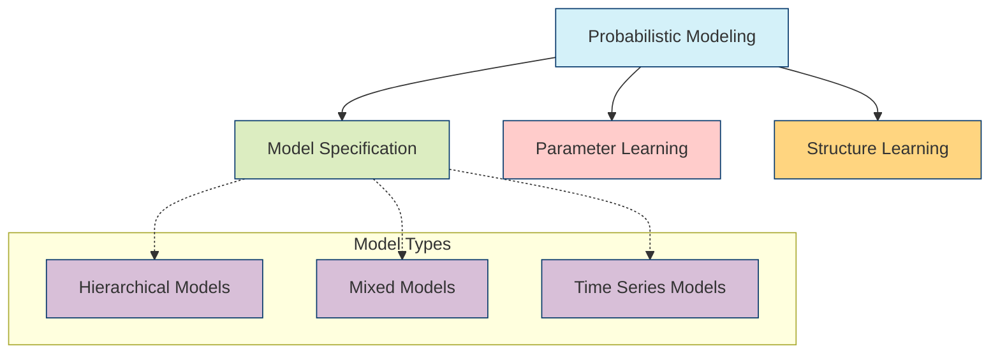

#### Model Specification

```julia

@model function hierarchical_model(data, groups)

    # Hyperparameters

    α ~ Gamma(1.0, 1.0)

    β ~ Gamma(1.0, 1.0)

    # Group-level parameters

    μ = Vector{Random}(undef, length(groups))

    for g in 1:length(groups)

        μ[g] ~ Normal(0.0, sqrt(1/α))

    end

    # Observations

    for (i, group) in enumerate(groups)

        data[i] ~ Normal(μ[group], sqrt(1/β))

    end

end

```

### 2. [[causal_inference|Causal Inference]]

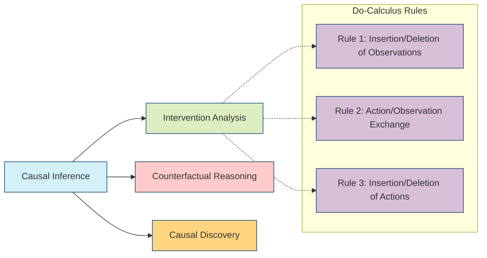

#### Intervention Analysis

```julia

function do_calculus(graph::BayesianGraph,

                    intervention::Node,

                    value::Any,

                    query::Node)

    # Create mutilated graph

    mutilated = copy(graph)

    remove_incoming_edges!(mutilated, intervention)

    set_value!(mutilated, intervention, value)

    # Perform inference

    return infer(mutilated, query)

end

```

### 3. [[structure_learning|Structure Learning]]

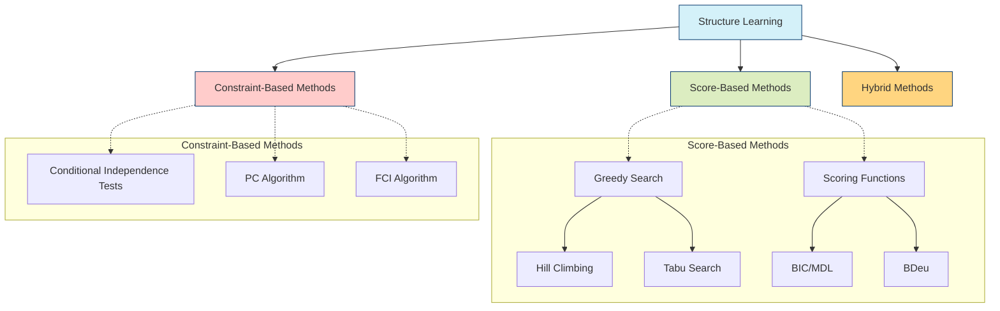

#### Score-Based Learning

```julia

function learn_structure(data::Matrix,

                        score_fn::Function)

    n_vars = size(data, 2)

    graph = empty_graph(n_vars)

    while true

        best_score = -Inf

        best_edge = nothing

        # Try adding each possible edge

        for i in 1:n_vars, j in 1:n_vars

            if !has_edge(graph, i, j) && !would_create_cycle(graph, i, j)

                score = score_fn(data, add_edge(graph, i, j))

                if score > best_score

                    best_score = score

                    best_edge = (i, j)

                end

            end

        end

        if best_edge === nothing

            break

        end

        add_edge!(graph, best_edge...)

    end

    return graph

end

```

## Integration with Other Methods

### 1. [[deep_learning|Deep Learning Integration]]

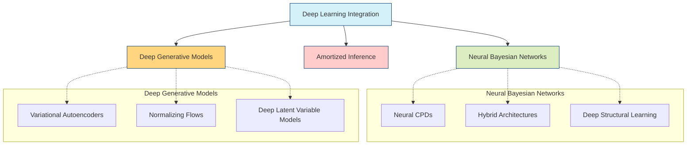

```julia

struct NeuralBayesianNetwork

    graph::BayesianGraph

    neural_networks::Dict{Node, NeuralNetwork}

    function NeuralBayesianNetwork(structure::BayesianGraph)

        # Create neural networks for CPDs

        nns = Dict{Node, NeuralNetwork}()

        for node in get_nodes(structure)

            n_parents = length(get_parents(structure, node))

            nns[node] = build_network(n_parents)

        end

        new(structure, nns)

    end

end

```

### 2. [[active_inference|Active Inference]]

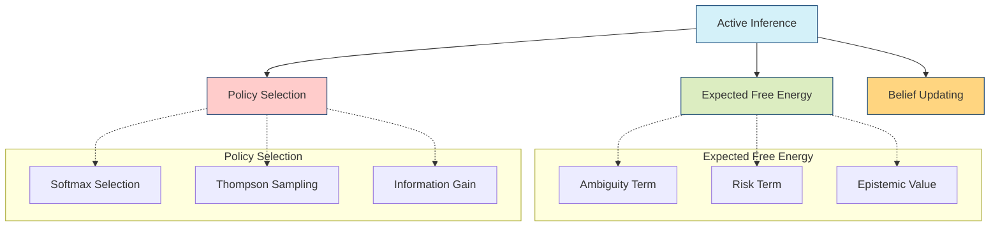

```julia

function compute_expected_free_energy(graph::BayesianGraph,

                                    policy::Vector{Action})

    # Initialize EFE

    efe = 0.0

    # Compute for each time step

    for t in 1:length(policy)

        # Get predicted state distribution

        state_dist = predict_state(graph, policy[1:t])

        # Compute ambiguity

        ambiguity = compute_ambiguity(state_dist)

        # Compute risk

        risk = compute_risk(state_dist, policy[t])

        # Accumulate

        efe += ambiguity + risk

    end

    return efe

end

```

### 3. [[probabilistic_programming|Probabilistic Programming]]

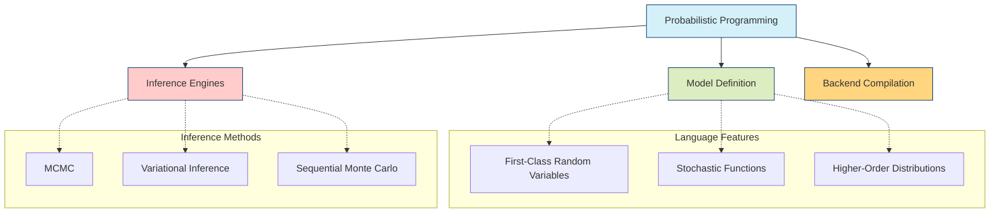

```julia

macro bayesian_model(expr)

    # Parse model expression

    model_ast = parse_model(expr)

    # Extract variables and dependencies

    variables = extract_variables(model_ast)

    dependencies = extract_dependencies(model_ast)

    # Create graph structure

    graph = create_graph(variables, dependencies)

    # Generate inference code

    inference_code = generate_inference_code(graph)

    return quote

        graph = $graph

        $inference_code

    end

end

```

## Best Practices

```mermaid

mindmap

  root((Bayesian Graph<br>Theory<br>Best Practices))

    Model Design

      Start with Minimal Structure

      Validate Independence Assumptions

      Consider Computational Complexity

      Document Model Assumptions

    Implementation

      Use Efficient Data Structures

      Implement Numerical Safeguards

      Cache Intermediate Results

      Profile Performance Bottlenecks

    Validation

      Test with Synthetic Data

      Validate Against Known Results

      Monitor Convergence

      Analyze Sensitivity

```

### 1. Model Design

- Start with minimal structure

- Validate independence assumptions

- Consider computational complexity

- Document model assumptions

### 2. Implementation

- Use efficient data structures

- Implement numerical safeguards

- Cache intermediate results

- Profile performance bottlenecks

### 3. Validation

- Test with synthetic data

- Validate against known results

- Monitor convergence

- Analyze sensitivity

## References

1. Pearl, J. (1988). Probabilistic Reasoning in Intelligent Systems

1. Koller, D., & Friedman, N. (2009). Probabilistic Graphical Models

1. Bishop, C. M. (2006). Pattern Recognition and Machine Learning

1. Murphy, K. P. (2012). Machine Learning: A Probabilistic Perspective

1. Wainwright, M. J., & Jordan, M. I. (2008). Graphical Models, Exponential Families, and Variational Inference

