---

title: Bayesian Networks

type: mathematical_concept

status: stable

created: 2024-03-20

tags:

  - mathematics

  - probability

  - graphical-models

semantic_relations:

  - type: foundation

    links:

      - [[probabilistic_graphical_models]]

      - [[directed_graphical_models]]

      - [[probability_theory]]

      - [[factor_graphs]]

      - [[bayes_theorem]]

  - type: related

    links:

      - [[markov_random_fields]]

      - [[message_passing]]

      - [[variational_inference]]

      - [[bayesian_graph_theory]]

  - type: implements

    links:

      - [[probabilistic_models]]

      - [[causal_inference]]

      - [[belief_updating]]

---

# Bayesian Networks

## Overview

Bayesian Networks (BNs), also known as [[directed_acyclic_graphs|directed acyclic graphs]] (DAGs), are a type of [[probabilistic_graphical_models|probabilistic graphical model]] that represents conditional dependencies between random variables. They provide a compact representation of joint probability distributions through factorization based on conditional independence assumptions.

```mermaid

graph TB

    A[Bayesian Networks] --> B[Mathematical Foundation]

    A --> C[Structure and Components]

    A --> D[Integration with Factor Graphs]

    A --> E[Inference Methods]

    A --> F[Learning]

    A --> G[Applications]

    A --> H[Implementation]

    A --> I[Best Practices]

    A --> J[Common Challenges]

    A --> K[Integration with Other Methods]

    style A fill:#ff9999,stroke:#05386b

    style B fill:#d4f1f9,stroke:#05386b

    style C fill:#dcedc1,stroke:#05386b

    style D fill:#ffcccb,stroke:#05386b

    style E fill:#ffd580,stroke:#05386b

    style F fill:#d8bfd8,stroke:#05386b

    style G fill:#ffb6c1,stroke:#05386b

    style H fill:#c1e1c1,stroke:#05386b

    style I fill:#c1c1e1,stroke:#05386b

    style J fill:#e1c1c1,stroke:#05386b

    style K fill:#e1e1c1,stroke:#05386b

```

## Mathematical Foundation

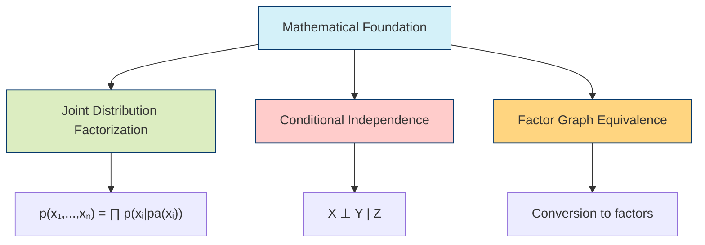

### 1. Joint Distribution Factorization

```math

p(x_1, ..., x_n) = \prod_{i=1}^n p(x_i | pa(x_i))

```

where:

- p(x_i | pa(x_i)) is the [[conditional_probability|conditional probability]]

- pa(x_i) represents the parents of variable x_i

### 2. [[conditional_independence|Conditional Independence]]

For variables X, Y, Z:

```math

p(X | Y, Z) = p(X | Z) \text{ if X ⊥ Y | Z}

```

### 3. [[factor_graph_equivalence|Factor Graph Equivalence]]

Every Bayesian network can be converted to a [[factor_graphs|factor graph]]:

```math

p(x_1, ..., x_n) = \prod_{i=1}^n f_i(x_i, pa(x_i))

```

where each factor f_i represents a conditional probability.

## Structure and Components

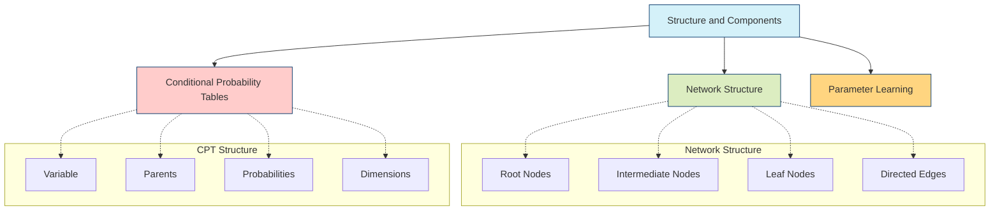

### 1. [[network_structure|Network Structure]]

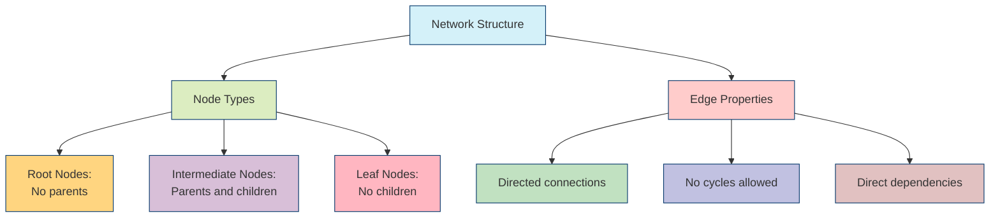

#### Node Types

- **Root Nodes**: No parents, represent prior distributions

- **Intermediate Nodes**: Both parents and children, represent conditional distributions

- **Leaf Nodes**: No children, often represent observations

#### Edge Properties

- Directed connections indicating causal or probabilistic influence

- No cycles allowed (acyclic constraint)

- Represent direct dependencies between variables

### 2. [[conditional_probability_tables|Conditional Probability Tables]]

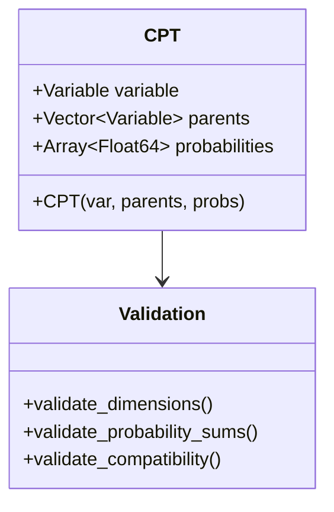

```julia

struct CPT

    variable::Variable

    parents::Vector{Variable}

    probabilities::Array{Float64}

    function CPT(var, parents, probs)

        # Validate dimensions

        @assert size(probs, ndims(probs)) == prod(size.(parents))

        new(var, parents, probs)

    end

end

```

### 3. [[parameter_learning|Parameter Learning]]

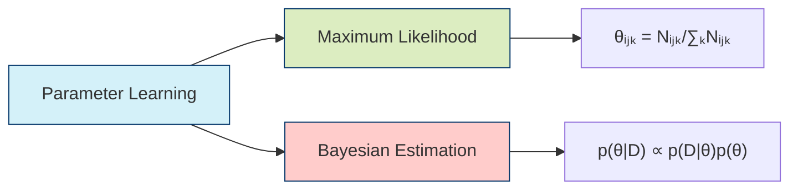

#### Maximum Likelihood

```math

θ_{ijk} = \frac{N_{ijk}}{\sum_k N_{ijk}}

```

#### Bayesian Estimation

```math

p(θ | D) ∝ p(D | θ)p(θ)

```

## Integration with Factor Graphs

```mermaid

graph TB

    A[Integration with Factor Graphs] --> B[Conversion to Factor Graphs]

    A --> C[Message Passing Inference]

    A --> D[Belief Updates]

    subgraph "Conversion Process"

        B1[Create Variable Nodes]

        B2[Create Factor Nodes for CPTs]

        B3[Connect Nodes]

    end

    subgraph "Message Types"

        C1[Variable to Factor:<br>μₓ→ᶠ(x)]

        C2[Factor to Variable:<br>μᶠ→ₓ(x)]

    end

    subgraph "Belief Update"

        D1[Collect Messages]

        D2[Multiply Messages]

        D3[Normalize Belief]

    end

    B -.-> B1 --> B2 --> B3

    C -.-> C1 & C2

    D -.-> D1 --> D2 --> D3

    style A fill:#d4f1f9,stroke:#05386b

    style B fill:#dcedc1,stroke:#05386b

    style C fill:#ffcccb,stroke:#05386b

    style D fill:#ffd580,stroke:#05386b

```

### 1. [[conversion_to_factor_graphs|Conversion to Factor Graphs]]

```julia

function to_factor_graph(bn::BayesianNetwork)

    # Create factor graph

    fg = FactorGraph()

    # Add variable nodes

    for node in bn.nodes

        add_variable!(fg, node)

    end

    # Add factor nodes for CPTs

    for (var, cpt) in bn.parameters

        add_factor!(fg, FactorNode(cpt))

    end

    return fg

end

```

### 2. [[message_passing_inference|Message Passing Inference]]

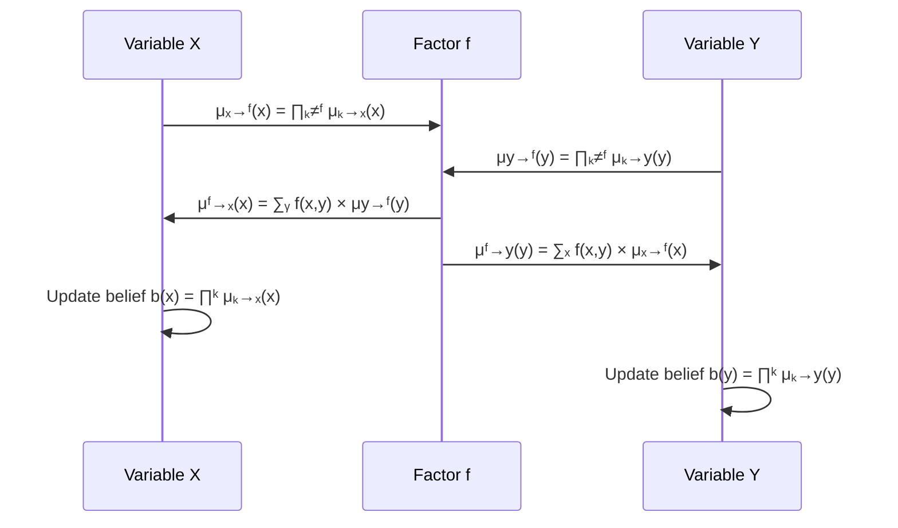

#### Forward Messages (Variable to Factor)

```math

μ_{x→f}(x) = \prod_{g \in N(x) \backslash f} μ_{g→x}(x)

```

#### Backward Messages (Factor to Variable)

```math

μ_{f→x}(x) = \sum_{x_{\partial f \backslash x}} f(x_{\partial f}) \prod_{y \in \partial f \backslash x} μ_{y→f}(y)

```

### 3. [[belief_updates|Belief Updates]]

```julia

function update_beliefs!(network)

    for node in network.nodes

        # Collect incoming messages

        messages = [msg for msg in incoming_messages(node)]

        # Update belief

        node.belief = normalize(prod(messages))

    end

end

```

## Inference Methods

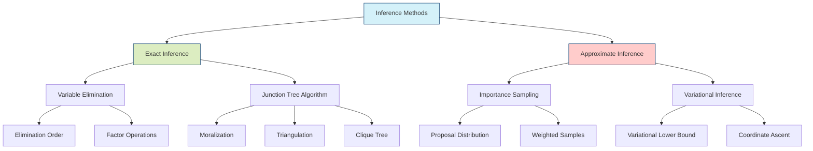

### 1. [[exact_inference|Exact Inference]]

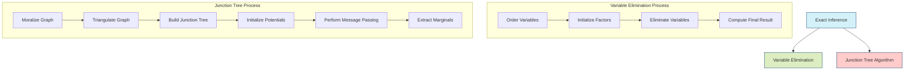

#### Variable Elimination

```julia

function variable_elimination(network, query, evidence)

    # Order variables

    order = elimination_order(network, query)

    # Initialize factors

    factors = collect_factors(network, evidence)

    # Eliminate variables

    for var in order

        factors = sum_out_variable(factors, var)

    end

    return normalize(multiply_factors(factors))

end

```

#### Junction Tree Algorithm

```julia

function build_junction_tree(network)

    # Moralize graph

    moral_graph = moralize(network)

    # Triangulate

    triangulated = triangulate(moral_graph)

    # Build clique tree

    return maximum_spanning_tree(triangulated)

end

```

### 2. [[approximate_inference|Approximate Inference]]

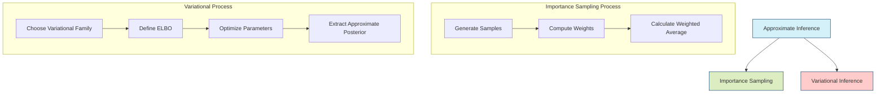

#### [[importance_sampling|Importance Sampling]]

```julia

function importance_sampling(network, query, n_samples)

    weights = zeros(n_samples)

    samples = zeros(n_samples, length(query))

    for i in 1:n_samples

        sample = generate_sample(network)

        weights[i] = compute_weight(sample, evidence)

        samples[i,:] = extract_query(sample, query)

    end

    return weighted_average(samples, weights)

end

```

#### [[variational_inference|Variational Inference]]

```math

\mathcal{L}(q) = \mathbb{E}_q[\log p(x,z)] - \mathbb{E}_q[\log q(z)]

```

## Learning

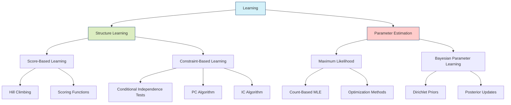

### 1. [[structure_learning|Structure Learning]]

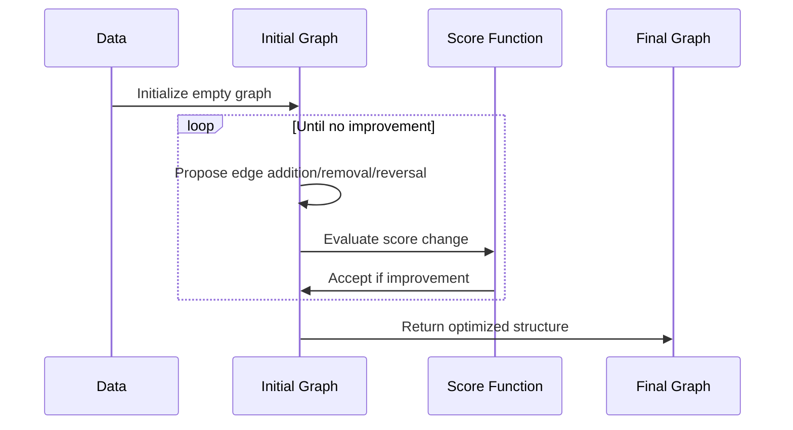

#### Score-Based Learning

```julia

function learn_structure(data, scoring_fn)

    structure = empty_graph()

    while true

        best_score = current_score

        best_edge = nothing

        for edge in possible_edges

            new_score = score_with_edge(structure, edge)

            if new_score > best_score

                best_score = new_score

                best_edge = edge

            end

        end

        if best_edge === nothing

            break

        end

        add_edge!(structure, best_edge)

    end

    return structure

end

```

#### Constraint-Based Learning

- [[conditional_independence_tests|Conditional independence tests]]

- [[pc_algorithm|PC algorithm]]

- [[ic_algorithm|IC algorithm]]

### 2. [[parameter_estimation|Parameter Estimation]]

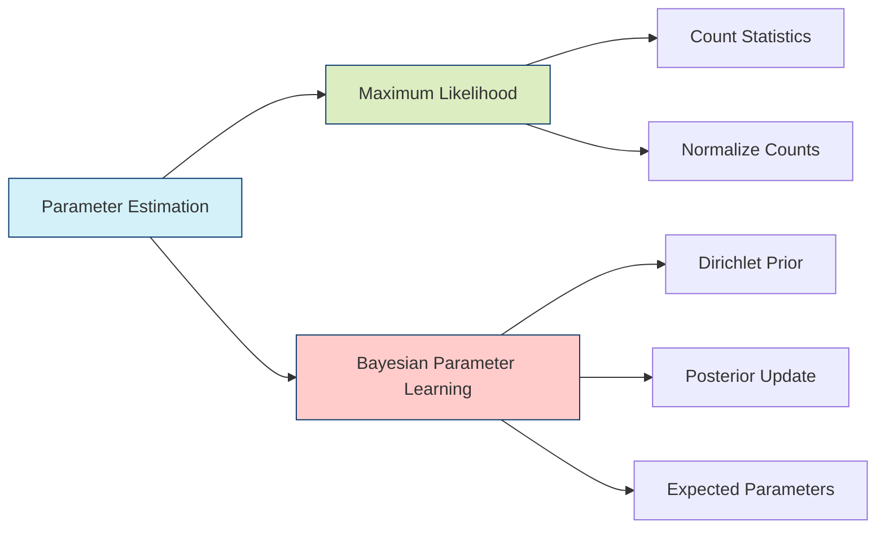

#### Maximum Likelihood

```julia

function estimate_parameters(data, structure)

    parameters = Dict()

    for node in nodes(structure)

        # Count occurrences

        counts = count_configurations(data, node)

        # Compute MLEs

        parameters[node] = normalize_counts(counts)

    end

    return parameters

end

```

#### Bayesian Parameter Learning

```julia

function bayesian_parameter_learning(data, structure, prior)

    posterior = Dict()

    for node in nodes(structure)

        # Compute sufficient statistics

        stats = sufficient_statistics(data, node)

        # Update Dirichlet parameters

        posterior[node] = update_dirichlet(prior[node], stats)

    end

    return posterior

end

```

## Applications

```mermaid

mindmap

  root((Bayesian<br>Networks<br>Applications))

    Probabilistic Reasoning

      Medical Diagnosis

      Fault Diagnosis

      Risk Assessment

    Decision Support

      Expert Systems

      Decision Analysis

      Policy Making

    Causal Inference

      Intervention Analysis

      Counterfactual Reasoning

      Treatment Effect Estimation

    Natural Language Processing

      Text Classification

      Sentiment Analysis

      Topic Modeling

    Computer Vision

      Object Recognition

      Scene Understanding

      Activity Recognition

```

### 1. [[probabilistic_reasoning|Probabilistic Reasoning]]

- Medical diagnosis systems

- Fault diagnosis in complex systems

- Risk assessment and decision support

### 2. [[decision_support|Decision Support]]

- Expert systems for complex domains

- Decision analysis under uncertainty

- Policy making and strategy evaluation

### 3. [[causal_inference|Causal Inference]]

- Intervention analysis in clinical trials

- Counterfactual reasoning

- Treatment effect estimation

## Implementation

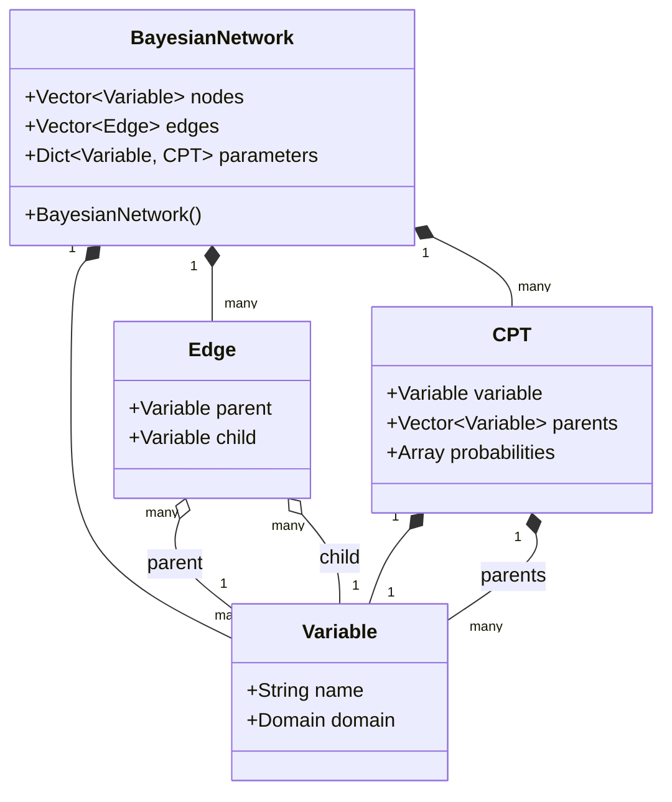

### 1. Data Structures

```julia

struct BayesianNetwork

    nodes::Vector{Variable}

    edges::Vector{Edge}

    parameters::Dict{Variable, CPT}

    function BayesianNetwork()

        new(Vector{Variable}(), Vector{Edge}(), Dict{Variable, CPT}())

    end

end

```

### 2. Core Operations

```julia

function add_edge!(network, parent, child)

    # Check for cycles

    if would_create_cycle(network, parent, child)

        error("Adding edge would create cycle")

    end

    # Add edge

    push!(network.edges, Edge(parent, child))

    # Update CPT

    update_cpt!(network.parameters[child])

end

```

### 3. Inference Engine

```julia

function query_probability(network, query, evidence)

    # Convert to factor graph for efficient inference

    factor_graph = to_factor_graph(network)

    # Run inference using message passing

    result = run_inference(factor_graph, query, evidence)

    return normalize(result)

end

```

## Best Practices

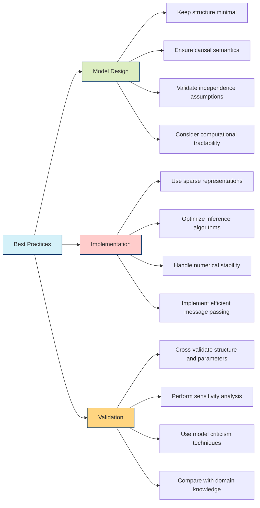

### 1. Model Design

- Keep structure minimal but sufficient

- Ensure causal semantics when appropriate

- Validate independence assumptions

- Consider computational tractability

### 2. Implementation

- Use sparse representations for large networks

- Optimize inference algorithms for specific cases

- Handle numerical stability issues

- Implement efficient message passing

### 3. Validation

- Cross-validate structure and parameters

- Perform sensitivity analysis

- Use model criticism techniques

- Compare with domain knowledge

## Common Challenges

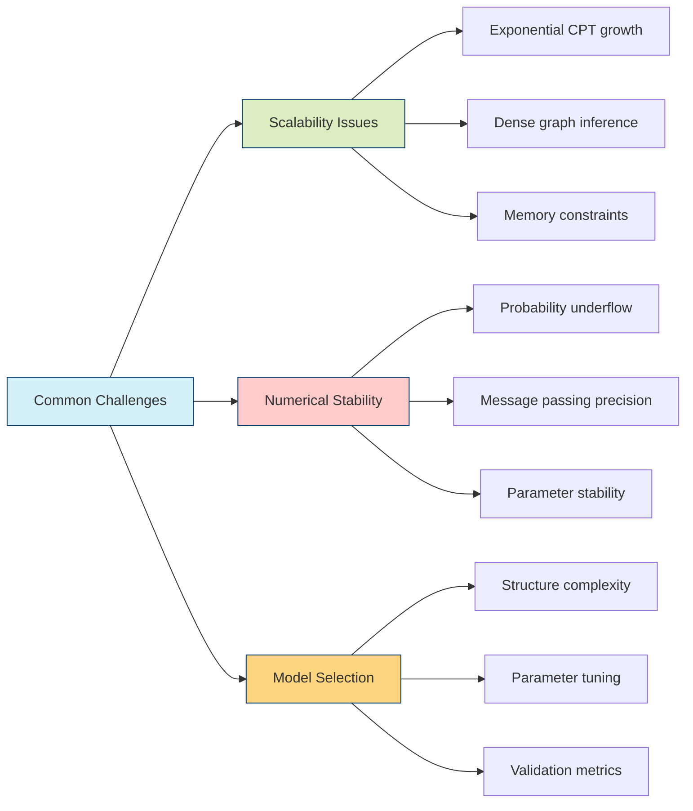

### 1. [[scalability_issues|Scalability Issues]]

- Exponential growth of CPTs

- Inference complexity in dense graphs

- Memory constraints for large networks

### 2. [[numerical_stability|Numerical Stability]]

- Underflow in probability calculations

- Precision loss in message passing

- Stability in parameter estimation

### 3. [[model_selection|Model Selection]]

- Structure learning complexity

- Parameter tuning

- Validation metrics

## Integration with Other Methods

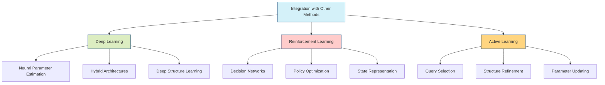

### 1. [[deep_learning|Deep Learning]]

- Neural network parameter estimation

- Hybrid architectures

- Structure learning with deep models

### 2. [[reinforcement_learning|Reinforcement Learning]]

- Decision networks

- Policy optimization

- State representation

### 3. [[active_learning|Active Learning]]

- Query selection

- Structure refinement

- Parameter updating

## References

1. Pearl, J. (1988). Probabilistic Reasoning in Intelligent Systems

1. Koller, D., & Friedman, N. (2009). Probabilistic Graphical Models

1. Murphy, K. P. (2012). Machine Learning: A Probabilistic Perspective

1. Darwiche, A. (2009). Modeling and Reasoning with Bayesian Networks

1. Spirtes, P., Glymour, C., & Scheines, R. (2000). Causation, Prediction, and Search

