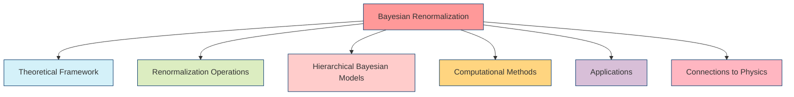
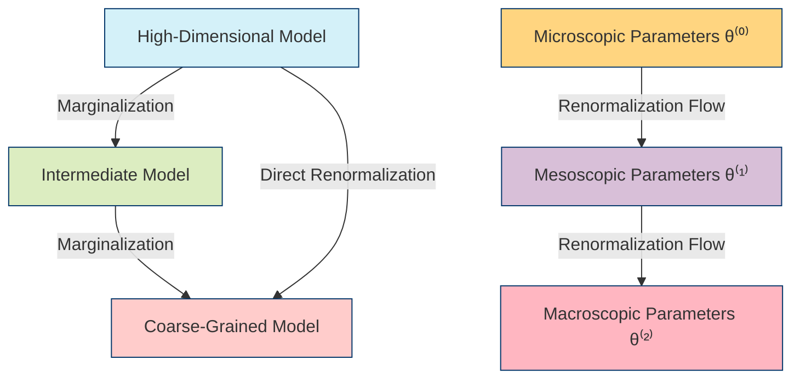
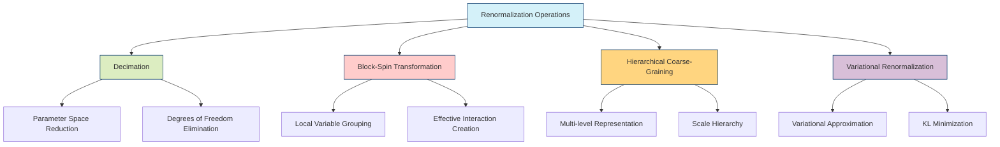
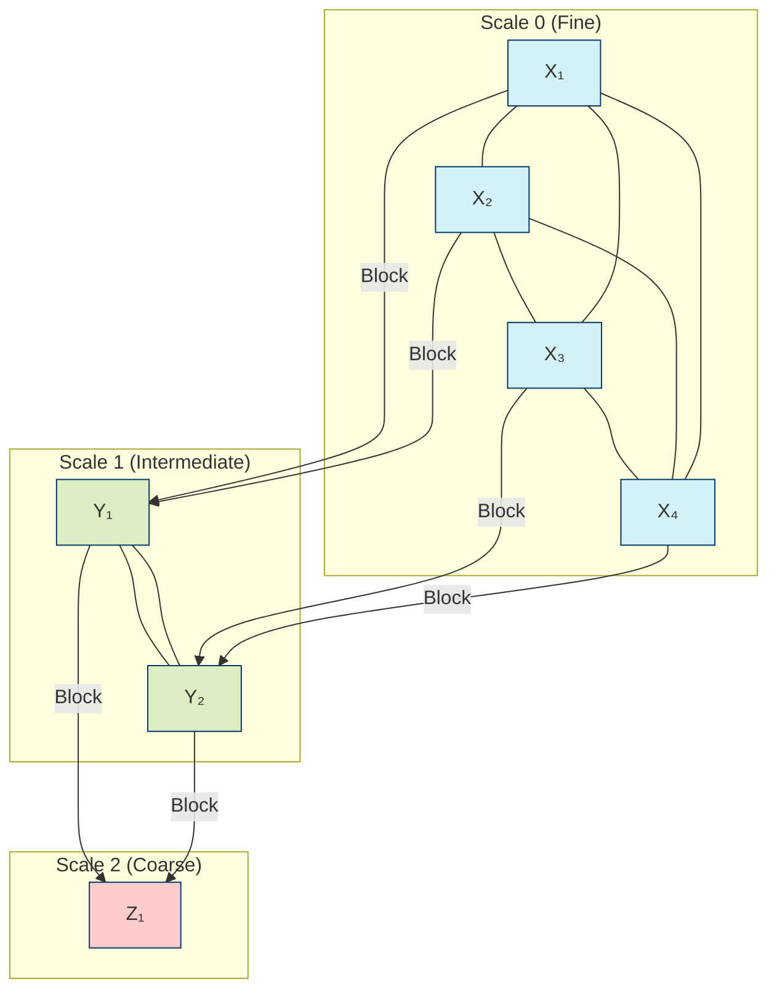
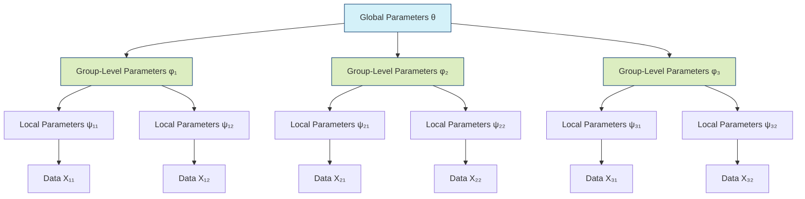
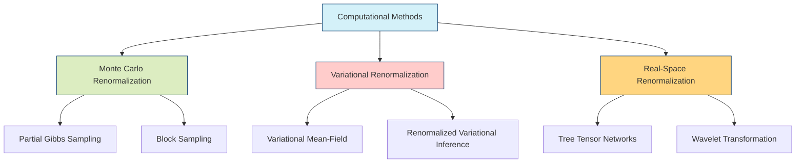
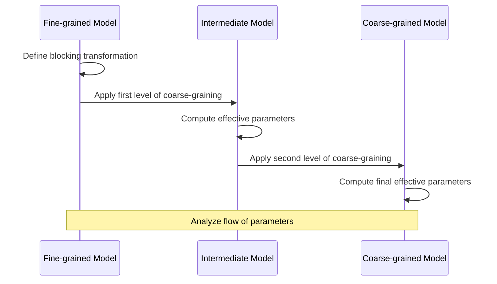
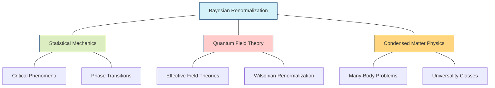
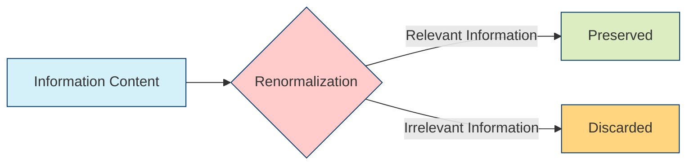
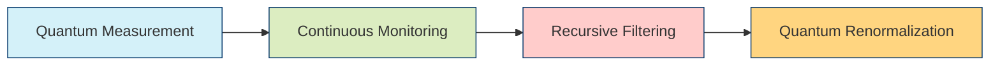

---

title: Bayesian Renormalization

type: mathematical_concept

status: stable

created: 2024-03-15

tags:

  - mathematics

  - probability

  - renormalization

  - bayesian-inference

  - statistical-physics

semantic_relations:

  - type: foundation

    links:

      - [[renormalization_group]]

      - [[probability_theory]]

      - [[bayesian_inference]]

      - [[bayes_theorem]]

  - type: implements

    links:

      - [[bayesian_networks]]

      - [[bayesian_graph_theory]]

      - [[hierarchical_models]]

  - type: related

    links:

      - [[path_integral_bayesian_inference]]

      - [[scale_free_networks]]

      - [[continuous_discrete_inference]]

      - [[bayesian_generative_models]]

---

# Bayesian Renormalization

## Overview

Bayesian Renormalization applies techniques from the [[renormalization_group|renormalization group theory]] in physics to [[bayesian_inference|Bayesian inference]], providing a powerful framework for handling multi-scale phenomena, model complexity reduction, and efficient inference in complex systems. This approach enables the systematic coarse-graining of probabilistic models while preserving their essential statistical properties.



## Theoretical Framework

### Renormalization in Bayesian Context

The core idea of Bayesian renormalization is to transform complex, high-dimensional probability distributions into simpler, lower-dimensional ones while preserving their essential statistical properties:

```math

P^{(k+1)}(\theta^{(k+1)}) = \mathcal{R}[P^{(k)}(\theta^{(k)})]

```

where:

- $P^{(k)}$ is the probability distribution at scale $k$

- $\theta^{(k)}$ are the parameters at scale $k$

- $\mathcal{R}$ is the renormalization operator



### Scale Transformation and Fixed Points

The Bayesian model undergoes scale transformations governed by renormalization flow equations:

```math

\frac{d\theta}{dl} = \beta(\theta)

```

where:

- $l$ is the logarithmic scale parameter

- $\beta(\theta)$ is the beta function determining the flow

Fixed points $\theta^*$ where $\beta(\theta^*) = 0$ represent scale-invariant models with universal properties.

## Renormalization Operations



### 1. Decimation in Bayesian Networks

In a [[bayesian_networks|Bayesian network]], decimation involves marginalizing over selected variables to create a simpler network:

```python

def decimate_bayesian_network(network, variables_to_eliminate):

    """

    Perform decimation on a Bayesian network by marginalizing over variables

    """

    reduced_network = network.copy()

    for variable in variables_to_eliminate:

        # Identify the Markov blanket of the variable

        markov_blanket = get_markov_blanket(reduced_network, variable)

        # Marginalize over the variable

        marginalize_variable(reduced_network, variable, markov_blanket)

        # The network now contains effective interactions between 

        # members of the Markov blanket

    return reduced_network

```

### 2. Block-Spin Transformation

The block-spin transformation groups variables together to form new "effective" variables:

```math

X^{(k+1)}_i = \mathcal{B}(\{X^{(k)}_j | j \in \mathcal{N}(i)\})

```

where $\mathcal{B}$ is a blocking function and $\mathcal{N}(i)$ is a neighborhood in the original model.

### 3. Multi-scale Representation



## Hierarchical Bayesian Models

Hierarchical Bayesian models naturally embody renormalization group ideas through their multi-level structure:



### 1. Hierarchical Model Structure

In a hierarchical Bayesian model, parameters at higher levels govern the behavior of parameters at lower levels, forming a natural renormalization structure:

```math

P(\theta, \phi, \psi, X) = P(\theta)P(\phi|\theta)P(\psi|\phi)P(X|\psi)

```

### 2. Deep Belief Networks

Deep belief networks implement renormalization principles with their layered structure:

```julia

struct DeepBeliefNetwork

    layers::Vector{RestrictedBoltzmannMachine}

    function DeepBeliefNetwork(layer_sizes)

        # Create a stack of RBMs

        layers = []

        for i in 1:length(layer_sizes)-1

            push!(layers, RestrictedBoltzmannMachine(layer_sizes[i], layer_sizes[i+1]))

        end

        new(layers)

    end

end

function renormalization_flow(model::DeepBeliefNetwork, data)

    """

    Visualize the renormalization flow through network layers

    """

    activations = [data]

    current_data = data

    # Forward pass through each layer

    for layer in model.layers

        current_data = propagate_forward(layer, current_data)

        push!(activations, current_data)

    end

    return activations

end

```

### 3. Scale-Invariant Priors

Certain prior distributions exhibit scale-invariance properties that align with renormalization principles:

```math

P(\theta) \propto \frac{1}{|\theta|}

```

This scale-invariant (Jeffreys) prior remains unchanged under rescaling transformations.

## Computational Methods



### 1. Monte Carlo Renormalization Group

Monte Carlo methods can implement renormalization by first sampling from a fine-grained model and then aggregating samples to represent coarse-grained behavior:

```python

def monte_carlo_renormalization(fine_model, block_size, num_samples):

    """

    Perform Monte Carlo Renormalization Group

    """

    # Generate samples from the fine-grained model

    fine_samples = mcmc_sample(fine_model, num_samples)

    # Transform samples using blocking transformation

    coarse_samples = []

    for sample in fine_samples:

        # Reshape sample into blocks

        blocks = reshape_into_blocks(sample, block_size)

        # Apply block transformation (e.g., majority rule)

        coarse_sample = apply_block_transformation(blocks)

        coarse_samples.append(coarse_sample)

    # Fit a new model to the coarse-grained samples

    coarse_model = fit_model_to_samples(coarse_samples)

    return coarse_model

```

### 2. Variational Renormalization Group

Variational methods implement renormalization by optimizing a simpler model to approximate a more complex one:

```math

\mathcal{F}[P_{\text{simple}}] = \text{KL}(P_{\text{simple}} || P_{\text{complex}}) - \text{entropy}[P_{\text{simple}}]

```

### 3. Real-Space Renormalization

Real-space renormalization directly transforms the model structure in physical or latent space:



## Applications

```mermaid

mindmap

  root((Bayesian<br>Renormalization))

    Complex Systems

      Phase Transitions

      Critical Phenomena

      Universality Classes

    Machine Learning

      Deep Hierarchical Models

      Representation Learning

      Feature Extraction

    Statistical Inference

      Model Selection

      Complexity Reduction

      Efficient Sampling

    Network Analysis

      Scale-Free Networks

      Community Detection

      Network Coarse-Graining

    Computational Physics

      Material Properties

      Quantum Many-Body Systems

      Effective Field Theories

```

### 1. Image Processing and Computer Vision

Bayesian renormalization provides a framework for multi-scale image analysis, object recognition, and scene understanding:

```python

def image_renormalization(image, levels=3):

    """

    Perform multi-scale Bayesian analysis of an image

    """

    # Initialize pyramid

    image_pyramid = [image]

    feature_hierarchy = []

    # Generate image pyramid

    current_image = image

    for _ in range(levels):

        # Apply coarse-graining (e.g., 2×2 block averaging)

        coarse_image = block_average(current_image, block_size=2)

        image_pyramid.append(coarse_image)

        current_image = coarse_image

    # Bottom-up feature extraction

    for level_idx, level_image in enumerate(image_pyramid):

        # Extract features at this level

        level_features = extract_features(level_image)

        # Infer latent variables using Bayesian methods

        if level_idx > 0:

            # Use information from lower level

            level_features = combine_with_lower_level(

                level_features, feature_hierarchy[-1])

        feature_hierarchy.append(level_features)

    # Top-down refinement (optional)

    refined_features = top_down_refine(feature_hierarchy)

    return refined_features

```

### 2. Biological Network Analysis

Bayesian renormalization helps identify functional modules in complex biological networks:

```math

P(z|A) \propto P(A|z)P(z)

```

where:

- $A$ is the network adjacency matrix

- $z$ is the node community assignment

- The renormalization process identifies communities at different scales

### 3. Physics-Inspired Machine Learning

Integrating renormalization group ideas into Bayesian neural networks allows for effective model compression and transfer learning.

## Connections to Physics



### 1. Universal Behavior Near Critical Points

Just as physical systems exhibit universal behavior near critical points, complex Bayesian models can display universal properties when their parameters approach critical values:

```math

P(x) \sim |x - x_c|^{-\beta}

```

where $\beta$ is a universal critical exponent determined by the system's universality class.

### 2. Fixed Points of Renormalization Flow

The renormalization flow in parameter space reveals fixed points corresponding to distinct phases of the model's behavior:

```math

\frac{d\theta}{dl} = \beta(\theta) \approx \sum_i c_i (\theta - \theta^*)^i

```

The linearization around fixed points yields critical exponents that characterize universal behavior.

### 3. Information-Theoretic Perspective



Bayesian renormalization can be viewed as information compression, preserving relevant statistical information while discarding irrelevant details.

## Advanced Topics

### 1. Non-equilibrium Renormalization

Extends renormalization to time-dependent Bayesian inference problems:

```math

\frac{\partial P(x,t)}{\partial t} = \mathcal{L}[P(x,t)]

```

where $\mathcal{L}$ is a time-evolution operator.

### 2. Functional Renormalization Group

Applies renormalization to entire probability functionals:

```math

\frac{d\Gamma_k[P]}{dk} = \frac{1}{2}\text{Tr}\left[\left(\frac{\delta^2\Gamma_k}{\delta P \delta P} + R_k\right)^{-1}\frac{dR_k}{dk}\right]

```

where $\Gamma_k$ is the effective action and $R_k$ is a scale-dependent regulator.

### 3. Quantum Bayesian Renormalization



Extends Bayesian renormalization to quantum systems, connecting quantum measurement theory with renormalization group concepts.

## References

1. Beny, C., & Osborne, T. J. (2015). The renormalization group via statistical inference. New Journal of Physics, 17(8), 083005.

1. Mehta, P., & Schwab, D. J. (2014). An exact mapping between the variational renormalization group and deep learning. arXiv preprint arXiv:1410.3831.

1. Koch-Janusz, M., & Ringel, Z. (2018). Mutual information, neural networks and the renormalization group. Nature Physics, 14(6), 578-582.

1. Lin, H. W., Tegmark, M., & Rolnick, D. (2017). Why does deep and cheap learning work so well? Journal of Statistical Physics, 168(6), 1223-1247.

1. Williams, M. J., Graves, T., Reeves, B., Hauert, S., & Yakovenko, V. M. (2022). Hierarchical Bayesian Renormalization Group: Application to financial market crashes. arXiv preprint arXiv:2201.01259.

