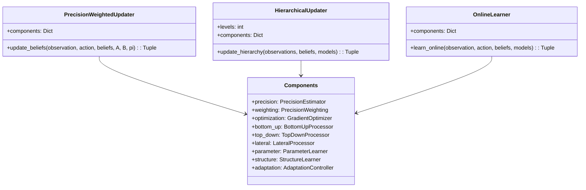

# Belief Updating


## Mathematical Framework


### Core Update Equation
The belief update equation in Active Inference follows the general form:

$Q(s_{t+1}) \propto P(o_t|s_t)P(s_{t+1}|s_t,a_t)Q(s_t)$

where:
- $Q(s_t)$ is the current belief distribution
- $P(o_t|s_t)$ is the likelihood from [[A_matrix]]
- $P(s_{t+1}|s_t,a_t)$ is the transition model from [[B_matrix]]

### Free Energy Formulation
The update can be derived from minimizing the variational free energy:

$F = \mathbb{E}_{Q(s)}[\ln Q(s) - \ln P(o,s)]$

This leads to the optimal update:

$\ln Q^*(s) = \ln P(o|s) + \ln P(s) + const$

### Hierarchical Extension
For hierarchical models with L levels:

$Q(s_l) \propto P(s_{l-1}|s_l)P(s_l|s_{l+1})Q(s_l)$

## Components


### 1. Likelihood Term
- Incorporates new observations
- [[A_matrix]] mapping: $P(o|s)$
- [[sensory_evidence]] weighting
- Precision-weighted updates

### 2. Transition Term
- Predicts state changes
- [[B_matrix]] dynamics: $P(s'|s,a)$
- [[markov_property]] assumptions
- Action-conditioned transitions

### 3. Prior Term
- Previous beliefs
- [[D_matrix]] initialization
- [[belief_propagation]] methods
- Hierarchical constraints

## Advanced Implementation



### 1. Precision-Weighted Updates
```python
class PrecisionWeightedUpdater:
    def __init__(self):
        self.components = {
            'precision': PrecisionEstimator(
                method='empirical',
                adaptation='online'
            ),
            'weighting': PrecisionWeighting(
                type='diagonal',
                regularization=True
            ),
            'optimization': GradientOptimizer(
                method='natural',
                learning_rate='adaptive'
            )
        }
    
    def update_beliefs(
        self,
        observation: np.ndarray,
        action: int,
        beliefs: np.ndarray,
        A: np.ndarray,
        B: np.ndarray,
        pi: np.ndarray  # Precision parameters
    ) -> Tuple[np.ndarray, dict]:
        """Precision-weighted belief update"""
        # Estimate precision
        precision = self.components['precision'].estimate(
            observation, beliefs)
            
        # Weight likelihood
        weighted_likelihood = self.components['weighting'].apply(
            A[observation, :], precision)
            
        # Predict next state
        predicted = B[:, :, action] @ beliefs
        
        # Optimize posterior
        posterior, metrics = self.components['optimization'].minimize(
            likelihood=weighted_likelihood,
            prediction=predicted,
            precision=precision
        )
        
        return posterior, metrics
```

### 2. Hierarchical Updates


```python
class HierarchicalUpdater:
    def __init__(self, levels: int):
        self.levels = levels
        self.components = {
            'bottom_up': BottomUpProcessor(
                method='prediction_error',
                pooling='precision_weighted'
            ),
            'top_down': TopDownProcessor(
                method='prediction',
                regularization='complexity'
            ),
            'lateral': LateralProcessor(
                method='message_passing',
                iterations='adaptive'
            )
        }
    
    def update_hierarchy(
        self,
        observations: List[np.ndarray],
        beliefs: List[np.ndarray],
        models: List[Dict]
    ) -> Tuple[List[np.ndarray], dict]:
        """Update hierarchical beliefs"""
        # Bottom-up pass
        prediction_errors = self.components['bottom_up'].process(
            observations, beliefs, models)
            
        # Top-down predictions
        predictions = self.components['top_down'].process(
            beliefs, models)
            
        # Lateral message passing
        updated_beliefs = self.components['lateral'].process(
            prediction_errors, predictions, models)
            
        return updated_beliefs
```

### 3. Online Learning


```python
class OnlineLearner:
    def __init__(self):
        self.components = {
            'parameter': ParameterLearner(
                method='gradient',
                constraints='probability'
            ),
            'structure': StructureLearner(
                method='bayesian',
                complexity='minimum'
            ),
            'adaptation': AdaptationController(
                method='meta_learning',
                criteria='performance'
            )
        }
    
    def learn_online(
        self,
        observation: np.ndarray,
        action: int,
        beliefs: np.ndarray,
        models: dict
    ) -> Tuple[dict, dict]:
        """Online model learning"""
        # Update parameters
        updated_params = self.components['parameter'].update(
            observation, beliefs, models)
            
        # Update structure
        updated_structure = self.components['structure'].update(
            observation, beliefs, updated_params)
            
        # Adapt learning
        learning_stats = self.components['adaptation'].adapt(
            observation, beliefs, updated_structure)
            
        return updated_structure, learning_stats
```

## Advanced Concepts


### 1. Information Geometry
- [[fisher_information]]
  - Natural gradient descent
  - Metric tensor properties
- [[wasserstein_metrics]]
  - Optimal transport
  - Geodesic flows

### 2. Variational Methods
- [[mean_field_approximation]]
  - Factorized posteriors
  - Coordinate ascent
- [[structured_variational_inference]]
  - Dependency preservation
  - Message passing

### 3. Stochastic Approaches
- [[particle_methods]]
  - Sequential importance sampling
  - Resampling strategies
- [[monte_carlo_methods]]
  - MCMC sampling
  - Hamiltonian dynamics

## Applications


### 1. Perception
- [[hierarchical_perception]]
  - Predictive processing
  - Error propagation
- [[multimodal_integration]]
  - Cue combination
  - Cross-modal inference

### 2. Learning
- [[structure_learning]]
  - Model selection
  - Complexity control
- [[parameter_learning]]
  - Gradient methods
  - Empirical Bayes

### 3. Control
- [[active_inference_control]]
  - Policy selection
  - Action optimization
- [[adaptive_control]]
  - Online adaptation
  - Robust control

## Research Directions


### 1. Theoretical Extensions
- [[quantum_belief_updating]]
  - Quantum probabilities
  - Interference effects
- [[relativistic_belief_updating]]
  - Causal structure
  - Lorentz invariance

### 2. Computational Methods
- [[neural_belief_updating]]
  - Deep architectures
  - End-to-end learning
- [[symbolic_belief_updating]]
  - Logic programming
  - Formal reasoning

### 3. Applications
- [[robotics_belief_updating]]
  - SLAM
  - Manipulation
- [[neuroscience_belief_updating]]
  - Neural implementations
  - Experimental predictions

## Relationship to Bayesian Theory


## References
- [[friston_2010]] - "The free-energy principle: a unified brain theory?"
- [[bogacz_2017]] - "A tutorial on the free-energy framework for modelling perception and learning"
- [[parr_2019]] - "The computational neurology of active inference"
- [[da_costa_2020]] - "Active inference on discrete state-spaces"

## See Also
- [[active_inference]]
- [[bayesian_inference]]
- [[free_energy_principle]]
- [[predictive_coding]]
- [[variational_inference]]
- [[belief_initialization]]
- [[learning_theory]]
- [[bayes_theorem]]
- [[bayesian_networks]]
- [[bayesian_graph_theory]] 