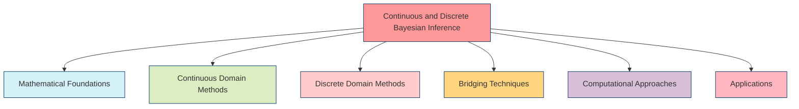
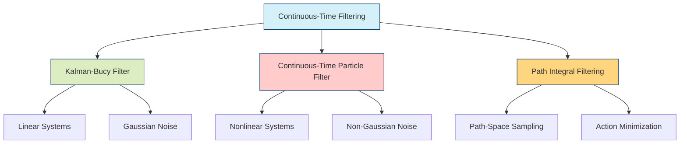
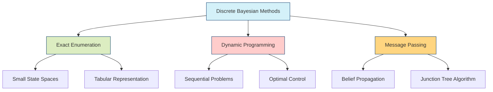
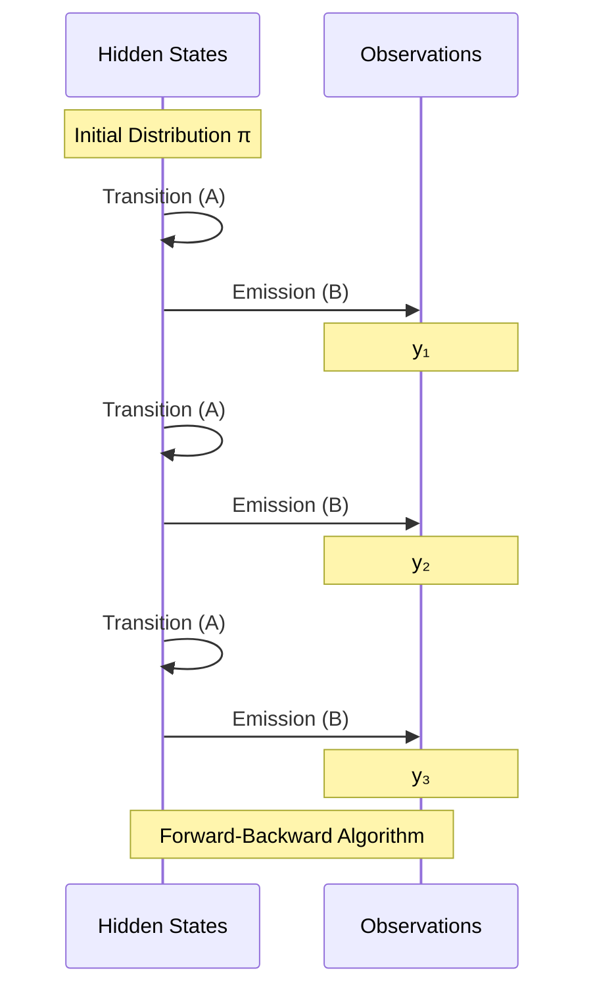
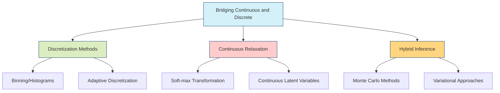
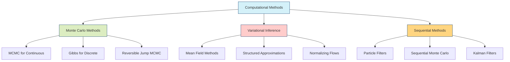
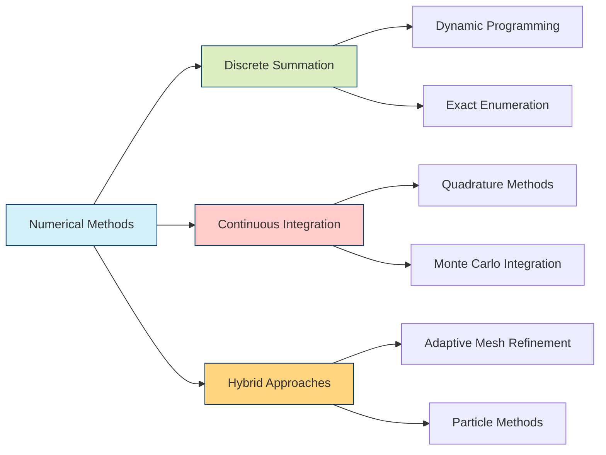
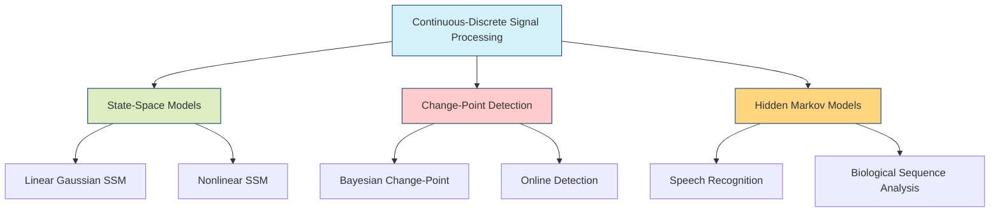
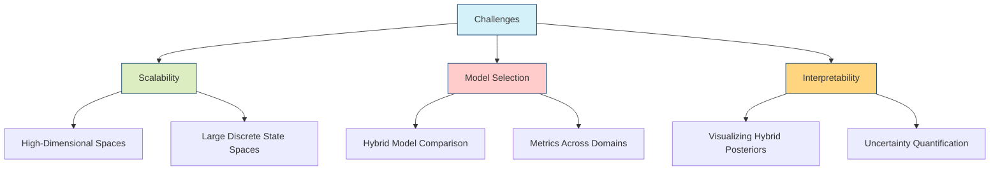

---

title: Continuous and Discrete Bayesian Inference

type: concept

status: stable

created: 2024-03-15

tags:

  - mathematics

  - probability

  - bayesian-inference

  - continuous-systems

  - discrete-systems

semantic_relations:

  - type: foundation

    links:

      - [[probability_theory]]

      - [[bayesian_inference]]

      - [[bayes_theorem]]

      - [[stochastic_processes]]

  - type: implements

    links:

      - [[bayesian_networks]]

      - [[bayesian_graph_theory]]

      - [[path_integral_bayesian_inference]]

  - type: related

    links:

      - [[bayesian_renormalization]]

      - [[bayesian_generative_models]]

      - [[variational_inference]]

      - [[belief_updating]]

---

# Continuous and Discrete Bayesian Inference

## Overview

This article explores the interplay between continuous and discrete state spaces in [[bayesian_inference|Bayesian inference]], addressing methods for handling inference across different representations of uncertainty. It covers the mathematical foundations, practical implementation challenges, and techniques for bridging between continuous and discrete domains in probabilistic modeling.



## Mathematical Foundations

### Bayesian Inference Framework

At its core, both continuous and discrete Bayesian inference rely on [[bayes_theorem|Bayes' theorem]]:

```math

P(\theta|D) = \frac{P(D|\theta)P(\theta)}{P(D)}

```

The difference lies in the nature of the parameter space $\Theta$ and data space $\mathcal{D}$:

```mermaid

graph TB

    subgraph "Bayesian Framework Components"

        A[Prior Distribution] --> E[Posterior Distribution]

        B[Likelihood Function] --> E

        C[Evidence/Marginal Likelihood] --> E

        D[Data] --> B

    end

    subgraph "Continuous vs. Discrete"

        F[Continuous Domain:<br>Parameters θ ∈ ℝⁿ<br>Probability Densities] --- G[Discrete Domain:<br>Parameters θ ∈ {1,2,...,k}<br>Probability Mass Functions]

    end

    E --- F

    E --- G

    style A fill:#d4f1f9,stroke:#05386b

    style B fill:#dcedc1,stroke:#05386b

    style C fill:#ffcccb,stroke:#05386b

    style D fill:#ffd580,stroke:#05386b

    style E fill:#d8bfd8,stroke:#05386b

    style F fill:#ffb6c1,stroke:#05386b

    style G fill:#f8d9d9,stroke:#05386b

```

### Continuous vs. Discrete Spaces

```mermaid

flowchart LR

    subgraph Continuous

        A1[Parameters: θ ∈ ℝⁿ]

        A2[Prior: p(θ)]

        A3[Posterior: p(θ|D)]

        A4["Integrals: ∫p(θ|D)dθ"]

    end

    subgraph Discrete

        B1[Parameters: θ ∈ {1,2,...,k}]

        B2[Prior: P(θ)]

        B3[Posterior: P(θ|D)]

        B4["Sums: ∑P(θ|D)"]

    end

    style A1 fill:#d4f1f9,stroke:#05386b

    style A2 fill:#dcedc1,stroke:#05386b

    style A3 fill:#ffcccb,stroke:#05386b

    style A4 fill:#ffd580,stroke:#05386b

    style B1 fill:#d8bfd8,stroke:#05386b

    style B2 fill:#ffb6c1,stroke:#05386b

    style B3 fill:#f8d9d9,stroke:#05386b

    style B4 fill:#d1f1d1,stroke:#05386b

```

### Time Domain: Continuous vs. Discrete

```mermaid

graph LR

    subgraph "Continuous Time"

        A1[Stochastic Differential Equations]

        A2[dX(t) = f(X(t),t)dt + g(X(t),t)dW(t)]

        A3[Path Integrals]

    end

    subgraph "Discrete Time"

        B1[Difference Equations]

        B2[X_{t+1} = F(X_t, t) + ε_t]

        B3[Markov Chains]

    end

    style A1 fill:#d4f1f9,stroke:#05386b

    style A2 fill:#dcedc1,stroke:#05386b

    style A3 fill:#ffcccb,stroke:#05386b

    style B1 fill:#ffd580,stroke:#05386b

    style B2 fill:#d8bfd8,stroke:#05386b

    style B3 fill:#ffb6c1,stroke:#05386b

```

## Continuous Domain Methods

### Probability Density Functions

```python

def bayesian_update_continuous(prior_pdf, likelihood_pdf, data, theta_range, n_points=1000):

    """

    Perform Bayesian update in continuous parameter space

    Args:

        prior_pdf: Function representing prior density p(θ)

        likelihood_pdf: Function representing likelihood p(D|θ)

        data: Observed data

        theta_range: Tuple (min, max) for parameter range

        n_points: Number of discretization points

    Returns:

        theta_grid: Grid of parameter values

        posterior_pdf: Posterior density values

    """

    # Create parameter grid

    theta_min, theta_max = theta_range

    theta_grid = np.linspace(theta_min, theta_max, n_points)

    # Compute prior and likelihood on grid

    prior_values = np.array([prior_pdf(theta) for theta in theta_grid])

    likelihood_values = np.array([likelihood_pdf(theta, data) for theta in theta_grid])

    # Compute unnormalized posterior

    unnormalized_posterior = prior_values * likelihood_values

    # Normalize using trapezoidal rule for numerical integration

    evidence = np.trapz(unnormalized_posterior, theta_grid)

    posterior_pdf = unnormalized_posterior / evidence

    return theta_grid, posterior_pdf

```

### Differential Equations and Filtering



#### Kalman-Bucy Filter

The continuous-time analog of the Kalman filter, the Kalman-Bucy filter handles linear systems with Gaussian noise:

```math

dX(t) = A(t)X(t)dt + B(t)dW(t)

```

with observations:

```math

dY(t) = C(t)X(t)dt + D(t)dV(t)

```

The filter equations are:

```math

d\hat{X}(t) = A(t)\hat{X}(t)dt + K(t)(dY(t) - C(t)\hat{X}(t)dt)

```

```math

K(t) = P(t)C(t)^T(D(t)D(t)^T)^{-1}

```

```math

\frac{dP(t)}{dt} = A(t)P(t) + P(t)A(t)^T + B(t)B(t)^T - K(t)D(t)D(t)^TK(t)^T

```

### Infinite-Dimensional Bayesian Inference

Continuous domains often involve infinite-dimensional objects like functions and paths:

```julia

function gaussian_process_regression(X_train, y_train, X_test, kernel, noise_var)

    """

    Perform Bayesian inference with Gaussian processes

    Args:

        X_train: Training inputs

        y_train: Training outputs

        X_test: Test inputs

        kernel: Covariance function

        noise_var: Observation noise variance

    Returns:

        mean: Posterior mean function values at X_test

        cov: Posterior covariance matrix

    """

    # Compute kernel matrices

    K_train = [kernel(x1, x2) for x1 in X_train, x2 in X_train]

    K_test_train = [kernel(x_test, x_train) for x_test in X_test, x_train in X_train]

    K_test = [kernel(x1, x2) for x1 in X_test, x2 in X_test]

    # Add noise to training kernel

    K_train_noisy = K_train + noise_var * I

    # Compute posterior mean and covariance

    mean = K_test_train * (K_train_noisy \ y_train)

    cov = K_test - K_test_train * (K_train_noisy \ K_test_train')

    return mean, cov

end

```

## Discrete Domain Methods

### Probability Mass Functions



#### Exact Bayesian Inference in Discrete Systems

For small discrete state spaces, exact calculations are possible:

```python

def discrete_bayesian_update(prior, likelihood, evidence=None):

    """

    Perform exact Bayesian update for discrete distributions

    Args:

        prior: Dictionary mapping states to prior probabilities

        likelihood: Dictionary mapping (state, observation) pairs to likelihoods

        evidence: Observed evidence

    Returns:

        posterior: Dictionary mapping states to posterior probabilities

    """

    posterior = {}

    normalization = 0.0

    # Compute unnormalized posterior

    for state in prior:

        posterior[state] = prior[state] * likelihood.get((state, evidence), 0)

        normalization += posterior[state]

    # Normalize

    if normalization > 0:

        for state in posterior:

            posterior[state] /= normalization

    return posterior

```

### Hidden Markov Models



### Dynamic Bayesian Networks

Dynamic Bayesian Networks (DBNs) extend [[bayesian_networks|Bayesian networks]] to model temporal processes:

```julia

struct DynamicBayesianNetwork

    initial_network::BayesianNetwork

    transition_network::BayesianNetwork

    function DynamicBayesianNetwork(initial, transition)

        # Validate that transition network properly connects time slices

        validate_transition_connections(initial, transition)

        new(initial, transition)

    end

end

function forward_inference(dbn::DynamicBayesianNetwork, observations, n_steps)

    # Initialize with prior

    belief = get_initial_distribution(dbn.initial_network)

    beliefs_over_time = [belief]

    for t in 1:n_steps

        # Prediction step

        belief = transition_update(dbn.transition_network, belief)

        # Observation update (if available)

        if t <= length(observations)

            belief = observation_update(dbn.transition_network, belief, observations[t])

        end

        push!(beliefs_over_time, belief)

    end

    return beliefs_over_time

end

```

## Bridging Techniques



### 1. Discretization of Continuous Spaces

```python

def adaptive_discretization(parameter_range, posterior_density, 

                          max_bins=100, tolerance=1e-3):

    """

    Adaptively discretize a continuous posterior distribution

    Args:

        parameter_range: (min, max) of parameter space

        posterior_density: Function representing posterior density

        max_bins: Maximum number of bins to use

        tolerance: Error tolerance

    Returns:

        bin_edges: Edges of adaptive bins

        discrete_probabilities: Probability masses for each bin

    """

    # Start with uniform binning

    theta_min, theta_max = parameter_range

    initial_bin_edges = np.linspace(theta_min, theta_max, 10)

    bin_edges = initial_bin_edges

    error = float('inf')

    while len(bin_edges) < max_bins and error > tolerance:

        # Compute current discrete approximation

        discrete_probs = []

        bin_centers = []

        for i in range(len(bin_edges)-1):

            lower = bin_edges[i]

            upper = bin_edges[i+1]

            center = (lower + upper) / 2

            bin_centers.append(center)

            # Use trapezoidal rule for integration within bin

            x = np.linspace(lower, upper, 20)

            y = np.array([posterior_density(xi) for xi in x])

            bin_prob = np.trapz(y, x)

            discrete_probs.append(bin_prob)

        # Normalize discrete probabilities

        discrete_probs = np.array(discrete_probs) / sum(discrete_probs)

        # Find bin with highest error and split it

        # Compute error as difference between continuous and piecewise constant

        errors = []

        for i in range(len(bin_edges)-1):

            lower = bin_edges[i]

            upper = bin_edges[i+1]

            x = np.linspace(lower, upper, 20)

            y_true = np.array([posterior_density(xi) for xi in x])

            y_approx = np.ones_like(x) * discrete_probs[i] / (upper - lower)

            error = np.trapz(np.abs(y_true - y_approx), x)

            errors.append(error)

        max_error_idx = np.argmax(errors)

        error = errors[max_error_idx]

        # Split the bin with highest error

        if error > tolerance:

            new_point = (bin_edges[max_error_idx] + bin_edges[max_error_idx+1]) / 2

            bin_edges = np.sort(np.append(bin_edges, new_point))

    # Compute final probabilities

    discrete_probs = []

    for i in range(len(bin_edges)-1):

        lower = bin_edges[i]

        upper = bin_edges[i+1]

        x = np.linspace(lower, upper, 20)

        y = np.array([posterior_density(xi) for xi in x])

        bin_prob = np.trapz(y, x)

        discrete_probs.append(bin_prob)

    # Normalize discrete probabilities

    discrete_probs = np.array(discrete_probs) / sum(discrete_probs)

    return bin_edges, discrete_probs

```

### 2. Continuous Relaxation of Discrete Spaces

```mermaid

graph LR

    A[Discrete Distribution<br>p(k)] -->|"Relaxation"| B[Continuous Distribution<br>q(z)]

    B -->|"Rounding/Sampling"| A

    C[Hard Categorical<br>One-hot Vectors] -->|"Softmax with Temperature"| D[Soft Categorical<br>Probability Simplex]

    style A fill:#d4f1f9,stroke:#05386b

    style B fill:#dcedc1,stroke:#05386b

    style C fill:#ffcccb,stroke:#05386b

    style D fill:#ffd580,stroke:#05386b

```

Continuous relaxation of discrete variables is often accomplished through techniques like:

```python

def gumbel_softmax(logits, temperature=1.0):

    """

    Samples from a continuous relaxation of a categorical distribution

    Args:

        logits: Unnormalized log probabilities

        temperature: Temperature parameter controlling relaxation

    Returns:

        samples: Relaxed one-hot vectors

    """

    # Sample from Gumbel(0, 1)

    gumbel_noise = -np.log(-np.log(np.random.uniform(size=logits.shape)))

    # Add noise to logits

    noisy_logits = logits + gumbel_noise

    # Apply softmax with temperature

    return softmax(noisy_logits / temperature)

```

### 3. Hybrid Systems

Many real-world systems contain both discrete and continuous components:

```mermaid

graph TB

    subgraph "Hybrid Bayesian Model"

        A[Continuous Variables X] --- C[Joint Distribution<br>p(X,Z|θ)]

        B[Discrete Variables Z] --- C

        D[Continuous Parameters θₓ] --- C

        E[Discrete Parameters θᵧ] --- C

    end

    C --- F[Hybrid Inference Methods]

    F --- G[Particle MCMC]

    F --- H[Reversible Jump MCMC]

    F --- I[Variational Methods]

    style A fill:#d4f1f9,stroke:#05386b

    style B fill:#dcedc1,stroke:#05386b

    style C fill:#ffcccb,stroke:#05386b

    style D fill:#ffd580,stroke:#05386b

    style E fill:#d8bfd8,stroke:#05386b

    style F fill:#ffb6c1,stroke:#05386b

```

#### Example: Switching State-Space Model

```julia

struct SwitchingStateSpaceModel

    # Continuous dynamics for each discrete mode

    dynamics::Vector{Function}

    # Transition matrix for discrete states

    mode_transitions::Matrix{Float64}

    # Observation model

    observation_model::Function

    function SwitchingStateSpaceModel(dynamics, transitions, observation)

        @assert size(transitions, 1) == size(transitions, 2) == length(dynamics)

        new(dynamics, transitions, observation)

    end

end

function particle_filter(model::SwitchingStateSpaceModel, observations, n_particles)

    n_modes = length(model.dynamics)

    n_steps = length(observations)

    # Initialize particles: continuous state and discrete mode

    particles = [(randn(2), rand(1:n_modes)) for _ in 1:n_particles]

    all_particles = [deepcopy(particles)]

    all_weights = []

    for t in 1:n_steps

        # Propagate particles

        for i in 1:n_particles

            # Sample new discrete mode

            state, mode = particles[i]

            new_mode = sample_categorical(model.mode_transitions[mode, :])

            # Propagate continuous state with mode-specific dynamics

            new_state = model.dynamics[new_mode](state) + 0.1*randn(2)

            particles[i] = (new_state, new_mode)

        end

        # Compute weights

        weights = [model.observation_model(particles[i][1], observations[t]) 

                  for i in 1:n_particles]

        weights = weights / sum(weights)

        push!(all_weights, weights)

        # Resample

        if effective_sample_size(weights) < n_particles/2

            indices = resample_multinomial(weights, n_particles)

            particles = particles[indices]

        end

        push!(all_particles, deepcopy(particles))

    end

    return all_particles, all_weights

end

```

## Computational Approaches



### 1. Markov Chain Monte Carlo

MCMC methods work for both continuous and discrete spaces, with adaptations for each:

```python

def metropolis_hastings(target_density, proposal_sampler, initial_state, n_samples):

    """

    General Metropolis-Hastings sampler for continuous or discrete spaces

    Args:

        target_density: Function proportional to the target distribution

        proposal_sampler: Function that samples from proposal distribution

        initial_state: Starting state

        n_samples: Number of samples to generate

    Returns:

        samples: Generated samples from target distribution

    """

    samples = [initial_state]

    current_state = initial_state

    for _ in range(n_samples):

        # Propose new state

        proposed_state = proposal_sampler(current_state)

        # Compute acceptance probability

        p_current = target_density(current_state)

        p_proposed = target_density(proposed_state)

        # Proposal density ratio (assuming symmetric proposal)

        acceptance_prob = min(1, p_proposed / p_current)

        # Accept or reject

        if np.random.random() < acceptance_prob:

            current_state = proposed_state

        samples.append(current_state)

    return samples

```

### 2. Variational Inference

[[variational_inference|Variational inference]] methods approximate the posterior with a simpler distribution:

```mermaid

sequenceDiagram

    participant T as True Posterior

    participant A as Approximating Family

    T->>T: Define target p(θ|D)

    A->>A: Choose approximation family q(θ;φ)

    loop Optimization

        A->>T: Compute KL(q(θ;φ) || p(θ|D))

        T->>A: Update parameters φ

    end

    Note over T,A: Minimize KL divergence or maximize ELBO

```

### 3. Numerical Integration and Sampling



## Applications

```mermaid

mindmap

  root((Continuous-Discrete<br>Bayesian<br>Inference))

    Robotics and Control

      State Estimation

      Hybrid Control Systems

      Path Planning

    Signal Processing

      Change-Point Detection

      Regime-Switching Models

      Speech Recognition

    Computational Biology

      Genetic Sequence Analysis

      Protein Structure Prediction

      Gene Regulatory Networks

    Finance

      Option Pricing

      Regime-Switching Models

      Risk Assessment

    Computer Vision

      Object Recognition

      Motion Tracking

      Scene Understanding

```

### 1. Robotics and Control

In robotics, continuous state estimation often interacts with discrete decision-making:

```python

def hybrid_robot_localization(map_data, motion_model, sensor_model, 

                            initial_belief, actions, observations):

    """

    Hybrid Bayesian localization for a robot

    Args:

        map_data: Environment map with obstacles

        motion_model: Continuous motion dynamics

        sensor_model: Observation likelihood

        initial_belief: Initial state distribution

        actions: Sequence of control inputs

        observations: Sequence of sensor readings

    Returns:

        beliefs: Sequence of posterior distributions

    """

    # Initialize beliefs

    beliefs = [initial_belief]

    current_belief = initial_belief

    for t in range(len(actions)):

        # Predict step: apply continuous motion model

        predicted_belief = apply_motion_model(current_belief, motion_model, actions[t])

        # Discretize continuous belief for grid-based operations

        grid_belief = discretize_belief(predicted_belief, map_data.resolution)

        # Apply discrete corrections (e.g., collision avoidance)

        corrected_grid_belief = apply_discrete_constraints(grid_belief, map_data)

        # Convert back to continuous representation

        corrected_belief = continuize_belief(corrected_grid_belief, map_data.resolution)

        # Update step: incorporate observation

        updated_belief = apply_sensor_model(corrected_belief, sensor_model, 

                                          observations[t])

        beliefs.append(updated_belief)

        current_belief = updated_belief

    return beliefs

```

### 2. Signal Processing

Signal processing applications often involve detecting discrete events in continuous signals:



### 3. Computational Biology

In computational biology, discrete sequence data often interacts with continuous molecular dynamics:

```julia

function protein_structure_prediction(amino_acid_sequence, force_field)

    """

    Predict protein structure using hybrid Bayesian inference

    Args:

        amino_acid_sequence: Discrete sequence of amino acids

        force_field: Energy function for molecular conformation

    Returns:

        predicted_structures: Sampled 3D protein structures

    """

    # Discrete part: secondary structure prediction

    secondary_structure = predict_secondary_structure(amino_acid_sequence)

    # Initialize continuous conformation

    initial_conformation = initialize_conformation(amino_acid_sequence, secondary_structure)

    # Define target density (Boltzmann distribution)

    function target_density(conformation)

        energy = force_field(conformation, amino_acid_sequence)

        return exp(-energy / (kB * T))

    end

    # Hybrid MCMC for structure prediction

    predicted_structures = hybrid_mcmc(target_density, initial_conformation,

                                     secondary_structure, n_samples=1000)

    return predicted_structures

end

```

## Challenges and Future Directions



### 1. Scaling to High-Dimensional Spaces

Both continuous and discrete methods face challenges in high dimensions:

- Continuous: Curse of dimensionality in integration

- Discrete: Combinatorial explosion of state spaces

### 2. Theoretical Connections

Developing stronger theoretical connections between continuous and discrete methods remains an active research area:

- Information-geometric perspectives

- Measure-theoretic unifications

- Category-theoretic frameworks

### 3. Emerging Applications

New application areas are driving innovations in hybrid approaches:

- Quantum Bayesian inference (discrete energy levels, continuous wavefunctions)

- Neuromorphic computing (discrete spikes, continuous membrane potentials)

- Biological systems (discrete genetic code, continuous biochemical dynamics)

## References

1. Särkkä, S. (2013). Bayesian Filtering and Smoothing. Cambridge University Press.

1. Green, P. J. (1995). Reversible jump Markov chain Monte Carlo computation and Bayesian model determination. Biometrika, 82(4), 711-732.

1. Neal, R. M. (2011). MCMC using Hamiltonian dynamics. Handbook of Markov Chain Monte Carlo, 2(11), 2.

1. Daum, F., & Huang, J. (2003). Curse of dimensionality and particle filters. In Proceedings of the IEEE Conference on Aerospace.

1. Hoffman, M. D., & Gelman, A. (2014). The No-U-Turn sampler: adaptively setting path lengths in Hamiltonian Monte Carlo. Journal of Machine Learning Research, 15(1), 1593-1623.

