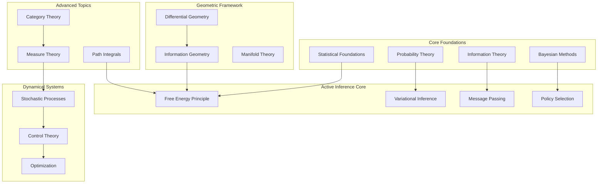
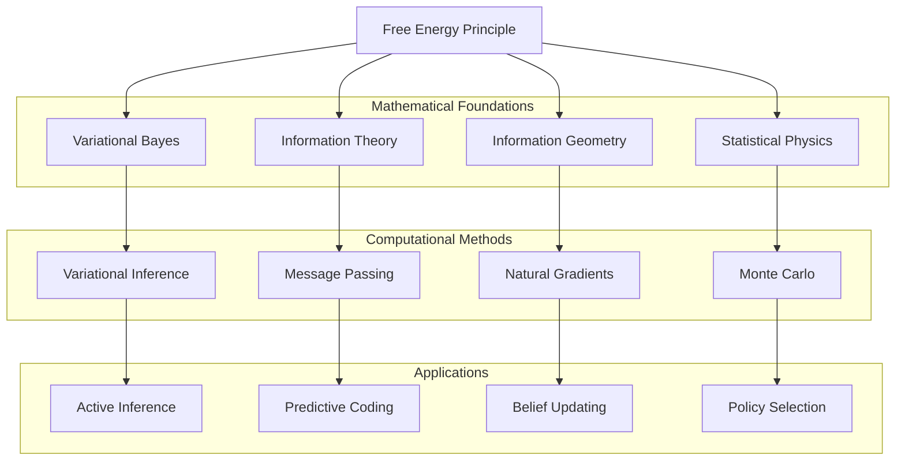
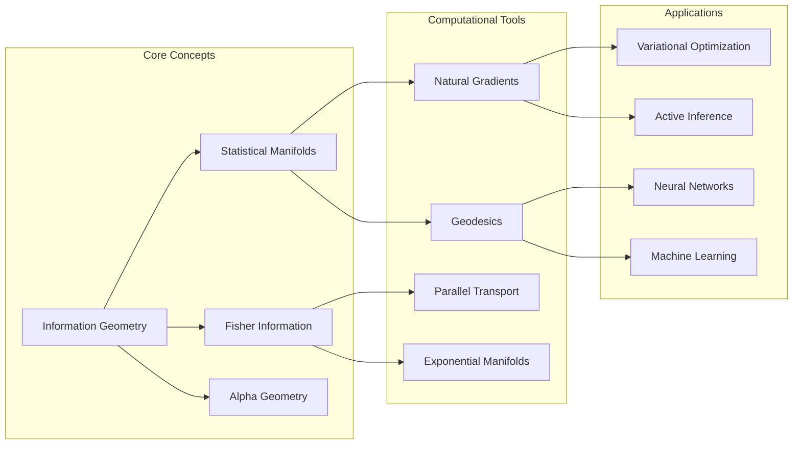
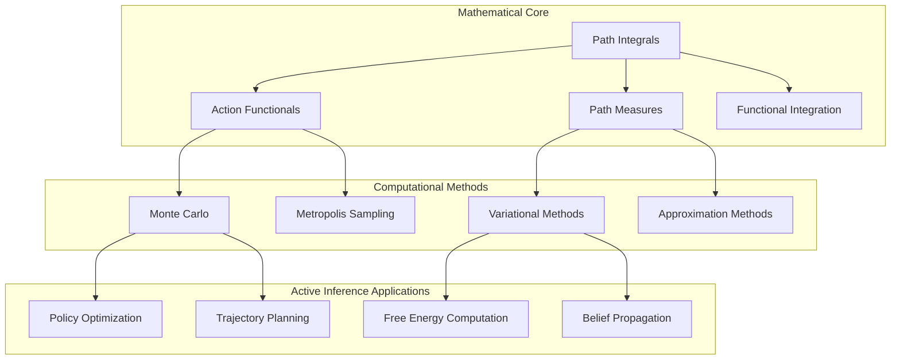
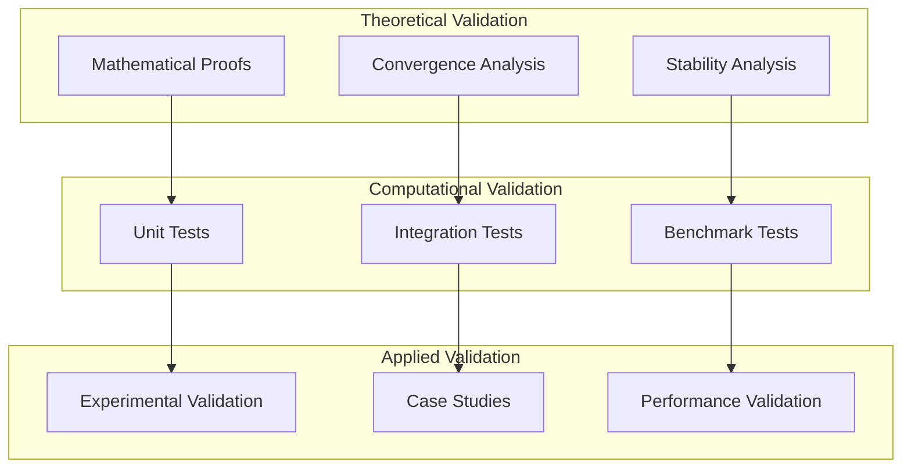

---

title: Mathematics Cross-Reference Map

type: meta

status: active

created: 2024-02-07

tags:

  - mathematics

  - meta

  - cross_references

  - knowledge_graph

semantic_relations:

  - type: maps

    links:

      - [[README]]

      - [[../ontology/cognitive_ontology]]

---

# Mathematics Cross-Reference Map

## Overview

This document provides a comprehensive mapping of cross-references across the mathematics knowledge base, facilitating navigation and understanding of conceptual relationships.



## Primary Conceptual Hierarchies

### 1. Statistical Foundations Hierarchy

```yaml

statistical_foundations:

  foundations:

    - probability_theory

    - measure_theory

    - real_analysis

  core_methods:

    - bayesian_inference

    - frequentist_inference

    - hypothesis_testing

  advanced_topics:

    - information_theory

    - statistical_physics

    - stochastic_processes

  applications:

    - parameter_estimation

    - model_selection

    - uncertainty_quantification

```

#### Cross-Reference Network

- **[[statistical_foundations]]** ↔ **[[probability_theory]]** ↔ **[[measure_theory]]**

- **[[bayesian_inference]]** ↔ **[[bayes_theorem]]** ↔ **[[prior_distributions]]**

- **[[information_theory]]** ↔ **[[entropy]]** ↔ **[[mutual_information]]**

- **[[stochastic_processes]]** ↔ **[[markov_processes]]** ↔ **[[diffusion_processes]]**

### 2. Active Inference Hierarchy

```yaml

active_inference:

  theoretical_core:

    - free_energy_principle

    - variational_free_energy

    - expected_free_energy

  computational_methods:

    - variational_inference

    - message_passing

    - belief_updating

  geometric_perspective:

    - information_geometry

    - natural_gradients

    - fisher_information

  applications:

    - policy_selection

    - action_selection

    - hierarchical_inference

```

#### Cross-Reference Network

- **[[free_energy_principle]]** ↔ **[[variational_free_energy]]** ↔ **[[expected_free_energy]]**

- **[[active_inference_theory]]** ↔ **[[policy_selection]]** ↔ **[[belief_updating]]**

- **[[information_geometry]]** ↔ **[[fisher_information]]** ↔ **[[natural_gradients]]**

- **[[message_passing]]** ↔ **[[factor_graphs]]** ↔ **[[belief_propagation]]**

### 3. Geometric Mathematics Hierarchy

```yaml

geometric_mathematics:

  foundations:

    - differential_geometry

    - riemannian_geometry

    - topology

  information_geometric:

    - information_geometry

    - statistical_manifolds

    - fisher_information

  symplectic_geometric:

    - symplectic_geometry

    - hamiltonian_mechanics

    - contact_geometry

  applications:

    - optimization_on_manifolds

    - geometric_deep_learning

    - geometric_active_inference

```

#### Cross-Reference Network

- **[[differential_geometry]]** ↔ **[[riemannian_geometry]]** ↔ **[[metric_geometry]]**

- **[[information_geometry]]** ↔ **[[statistical_manifolds]]** ↔ **[[exponential_families]]**

- **[[symplectic_geometry]]** ↔ **[[hamiltonian_mechanics]]** ↔ **[[lagrangian_mechanics]]**

- **[[geometric_active_inference]]** ↔ **[[natural_gradient_flow]]** ↔ **[[geodesic_flows]]**

## Detailed Cross-Reference Mappings

### Free Energy Principle Connections



#### Specific Links

- **[[free_energy_principle]]** implements **[[variational_principle]]**

- **[[variational_free_energy]]** bounds **[[negative_log_evidence]]**

- **[[expected_free_energy]]** guides **[[policy_optimization]]**

- **[[free_energy_minimization]]** uses **[[natural_gradient_descent]]**

### Information Geometry Network



#### Specific Links

- **[[information_geometry]]** studies **[[statistical_manifolds]]**

- **[[fisher_information]]** defines **[[riemannian_metric]]**

- **[[natural_gradients]]** follow **[[steepest_descent]]** on manifolds

- **[[alpha_connections]]** generalize **[[exponential_families]]**

### Path Integral Framework



#### Specific Links

- **[[path_integral_theory]]** extends **[[quantum_mechanics]]** to **[[stochastic_systems]]**

- **[[path_integral_free_energy]]** implements **[[partition_function]]** calculations

- **[[path_integral_implementations]]** use **[[monte_carlo_methods]]**

- **[[trajectory_optimization]]** applies **[[variational_calculus]]**

## Bidirectional Reference Patterns

### Foundation → Application Flow

```yaml

foundation_to_application:

  probability_theory:

    - bayesian_inference

    - stochastic_processes

    - information_theory

    - statistical_physics

  differential_geometry:

    - information_geometry

    - optimal_control

    - geometric_mechanics

    - general_relativity

  variational_calculus:

    - optimization_theory

    - control_theory

    - field_theory

    - path_integrals

  measure_theory:

    - probability_theory

    - functional_analysis

    - stochastic_calculus

    - ergodic_theory

```

### Application → Foundation Flow

```yaml

application_to_foundation:

  active_inference:

    requires:

      - variational_inference

      - information_geometry

      - optimization_theory

      - stochastic_processes

  neural_networks:

    requires:

      - optimization_theory

      - probability_theory

      - linear_algebra

      - calculus

  control_systems:

    requires:

      - differential_equations

      - optimization_theory

      - linear_algebra

      - real_analysis

  machine_learning:

    requires:

      - statistical_learning_theory

      - optimization_theory

      - probability_theory

      - linear_algebra

```

## Thematic Cross-Reference Clusters

### 1. Optimization Cluster

**Core Files:**

- **[[optimization_theory]]** - Central hub

- **[[variational_methods]]** - Calculus of variations

- **[[stochastic_optimization]]** - Random optimization

- **[[convex_optimization]]** - Convex problems

**Cross-References:**

```text

optimization_theory ↔ variational_methods ↔ calculus_of_variations

stochastic_optimization ↔ gradient_descent ↔ natural_gradients

convex_optimization ↔ lagrange_multipliers ↔ duality_theory

control_theory ↔ optimal_control ↔ dynamic_programming

```

### 2. Probabilistic Modeling Cluster

**Core Files:**

- **[[probabilistic_graphical_models]]** - Framework overview

- **[[bayesian_networks]]** - Directed models

- **[[markov_random_fields]]** - Undirected models

- **[[factor_graphs]]** - Factor representations

**Cross-References:**

```text

probabilistic_graphical_models ↔ bayesian_networks ↔ conditional_independence

markov_random_fields ↔ gibbs_distributions ↔ hammersley_clifford

factor_graphs ↔ message_passing ↔ belief_propagation

variational_inference ↔ mean_field ↔ structured_variational

```

### 3. Stochastic Analysis Cluster

**Core Files:**

- **[[stochastic_processes]]** - General framework

- **[[martingale_theory]]** - Martingales

- **[[ito_calculus]]** - Stochastic calculus

- **[[diffusion_processes]]** - Continuous processes

**Cross-References:**

```text

stochastic_processes ↔ probability_theory ↔ measure_theory

martingale_theory ↔ optional_stopping ↔ doob_meyer

ito_calculus ↔ stochastic_differential_equations ↔ fokker_planck

diffusion_processes ↔ brownian_motion ↔ feynman_kac

```

### 4. Information Theory Cluster

**Core Files:**

- **[[information_theory]]** - Shannon information

- **[[algorithmic_information]]** - Kolmogorov complexity

- **[[quantum_information]]** - Quantum extensions

- **[[information_geometry]]** - Geometric information

**Cross-References:**

```text

information_theory ↔ entropy ↔ mutual_information ↔ channel_capacity

algorithmic_information ↔ kolmogorov_complexity ↔ minimum_description_length

quantum_information ↔ von_neumann_entropy ↔ quantum_entanglement

information_geometry ↔ fisher_information ↔ jeffreys_prior

```

## Implementation Cross-References

### Numerical Methods Links

```yaml

numerical_implementations:

  core_algorithms:

    automatic_differentiation:

      - optimization_theory

      - machine_learning

      - variational_inference

    monte_carlo_methods:

      - bayesian_inference

      - path_integrals

      - statistical_physics

    finite_element_methods:

      - differential_equations

      - continuum_mechanics

      - computational_physics

    spectral_methods:

      - fourier_analysis

      - partial_differential_equations

      - signal_processing

  software_libraries:

    scientific_computing:

      - numpy

      - scipy

      - sympy

      - matplotlib

    machine_learning:

      - pytorch

      - jax

      - tensorflow

      - scikit_learn

    probabilistic_programming:

      - pymc

      - stan

      - edward

      - pyro

```

### Code Example Cross-References

```python

# Cross-reference pattern for implementation files

class CrossReferenceExample:

    """

    Example showing cross-reference patterns in code.

    Mathematical Foundation:

        - [[variational_inference]] - Core VI theory

        - [[natural_gradients]] - Geometric optimization

        - [[fisher_information]] - Information metric

    Implementation Details:

        - [[automatic_differentiation]] - Gradient computation

        - [[numerical_optimization]] - Optimization algorithms

        - [[convergence_analysis]] - Theoretical guarantees

    Applications:

        - [[active_inference]] - AI applications

        - [[machine_learning]] - ML applications

        - [[robotics]] - Robotics applications

    Related Implementations:

        - [[message_passing_implementations]]

        - [[belief_updating_algorithms]]

        - [[policy_optimization_methods]]

    """

    pass

```

## Quality Assurance Cross-References

### Validation Networks



### Documentation Standards

```yaml

documentation_standards:

  mathematical_content:

    required_sections:

      - mathematical_foundation

      - theoretical_guarantees

      - computational_complexity

      - implementation_notes

    cross_reference_requirements:

      - related_theory: minimum 3 links

      - implementation_details: minimum 2 links

      - applications: minimum 2 links

      - external_resources: minimum 1 link

  code_content:

    required_sections:

      - docstring_with_theory_links

      - type_annotations

      - example_usage

      - performance_notes

    cross_reference_requirements:

      - mathematical_foundation: minimum 2 links

      - related_algorithms: minimum 1 link

      - test_coverage: 100% for core functions

```

## Maintenance and Updates

### Cross-Reference Validation

```python

class CrossReferenceValidator:

    """

    Automated validation of cross-reference integrity.

    Features:

        - Dead link detection

        - Bidirectional link verification

        - Consistency checking

        - Coverage analysis

    """

    def validate_links(self, knowledge_base_path: str) -> dict:

        """Validate all cross-references in knowledge base."""

        # Implementation for link validation

        pass

    def generate_link_report(self) -> str:

        """Generate comprehensive link analysis report."""

        # Implementation for report generation

        pass

    def suggest_missing_links(self) -> list:

        """Suggest potential missing cross-references."""

        # Implementation for link suggestion

        pass

```

### Update Propagation

```yaml

update_propagation:

  new_content_addition:

    steps:

      1. Add content to appropriate location

      2. Update parent category indexes

      3. Add bidirectional cross-references

      4. Update cross-reference map

      5. Validate all links

      6. Update documentation

  content_modification:

    steps:

      1. Modify content

      2. Check affected cross-references

      3. Update dependent content

      4. Validate link integrity

      5. Update modification timestamps

  content_removal:

    steps:

      1. Identify all incoming links

      2. Update or remove references

      3. Archive content appropriately

      4. Update cross-reference map

      5. Validate remaining links

```

## Recent Developments (2025)

### Enhanced Content

- **[[statistical_foundations]]** - Comprehensive mathematical treatment with proofs and examples

- **[[message_passing]]** - Detailed algorithmic implementations and applications

- **[[statistical_computing_implementations]]** - Complete computational library with examples

- **[[probabilistic_models]]** - Extended mathematical framework and applications

### Implementation Improvements

- **Theory-Practice Integration**: Code examples directly linked to mathematical theory

- **Cross-Reference Enhancement**: Improved bidirectional linking throughout knowledge base

- **Quality Standards**: Enhanced documentation standards and validation procedures

- **Practical Examples**: Working demonstrations for all major concepts

### Cross-Reference Network Growth

```yaml

new_cross_references:

  statistical_computing_implementations:

    - links_to: [statistical_foundations, bayesian_inference, information_theory]

    - links_from: [active_inference_theory, message_passing, variational_inference]

    - implementations: [ExponentialFamily, BayesianInference, InformationMeasures]

  enhanced_message_passing:

    - mathematical_framework: probabilistic_graphical_models

    - algorithmic_details: [sum_product, max_product, variational_mp]

    - applications: [active_inference, error_correction, computer_vision]

  updated_cross_reference_map:

    - validation_procedures: automated_link_checking

    - maintenance_protocols: update_propagation

    - quality_metrics: coverage_analysis

```

## Future Enhancements

### Planned Improvements

1. **Semantic Linking**: Enhanced semantic relationship detection

1. **Interactive Navigation**: Dynamic cross-reference visualization

1. **Automated Maintenance**: AI-powered link maintenance

1. **Multi-Modal Links**: Integration with visualizations and code

## External Standards and Ontologies

- [[msc_skos]] — Standard taxonomy for mathematics as SKOS; useful for tagging and search alignment

- [[ontomathpro_ontology]] — Concept graph to align symbols, fields, and relations

- [[mathgloss_knowledge_graph]] — Undergraduate math KG; supports learning paths and multilingual terms

### Research Directions

1. **Knowledge Graph Embeddings**: Vector representations of concepts

1. **Automated Concept Discovery**: ML-based concept relationship discovery

1. **Dynamic Documentation**: Self-updating cross-references

1. **Collaborative Editing**: Multi-user cross-reference management

---

**See Also**:

- [[README]] - Main navigation hub

- [[../ontology/cognitive_ontology]] - Conceptual framework

- Individual mathematical concept files for specific cross-references

