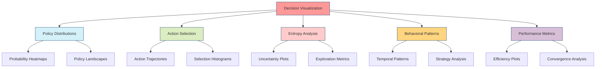

# Decision Visualization

## Overview

Decision visualization provides graphical tools and diagnostics for understanding policy distributions, action selection processes, entropy measures, and behavioral patterns in active inference agents. These visualizations enable researchers and practitioners to analyze decision-making dynamics and optimize agent behavior.



## Policy Distribution Visualizations

### Probability Heatmaps

```python
import numpy as np
import matplotlib.pyplot as plt
import seaborn as sns

def plot_policy_heatmap(policies, states, actions, title="Policy Distribution"):
    """Plot policy probabilities as a heatmap."""
    fig, ax = plt.subplots(figsize=(10, 6))

    # Create heatmap data
    policy_matrix = np.zeros((len(states), len(actions)))
    for i, state in enumerate(states):
        for j, action in enumerate(actions):
            policy_matrix[i, j] = policies[state][action]

    # Plot heatmap
    sns.heatmap(policy_matrix,
                xticklabels=actions,
                yticklabels=states,
                annot=True,
                fmt='.2f',
                cmap='Blues',
                ax=ax)

    ax.set_title(title)
    ax.set_xlabel('Actions')
    ax.set_ylabel('States')
    plt.tight_layout()
    return fig
```

## Action Selection Visualizations

### Action Trajectory Plots

```python
def plot_action_trajectory(actions_over_time, states_over_time,
                          title="Action Selection Trajectory"):
    """Plot action selections over time with state context."""
    fig, (ax1, ax2) = plt.subplots(2, 1, figsize=(12, 8), sharex=True)

    time_steps = range(len(actions_over_time))

    # Plot actions
    action_nums = [action['index'] for action in actions_over_time]
    ax1.plot(time_steps, action_nums, 'bo-', linewidth=2, markersize=6,
             label='Selected Action')
    ax1.set_ylabel('Action Index')
    ax1.set_title('Action Selection Over Time')
    ax1.grid(True, alpha=0.3)
    ax1.legend()

    # Plot state probabilities
    state_probs = np.array([state['probabilities'] for state in states_over_time])
    for state_idx in range(state_probs.shape[1]):
        ax2.plot(time_steps, state_probs[:, state_idx],
                label=f'State {state_idx+1}', linewidth=2)

    ax2.set_xlabel('Time Step')
    ax2.set_ylabel('State Probability')
    ax2.set_title('Belief State Evolution')
    ax2.grid(True, alpha=0.3)
    ax2.legend()

    plt.suptitle(title)
    plt.tight_layout()
    return fig
```

## Entropy Analysis Visualizations

### Uncertainty Evolution Plots

```python
def plot_entropy_evolution(belief_history, action_history, title="Uncertainty Evolution"):
    """Plot belief entropy and action entropy over time."""
    fig, (ax1, ax2) = plt.subplots(2, 1, figsize=(12, 8), sharex=True)

    time_steps = range(len(belief_history))

    # Compute belief entropy
    belief_entropies = []
    for beliefs in belief_history:
        probs = np.array(list(beliefs.values()))
        entropy = -np.sum(probs * np.log(probs + 1e-10))
        belief_entropies.append(entropy)

    ax1.plot(time_steps, belief_entropies, 'b-', linewidth=2, label='Belief Entropy')
    ax1.fill_between(time_steps, belief_entropies, alpha=0.3, color='blue')
    ax1.set_ylabel('Belief Entropy')
    ax1.set_title('Belief State Uncertainty')
    ax1.grid(True, alpha=0.3)
    ax1.legend()

    # Compute action entropy (if probabilities available)
    if action_history and 'probabilities' in action_history[0]:
        action_entropies = []
        for action in action_history:
            probs = np.array(action['probabilities'])
            entropy = -np.sum(probs * np.log(probs + 1e-10))
            action_entropies.append(entropy)

        ax2.plot(time_steps, action_entropies, 'r-', linewidth=2, label='Action Entropy')
        ax2.fill_between(time_steps, action_entropies, alpha=0.3, color='red')
        ax2.set_ylabel('Action Entropy')
        ax2.set_title('Action Selection Uncertainty')
        ax2.grid(True, alpha=0.3)
        ax2.legend()

    ax2.set_xlabel('Time Step')
    plt.suptitle(title)
    plt.tight_layout()
    return fig
```

## Applications in Active Inference

### Real-time Decision Monitoring

```python
def create_realtime_dashboard(agent_state, history_length=100):
    """Create real-time decision monitoring dashboard."""
    fig, axes = plt.subplots(3, 2, figsize=(15, 12))

    # Current belief state
    current_beliefs = list(agent_state['beliefs'].values())
    axes[0,0].bar(range(len(current_beliefs)), current_beliefs, color='skyblue')
    axes[0,0].set_title('Current Belief State')
    axes[0,0].set_xlabel('State')
    axes[0,0].set_ylabel('Probability')

    # Recent action history
    if len(agent_state['action_history']) > 0:
        recent_actions = agent_state['action_history'][-history_length:]
        axes[0,1].plot(range(len(recent_actions)), recent_actions, 'ro-')
        axes[0,1].set_title('Recent Action History')
        axes[0,1].set_xlabel('Time Step')
        axes[0,1].set_ylabel('Action Index')

    # EFE landscape
    if 'expected_free_energies' in agent_state:
        efe_values = agent_state['expected_free_energies']
        axes[1,0].bar(range(len(efe_values)), efe_values, color='orange')
        axes[1,0].set_title('Expected Free Energies')
        axes[1,0].set_xlabel('Action')
        axes[1,0].set_ylabel('EFE Value')

    # Policy distribution
    if 'policy_probabilities' in agent_state:
        policy_probs = agent_state['policy_probabilities']
        axes[1,1].bar(range(len(policy_probs)), policy_probs, color='green')
        axes[1,1].set_title('Current Policy')
        axes[1,1].set_xlabel('Action')
        axes[1,1].set_ylabel('Probability')

    # Belief entropy over time
    if len(agent_state['belief_history']) > 1:
        belief_entropies = []
        for beliefs in agent_state['belief_history'][-history_length:]:
            probs = np.array(list(beliefs.values()))
            entropy = -np.sum(probs * np.log(probs + 1e-10))
            belief_entropies.append(entropy)

        axes[2,0].plot(range(len(belief_entropies)), belief_entropies, 'blue')
        axes[2,0].set_title('Belief Entropy History')
        axes[2,0].set_xlabel('Time Step')
        axes[2,0].set_ylabel('Entropy')

    # Performance metrics
    if 'reward_history' in agent_state and len(agent_state['reward_history']) > 0:
        recent_rewards = agent_state['reward_history'][-history_length:]
        cumulative_reward = np.cumsum(recent_rewards)

        axes[2,1].plot(range(len(recent_rewards)), recent_rewards, 'lightblue', alpha=0.7, label='Instant')
        axes[2,1].plot(range(len(cumulative_reward)), cumulative_reward, 'darkblue', linewidth=2, label='Cumulative')
        axes[2,1].set_title('Reward History')
        axes[2,1].set_xlabel('Time Step')
        axes[2,1].set_ylabel('Reward')
        axes[2,1].legend()

    plt.suptitle('Active Inference Agent - Real-time Dashboard', fontsize=16)
    plt.tight_layout()
    return fig
```

## Related Concepts

### Active Inference Components

- [[active_inference]]
- [[policy_selection]]
- [[expected_free_energy]]
- [[belief_updating]]

### Visualization Methods

- [[exploration_visualization]]
- [[learning_visualization]]
- [[belief_evolution]]

## References

1. Friston, K., et al. (2017). Active Inference: A Process Theory. Neural Computation.

1. Parr, T., & Friston, K. (2019). Generalised free energy and active inference. Biological Cybernetics.

## See Also

- [[exploration_visualization]]
- [[learning_visualization]]
- [[belief_evolution]]
- [[expected_free_energy]]
- [[active_inference]]
