# Ecological Systems

## Overview

Ecological systems mathematics studies the dynamics of interacting populations in natural ecosystems. In cognitive modeling, ecological principles provide frameworks for understanding multi-agent systems, resource allocation, adaptation, and the emergence of complex behaviors from simple interactions, offering insights for distributed active inference and collective intelligence.

```mermaid
graph TD
    A[Ecological Systems] --> B[Population Dynamics]
    A --> C[Community Ecology]
    A --> D[Ecosystem Processes]
    A --> E[Spatial Ecology]
    A --> F[Evolutionary Dynamics]

    B --> B1[Single Species]
    B --> B2[Predator-Prey]
    B --> B3[Competition]
    B --> B4[Mutualism]

    C --> C1[Food Webs]
    C --> C2[Trophic Cascades]
    C --> C3[Biodiversity]
    C --> C4[Keystone Species]

    D --> D1[Nutrient Cycling]
    D --> D2[Energy Flow]
    D --> D3[Material Balance]

    E --> E1[Metapopulation]
    E --> E2[Landscape Ecology]
    E --> E3[Dispersal]
    E --> E4[Habitat Fragmentation]

    F --> F1[Natural Selection]
    F --> F2[Co-evolution]
    F --> F3[Adaptive Dynamics]

    style A fill:#ff9999,stroke:#05386b
```



## Population Dynamics

### Single Species Models

#### Exponential Growth
dn/dt = r n

#### Logistic Growth
dn/dt = r n (1 - n/K)

#### Allee Effect
Cooperative population dynamics with critical thresholds.

### Multi-Species Interactions

#### Lotka-Volterra Predator-Prey
dx/dt = α x - β x y
dy/dt = -γ y + δ x y

#### Competitive Exclusion
Gause's principle: complete competitors cannot coexist.

#### Mutualism
Beneficial interactions between species.

## Community Ecology

### Food Web Dynamics

Complex networks of trophic interactions:

dN_i/dt = N_i (r_i + ∑_j a_ij N_j)

### Trophic Cascades

Indirect effects propagating through food chains.

### Biodiversity Patterns

Species-area relationships, diversity gradients.

## Ecosystem Processes

### Nutrient Cycling

Biogeochemical cycles with multiple compartments:

dC/dt = inputs - outputs + transformations

### Energy Flow

Trophic efficiency and energy transfer between levels.

### Material Balance

Conservation principles in ecosystem metabolism.

## Spatial Ecology

### Metapopulation Theory

Populations of populations:

dP_i/dt = c ∑_j m_ij (P_j - P_i) + local_dynamics

### Reaction-Diffusion Systems

∂n/∂t = D ∇²n + f(n)

### Habitat Connectivity

Landscape permeability and dispersal barriers.

## Evolutionary Dynamics

### Adaptive Dynamics

Evolution of quantitative traits:

dẋ/dt = (1/2) σ² x''(x)

### Evolutionary Game Theory

Frequency-dependent selection in populations.

### Co-evolutionary Dynamics

Reciprocal evolution of interacting species.

## Applications in Cognitive Modeling

### Multi-Agent Systems

Agent populations with resource competition and cooperation.

### Distributed Active Inference

Collective belief updating and decision-making.

### Swarm Intelligence

Emergent collective behavior from simple rules.

### Resource Allocation

Optimal distribution of cognitive resources.

## Implementation

```python
import numpy as np
from typing import Dict, Union, Tuple, Callable, List, Optional
from scipy.integrate import odeint

class EcologicalDynamics:
    """Mathematical models of ecological systems for cognitive modeling analogies.

    This class implements various ecological models that can be used as analogies
    for understanding complex interactions in cognitive systems, multi-agent
    reinforcement learning, and collective intelligence.
    """

    @staticmethod
    def lotka_volterra_predator_prey(state: np.ndarray,
                                    t: Union[float, np.ndarray],
                                    params: Dict[str, float]) -> np.ndarray:
        """Classic Lotka-Volterra predator-prey equations.

        Models the oscillatory dynamics between predator and prey populations.

        Args:
            state: Current population densities [prey_density, predator_density]
            t: Time parameter (required for odeint compatibility)
            params: Model parameters dictionary containing:
                - alpha: prey growth rate (default: 1.0)
                - beta: predation rate (default: 0.1)
                - gamma: predator death rate (default: 1.5)
                - delta: predator efficiency (default: 0.075)

        Returns:
            Array of population derivatives [dprey/dt, dpredator/dt]

        Example:
            >>> params = {'alpha': 1.0, 'beta': 0.1, 'gamma': 1.5, 'delta': 0.075}
            >>> state = np.array([10.0, 5.0])
            >>> derivatives = EcologicalDynamics.lotka_volterra_predator_prey(state, 0, params)
        """
        prey, predator = state

        # Extract parameters with defaults
        alpha = params.get('alpha', 1.0)  # prey growth rate
        beta = params.get('beta', 0.1)   # predation rate
        gamma = params.get('gamma', 1.5) # predator death rate
        delta = params.get('delta', 0.075) # predator efficiency

        dprey_dt = alpha * prey - beta * prey * predator
        dpredator_dt = -gamma * predator + delta * prey * predator

        return np.array([dprey_dt, dpredator_dt])

    @staticmethod
    def logistic_competition(state: np.ndarray,
                           t: Union[float, np.ndarray],
                           params: Dict[str, Union[np.ndarray, float]]) -> np.ndarray:
        """Logistic growth model with inter-species competition.

        Extends logistic growth to multiple competing species.

        Args:
            state: Population densities for all species
            t: Time parameter (required for odeint compatibility)
            params: Model parameters dictionary containing:
                - growth_rates: Growth rates for each species (default: ones)
                - carrying_capacities: Carrying capacities (default: ones)
                - competition_matrix: Competition coefficients (default: identity)

        Returns:
            Array of population derivatives for all species

        Example:
            >>> params = {
            ...     'growth_rates': np.array([0.5, 0.3]),
            ...     'carrying_capacities': np.array([100, 80]),
            ...     'competition_matrix': np.array([[1, 0.5], [0.3, 1]])
            ... }
            >>> state = np.array([50.0, 40.0])
            >>> derivatives = EcologicalDynamics.logistic_competition(state, 0, params)
        """
        N = state
        r = params.get('growth_rates', np.ones(len(N)))
        K = params.get('carrying_capacities', np.ones(len(N)))
        alpha = params.get('competition_matrix', np.eye(len(N)))

        # Competition terms (Lotka-Volterra competition)
        competition = alpha @ N

        dN_dt = r * N * (1 - competition / K)

        return dN_dt

    @staticmethod
    def food_web_dynamics(state: np.ndarray,
                         t: Union[float, np.ndarray],
                         params: Dict[str, Union[np.ndarray, float]]) -> np.ndarray:
        """Generalized Lotka-Volterra food web dynamics.

        Models complex feeding relationships in ecological communities.

        Args:
            state: Species densities/abundances
            t: Time parameter (required for odeint compatibility)
            params: Model parameters dictionary containing:
                - growth_rates: Intrinsic growth rates (default: zeros)
                - interaction_matrix: Species interaction matrix (predation/competition/mutualism)

        Returns:
            Array of species density derivatives

        Example:
            >>> # Simple food chain: resource -> consumer -> predator
            >>> interaction_matrix = np.array([
            ...     [0, -0.1, 0],      # resource consumed by consumer
            ...     [0.05, 0, -0.2],   # consumer grows from resource, eaten by predator
            ...     [0, 0.1, 0]        # predator grows from consumer
            ... ])
            >>> params = {'interaction_matrix': interaction_matrix}
            >>> state = np.array([100, 20, 5])
            >>> derivatives = EcologicalDynamics.food_web_dynamics(state, 0, params)
        """
        N = state
        r = params.get('growth_rates', np.zeros(len(N)))
        A = params.get('interaction_matrix', np.zeros((len(N), len(N))))

        # Generalized Lotka-Volterra: dN_i/dt = N_i * (r_i + sum_j A_ij * N_j)
        dN_dt = N * (r + A @ N)

        return dN_dt

    @staticmethod
    def simulate_ecosystem(model_func: Callable[[np.ndarray, Union[float, np.ndarray], Dict], np.ndarray],
                          params: Dict[str, Union[np.ndarray, float]],
                          t_span: np.ndarray,
                          initial_state: np.ndarray,
                          method: str = 'odeint') -> np.ndarray:
        """Generic ecosystem simulation using numerical integration.

        Args:
            model_func: Dynamical model function (must match odeint signature)
            params: Model parameters dictionary
            t_span: Time points for simulation
            initial_state: Initial population densities
            method: Integration method ('odeint' or other scipy methods)

        Returns:
            Time series of system state (shape: len(t_span) x len(initial_state))

        Example:
            >>> params = {'alpha': 1.0, 'beta': 0.1, 'gamma': 1.5, 'delta': 0.075}
            >>> t_span = np.linspace(0, 50, 1000)
            >>> initial_state = np.array([10.0, 5.0])
            >>> trajectory = EcologicalDynamics.simulate_ecosystem(
            ...     EcologicalDynamics.lotka_volterra_predator_prey,
            ...     params, t_span, initial_state
            ... )
        """
        if method == 'odeint':
            solution = odeint(model_func, initial_state, t_span, args=(params,))
        else:
            raise ValueError(f"Integration method '{method}' not supported")

        return solution

    @staticmethod
    def calculate_diversity_index(abundances: np.ndarray,
                                method: str = 'shannon',
                                normalize: bool = True) -> float:
        """Calculate biodiversity index from species abundances.

        Args:
            abundances: Array of species abundances/counts
            method: Diversity index type ('shannon', 'simpson', 'richness')
            normalize: Whether to normalize abundances to probabilities

        Returns:
            Diversity index value (higher values indicate more diversity)

        Raises:
            ValueError: If method is not recognized

        Example:
            >>> abundances = np.array([10, 5, 3, 2, 1])
            >>> shannon_index = EcologicalDynamics.calculate_diversity_index(abundances, 'shannon')
            >>> simpson_index = EcologicalDynamics.calculate_diversity_index(abundances, 'simpson')
        """
        if np.sum(abundances) == 0:
            return 0.0

        if normalize:
            p = abundances / np.sum(abundances)
        else:
            p = abundances

        if method == 'shannon':
            # Shannon diversity index: H = -∑p_i * log(p_i)
            p = p[p > 0]  # Remove zeros to avoid log(0)
            return -np.sum(p * np.log(p))
        elif method == 'simpson':
            # Simpson diversity index: D = ∑p_i² (lower values = more diverse)
            # Return 1 - D for consistency (higher = more diverse)
            return 1 - np.sum(p**2)
        elif method == 'richness':
            # Species richness: number of non-zero abundances
            return np.sum(abundances > 0)
        else:
            raise ValueError(f"Unknown diversity method: {method}. "
                           "Choose from 'shannon', 'simpson', or 'richness'")

    @staticmethod
    def trophic_cascade_analysis(food_web: np.ndarray,
                               biomass: Optional[np.ndarray] = None) -> Dict[str, Union[np.ndarray, float]]:
        """Analyze trophic structure and potential cascades in food webs.

        Args:
            food_web: Adjacency matrix of feeding relationships (n_species x n_species)
                food_web[i,j] > 0 means species i eats species j
            biomass: Optional species biomasses for cascade analysis

        Returns:
            Dictionary containing:
                - trophic_levels: Computed trophic levels for each species
                - connectance: Fraction of possible feeding links that exist
                - mean_trophic_level: Average trophic level
                - max_trophic_level: Maximum trophic level
                - biomass: Original biomass array (if provided)

        Example:
            >>> # Simple food chain: resource -> consumer -> top predator
            >>> food_web = np.array([
            ...     [0, 0, 0],    # resource doesn't eat anyone
            ...     [1, 0, 0],    # consumer eats resource
            ...     [0, 1, 0]     # predator eats consumer
            ... ])
            >>> analysis = EcologicalDynamics.trophic_cascade_analysis(food_web)
            >>> print(f"Mean trophic level: {analysis['mean_trophic_level']:.2f}")
        """
        n_species = food_web.shape[0]
        trophic_levels = np.zeros(n_species)

        # Find basal species (species with no prey)
        prey_counts = np.sum(food_web, axis=0)  # Sum columns: who eats whom
        basal_indices = np.where(prey_counts == 0)[0]
        trophic_levels[basal_indices] = 1

        # Iteratively compute trophic levels
        max_iterations = 100
        tolerance = 1e-6

        for iteration in range(max_iterations):
            old_levels = trophic_levels.copy()

            for i in range(n_species):
                if trophic_levels[i] == 0:  # Not yet assigned
                    # Find species that eat this one
                    predators = np.where(food_web[:, i] > 0)[0]
                    if len(predators) > 0:
                        prey_levels = trophic_levels[predators]
                        # Trophic level = 1 + average of predator levels
                        trophic_levels[i] = 1 + np.mean(prey_levels)

            # Check convergence
            if np.max(np.abs(trophic_levels - old_levels)) < tolerance:
                break

        # Compute network properties
        n_links = np.sum(food_web > 0)
        connectance = n_links / (n_species ** 2)
        mean_trophic_level = np.mean(trophic_levels[trophic_levels > 0])
        max_trophic_level = np.max(trophic_levels)

        result = {
            'trophic_levels': trophic_levels,
            'connectance': connectance,
            'mean_trophic_level': mean_trophic_level,
            'max_trophic_level': max_trophic_level,
            'n_species': n_species,
            'n_links': n_links
        }

        if biomass is not None:
            result['biomass'] = biomass

        return result
```

## Key Concepts

### Stability and Resilience

Ecosystem responses to perturbations.

### Succession

Temporal changes in community composition.

### Biodiversity-Ecosystem Function

Relationships between diversity and ecosystem processes.

### Ecological Networks

Structure and dynamics of interaction networks.

## References

- Odum, E. P. (1971). Fundamentals of Ecology
- May, R. M. (1973). Stability and Complexity in Model Ecosystems
- Levin, S. A. (1999). Fragile Dominion

---

> **Systems Thinking**: Ecological systems provide powerful analogies for understanding complex interactions in cognitive and social systems.

---

> **Emergent Properties**: Ecosystem dynamics demonstrate how complex behaviors emerge from simple rules and local interactions.
