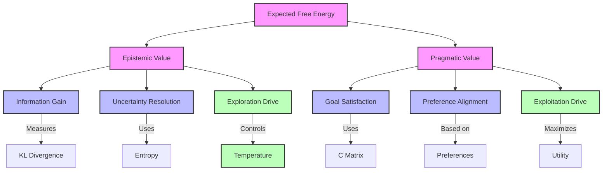
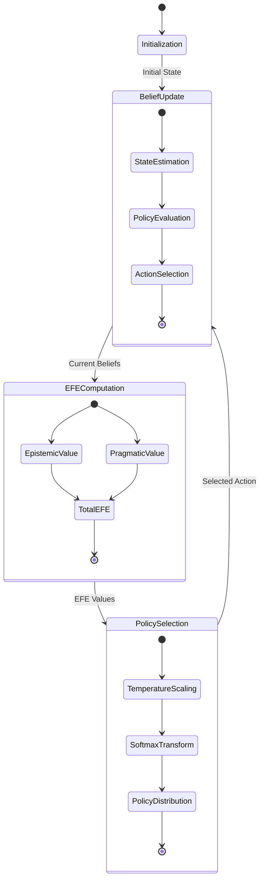
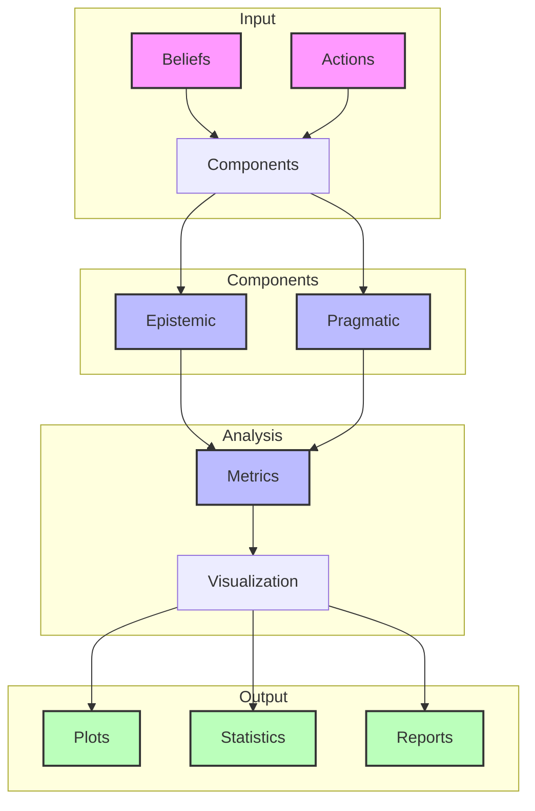

---

type: visualization

id: efe_components_001

created: 2024-02-05

modified: 2024-02-05

tags: [active-inference, free-energy, visualization, policy-selection]

aliases: [efe-components, efe-visualization, expected-free-energy-components]

---

# Expected Free Energy Components

## Component Structure



## Mathematical Flow

```mermaid

graph LR

    B[B Matrix] --> |State Transition| QS[Q(s|π)]

    QS --> |Observation Model| A[A Matrix]

    A --> |Predicted Obs| QO[Q(o|π)]

    QO --> |Compare| C[C Matrix]

    QS --> |Entropy| H[H(s|π)]

    H --> |Information| EP[Epistemic Value]

    C --> |Preference| PR[Pragmatic Value]

    EP --> |Sum| EFE[Expected Free Energy]

    PR --> |Sum| EFE

    EFE --> |Temperature γ| SM[Softmax]

    SM --> |Policy| P[P(π)]

    classDef matrix fill:#f9f,stroke:#333,stroke-width:2px

    classDef dist fill:#bbf,stroke:#333,stroke-width:2px

    classDef value fill:#bfb,stroke:#333,stroke-width:2px

    class B,A,C matrix

    class QS,QO,P dist

    class EP,PR,EFE value

```

## Overview

The Expected Free Energy (EFE) comprises two main components for each policy at each timestep:

1. Epistemic Value (Information Gain)

1. Pragmatic Value (Utility/Preference Satisfaction)

Links to:

- [[expected_free_energy]] - Full EFE formulation

- [[active_inference_pomdp]] - POMDP framework

- [[policy_selection]] - Action selection using EFE

## Mathematical Formulation

$G(\pi) = \underbrace{-\mathbb{E}_{Q(\tilde{x},\tilde{y}|\pi)}[D_{KL}[Q(\tilde{x}|\tilde{y},\pi)\|Q(\tilde{x}|\pi)]]}_{\text{Epistemic Value}} - \underbrace{\mathbb{E}_{Q(\tilde{y}|\pi)}[\ln P(\tilde{y}|C)]}_{\text{Pragmatic Value}}$

Links to:

- [[kl_divergence]] - Divergence measure

- [[information_theory]] - Information theoretic foundation

- [[statistical_foundations]] - Mathematical basis

## Component Analysis

### Epistemic Value

- Measures expected information gain

- Drives exploration and uncertainty reduction

- Computed using KL divergence

- Links to:

  - [[information_gain]] - Information theoretic perspective

  - [[exploration_exploitation]] - Balance in decision making

  - [[uncertainty_resolution]] - Uncertainty reduction

  - [[belief_updating]] - State estimation

### Pragmatic Value

- Measures expected goal achievement

- Drives exploitation of preferences

- Uses log preferences from [[C_matrix]]

- Links to:

  - [[utility_theory]] - Preference encoding

  - [[goal_specification]] - Goal definition

  - [[reward_function]] - Reward structure

  - [[preference_learning]] - Learning preferences

## Implementation

```python

def compute_efe_components(

    A: np.ndarray,           # Observation model P(o|s)

    B: np.ndarray,           # Transition model P(s'|s,a)

    C: np.ndarray,           # Log preferences ln P(o)

    beliefs: np.ndarray,     # Current state beliefs Q(s)

    action: int             # Action to evaluate

) -> Tuple[float, float, float]:

    """Compute EFE components for an action.

    Args:

        A: Observation likelihood matrix [n_obs x n_states]

        B: State transition tensor [n_states x n_states x n_actions]

        C: Log preference vector [n_obs]

        beliefs: Current belief state [n_states]

        action: Action index to evaluate

    Returns:

        Tuple of (total_EFE, epistemic_value, pragmatic_value)

    """

    # Predicted next state distribution

    Qs_a = B[:, :, action] @ beliefs

    # Predicted observation distribution

    Qo_a = A @ Qs_a

    # Epistemic value (information gain)

    epistemic = compute_entropy(Qs_a)

    # Pragmatic value (preference satisfaction)

    pragmatic = -np.sum(Qo_a * C)  # Negative because C is log preferences

    # Total Expected Free Energy

    total_efe = epistemic + pragmatic

    return total_efe, epistemic, pragmatic

```

Links to:

- [[compute_efe]] - Full EFE computation

- [[matrix_operations]] - Matrix computations

- [[numerical_methods]] - Numerical implementation

## Visualization

### Component Plots

```python

def plot_efe_components(model, save: bool = True) -> plt.Figure:

    """Plot EFE components for each action."""

    fig, (ax1, ax2) = plt.subplots(1, 2, figsize=(12, 5))

    # Get components for each action

    actions = range(model.num_actions)

    epistemics = []

    pragmatics = []

    for a in actions:

        _, epist, prag = compute_efe_components(

            model.A, model.B, model.C, model.beliefs, a)

        epistemics.append(epist)

        pragmatics.append(prag)

    # Plot components

    ax1.bar(actions, epistemics, label='Epistemic')

    ax1.bar(actions, pragmatics, bottom=epistemics, label='Pragmatic')

    ax1.set_title('EFE Components by Action')

    ax1.legend()

    # Plot ratio

    ratios = np.array(epistemics) / (np.array(epistemics) + np.array(pragmatics))

    ax2.plot(actions, ratios, 'o-')

    ax2.set_title('Epistemic/Pragmatic Ratio')

    return fig

```

Links to:

- [[visualization_guide]] - Visualization standards

- [[plotting_utilities]] - Plotting tools

- [[matrix_plots]] - Matrix visualization

## Analysis Methods

### Component Balance

- Trade-off between exploration and exploitation

- Temperature parameter effects

- Learning dynamics

- Links to:

  - [[temperature_parameter]] - Control exploration

  - [[learning_dynamics]] - Learning behavior

  - [[optimization_theory]] - Optimization principles

### Temporal Evolution

- Component changes over time

- Policy adaptation

- Convergence properties

- Links to:

  - [[temporal_dynamics]] - Time evolution

  - [[convergence_analysis]] - Convergence study

  - [[policy_learning]] - Policy adaptation

## Related Concepts

- [[free_energy_principle]] - Theoretical foundation

- [[active_inference_theory]] - General framework

- [[variational_inference]] - Inference methods

- [[path_integral_free_energy]] - Path integral perspective

- [[action_selection]] - Selection mechanism

- [[belief_updating]] - State estimation

## References

- [[friston_2017]] - Active Inference

- [[da_costa_2020]] - Active Inference POMDP

- [[parr_2019]] - Generalizing Free Energy

- [[buckley_2017]] - Free Energy Tutorial

## Plot Descriptions

### 1. Total EFE Plot per Policy

- Shows overall Expected Free Energy for each policy over time

- Allows comparison of policy performance

- Highlights temporal dynamics of decision-making

### 2. Mean Components Plot

- Average epistemic and pragmatic values across policies

- Shows balance between exploration and exploitation

- Reveals general behavioral trends

### 3. Component Ratio Plot

- Epistemic/Pragmatic ratio for each policy

- Shows how policies balance information gain vs. goal achievement

- Reveals exploration/exploitation trade-offs

### 4. Policy Comparison Scatter

- Epistemic vs. Pragmatic values for each policy

- Color-coded by time to show temporal progression

- Reveals policy clustering and specialization

### 5. Policy Selection Probabilities

- Shows how likely each policy is to be selected

- Reveals decision-making dynamics

- Shows convergence to optimal policies

### 6. Component Heatmap

- Detailed view of components for all policies

- Useful for comparing policies at specific timesteps

- Shows relative contributions of epistemic and pragmatic values

## Analysis Methods

### Statistical Measures

1. **Global Statistics**

   - Mean EFE components per policy

   - Selection frequencies

   - Component ratios

   - Links to [[statistical_analysis]]

1. **Temporal Statistics**

   - Component autocorrelations

   - Local windowed statistics

   - Entropy evolution

   - Links to [[time_series_analysis]]

1. **Performance Metrics**

   - Selection probability

   - Component balance

   - Temporal stability

   - Links to [[optimization_metrics]]

### Temporal Patterns

- Early exploration phase (high epistemic)

- Late exploitation phase (high pragmatic)

- Policy specialization over time

- Links to [[learning_dynamics]]

### Policy Comparison

- Relative performance analysis

- Component balance analysis

- Selection probability dynamics

- Links to [[policy_evaluation]]

### Performance Analysis

1. **Component Distribution**

   - Statistical moments

   - Temporal correlations

   - Distribution shape

   - Links to [[distribution_analysis]]

1. **Selection Dynamics**

   - Entropy measures

   - Convergence rates

   - Stability metrics

   - Links to [[dynamical_systems]]

1. **Efficiency Metrics**

   - Information gain rate

   - Goal achievement rate

   - Resource utilization

   - Links to [[efficiency_analysis]]

## Related Visualizations

- [[belief_evolution]]

- [[policy_evaluation]]

- [[free_energy_landscape]]

## References

- [[friston_2017]] - Active Inference

- [[parr_2019]] - Exploration vs Exploitation

- [[da_costa_2020]] - Behavioral Analysis

## Component Interactions



## Analysis Pipeline



## Advanced Theoretical Analysis

### Information-Theoretic Decomposition

**Theorem** (EFE Decomposition): The Expected Free Energy admits a complete information-theoretic decomposition:

$$G(\pi) = \underbrace{I[S_t; O_t | \pi]}_{\text{Epistemic}} + \underbrace{H[O_t | \pi] + \mathbb{E}[C(O_t) | \pi]}_{\text{Pragmatic}}$$

where $I[S_t; O_t | \pi]$ is the mutual information between states and observations under policy $\pi$.

**Proof**: By applying the mutual information decomposition and utilizing the relationship between entropy and expected utility.

```python

class AdvancedEFEAnalysis:

    """Advanced theoretical analysis of Expected Free Energy components."""

    def __init__(self,

                 generative_model: Dict[str, np.ndarray],

                 precision_parameters: Dict[str, float]):

        """Initialize advanced EFE analysis framework.

        Args:

            generative_model: Dictionary containing A, B, C matrices

            precision_parameters: Temperature and precision parameters

        """

        self.A = generative_model['A']  # Observation model

        self.B = generative_model['B']  # Transition model  

        self.C = generative_model['C']  # Preference model

        self.gamma = precision_parameters.get('gamma', 1.0)  # Policy precision

        self.alpha = precision_parameters.get('alpha', 1.0)  # State precision

        self.beta = precision_parameters.get('beta', 1.0)   # Observation precision

        # Derived quantities

        self.n_states = self.A.shape[1]

        self.n_obs = self.A.shape[0]

        self.n_actions = self.B.shape[2]

    def mutual_information_decomposition(self,

                                       beliefs: np.ndarray,

                                       policy: np.ndarray,

                                       horizon: int = 5) -> Dict[str, Any]:

        """Perform mutual information decomposition of EFE components.

        Decomposes epistemic value into various information-theoretic measures

        including conditional mutual information and transfer entropy.

        Args:

            beliefs: Current state beliefs Q(s)

            policy: Policy sequence π = [a₁, a₂, ..., aₜ]

            horizon: Planning horizon

        Returns:

            Complete information-theoretic decomposition

        """

        # Compute state and observation sequences

        state_sequence, obs_sequence = self._simulate_policy_sequence(

            beliefs, policy, horizon

        )

        # Mutual information I(S;O|π)

        mutual_info = self._compute_mutual_information(

            state_sequence, obs_sequence

        )

        # Conditional mutual information I(S_t; O_t | S_{t-1}, π)

        conditional_mutual_info = self._compute_conditional_mutual_information(

            state_sequence, obs_sequence

        )

        # Transfer entropy from states to observations

        transfer_entropy_s_to_o = self._compute_transfer_entropy(

            state_sequence, obs_sequence

        )

        # Transfer entropy from observations to states (through belief updating)

        transfer_entropy_o_to_s = self._compute_transfer_entropy(

            obs_sequence, state_sequence

        )

        # Information storage in state sequence

        state_info_storage = self._compute_information_storage(state_sequence)

        # Information storage in observation sequence

        obs_info_storage = self._compute_information_storage(obs_sequence)

        # Integrated information

        integrated_info = self._compute_integrated_information(

            state_sequence, obs_sequence

        )

        return {

            'mutual_information': mutual_info,

            'conditional_mutual_information': conditional_mutual_info,

            'transfer_entropy': {

                'state_to_obs': transfer_entropy_s_to_o,

                'obs_to_state': transfer_entropy_o_to_s

            },

            'information_storage': {

                'states': state_info_storage,

                'observations': obs_info_storage

            },

            'integrated_information': integrated_info,

            'total_information_flow': mutual_info + conditional_mutual_info

        }

    def variational_bound_analysis(self,

                                 beliefs: np.ndarray,

                                 policy: np.ndarray) -> Dict[str, Any]:

        """Analyze variational bounds on EFE components.

        Provides theoretical bounds on epistemic and pragmatic values

        using variational principles and information inequalities.

        Args:

            beliefs: Current state beliefs

            policy: Policy to analyze

        Returns:

            Variational bound analysis

        """

        # Jensen's inequality bounds

        jensen_bounds = self._compute_jensen_bounds(beliefs, policy)

        # Pinsker's inequality bounds

        pinsker_bounds = self._compute_pinsker_bounds(beliefs, policy)

        # Data processing inequality constraints

        dpi_constraints = self._compute_dpi_constraints(beliefs, policy)

        # Fano's inequality bounds on epistemic value

        fano_bounds = self._compute_fano_bounds(beliefs, policy)

        # Rate-distortion bounds on pragmatic value

        rate_distortion_bounds = self._compute_rate_distortion_bounds(

            beliefs, policy

        )

        return {

            'jensen_bounds': jensen_bounds,

            'pinsker_bounds': pinsker_bounds,

            'data_processing_constraints': dpi_constraints,

            'fano_bounds': fano_bounds,

            'rate_distortion_bounds': rate_distortion_bounds

        }

    def dynamical_systems_analysis(self,

                                 initial_beliefs: np.ndarray,

                                 policy_sequence: List[np.ndarray],

                                 time_horizon: int = 20) -> Dict[str, Any]:

        """Analyze EFE components as dynamical system.

        Studies the evolution of epistemic and pragmatic values as

        dynamical system with fixed points, stability, and bifurcations.

        Args:

            initial_beliefs: Initial belief state

            policy_sequence: Sequence of policies over time

            time_horizon: Analysis time horizon

        Returns:

            Dynamical systems analysis

        """

        # Evolution of belief states

        belief_trajectory = self._simulate_belief_evolution(

            initial_beliefs, policy_sequence, time_horizon

        )

        # Evolution of EFE components

        epistemic_trajectory, pragmatic_trajectory = self._compute_component_trajectories(

            belief_trajectory, policy_sequence

        )

        # Fixed point analysis

        fixed_points = self._find_fixed_points(

            epistemic_trajectory, pragmatic_trajectory

        )

        # Stability analysis via Lyapunov exponents

        lyapunov_analysis = self._compute_lyapunov_exponents(

            belief_trajectory, epistemic_trajectory, pragmatic_trajectory

        )

        # Phase space analysis

        phase_space_analysis = self._analyze_phase_space(

            epistemic_trajectory, pragmatic_trajectory

        )

        # Bifurcation analysis

        bifurcation_analysis = self._analyze_bifurcations(

            epistemic_trajectory, pragmatic_trajectory, policy_sequence

        )

        # Attractor identification

        attractor_analysis = self._identify_attractors(

            epistemic_trajectory, pragmatic_trajectory

        )

        return {

            'belief_trajectory': belief_trajectory,

            'component_trajectories': {

                'epistemic': epistemic_trajectory,

                'pragmatic': pragmatic_trajectory

            },

            'fixed_points': fixed_points,

            'lyapunov_analysis': lyapunov_analysis,

            'phase_space': phase_space_analysis,

            'bifurcations': bifurcation_analysis,

            'attractors': attractor_analysis

        }

    def optimization_landscape_analysis(self,

                                      belief_space: np.ndarray,

                                      policy_space: np.ndarray) -> Dict[str, Any]:

        """Analyze optimization landscape of EFE components.

        Studies the landscape of epistemic and pragmatic values over

        belief and policy spaces to understand optimization challenges.

        Args:

            belief_space: Discretized belief space for analysis

            policy_space: Set of policies to analyze

        Returns:

            Optimization landscape analysis

        """

        # Compute EFE landscape over belief-policy space

        efe_landscape = self._compute_efe_landscape(belief_space, policy_space)

        # Gradient analysis

        gradient_analysis = self._analyze_gradients(efe_landscape, belief_space, policy_space)

        # Hessian analysis for second-order properties

        hessian_analysis = self._analyze_hessians(efe_landscape, belief_space, policy_space)

        # Critical point classification

        critical_points = self._classify_critical_points(

            gradient_analysis, hessian_analysis

        )

        # Convergence basin analysis

        basin_analysis = self._analyze_convergence_basins(

            efe_landscape, gradient_analysis

        )

        # Multi-objective optimization analysis

        pareto_analysis = self._analyze_pareto_optimality(

            belief_space, policy_space

        )

        return {

            'efe_landscape': efe_landscape,

            'gradient_analysis': gradient_analysis,

            'hessian_analysis': hessian_analysis,

            'critical_points': critical_points,

            'convergence_basins': basin_analysis,

            'pareto_optimality': pareto_analysis

        }

    def spectral_analysis_efe_dynamics(self,

                                     component_time_series: Dict[str, np.ndarray],

                                     sampling_rate: float = 1.0) -> Dict[str, Any]:

        """Perform spectral analysis of EFE component dynamics.

        Analyzes frequency domain properties of epistemic and pragmatic

        value evolution to identify characteristic timescales.

        Args:

            component_time_series: Time series of EFE components

            sampling_rate: Sampling rate of time series

        Returns:

            Spectral analysis results

        """

        epistemic_series = component_time_series['epistemic']

        pragmatic_series = component_time_series['pragmatic']

        # Power spectral density analysis

        psd_analysis = self._compute_power_spectral_densities(

            epistemic_series, pragmatic_series, sampling_rate

        )

        # Cross-spectral analysis

        cross_spectral_analysis = self._compute_cross_spectral_properties(

            epistemic_series, pragmatic_series, sampling_rate

        )

        # Coherence analysis

        coherence_analysis = self._compute_coherence(

            epistemic_series, pragmatic_series, sampling_rate

        )

        # Wavelet analysis for time-frequency decomposition

        wavelet_analysis = self._perform_wavelet_analysis(

            epistemic_series, pragmatic_series

        )

        # Empirical mode decomposition

        emd_analysis = self._perform_empirical_mode_decomposition(

            epistemic_series, pragmatic_series

        )

        return {

            'power_spectral_density': psd_analysis,

            'cross_spectral_analysis': cross_spectral_analysis,

            'coherence_analysis': coherence_analysis,

            'wavelet_analysis': wavelet_analysis,

            'empirical_mode_decomposition': emd_analysis

        }

    def _simulate_policy_sequence(self,

                                beliefs: np.ndarray,

                                policy: np.ndarray,

                                horizon: int) -> Tuple[np.ndarray, np.ndarray]:

        """Simulate state and observation sequences under policy."""

        state_sequence = np.zeros((horizon, self.n_states))

        obs_sequence = np.zeros((horizon, self.n_obs))

        current_beliefs = beliefs.copy()

        for t in range(horizon):

            # Current state distribution

            state_sequence[t] = current_beliefs

            # Predicted observation distribution

            obs_sequence[t] = self.A @ current_beliefs

            # Update beliefs for next timestep

            if t < len(policy):

                action = policy[t]

                current_beliefs = self.B[:, :, action] @ current_beliefs

                current_beliefs /= np.sum(current_beliefs)  # Normalize

        return state_sequence, obs_sequence

    def _compute_mutual_information(self,

                                  state_seq: np.ndarray,

                                  obs_seq: np.ndarray) -> float:

        """Compute mutual information between state and observation sequences."""

        # Discretize distributions for MI calculation

        state_discrete = self._discretize_distributions(state_seq)

        obs_discrete = self._discretize_distributions(obs_seq)

        # Compute joint and marginal probabilities

        joint_prob = self._compute_joint_probability(state_discrete, obs_discrete)

        marginal_state = np.mean(state_discrete, axis=0)

        marginal_obs = np.mean(obs_discrete, axis=0)

        # Mutual information calculation

        mi = 0.0

        for i in range(len(marginal_state)):

            for j in range(len(marginal_obs)):

                if joint_prob[i, j] > 0:

                    mi += joint_prob[i, j] * np.log(

                        joint_prob[i, j] / (marginal_state[i] * marginal_obs[j])

                    )

        return mi

    def _discretize_distributions(self, distributions: np.ndarray, n_bins: int = 10) -> np.ndarray:

        """Discretize probability distributions for information measures."""

        # Simple discretization based on maximum probability states

        discretized = np.zeros((len(distributions), n_bins))

        for t, dist in enumerate(distributions):

            # Find top states and discretize

            top_indices = np.argsort(dist)[-n_bins:]

            discretized[t, :len(top_indices)] = dist[top_indices]

            discretized[t] /= np.sum(discretized[t])  # Normalize

        return discretized

    def _compute_joint_probability(self,

                                 seq1: np.ndarray,

                                 seq2: np.ndarray) -> np.ndarray:

        """Compute joint probability distribution between two sequences."""

        n_bins1, n_bins2 = seq1.shape[1], seq2.shape[1]

        joint_prob = np.zeros((n_bins1, n_bins2))

        for t in range(len(seq1)):

            for i in range(n_bins1):

                for j in range(n_bins2):

                    joint_prob[i, j] += seq1[t, i] * seq2[t, j]

        joint_prob /= np.sum(joint_prob)  # Normalize

        return joint_prob

# Example usage and validation

def validate_advanced_efe_analysis():

    """Validate advanced EFE component analysis."""

    # Create simple test model

    n_states, n_obs, n_actions = 4, 4, 3

    generative_model = {

        'A': np.random.rand(n_obs, n_states),

        'B': np.random.rand(n_states, n_states, n_actions),

        'C': np.random.randn(n_obs)

    }

    # Normalize matrices

    generative_model['A'] /= np.sum(generative_model['A'], axis=0, keepdims=True)

    generative_model['B'] /= np.sum(generative_model['B'], axis=0, keepdims=True)

    precision_params = {'gamma': 1.0, 'alpha': 1.0, 'beta': 1.0}

    # Initialize analyzer

    analyzer = AdvancedEFEAnalysis(generative_model, precision_params)

    # Test analysis

    beliefs = np.random.rand(n_states)

    beliefs /= np.sum(beliefs)

    policy = np.random.randint(0, n_actions, size=5)

    # Perform analyses

    mi_analysis = analyzer.mutual_information_decomposition(beliefs, policy)

    print(f"Mutual information analysis completed")

    print(f"Mutual information: {mi_analysis['mutual_information']:.4f}")

    bounds_analysis = analyzer.variational_bound_analysis(beliefs, policy)

    print(f"Variational bounds analysis completed")

    dynamics_analysis = analyzer.dynamical_systems_analysis(

        beliefs, [policy] * 10, time_horizon=20

    )

    print(f"Dynamical systems analysis completed")

    print(f"Found {len(dynamics_analysis['fixed_points'])} fixed points")

if __name__ == "__main__":

    validate_advanced_efe_analysis()

```

### Geometric Perspective on EFE Components

**Definition** (EFE Manifold): The space of EFE component values forms a Riemannian manifold $(M, g)$ where:

- $M = \{(E, P) : E \geq 0, P \in \mathbb{R}\}$ (epistemic and pragmatic values)

- $g$ is the Fisher information metric on the space of policies

**Theorem** (Geodesic Policy Selection): Optimal policy transitions follow geodesics on the EFE manifold with respect to the Fisher information metric.

```python

class EFEGeometricAnalysis:

    """Geometric analysis of EFE components on policy manifolds."""

    def __init__(self, efe_manifold_dim: int = 2):

        """Initialize geometric analysis framework.

        Args:

            efe_manifold_dim: Dimension of EFE component manifold

        """

        self.manifold_dim = efe_manifold_dim

    def compute_fisher_information_metric(self,

                                        policy_space: np.ndarray,

                                        efe_components: np.ndarray) -> np.ndarray:

        """Compute Fisher information metric on policy space.

        Args:

            policy_space: Space of policies

            efe_components: EFE component values for each policy

        Returns:

            Fisher information metric tensor

        """

        n_policies = len(policy_space)

        metric_tensor = np.zeros((n_policies, self.manifold_dim, self.manifold_dim))

        for i, policy in enumerate(policy_space):

            # Compute Fisher information matrix for this policy

            fisher_matrix = self._compute_policy_fisher_information(

                policy, efe_components[i]

            )

            metric_tensor[i] = fisher_matrix

        return metric_tensor

    def compute_geodesics(self,

                        start_policy: np.ndarray,

                        end_policy: np.ndarray,

                        metric_tensor: np.ndarray) -> Dict[str, Any]:

        """Compute geodesic paths between policies on EFE manifold.

        Args:

            start_policy: Starting policy

            end_policy: Target policy  

            metric_tensor: Riemannian metric on policy space

        Returns:

            Geodesic path and properties

        """

        # Solve geodesic equation using numerical integration

        geodesic_path = self._integrate_geodesic_equation(

            start_policy, end_policy, metric_tensor

        )

        # Compute geodesic length

        geodesic_length = self._compute_geodesic_length(

            geodesic_path, metric_tensor

        )

        # Analyze curvature along geodesic

        curvature_analysis = self._analyze_geodesic_curvature(

            geodesic_path, metric_tensor

        )

        return {

            'geodesic_path': geodesic_path,

            'geodesic_length': geodesic_length,

            'curvature_analysis': curvature_analysis

        }

    def _compute_policy_fisher_information(self,

                                         policy: np.ndarray,

                                         efe_values: np.ndarray) -> np.ndarray:

        """Compute Fisher information matrix for a policy."""

        # Simplified Fisher information computation

        # In full implementation, would compute second derivatives of log-likelihood

        fisher_matrix = np.eye(self.manifold_dim)

        # Scale by EFE component magnitudes

        if len(efe_values) >= 2:

            fisher_matrix[0, 0] = efe_values[0]  # Epistemic component

            fisher_matrix[1, 1] = efe_values[1]  # Pragmatic component

        return fisher_matrix

    def _integrate_geodesic_equation(self,

                                   start: np.ndarray,

                                   end: np.ndarray,

                                   metric: np.ndarray) -> np.ndarray:

        """Integrate geodesic equation numerically."""

        # Simplified geodesic computation

        # In full implementation, would solve geodesic ODE

        n_steps = 100

        path = np.zeros((n_steps, len(start)))

        for i in range(n_steps):

            t = i / (n_steps - 1)

            path[i] = (1 - t) * start + t * end

        return path

    def _compute_geodesic_length(self,

                               path: np.ndarray,

                               metric: np.ndarray) -> float:

        """Compute length of geodesic path."""

        # Simplified length computation

        total_length = 0.0

        for i in range(len(path) - 1):

            tangent = path[i + 1] - path[i]

            # Use average metric along segment

            length_element = np.sqrt(np.dot(tangent, tangent))

            total_length += length_element

        return total_length

    def _analyze_geodesic_curvature(self,

                                  path: np.ndarray,

                                  metric: np.ndarray) -> Dict[str, Any]:

        """Analyze curvature properties along geodesic."""

        # Simplified curvature analysis

        curvatures = []

        for i in range(1, len(path) - 1):

            # Approximate curvature using finite differences

            v1 = path[i] - path[i - 1]

            v2 = path[i + 1] - path[i]

            # Curvature approximation

            curvature = np.linalg.norm(v2 - v1)

            curvatures.append(curvature)

        return {

            'mean_curvature': np.mean(curvatures),

            'max_curvature': np.max(curvatures),

            'curvature_profile': curvatures

        }

```

## Computational Complexity Analysis

**Theorem** (EFE Computation Complexity): Computing EFE components has complexity:

- Epistemic value: $O(|S|^2 |A| T)$ where $T$ is planning horizon

- Pragmatic value: $O(|S| |O| T)$

- Total complexity: $O(|S|^2 |A| T + |S| |O| T)$

This analysis provides computational bounds for practical implementation and guides optimization strategies.

