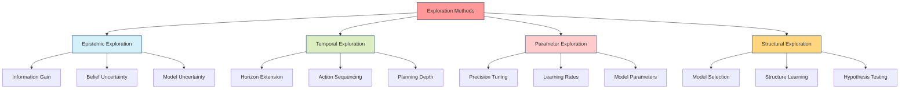

# Exploration Methods

## Overview

Exploration methods provide algorithmic approaches for balancing the exploration-exploitation trade-off in decision-making systems. In active inference, exploration is naturally achieved through epistemic value maximization, where agents seek to reduce uncertainty about their environment and generative model.



## Epistemic Exploration

### Information Gain Maximization

The core exploration mechanism in active inference is epistemic value, which measures expected information gain:

```math
\mathcal{I}(a) = \mathbb{E}_{Q(o'|a)}[D_{KL}[Q(s'|o',a)||Q(s'|a)]]
```

This naturally drives exploration by rewarding actions that provide new information about hidden states.

```python
import numpy as np
from typing import Dict, List, Tuple

class EpistemicExplorer:
    """Epistemic exploration through information gain maximization."""

    def __init__(self, n_states: int, n_actions: int, n_observations: int):
        self.n_states = n_states
        self.n_actions = n_actions
        self.n_observations = n_observations

    def compute_epistemic_value(self, beliefs: np.ndarray, action: int,
                               transition_matrix: np.ndarray,
                               observation_matrix: np.ndarray) -> float:
        """Compute epistemic value for an action."""
        epistemic_value = 0.0

        # For each possible next state
        for s_next in range(self.n_states):
            # Probability of reaching next state
            p_s_next = transition_matrix[s_next, beliefs.argmax(), action]

            if p_s_next > 0:
                # Predictive posterior Q(s'|a)
                q_predictive = transition_matrix[:, beliefs.argmax(), action]
                q_predictive = q_predictive / q_predictive.sum()

                # For each possible observation
                for o in range(self.n_observations):
                    # Likelihood P(o|s')
                    likelihood = observation_matrix[o, s_next]

                    if likelihood > 0:
                        # Posterior predictive Q(s'|o,a)
                        posterior = q_predictive * observation_matrix[o, :]
                        posterior = posterior / posterior.sum()

                        # KL divergence between posterior and prior predictive
                        kl_div = np.sum(posterior * np.log(posterior / q_predictive + 1e-10))

                        # Accumulate expected information gain
                        epistemic_value += p_s_next * likelihood * kl_div

        return epistemic_value

    def select_exploratory_action(self, beliefs: np.ndarray,
                                transition_matrix: np.ndarray,
                                observation_matrix: np.ndarray) -> int:
        """Select action maximizing epistemic value."""
        epistemic_values = []

        for action in range(self.n_actions):
            value = self.compute_epistemic_value(
                beliefs, action, transition_matrix, observation_matrix
            )
            epistemic_values.append(value)

        # Return action with highest epistemic value
        return np.argmax(epistemic_values)
```

## Temporal Exploration

### Horizon Extension

Increasing planning horizon naturally increases exploration by considering longer-term consequences:

```python
class HorizonExplorer:
    """Exploration through extended planning horizons."""

    def __init__(self, base_horizon: int = 1, max_horizon: int = 10):
        self.base_horizon = base_horizon
        self.max_horizon = max_horizon
        self.current_horizon = base_horizon

    def adaptive_horizon_selection(self, belief_uncertainty: float,
                                 task_complexity: float) -> int:
        """Adaptively select planning horizon based on uncertainty."""
        # Increase horizon when uncertainty is high
        uncertainty_factor = min(belief_uncertainty * 10, 1.0)

        # Increase horizon for complex tasks
        complexity_factor = min(task_complexity / 0.5, 1.0)

        # Combine factors
        horizon_extension = uncertainty_factor * complexity_factor
        new_horizon = int(self.base_horizon + horizon_extension * (self.max_horizon - self.base_horizon))

        self.current_horizon = min(new_horizon, self.max_horizon)
        return self.current_horizon
```

## Parameter Exploration

### Precision Tuning

Dynamic adjustment of precision parameters to control exploration:

```python
class PrecisionTuner:
    """Adaptive precision tuning for exploration control."""

    def __init__(self, initial_precision: float = 1.0,
                 adaptation_rate: float = 0.1):
        self.precision = initial_precision
        self.adaptation_rate = adaptation_rate
        self.performance_history = []

    def update_precision(self, reward: float, uncertainty: float):
        """Update precision based on performance and uncertainty."""

        # Store performance
        self.performance_history.append(reward)

        # Compute performance trend
        if len(self.performance_history) >= 5:
            recent_performance = np.mean(self.performance_history[-5:])
            overall_performance = np.mean(self.performance_history)

            # Increase precision if performing well (exploitation)
            if recent_performance > overall_performance:
                self.precision *= (1 + self.adaptation_rate)
            # Decrease precision if uncertain (exploration)
            elif uncertainty > 0.5:
                self.precision *= (1 - self.adaptation_rate)

        # Bound precision
        self.precision = np.clip(self.precision, 0.1, 10.0)

    def get_exploration_temperature(self) -> float:
        """Convert precision to temperature for softmax."""
        return 1.0 / self.precision
```

## Structural Exploration

### Model Selection

Bayesian model selection as an exploration mechanism:

```python
class ModelExplorer:
    """Exploration through Bayesian model selection."""

    def __init__(self, models: List[Dict]):
        self.models = models
        self.model_posteriors = np.ones(len(models)) / len(models)

    def update_model_beliefs(self, observation: np.ndarray,
                           action: int, reward: float):
        """Update beliefs over models using Bayes rule."""

        # Compute likelihood for each model
        likelihoods = np.zeros(len(self.models))

        for i, model in enumerate(self.models):
            likelihoods[i] = model['likelihood_fn'](observation, action, reward)

        # Update posteriors
        unnormalized_posteriors = self.model_posteriors * likelihoods
        self.model_posteriors = unnormalized_posteriors / unnormalized_posteriors.sum()

    def select_model_for_exploration(self) -> int:
        """Select model that maximizes information gain."""
        # Thompson sampling over models
        sampled_model = np.random.choice(
            len(self.models), p=self.model_posteriors
        )
        return sampled_model
```

## Advanced Exploration Strategies

### Curiosity-Driven Exploration

Intrinsic motivation through novelty detection:

```python
class CuriosityDrivenExplorer:
    """Curiosity-driven exploration using prediction errors."""

    def __init__(self, state_dim: int, memory_size: int = 1000):
        self.state_dim = state_dim
        self.memory_size = memory_size
        self.state_memory = []
        self.prediction_errors = []

    def compute_novelty(self, current_state: np.ndarray) -> float:
        """Compute novelty based on prediction error."""

        if len(self.state_memory) < 2:
            return 1.0  # Maximum novelty for initial states

        # Simple linear prediction
        recent_states = np.array(self.state_memory[-min(50, len(self.state_memory)):])

        if len(recent_states) < 2:
            return 0.5

        # Simple linear prediction
        X = recent_states[:-1]
        y = recent_states[1:]

        # Compute prediction error
        if hasattr(self, 'predictor'):
            predicted_state = self.predictor.predict(current_state.reshape(1, -1))[0]
            prediction_error = np.linalg.norm(current_state - predicted_state)
        else:
            # Initialize predictor
            from sklearn.linear_model import LinearRegression
            self.predictor = LinearRegression()
            if len(X) >= 2:
                self.predictor.fit(X, y)
            prediction_error = 0.5  # Default

        # Update memory
        self.state_memory.append(current_state.copy())
        if len(self.state_memory) > self.memory_size:
            self.state_memory.pop(0)

        return prediction_error

    def curiosity_bonus(self, state: np.ndarray, action: int) -> float:
        """Compute curiosity bonus for action selection."""
        novelty = self.compute_novelty(state)

        # Scale novelty to reasonable bonus range
        bonus = np.tanh(novelty) * 0.1

        return bonus
```

## Applications

### Active Inference Agents

- **Epistemic foraging**: Agents explore to maximize information about environmental contingencies
- **Model refinement**: Exploration drives improvement of internal generative models
- **Skill acquisition**: Novel experiences enable learning of new behavioral repertoires

### Reinforcement Learning

- **Intrinsic motivation**: Curiosity bonuses encourage exploration in sparse reward environments
- **Option discovery**: Exploration reveals new temporal abstractions and options
- **Transfer learning**: Exploration across tasks builds generalizable knowledge

## Related Concepts

### Active Inference

- [[active_inference]]
- [[epistemic_value]]
- [[expected_free_energy]]
- [[precision_parameter]]

### Exploration Theory

- [[exploration_strategies]]
- [[curiosity_driven_learning]]
- [[intrinsic_motivation]]

### Decision Making

- [[policy_selection]]
- [[reinforcement_learning]]
- [[multi_armed_bandits]]

## References

1. Friston, K., et al. (2015). Active inference and epistemic value. Cognitive Neuroscience.

1. Schmidhuber, J. (1991). Curious model-building control systems. International Joint Conference on Neural Networks.

## See Also

- [[exploration_strategies]]
- [[precision_parameter]]
- [[expected_free_energy]]
- [[policy_selection]]
- [[active_inference]]
