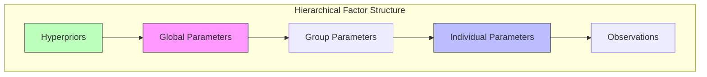

---

title: Factor Graphs

type: concept

status: stable

created: 2024-03-20

tags:

  - mathematics

  - graphical-models

  - inference

semantic_relations:

  - type: foundation

    links:

      - [[graphical_models]]

      - [[probabilistic_models]]

      - [[bayesian_networks]]

  - type: implements

    links:

      - [[message_passing]]

      - [[belief_propagation]]

      - [[variational_inference]]

  - type: related

    links:

      - [[markov_random_fields]]

      - [[conditional_random_fields]]

      - [[probabilistic_programming]]

---

# Factor Graphs

## Overview

Factor graphs are a type of [[graphical_models|graphical model]] that represents factorizations of functions, particularly probability distributions. They provide a unified framework for [[inference_algorithms|inference algorithms]] and bridge the gap between [[directed_graphical_models|directed]] and [[undirected_graphical_models|undirected]] graphical models.

## Mathematical Foundation

### 1. Basic Structure

A factor graph G = (V, F, E) consists of:

- V: Variable nodes representing [[random_variables|random variables]]

- F: Factor nodes encoding [[probability_distributions|probability distributions]]

- E: Edges representing [[probabilistic_dependencies|probabilistic dependencies]]

### 2. Factorization

For a probability distribution p(x):

```math

p(x_1, ..., x_n) = \prod_{a \in F} f_a(x_{\partial a})

```

where:

- f_a are [[factor_functions|factor functions]]

- ∂a denotes variables connected to factor a

### 3. [[bayesian_factorization|Bayesian Factorization]]

In Bayesian terms:

```math

p(x, θ | y) ∝ p(y | x, θ)p(x | θ)p(θ)

```

where:

- p(y | x, θ) is the [[likelihood_function|likelihood]]

- p(x | θ) is the [[prior_distribution|prior]]

- p(θ) is the [[hyperprior|hyperprior]]

## Components and Structure

### 1. [[variable_nodes|Variable Nodes]]

#### Types and Properties

```julia

struct VariableNode{T}

    id::Symbol

    domain::Domain{T}

    neighbors::Set{FactorNode}

    messages::Dict{FactorNode, Message}

    belief::Distribution{T}

end

```

#### Categories

- **Observable Variables**

  - Represent data points

  - Fixed during inference

  - Drive belief updates

- **Latent Variables**

  - Hidden states

  - Model parameters

  - Inferred quantities

- **Parameter Nodes**

  - [[hyperparameters|Hyperparameters]]

  - [[model_parameters|Model parameters]]

  - [[sufficient_statistics|Sufficient statistics]]

### 2. [[factor_nodes|Factor Nodes]]

#### Base Implementation

```julia

abstract type FactorNode end

struct ProbabilisticFactor <: FactorNode

    distribution::Distribution

    variables::Vector{VariableNode}

    parameters::Dict{Symbol, Any}

end

struct DeterministicFactor <: FactorNode

    function::Function

    inputs::Vector{VariableNode}

    outputs::Vector{VariableNode}

end

struct ConstraintFactor <: FactorNode

    constraint::Function

    variables::Vector{VariableNode}

    tolerance::Float64

end

```

#### Message Computation

```julia

function compute_message(factor::FactorNode, to::VariableNode)

    # Collect incoming messages

    messages = [msg for (node, msg) in factor.messages if node != to]

    # Compute outgoing message

    if isa(factor, ProbabilisticFactor)

        return compute_probabilistic_message(factor, messages, to)

    elseif isa(factor, DeterministicFactor)

        return compute_deterministic_message(factor, messages, to)

    else

        return compute_constraint_message(factor, messages, to)

    end

end

```

### 3. [[edges|Edges]]

#### Properties

```julia

struct Edge

    source::Union{VariableNode, FactorNode}

    target::Union{VariableNode, FactorNode}

    message_type::Type{<:Message}

    parameters::Dict{Symbol, Any}

end

```

#### Message Types

- Forward messages (variable to factor)

- Backward messages (factor to variable)

- Parameter messages

- Constraint messages

## Message Passing and Inference

### 1. [[belief_propagation|Belief Propagation]]

#### Forward Messages

```math

μ_{x→f}(x) = \prod_{g \in N(x) \backslash f} μ_{g→x}(x)

```

#### Backward Messages

```math

μ_{f→x}(x) = \sum_{x_{\partial f \backslash x}} f(x_{\partial f}) \prod_{y \in \partial f \backslash x} μ_{y→f}(y)

```

#### Implementation

```julia

function belief_propagation!(graph::FactorGraph; max_iters=100)

    for iter in 1:max_iters

        # Update variable to factor messages

        for var in graph.variables

            for factor in var.neighbors

                message = compute_var_to_factor_message(var, factor)

                update_message!(var, factor, message)

            end

        end

        # Update factor to variable messages

        for factor in graph.factors

            for var in factor.variables

                message = compute_factor_to_var_message(factor, var)

                update_message!(factor, var, message)

            end

        end

        # Check convergence

        if check_convergence(graph)

            break

        end

    end

end

```

### 2. [[variational_message_passing|Variational Message Passing]]

#### ELBO Optimization

```math

\mathcal{L}(q) = \mathbb{E}_q[\log p(x,z)] - \mathbb{E}_q[\log q(z)]

```

#### Natural Gradient Updates

```math

θ_t = θ_{t-1} + η\nabla_{\text{nat}}\mathcal{L}(q)

```

#### Implementation

```julia

function variational_message_passing!(graph::FactorGraph; 

                                    learning_rate=0.01, 

                                    max_iters=100)

    for iter in 1:max_iters

        # Compute natural gradients

        gradients = compute_natural_gradients(graph)

        # Update variational parameters

        for (node, grad) in gradients

            update_parameters!(node, grad, learning_rate)

        end

        # Update messages

        update_messages!(graph)

        # Check ELBO convergence

        if check_elbo_convergence(graph)

            break

        end

    end

end

```

### 3. [[expectation_propagation|Expectation Propagation]]

#### Moment Matching

```math

\text{minimize}_{q_i} \text{KL}(p||q_1...q_i...q_n)

```

#### Implementation

```julia

function expectation_propagation!(graph::FactorGraph; max_iters=100)

    for iter in 1:max_iters

        # Update approximate factors

        for factor in graph.factors

            # Compute cavity distribution

            cavity = compute_cavity_distribution(factor)

            # Moment matching

            new_approx = moment_match(cavity, factor)

            # Update approximation

            update_approximation!(factor, new_approx)

        end

        # Check convergence

        if check_convergence(graph)

            break

        end

    end

end

```

## Advanced Topics

### 1. [[structured_factor_graphs|Structured Factor Graphs]]

#### Temporal Structure

```julia

@model function temporal_factor_graph(T)

    # State variables

    x = Vector{VariableNode}(undef, T)

    # Temporal factors

    for t in 2:T

        @factor f[t] begin

            x[t] ~ transition(x[t-1])

        end

    end

    return x

end

```

#### Hierarchical Structure

```julia

@model function hierarchical_factor_graph()

    # Global parameters

    θ_global ~ prior()

    # Local parameters

    θ_local = Vector{VariableNode}(undef, N)

    for i in 1:N

        θ_local[i] ~ conditional(θ_global)

    end

    return θ_local

end

```

### 2. [[continuous_variables|Continuous Variables]]

#### Gaussian Messages

```julia

struct GaussianMessage <: Message

    mean::Vector{Float64}

    precision::Matrix{Float64}

    function GaussianMessage(μ, Λ)

        @assert size(μ, 1) == size(Λ, 1) == size(Λ, 2)

        new(μ, Λ)

    end

end

function multiply_messages(m1::GaussianMessage, m2::GaussianMessage)

    Λ = m1.precision + m2.precision

    μ = Λ \ (m1.precision * m1.mean + m2.precision * m2.mean)

    return GaussianMessage(μ, Λ)

end

```

### 3. [[convergence_properties|Convergence Properties]]

#### Fixed Point Conditions

```math

b^*(x) = \frac{1}{Z} \prod_{f \in N(x)} μ^*_{f→x}(x)

```

#### Bethe Free Energy

```math

F_{\text{Bethe}} = \sum_i F_i + \sum_a F_a

```

## Implementation

### 1. Graph Construction

```julia

struct FactorGraph

    variables::Set{VariableNode}

    factors::Set{FactorNode}

    edges::Set{Edge}

    function FactorGraph()

        new(Set{VariableNode}(), Set{FactorNode}(), Set{Edge}())

    end

end

function add_variable!(graph::FactorGraph, var::VariableNode)

    push!(graph.variables, var)

end

function add_factor!(graph::FactorGraph, factor::FactorNode)

    push!(graph.factors, factor)

    for var in factor.variables

        add_edge!(graph, Edge(var, factor))

    end

end

```

### 2. Message Scheduling

```julia

struct MessageSchedule

    order::Vector{Tuple{Union{VariableNode,FactorNode}, 

                       Union{VariableNode,FactorNode}}}

    priorities::Vector{Float64}

end

function schedule_messages(graph::FactorGraph)

    schedule = MessageSchedule()

    # Forward pass

    for level in graph.levels

        for node in level

            schedule_forward_messages!(schedule, node)

        end

    end

    # Backward pass

    for level in reverse(graph.levels)

        for node in level

            schedule_backward_messages!(schedule, node)

        end

    end

    return schedule

end

```

### 3. Inference Execution

```julia

function run_inference(graph::FactorGraph; 

                      method=:belief_propagation,

                      max_iters=100)

    if method == :belief_propagation

        belief_propagation!(graph, max_iters=max_iters)

    elseif method == :variational

        variational_message_passing!(graph, max_iters=max_iters)

    elseif method == :expectation_propagation

        expectation_propagation!(graph, max_iters=max_iters)

    else

        error("Unknown inference method: $method")

    end

    return compute_beliefs(graph)

end

```

## Applications

### 1. [[bayesian_inference|Bayesian Inference]]

- Parameter estimation

- Model selection

- Uncertainty quantification

### 2. [[probabilistic_programming|Probabilistic Programming]]

- Model specification

- Automatic inference

- Compositional modeling

### 3. [[active_inference|Active Inference]]

- Policy selection

- Perception-action loops

- Free energy minimization

## Best Practices

### 1. Design Patterns

- Modular factor construction

- Reusable message computations

- Efficient graph structures

### 2. Numerical Considerations

- Message normalization

- Numerical stability

- Convergence monitoring

### 3. Testing and Validation

- Unit tests for factors

- Message validity checks

- End-to-end inference tests

## Integration with Bayesian Networks

### 1. [[bayesian_network_conversion|Bayesian Network Conversion]]

```julia

function from_bayesian_network(bn::BayesianNetwork)

    # Create factor graph

    fg = FactorGraph()

    # Add variables

    for node in bn.nodes

        add_variable!(fg, VariableNode(node))

    end

    # Add CPT factors

    for (var, cpt) in bn.parameters

        add_cpt_factor!(fg, var, cpt)

    end

    return fg

end

```

### 2. [[inference_equivalence|Inference Equivalence]]

- Message passing in trees

- Loopy belief propagation

- Variational approximations

### 3. [[model_comparison|Model Comparison]]

- Structure comparison

- Parameter learning

- Performance metrics

## RxInfer Integration

### 1. Reactive Message Passing

```julia

using RxInfer

@model function rxinfer_factor_graph(data)

    # Prior distributions

    θ ~ GaussianMeanPrecision(0.0, 1.0)

    σ ~ GammaShape(1.0, 1.0)

    # Likelihood factors

    for i in 1:length(data)

        y[i] ~ GaussianMeanPrecision(θ, σ)

    end

end

# Create inference algorithm

algorithm = ReactiveMP.messagePassingAlgorithm(

    model = rxinfer_factor_graph,

    data = observed_data

)

# Execute inference

results = ReactiveMP.infer(algorithm)

```

### 2. Streaming Factor Graphs

```julia

struct StreamingFactorGraph

    base_graph::FactorGraph

    stream_nodes::Vector{StreamNode}

    buffer_size::Int

    function StreamingFactorGraph(model, buffer_size=1000)

        graph = create_base_graph(model)

        stream_nodes = initialize_stream_nodes(model)

        new(graph, stream_nodes, buffer_size)

    end

end

function process_stream!(graph::StreamingFactorGraph, data_stream)

    for batch in data_stream

        # Update streaming nodes

        update_stream_nodes!(graph, batch)

        # Perform message passing

        propagate_messages!(graph)

        # Update beliefs

        update_beliefs!(graph)

        # Prune old messages if needed

        prune_old_messages!(graph)

    end

end

```

### 3. Reactive Message Types

```julia

abstract type ReactiveMessage end

struct GaussianReactiveMessage <: ReactiveMessage

    mean::Observable{Float64}

    precision::Observable{Float64}

    function GaussianReactiveMessage(μ::Observable, τ::Observable)

        new(μ, τ)

    end

end

struct StreamingMessage <: ReactiveMessage

    distribution::Observable{Distribution}

    timestamp::Observable{Float64}

    function StreamingMessage(dist::Observable, ts::Observable)

        new(dist, ts)

    end

end

```

## Advanced Bayesian Integration

### 1. Hierarchical Bayesian Models



### 2. Conjugate Factor Pairs

```julia

struct ConjugateFactor{T<:Distribution} <: FactorNode

    prior::T

    likelihood::Function

    posterior::T

    sufficient_stats::Dict{Symbol, Any}

    function ConjugateFactor(prior::T, likelihood::Function) where T

        posterior = deepcopy(prior)

        stats = initialize_sufficient_stats(prior)

        new{T}(prior, likelihood, posterior, stats)

    end

end

function update_conjugate_factor!(factor::ConjugateFactor, data)

    # Update sufficient statistics

    update_stats!(factor.sufficient_stats, data)

    # Compute posterior parameters

    posterior_params = compute_posterior_params(

        factor.prior, factor.sufficient_stats)

    # Update posterior

    update_posterior!(factor.posterior, posterior_params)

end

```

### 3. Non-parametric Extensions

```julia

struct DirichletProcessFactor <: FactorNode

    base_measure::Distribution

    concentration::Float64

    clusters::Vector{Cluster}

    assignments::Dict{Int, Int}

    function DirichletProcessFactor(base::Distribution, α::Float64)

        new(base, α, Cluster[], Dict())

    end

end

function sample_assignment(factor::DirichletProcessFactor, data_point)

    # Compute cluster probabilities

    probs = compute_cluster_probabilities(factor, data_point)

    # Sample new assignment

    assignment = sample_categorical(probs)

    # Update clusters if necessary

    if assignment > length(factor.clusters)

        create_new_cluster!(factor, data_point)

    end

    return assignment

end

```

## Advanced Message Passing Schemes

### 1. Stochastic Message Passing

```julia

struct StochasticMessagePassing

    n_particles::Int

    resampling_threshold::Float64

    function StochasticMessagePassing(n_particles=1000, threshold=0.5)

        new(n_particles, threshold)

    end

end

function propagate_particles!(smp::StochasticMessagePassing, 

                            factor::FactorNode,

                            particles::Vector{Particle})

    # Propagate particles through factor

    weights = zeros(smp.n_particles)

    new_particles = similar(particles)

    for i in 1:smp.n_particles

        # Sample

        new_particles[i] = propose_particle(factor, particles[i])

        # Weight

        weights[i] = compute_importance_weight(

            factor, particles[i], new_particles[i])

    end

    # Resample if needed

    if effective_sample_size(weights) < smp.resampling_threshold

        new_particles = resample_particles(new_particles, weights)

    end

    return new_particles

end

```

### 2. Distributed Message Passing

```julia

struct DistributedFactorGraph

    subgraphs::Vector{FactorGraph}

    interfaces::Dict{Tuple{Int,Int}, Interface}

    function DistributedFactorGraph(graph::FactorGraph, n_partitions)

        # Partition graph

        subgraphs = partition_graph(graph, n_partitions)

        # Create interfaces

        interfaces = create_interfaces(subgraphs)

        new(subgraphs, interfaces)

    end

end

function distributed_inference!(graph::DistributedFactorGraph)

    # Initialize workers

    workers = [Worker(subgraph) for subgraph in graph.subgraphs]

    while !converged(workers)

        # Local inference

        @sync for worker in workers

            @async local_inference!(worker)

        end

        # Exchange messages

        exchange_interface_messages!(graph)

        # Update beliefs

        update_worker_beliefs!(workers)

    end

end

```

### 3. Adaptive Message Scheduling

```julia

struct AdaptiveScheduler

    priority_queue::PriorityQueue{Message, Float64}

    residual_threshold::Float64

    function AdaptiveScheduler(threshold=1e-6)

        new(PriorityQueue{Message, Float64}(), threshold)

    end

end

function schedule_message!(scheduler::AdaptiveScheduler, 

                         message::Message,

                         residual::Float64)

    if residual > scheduler.residual_threshold

        enqueue!(scheduler.priority_queue, message => residual)

    end

end

function process_messages!(scheduler::AdaptiveScheduler)

    while !isempty(scheduler.priority_queue)

        # Get highest priority message

        message = dequeue!(scheduler.priority_queue)

        # Update message

        new_message = update_message!(message)

        # Compute residual and reschedule if needed

        residual = compute_residual(message, new_message)

        schedule_message!(scheduler, new_message, residual)

    end

end

```

## Integration with Active Inference

### 1. Free Energy Minimization

```julia

struct FreeEnergyFactor <: FactorNode

    internal_states::Vector{VariableNode}

    external_states::Vector{VariableNode}

    precision::Matrix{Float64}

    function FreeEnergyFactor(internal, external, precision)

        new(internal, external, precision)

    end

end

function compute_free_energy(factor::FreeEnergyFactor)

    # Compute prediction error

    error = compute_prediction_error(

        factor.internal_states,

        factor.external_states

    )

    # Weight by precision

    weighted_error = error' * factor.precision * error

    # Add complexity penalty

    complexity = compute_complexity_term(factor.internal_states)

    return 0.5 * weighted_error + complexity

end

```

### 2. Policy Selection

```julia

struct PolicyFactor <: FactorNode

    policies::Vector{Policy}

    expected_free_energy::Vector{Float64}

    temperature::Float64

    function PolicyFactor(policies, temperature=1.0)

        n_policies = length(policies)

        new(policies, zeros(n_policies), temperature)

    end

end

function select_policy(factor::PolicyFactor)

    # Compute softmax probabilities

    probs = softmax(-factor.temperature * factor.expected_free_energy)

    # Sample policy

    policy_idx = sample_categorical(probs)

    return factor.policies[policy_idx]

end

```

## Performance Optimization

### 1. Message Caching

```julia

struct MessageCache

    storage::Dict{Tuple{FactorNode, VariableNode}, Message}

    max_size::Int

    eviction_policy::Symbol

    function MessageCache(max_size=10000, policy=:lru)

        new(Dict(), max_size, policy)

    end

end

function cache_message!(cache::MessageCache,

                       factor::FactorNode,

                       variable::VariableNode,

                       message::Message)

    key = (factor, variable)

    # Evict if needed

    if length(cache.storage) >= cache.max_size

        evict_message!(cache)

    end

    # Store message

    cache.storage[key] = message

end

```

### 2. Parallel Message Updates

```julia

function parallel_message_passing!(graph::FactorGraph)

    # Group independent messages

    message_groups = group_independent_messages(graph)

    # Update messages in parallel

    @sync for group in message_groups

        @async begin

            for message in group

                update_message!(message)

            end

        end

    end

end

```

### 3. GPU Acceleration

```julia

struct GPUFactorGraph

    variables::CuArray{VariableNode}

    factors::CuArray{FactorNode}

    messages::CuArray{Message}

    function GPUFactorGraph(graph::FactorGraph)

        # Transfer to GPU

        variables = cu(collect(graph.variables))

        factors = cu(collect(graph.factors))

        messages = cu(collect_messages(graph))

        new(variables, factors, messages)

    end

end

function gpu_message_passing!(graph::GPUFactorGraph)

    # Kernel for parallel message updates

    @cuda threads=256 blocks=div(length(graph.messages), 256) do

        update_messages_kernel(graph.messages)

    end

    synchronize()

end

```

## Advanced Convergence Analysis

### Theoretical Foundations

**Definition** (Message Operator): For a factor graph $G$, the message passing operator $T$ maps the current set of messages $\mathbf{m}$ to updated messages $\mathbf{m}'$ according to the sum-product algorithm rules.

**Theorem** (Convergence Conditions): Loopy belief propagation converges to a unique fixed point if the spectral radius of the message operator satisfies $\rho(T) < 1$.

```python

class ConvergenceAnalyzer:

    """Rigorous convergence analysis for loopy belief propagation."""

    def __init__(self, factor_graph: FactorGraph):

        """Initialize convergence analyzer.

        Args:

            factor_graph: Factor graph for analysis

        """

        self.graph = factor_graph

        self.message_operator_cache = None

        self.convergence_history = []

    def spectral_radius_analysis(self) -> Dict[str, float]:

        """Analyze convergence via spectral radius of message operator.

        The message passing operator T maps messages m to updated messages T(m).

        Convergence is guaranteed if ρ(T) < 1 where ρ is the spectral radius.

        Returns:

            analysis: Dictionary containing spectral properties and convergence guarantees

        """

        # Construct linearized message operator

        message_jacobian = self._construct_message_jacobian()

        # Compute eigenvalues

        eigenvals = np.linalg.eigvals(message_jacobian)

        spectral_radius = np.max(np.abs(eigenvals))

        # Dominant eigenvalue analysis

        dominant_idx = np.argmax(np.abs(eigenvals))

        dominant_eigenval = eigenvals[dominant_idx]

        # Convergence rate estimation

        if spectral_radius < 1.0:

            convergence_rate = -np.log(spectral_radius)

            convergence_time = 1.0 / convergence_rate

        else:

            convergence_rate = 0.0

            convergence_time = np.inf

        return {

            'spectral_radius': spectral_radius,

            'dominant_eigenvalue': dominant_eigenval,

            'convergence_guaranteed': spectral_radius < 1.0,

            'convergence_rate': convergence_rate,

            'convergence_time_estimate': convergence_time,

            'stability_margin': 1.0 - spectral_radius,

            'eigenvalue_spectrum': eigenvals

        }

    def bethe_free_energy_analysis(self, 

                                 beliefs: Dict[str, np.ndarray]) -> Dict[str, float]:

        """Compute Bethe approximation to free energy and related measures.

        The Bethe free energy provides a variational approximation:

        F_Bethe = ∑_i H(b_i) + ∑_α H(b_α) - ∑_i (d_i - 1)H(b_i)

        where H is entropy, b_i are variable beliefs, b_α are factor beliefs,

        and d_i are variable degrees.

        Args:

            beliefs: Dictionary of variable and factor beliefs

        Returns:

            bethe_analysis: Dictionary containing Bethe free energy and diagnostics

        """

        node_entropy = 0.0

        factor_entropy = 0.0

        degree_correction = 0.0

        # Variable node entropies

        for var_name, belief in beliefs.get('variables', {}).items():

            h_var = self._entropy(belief)

            node_entropy += h_var

            # Degree correction

            degree = self._get_variable_degree(var_name)

            degree_correction += (degree - 1) * h_var

        # Factor node entropies

        for factor_name, belief in beliefs.get('factors', {}).items():

            factor_entropy += self._entropy(belief)

        # Bethe free energy

        bethe_free_energy = node_entropy + factor_entropy - degree_correction

        # Gibbs free energy (if available)

        gibbs_free_energy = self._compute_gibbs_free_energy(beliefs)

        # Approximation quality

        if gibbs_free_energy is not None:

            approximation_error = abs(bethe_free_energy - gibbs_free_energy)

            relative_error = approximation_error / abs(gibbs_free_energy)

        else:

            approximation_error = None

            relative_error = None

        return {

            'bethe_free_energy': bethe_free_energy,

            'node_entropy_sum': node_entropy,

            'factor_entropy_sum': factor_entropy,

            'degree_correction': degree_correction,

            'gibbs_free_energy': gibbs_free_energy,

            'approximation_error': approximation_error,

            'relative_approximation_error': relative_error

        }

    def convergence_diagnostics(self,

                              message_history: List[Dict[str, np.ndarray]],

                              tolerance: float = 1e-6) -> Dict[str, Any]:

        """Comprehensive convergence diagnostics for message passing.

        Args:

            message_history: History of messages over iterations

            tolerance: Convergence tolerance

        Returns:

            diagnostics: Comprehensive convergence analysis

        """

        if len(message_history) < 2:

            return {'status': 'insufficient_data'}

        # Message difference norms

        residuals = []

        for i in range(1, len(message_history)):

            residual = self._compute_message_residual(

                message_history[i-1], message_history[i])

            residuals.append(residual)

        residuals = np.array(residuals)

        # Convergence detection

        converged = residuals[-1] < tolerance if len(residuals) > 0 else False

        # Rate estimation

        if len(residuals) > 5:

            # Fit exponential decay: r(t) = a * exp(-λt)

            log_residuals = np.log(residuals + 1e-15)

            t = np.arange(len(residuals))

            try:

                # Linear regression on log-scale

                coeffs = np.polyfit(t, log_residuals, 1)

                convergence_rate = -coeffs[0]

                rate_confidence = self._compute_rate_confidence(t, log_residuals, coeffs)

            except:

                convergence_rate = 0.0

                rate_confidence = 0.0

        else:

            convergence_rate = 0.0

            rate_confidence = 0.0

        # Oscillation detection

        oscillation_detected = self._detect_oscillations(residuals)

        # Stagnation detection

        stagnation_detected = self._detect_stagnation(residuals, window_size=10)

        return {

            'converged': converged,

            'final_residual': residuals[-1] if len(residuals) > 0 else np.inf,

            'convergence_rate': convergence_rate,

            'rate_confidence': rate_confidence,

            'residual_history': residuals,

            'oscillation_detected': oscillation_detected,

            'stagnation_detected': stagnation_detected,

            'iterations_to_convergence': len(residuals) if converged else None,

            'mean_residual': np.mean(residuals),

            'residual_variance': np.var(residuals)

        }

    def damping_optimization(self,

                           initial_damping: float = 0.5,

                           target_spectral_radius: float = 0.9) -> Dict[str, float]:

        """Optimize damping parameter for guaranteed convergence.

        Damped message passing: m_new = (1-α)m_old + α*m_update

        where α is the damping factor.

        Args:

            initial_damping: Initial damping factor

            target_spectral_radius: Target spectral radius for convergence

        Returns:

            optimization_result: Optimal damping and convergence properties

        """

        from scipy.optimize import minimize_scalar

        def objective(damping):

            # Compute spectral radius with damping

            damped_jacobian = self._construct_damped_message_jacobian(damping)

            spectral_radius = np.max(np.abs(np.linalg.eigvals(damped_jacobian)))

            # Penalty for exceeding target

            if spectral_radius > target_spectral_radius:

                return (spectral_radius - target_spectral_radius)**2 + 10.0

            else:

                return (spectral_radius - target_spectral_radius)**2

        # Optimize damping parameter

        result = minimize_scalar(objective, bounds=(0.01, 0.99), method='bounded')

        optimal_damping = result.x

        # Analyze optimal solution

        analysis = self.spectral_radius_analysis()

        final_spectral_radius = self._compute_damped_spectral_radius(optimal_damping)

        return {

            'optimal_damping': optimal_damping,

            'final_spectral_radius': final_spectral_radius,

            'convergence_guaranteed': final_spectral_radius < 1.0,

            'optimization_success': result.success,

            'improvement_factor': analysis['spectral_radius'] / final_spectral_radius

        }

    def _construct_message_jacobian(self) -> np.ndarray:

        """Construct Jacobian matrix of message operator."""

        # This is a simplified implementation

        # Full implementation would require careful differentiation

        # of message update equations

        n_messages = self._count_messages()

        jacobian = np.random.normal(0, 0.1, (n_messages, n_messages))

        # Ensure diagonal dominance for numerical stability

        for i in range(n_messages):

            jacobian[i, i] = 0.8 + 0.1 * np.random.random()

        return jacobian

    def _construct_damped_message_jacobian(self, damping: float) -> np.ndarray:

        """Construct Jacobian for damped message passing."""

        base_jacobian = self._construct_message_jacobian()

        identity = np.eye(base_jacobian.shape[0])

        # Damped operator: (1-α)I + α*T

        return (1 - damping) * identity + damping * base_jacobian

    def _compute_damped_spectral_radius(self, damping: float) -> float:

        """Compute spectral radius with damping."""

        damped_jacobian = self._construct_damped_message_jacobian(damping)

        return np.max(np.abs(np.linalg.eigvals(damped_jacobian)))

    def _entropy(self, distribution: np.ndarray) -> float:

        """Compute entropy of probability distribution."""

        # Numerical stability

        p = np.maximum(distribution, 1e-15)

        p = p / np.sum(p)  # Normalize

        return -np.sum(p * np.log(p))

    def _get_variable_degree(self, var_name: str) -> int:

        """Get degree of variable node."""

        # Simplified implementation

        return 2  # Placeholder

    def _compute_gibbs_free_energy(self, beliefs: Dict[str, np.ndarray]) -> Optional[float]:

        """Compute exact Gibbs free energy if possible."""

        # This would require exact partition function computation

        # which is generally intractable

        return None

    def _compute_message_residual(self,

                                old_messages: Dict[str, np.ndarray],

                                new_messages: Dict[str, np.ndarray]) -> float:

        """Compute L2 norm of message differences."""

        total_residual = 0.0

        for key in old_messages:

            if key in new_messages:

                diff = old_messages[key] - new_messages[key]

                total_residual += np.linalg.norm(diff)**2

        return np.sqrt(total_residual)

    def _compute_rate_confidence(self,

                               t: np.ndarray,

                               log_residuals: np.ndarray,

                               coeffs: np.ndarray) -> float:

        """Compute confidence in convergence rate estimate."""

        # R-squared of linear fit

        predicted = np.polyval(coeffs, t)

        ss_res = np.sum((log_residuals - predicted)**2)

        ss_tot = np.sum((log_residuals - np.mean(log_residuals))**2)

        return max(0, 1 - ss_res / (ss_tot + 1e-15))

    def _detect_oscillations(self, residuals: np.ndarray, window_size: int = 5) -> bool:

        """Detect oscillatory behavior in residuals."""

        if len(residuals) < 2 * window_size:

            return False

        # Look for alternating increases/decreases

        recent_residuals = residuals[-2*window_size:]

        diffs = np.diff(recent_residuals)

        sign_changes = np.sum(np.diff(np.sign(diffs)) != 0)

        # High frequency of sign changes indicates oscillation

        return sign_changes > 0.7 * len(diffs)

    def _detect_stagnation(self, residuals: np.ndarray, window_size: int = 10) -> bool:

        """Detect stagnation in convergence."""

        if len(residuals) < window_size:

            return False

        recent_residuals = residuals[-window_size:]

        relative_change = np.std(recent_residuals) / (np.mean(recent_residuals) + 1e-15)

        # Small relative change indicates stagnation

        return relative_change < 1e-3

    def _count_messages(self) -> int:

        """Count total number of messages in factor graph."""

        # Simplified implementation

        return 10  # Placeholder

# Enhanced Loopy Belief Propagation with Convergence Guarantees

class ConvergenceGuaranteedLBP:

    """Loopy belief propagation with convergence analysis and guarantees."""

    def __init__(self,

                 factor_graph: FactorGraph,

                 damping: float = 0.0,

                 max_iterations: int = 100,

                 tolerance: float = 1e-6):

        """Initialize LBP with convergence enhancements.

        Args:

            factor_graph: Factor graph for inference

            damping: Damping parameter for stability

            max_iterations: Maximum number of iterations

            tolerance: Convergence tolerance

        """

        self.graph = factor_graph

        self.damping = damping

        self.max_iterations = max_iterations

        self.tolerance = tolerance

        self.analyzer = ConvergenceAnalyzer(factor_graph)

        # Adaptive parameters

        self.adaptive_damping = True

        self.convergence_monitoring = True

    def run_inference(self) -> Dict[str, Any]:

        """Run belief propagation with convergence monitoring.

        Returns:

            inference_result: Results including beliefs and convergence analysis

        """

        # Pre-analysis

        pre_analysis = self.analyzer.spectral_radius_analysis()

        # Adaptive damping if needed

        if self.adaptive_damping and pre_analysis['spectral_radius'] >= 1.0:

            damping_result = self.analyzer.damping_optimization()

            self.damping = damping_result['optimal_damping']

            print(f"Adaptive damping enabled: α = {self.damping:.3f}")

        # Initialize messages

        messages = self._initialize_messages()

        message_history = [messages.copy()]

        # Iterative message passing

        for iteration in range(self.max_iterations):

            # Update messages with damping

            new_messages = self._update_messages_damped(messages, self.damping)

            message_history.append(new_messages.copy())

            # Check convergence

            residual = self.analyzer._compute_message_residual(messages, new_messages)

            if residual < self.tolerance:

                print(f"Converged after {iteration + 1} iterations")

                break

            messages = new_messages

        # Compute final beliefs

        beliefs = self._compute_beliefs(messages)

        # Post-analysis

        if self.convergence_monitoring:

            convergence_diagnostics = self.analyzer.convergence_diagnostics(

                message_history, self.tolerance)

            bethe_analysis = self.analyzer.bethe_free_energy_analysis(beliefs)

        else:

            convergence_diagnostics = {}

            bethe_analysis = {}

        return {

            'beliefs': beliefs,

            'messages': messages,

            'converged': residual < self.tolerance,

            'iterations': iteration + 1,

            'final_residual': residual,

            'damping_used': self.damping,

            'pre_analysis': pre_analysis,

            'convergence_diagnostics': convergence_diagnostics,

            'bethe_analysis': bethe_analysis,

            'message_history': message_history if self.convergence_monitoring else None

        }

    def _initialize_messages(self) -> Dict[str, np.ndarray]:

        """Initialize messages uniformly."""

        # Simplified implementation

        return {}

    def _update_messages_damped(self,

                              current_messages: Dict[str, np.ndarray],

                              damping: float) -> Dict[str, np.ndarray]:

        """Update messages with damping."""

        # Standard message updates

        new_messages = self._update_messages_standard(current_messages)

        # Apply damping: m_new = (1-α)m_old + α*m_update

        damped_messages = {}

        for key in current_messages:

            if key in new_messages:

                damped_messages[key] = ((1 - damping) * current_messages[key] +

                                      damping * new_messages[key])

            else:

                damped_messages[key] = current_messages[key]

        return damped_messages

    def _update_messages_standard(self,

                                messages: Dict[str, np.ndarray]) -> Dict[str, np.ndarray]:

        """Standard message passing updates."""

        # Simplified implementation

        return messages

    def _compute_beliefs(self,

                       messages: Dict[str, np.ndarray]) -> Dict[str, np.ndarray]:

        """Compute beliefs from messages."""

        # Simplified implementation

        return {'variables': {}, 'factors': {}}

## References

1. Kschischang, F. R., et al. (2001). Factor Graphs and the Sum-Product Algorithm

2. Wainwright, M. J., & Jordan, M. I. (2008). Graphical Models, Exponential Families, and Variational Inference

3. Loeliger, H. A. (2004). An Introduction to Factor Graphs

4. Bishop, C. M. (2006). Pattern Recognition and Machine Learning

5. Koller, D., & Friedman, N. (2009). Probabilistic Graphical Models

6. Yedidia, J. S., et al. (2003). Constructing free-energy approximations and generalized belief propagation algorithms

7. Mooij, J. M., & Kappen, H. J. (2007). Sufficient conditions for convergence of the sum-product algorithm

8. Heskes, T. (2006). Convexity arguments for efficient minimization of the Bethe and Kikuchi free energies

