# Free Energy Principle

## Overview

The Free Energy Principle (FEP) is a unifying theory that explains how biological systems maintain their organization in the face of environmental fluctuations. It proposes that all self-organizing adaptive systems minimize "variational free energy"—a statistical quantity that bounds the surprise (or self-information) associated with sensory signals. Through this minimization, organisms implicitly resist the natural tendency toward disorder described by the second law of thermodynamics.

Mathematically, the FEP states that biological systems minimize a functional $F[q]$ that represents the upper bound on surprise:

```math
F[q] = \mathbb{E}_q[\ln q(s) - \ln p(s,o)]
```

where:
- $q(s)$ is a recognition density over internal states $s$
- $p(s,o)$ is a generative model relating internal states $s$ to observations $o$

The principle has broad applications across cognitive neuroscience, artificial intelligence, and biological self-organization.

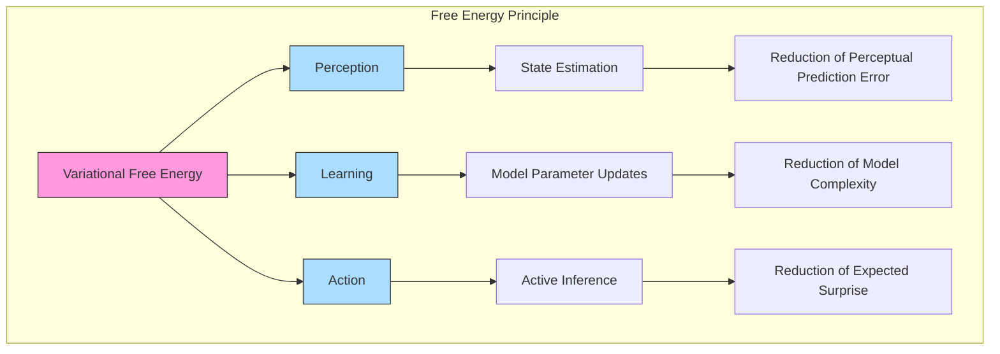

## Historical Context and Development

### Origins and Evolution

The Free Energy Principle emerged from the intersection of thermodynamics, information theory, and neuroscience, developed primarily by Karl Friston in the early 2000s:

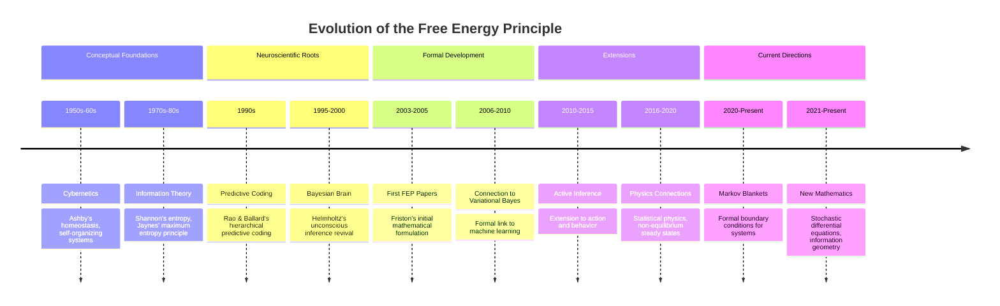

### Key Contributors

1. **Karl Friston**: Principal architect who formalized the Free Energy Principle
2. **Geoffrey Hinton**: Developed related concepts in Helmholtz Machines
3. **Anil Seth**: Extended FEP to interoceptive processing and consciousness
4. **Maxwell Ramstead**: Applied FEP to social systems and cultural dynamics
5. **Christopher Buckley**: Connected FEP to control theory
6. **Thomas Parr**: Developed hierarchical implementations
7. **Lancelot Da Costa**: Advanced mathematical formulations using stochastic calculus

### Intellectual Lineage

The Free Energy Principle integrates several intellectual traditions:

- **Helmholtz's Unconscious Inference**: The idea that perception is a form of unconscious statistical inference
- **Ashby's Cybernetics**: Concepts of homeostasis and self-organization
- **Jaynes' Maximum Entropy Principle**: Using entropy maximization subject to constraints
- **Feynman's Path Integrals**: Statistical mechanics approaches to understanding systems
- **Pearl's Causality**: Causal modeling through graphical models

## Mathematical Foundation

### Variational Free Energy

Variational free energy is formally defined as:

```math
F[q] = \mathbb{E}_q[\ln q(s) - \ln p(s,o)]
```

This can be decomposed in several ways:

```math
\begin{aligned}
F[q] &= \mathbb{E}_q[\ln q(s) - \ln p(s|o) - \ln p(o)] \\
&= D_{\mathrm{KL}}[q(s) \| p(s|o)] - \ln p(o) \\
&= \underbrace{\mathbb{E}_q[-\ln p(o|s)]}_{\text{accuracy}} + \underbrace{D_{\mathrm{KL}}[q(s) \| p(s)]}_{\text{complexity}}
\end{aligned}
```

where:
- $D_{\mathrm{KL}}$ is the Kullback-Leibler divergence
- $p(o)$ is the marginal likelihood or evidence
- $p(s|o)$ is the true posterior distribution

### Decomposition

The FEP can be decomposed into different components representing accuracy and complexity:

```math
\begin{aligned}
\text{Accuracy} &= \mathbb{E}_q[-\ln p(o|s)] \\
\text{Complexity} &= D_{\mathrm{KL}}[q(s) \| p(s)]
\end{aligned}
```

This decomposition reveals a fundamental trade-off: minimizing free energy requires balancing model fit (accuracy) against model complexity.

### Alternative Forms

Free energy can also be expressed in terms of energy and entropy:

```math
F[q] = \mathbb{E}_q[E(s,o)] - H[q(s)]
```

where:
- $E(s,o) = -\ln p(s,o)$ is the energy function
- $H[q(s)] = -\mathbb{E}_q[\ln q(s)]$ is the entropy of the recognition density

## Information Geometry Perspective

### Geometry of Free Energy

The Free Energy Principle can be understood through the lens of information geometry, where variational inference corresponds to optimization on a statistical manifold:

```math
\begin{aligned}
\delta F[q] &= \int \frac{\delta F}{\delta q(s)} \delta q(s) ds \\
&= \int \left(\ln q(s) - \ln p(s,o) + 1 \right) \delta q(s) ds
\end{aligned}
```

For parametric distributions $q_\theta(s)$ with parameters $\theta$, we can write:

```math
\frac{\partial F}{\partial \theta_i} = \mathbb{E}_q\left[\frac{\partial \ln q_\theta(s)}{\partial \theta_i}\left(\ln q_\theta(s) - \ln p(s,o)\right)\right]
```

### Fisher Information and Natural Gradients

Optimization in information geometry often uses the Fisher information matrix:

```math
\mathcal{G}_{ij} = \mathbb{E}_q\left[\frac{\partial \ln q_\theta(s)}{\partial \theta_i}\frac{\partial \ln q_\theta(s)}{\partial \theta_j}\right]
```

Leading to natural gradient descent:

```math
\Delta \theta = -\eta \mathcal{G}^{-1}\nabla_\theta F
```

where $\eta$ is a learning rate. This approach respects the Riemannian geometry of the probability simplex and can accelerate convergence.

### Connections to Optimal Transport

Recent work connects the FEP to optimal transport theory and Wasserstein gradients:

```math
\partial_t q_t = \nabla \cdot (q_t \nabla \delta F/\delta q)
```

This formulation reveals free energy minimization as a gradient flow on the space of probability measures.

## Connections to Statistical Physics

### Thermodynamic Interpretation

The Free Energy Principle has deep connections to statistical physics and thermodynamics:

```math
\begin{aligned}
F_{\text{thermo}} &= U - TS \\
F_{\text{variational}} &= \mathbb{E}_q[E] - H[q]
\end{aligned}
```

Where:
- $F_{\text{thermo}}$ is thermodynamic free energy
- $U$ is internal energy
- $T$ is temperature
- $S$ is entropy
- $F_{\text{variational}}$ is variational free energy
- $E$ is an energy function
- $H[q]$ is entropy of $q$

### Non-equilibrium Steady States

A more recent formulation connects the FEP to non-equilibrium steady states (NESS):

```math
\nabla \cdot (q(x) \nabla E(x)) = 0
```

Where $q(x)$ is a probability density function over states $x$ and $E(x)$ is a potential function. In the context of the FEP, biological systems are conceptualized as maintaining a characteristic probability distribution over their states.

### Principle of Least Action

The FEP can also be connected to the principle of least action via path integrals:

```math
q^*(x(t)) = \frac{1}{Z} \exp\left(-\int_0^T \mathcal{L}(x(t), \dot{x}(t)) dt\right)
```

Where $\mathcal{L}$ is a Lagrangian function and $Z$ is a normalizing constant. This formulation provides a bridge between the FEP and theoretical physics.

## Advanced Mathematical Formulations

### Stochastic Differential Equations

The FEP can be formulated using stochastic differential equations:

```math
\begin{aligned}
dx &= (f(x) + Q\partial_x\ln p(x))dt + \sqrt{2Q}dW \\
dp &= (-\partial_xH)dt + \sqrt{2R}dW
\end{aligned}
```

where:
- $f(x)$ is the drift function
- $Q$ and $R$ are diffusion matrices
- $dW$ is a Wiener process
- $H$ is the Hamiltonian

### Path Integral Formulation

The path integral perspective connects FEP to quantum mechanics:

```math
\begin{aligned}
p(x(T)|x(0)) &= \int \mathcal{D}[x]e^{-S[x]} \\
S[x] &= \int_0^T dt\left(\frac{1}{2}|\dot{x} - f(x)|^2 + V(x)\right)
\end{aligned}
```

where:
- $\mathcal{D}[x]$ is the path integral measure
- $S[x]$ is the action functional
- $V(x)$ is the potential function

### Information Geometric Extensions

Using the language of information geometry:

```math
\begin{aligned}
g_{ij}(\theta) &= \mathbb{E}_{p(x|\theta)}\left[\frac{\partial \ln p(x|\theta)}{\partial \theta^i}\frac{\partial \ln p(x|\theta)}{\partial \theta^j}\right] \\
\Gamma_{ijk}^{(α)} &= \mathbb{E}\left[\frac{\partial^2 \ln p}{\partial \theta^i\partial \theta^j}\frac{\partial \ln p}{\partial \theta^k}\right] \\
\nabla_\theta F &= g^{ij}(\theta)\frac{\partial F}{\partial \theta^j}
\end{aligned}
```

## Implementation Framework

### Variational Methods

```python
class FreeEnergyModel:
    def __init__(self,
                 state_dim: int,
                 obs_dim: int):
        """Initialize free energy model.
        
        Args:
            state_dim: State dimension
            obs_dim: Observation dimension
        """
        self.state_dim = state_dim
        self.obs_dim = obs_dim
        
        # Initialize distributions
        self.q = VariationalDistribution(state_dim)
        self.p = GenerativeModel(state_dim, obs_dim)
        
    def compute_free_energy(self,
                          obs: torch.Tensor) -> torch.Tensor:
        """Compute variational free energy.
        
        Args:
            obs: Observations
            
        Returns:
            F: Free energy value
        """
        # Get variational parameters
        mu, log_var = self.q.get_parameters()
        
        # Compute KL divergence
        kl_div = -0.5 * torch.sum(
            1 + log_var - mu.pow(2) - log_var.exp()
        )
        
        # Compute expected log likelihood
        expected_llh = self.p.expected_log_likelihood(
            obs, mu, log_var
        )
        
        return kl_div - expected_llh
    
    def update(self,
              obs: torch.Tensor,
              lr: float = 0.01) -> None:
        """Update model parameters.
        
        Args:
            obs: Observations
            lr: Learning rate
        """
        # Compute free energy
        F = self.compute_free_energy(obs)
        
        # Compute gradients
        F.backward()
        
        # Update parameters
        with torch.no_grad():
            for param in self.parameters():
                param -= lr * param.grad
                param.grad.zero_()
```

### Markov Blanket Implementation

```python
class MarkovBlanket:
    def __init__(self,
                 internal_dim: int,
                 blanket_dim: int,
                 external_dim: int):
        """Initialize Markov blanket.
        
        Args:
            internal_dim: Internal state dimension
            blanket_dim: Blanket state dimension
            external_dim: External state dimension
        """
        self.internal_dim = internal_dim
        self.blanket_dim = blanket_dim
        self.external_dim = external_dim
        
        # Initialize states
        self.internal = torch.zeros(internal_dim)
        self.blanket = torch.zeros(blanket_dim)
        self.external = torch.zeros(external_dim)
        
    def update_internal(self,
                       blanket_state: torch.Tensor) -> None:
        """Update internal states given blanket."""
        self.internal = self._compute_internal_update(
            self.internal, blanket_state
        )
        
    def update_blanket(self,
                      internal_state: torch.Tensor,
                      external_state: torch.Tensor) -> None:
        """Update blanket states."""
        self.blanket = self._compute_blanket_update(
            internal_state, self.blanket, external_state
        )
        
    def _compute_internal_update(self,
                               internal: torch.Tensor,
                               blanket: torch.Tensor) -> torch.Tensor:
        """Compute internal state update."""
        # Implement specific update rule
        return internal
        
    def _compute_blanket_update(self,
                              internal: torch.Tensor,
                              blanket: torch.Tensor,
                              external: torch.Tensor) -> torch.Tensor:
        """Compute blanket state update."""
        # Implement specific update rule
        return blanket
```

### MCMC Sampling

```python
class MCMCSampler:
    def __init__(self,
                 target_distribution: Callable,
                 proposal_distribution: Callable):
        """Initialize MCMC sampler.
        
        Args:
            target_distribution: Target distribution
            proposal_distribution: Proposal distribution
        """
        self.target = target_distribution
        self.proposal = proposal_distribution
        
    def sample(self,
              initial_state: torch.Tensor,
              n_samples: int) -> torch.Tensor:
        """Generate samples using MCMC.
        
        Args:
            initial_state: Initial state
            n_samples: Number of samples
            
        Returns:
            samples: Generated samples
        """
        current_state = initial_state
        samples = [current_state]
        
        for _ in range(n_samples):
            # Propose new state
            proposal = self.proposal(current_state)
            
            # Compute acceptance ratio
            ratio = self.target(proposal) / self.target(current_state)
            
            # Accept/reject
            if torch.rand(1) < ratio:
                current_state = proposal
                
            samples.append(current_state)
            
        return torch.stack(samples)
```

## Advanced Applications

### 1. Biological Systems

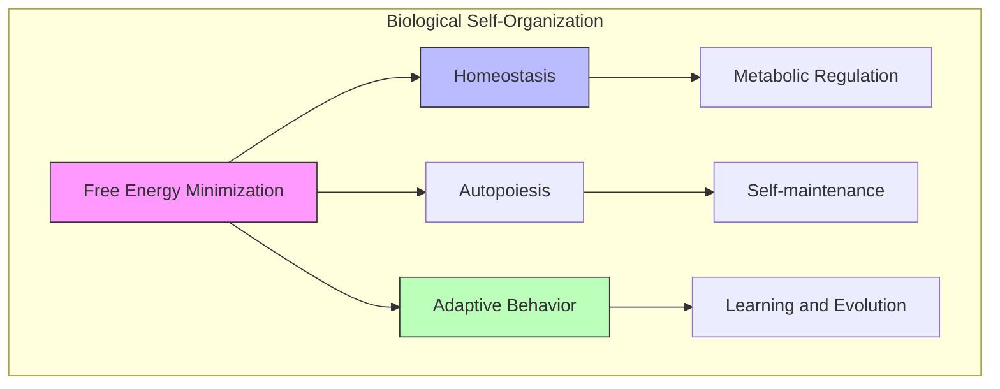

### 2. Cognitive Systems

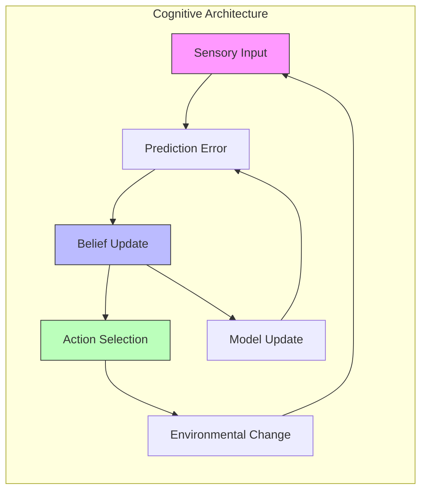

### 3. Artificial Systems

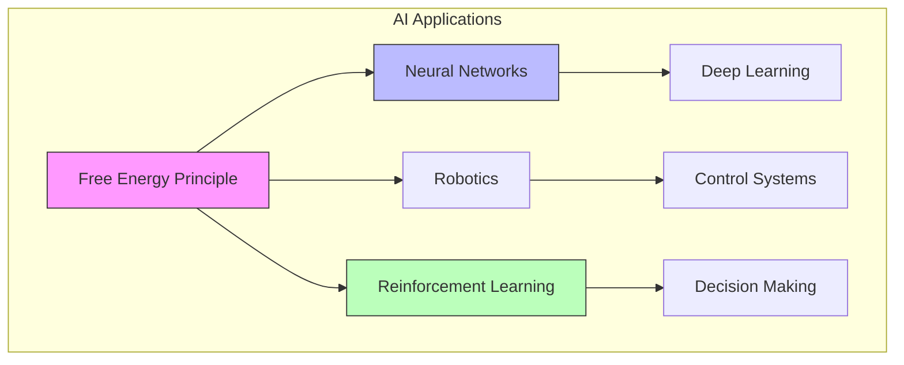

## Future Directions

### Emerging Research Areas

1. **Quantum Extensions**
   - Quantum Free Energy
   - Quantum Information Geometry
   - Quantum Active Inference

2. **Complex Systems**
   - Collective Behavior
   - Network Dynamics
   - Emergence and Criticality

3. **Machine Learning**
   - Deep Free Energy Models
   - Variational Autoencoders
   - Generative Models

### Open Problems

1. **Theoretical Challenges**
   - Exact vs. Approximate Inference
   - Non-equilibrium Dynamics
   - Scale Separation

2. **Practical Challenges**
   - Computational Tractability
   - Model Selection
   - Real-world Applications

## Criticisms and Limitations

### Technical Critiques

1. **Mathematical Tractability**: Exact free energy minimization is often intractable in complex models.
2. **Linearity Assumptions**: Many implementations rely on linear or weakly nonlinear approximations.
3. **Discrete vs. Continuous Time**: Reconciling discrete and continuous time formulations remains challenging.
4. **Identifiability Issues**: Different generative models can yield identical behavioral predictions.

### Conceptual Critiques

1. **Circularity Concerns**: Critics argue the theory risks being unfalsifiable by explaining everything.
2. **Missing Mechanistic Details**: The abstract nature can obscure specific neural mechanisms.
3. **Teleological Interpretations**: Confusion between "as if" optimization and goal-directed behavior.
4. **Scale Problems**: Applying the principle across vastly different scales (from cells to societies) raises questions.

### Empirical Challenges

1. **Experimental Design**: Testing FEP directly is challenging due to its mathematical abstraction.
2. **Parameter Identification**: Identifying model parameters from empirical data can be difficult.
3. **Competing Explanations**: Alternative theories sometimes provide simpler explanations for the same phenomena.

## Recent Extensions and Developments

### Non-equilibrium Steady States

Recent formulations cast the FEP in terms of non-equilibrium steady states using stochastic differential equations:

```math
dx = f(x)dt + \sigma(x)dW
```

where $x$ represents the system state, $f(x)$ is a drift function, $\sigma(x)$ is a diffusion coefficient, and $dW$ is a Wiener process.

### Particular Physics

The "particular physics" formulation grounds the FEP in specific physical principles:

```math
\begin{aligned}
\dot{p}(x,t) &= -\nabla \cdot (f(x)p(x,t)) + \frac{1}{2}\nabla^2 \cdot (D(x)p(x,t)) \\
&= -\nabla \cdot (f(x)p(x,t) - \nabla \cdot (D(x)p(x,t)))
\end{aligned}
```

where $p(x,t)$ is a probability density function, $f(x)$ is a flow field, and $D(x)$ is a diffusion tensor.

### Symmetry Breaking

Recent work connects the FEP to symmetry breaking in physics:

```math
\mathcal{L}(g \cdot x) = \mathcal{L}(x) \quad \forall g \in G
```

where $\mathcal{L}$ is a Lagrangian, $g$ is a group element, and $G$ is a group of transformations. The emergence of Markov blankets is viewed as a form of symmetry breaking.

### Dynamic Causal Modeling

Extensions to Dynamic Causal Modeling (DCM) allow empirical testing of FEP predictions:

```math
\dot{x} = f(x,u,\theta) + w
```

where $u$ are inputs, $\theta$ are parameters, and $w$ is noise. DCM enables system identification from time series data.

## Philosophical Implications

### Epistemology

The FEP has profound implications for epistemology:

1. **Knowledge as Model**: Suggests knowledge is embodied in probabilistic models.
2. **Bayesian Brain**: Positions the brain as a Bayesian inference machine.
3. **Umwelt**: Each organism constructs its own model-based reality.

### Metaphysics

Several metaphysical consequences follow from the FEP:

1. **Mind-Body Problem**: Offers a naturalistic account of mind as inference.
2. **Causality**: Reframes causation in terms of generative models.
3. **Emergence**: Provides a mathematical account of how higher-order properties emerge.

### Ethics and Aesthetics

The FEP has been extended to consider:

1. **Value**: Framing value in terms of expected free energy minimization.
2. **Aesthetics**: Suggesting beauty might relate to successful prediction.
3. **Social Dynamics**: Modeling social cohesion as shared free energy minimization.

## Theoretical Results

### Fisher Information and Cramér-Rao Bound

The FEP connects to fundamental results in information theory:

```math
\text{Var}(\hat{\theta}) \geq \frac{1}{\mathcal{I}(\theta)}
```

where $\mathcal{I}(\theta)$ is the Fisher information. This relates to the precision with which parameters can be estimated.

### Markov Blanket Conditions

For a system with states partitioned into internal states $\mu$ and external states $\eta$, the Markov blanket $b$ must satisfy:

```math
p(\mu | \eta, b) = p(\mu | b)
```

This condition ensures that internal states are conditionally independent of external states, given the blanket states.

### Path Integral Formulation

The path of least action in state space can be formulated as:

```math
q^*(x_{0:T}) = \frac{1}{Z}p(x_0)\exp\left(-\int_0^T \mathcal{L}(x, \dot{x})dt\right)
```

where $\mathcal{L}(x, \dot{x})$ is a Lagrangian and $Z$ is a normalizing constant.

### Marginal Stability

Systems at non-equilibrium steady states exhibit marginal stability:

```math
\lambda_{\max}(J) \approx 0
```

where $\lambda_{\max}(J)$ is the maximum eigenvalue of the Jacobian matrix of the dynamics. This relates to critical slowing near bifurcation points.

## Best Practices

### Model Design
1. Choose appropriate state space dimensionality
2. Structure hierarchical dependencies
3. Design informative priors
4. Balance model complexity
5. Test with simulated data

### Implementation
1. Handle numerical stability issues
2. Choose appropriate approximation methods
3. Validate with synthetic data
4. Benchmark against standard methods
5. Implement efficient matrix operations

```python
def compute_fisher_metric(model, q_samples, n_samples=1000):
    """Compute Fisher information metric for a model.
    
    Args:
        model: Probabilistic model
        q_samples: Parameter samples
        n_samples: Number of samples
        
    Returns:
        fisher_metric: Fisher information matrix
    """
    n_params = q_samples.shape[1]
    fisher_metric = np.zeros((n_params, n_params))
    
    # Compute score function for each sample
    scores = np.zeros((n_samples, n_params))
    
    for i in range(n_samples):
        params = q_samples[i]
        
        # Compute gradients of log probability
        for j in range(n_params):
            # Finite difference approximation
            eps = 1e-5
            params_plus = params.copy()
            params_plus[j] += eps
            
            params_minus = params.copy()
            params_minus[j] -= eps
            
            log_p_plus = model.log_prob(params_plus)
            log_p_minus = model.log_prob(params_minus)
            
            scores[i, j] = (log_p_plus - log_p_minus) / (2 * eps)
    
    # Compute outer product of scores
    for i in range(n_samples):
        outer_product = np.outer(scores[i], scores[i])
        fisher_metric += outer_product
    
    fisher_metric /= n_samples
    return fisher_metric
```

### Validation
1. Check convergence of optimization
2. Analyze sensitivity to hyperparameters
3. Compare with alternative models
4. Test edge cases
5. Evaluate generalization performance

## Related Documentation
- [[active_inference]]
- [[variational_inference]]
- [[bayesian_brain_hypothesis]]
- [[markov_blanket]]
- [[predictive_coding]]
- [[information_theory]]
- [[statistical_physics]]
- [[self_organization]]
- [[autopoiesis]]

## Quantum Extensions

### Quantum Free Energy Principle

The quantum extension of FEP uses quantum probability theory:

```math
\begin{aligned}
\text{Quantum State:} \quad |\psi\rangle &= \sum_s \sqrt{q(s)}|s\rangle \\
\text{Density Matrix:} \quad \rho &= |\psi\rangle\langle\psi| \\
\text{Quantum Free Energy:} \quad F_Q &= \text{Tr}(\rho H) + \text{Tr}(\rho \ln \rho)
\end{aligned}
```

### Quantum Information Geometry

```math
\begin{aligned}
\text{Quantum Fisher Information:} \quad g_{ij}^Q &= \text{Re}(\text{Tr}(\rho L_i L_j)) \\
\text{SLD Operators:} \quad L_i &= 2\frac{\partial \rho}{\partial \theta^i} \\
\text{Quantum Relative Entropy:} \quad S(\rho\|\sigma) &= \text{Tr}(\rho(\ln \rho - \ln \sigma))
\end{aligned}
```

### Implementation Framework

```python
class QuantumFreeEnergy:
    def __init__(self,
                 hilbert_dim: int,
                 hamiltonian: np.ndarray):
        """Initialize quantum free energy system.
        
        Args:
            hilbert_dim: Dimension of Hilbert space
            hamiltonian: System Hamiltonian
        """
        self.dim = hilbert_dim
        self.H = hamiltonian
        
    def compute_quantum_free_energy(self,
                                  state_vector: np.ndarray) -> float:
        """Compute quantum free energy.
        
        Args:
            state_vector: Quantum state vector
            
        Returns:
            F_Q: Quantum free energy
        """
        # Compute density matrix
        rho = np.outer(state_vector, state_vector.conj())
        
        # Energy term
        energy = np.trace(rho @ self.H)
        
        # von Neumann entropy
        entropy = -np.trace(rho @ np.log(rho))
        
        return energy + entropy
```

## Advanced Mathematical Structures

### Category Theory Framework

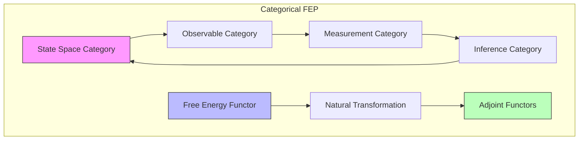

### Differential Forms and Symplectic Structure

```math
\begin{aligned}
\text{Symplectic Form:} \quad \omega &= \sum_i dp_i \wedge dq_i \\
\text{Hamiltonian Vector Field:} \quad X_H &= \omega^{-1}(dH) \\
\text{Liouville Form:} \quad \theta &= \sum_i p_i dq_i
\end{aligned}
```

### Lie Group Actions

```math
\begin{aligned}
\text{Group Action:} \quad \Phi: G \times M &\to M \\
\text{Momentum Map:} \quad J: T^*M &\to \mathfrak{g}^* \\
\text{Coadjoint Orbit:} \quad \mathcal{O}_\mu &= \{Ad^*_g\mu : g \in G\}
\end{aligned}
```

## Advanced Implementation Frameworks

### Deep Free Energy Networks

```python
class DeepFreeEnergyNetwork(nn.Module):
    def __init__(self,
                 state_dim: int,
                 obs_dim: int,
                 latent_dim: int):
        """Initialize deep free energy network."""
        super().__init__()
        
        # Recognition network
        self.recognition = nn.Sequential(
            nn.Linear(obs_dim, 256),
            nn.ReLU(),
            nn.Linear(256, 2 * latent_dim)  # Mean and log variance
        )
        
        # Generative network
        self.generative = nn.Sequential(
            nn.Linear(latent_dim, 256),
            nn.ReLU(),
            nn.Linear(256, obs_dim)
        )
        
        # State transition network
        self.dynamics = nn.Sequential(
            nn.Linear(latent_dim, 256),
            nn.ReLU(),
            nn.Linear(256, latent_dim)
        )
        
    def encode(self,
              x: torch.Tensor) -> Tuple[torch.Tensor, torch.Tensor]:
        """Encode observations to latent space."""
        h = self.recognition(x)
        mu, log_var = torch.chunk(h, 2, dim=-1)
        return mu, log_var
        
    def decode(self,
              z: torch.Tensor) -> torch.Tensor:
        """Decode latent states to observations."""
        return self.generative(z)
        
    def transition(self,
                  z: torch.Tensor) -> torch.Tensor:
        """Predict next latent state."""
        return self.dynamics(z)
        
    def compute_free_energy(self,
                          x: torch.Tensor,
                          z: torch.Tensor,
                          mu: torch.Tensor,
                          log_var: torch.Tensor) -> torch.Tensor:
        """Compute variational free energy."""
        # Reconstruction term
        x_recon = self.decode(z)
        recon_loss = F.mse_loss(x_recon, x, reduction='none')
        
        # KL divergence term
        kl_div = -0.5 * torch.sum(
            1 + log_var - mu.pow(2) - log_var.exp(),
            dim=1
        )
        
        return recon_loss.sum(dim=1) + kl_div
```

### Markov Blanket Analysis

```python
class MarkovBlanketAnalyzer:
    def __init__(self,
                 n_variables: int,
                 threshold: float = 0.1):
        """Initialize Markov blanket analyzer."""
        self.n_vars = n_variables
        self.threshold = threshold
        
    def identify_blanket(self,
                        data: np.ndarray) -> Dict[str, np.ndarray]:
        """Identify Markov blanket structure.
        
        Args:
            data: Time series data (samples × variables)
            
        Returns:
            partitions: Dictionary of partitioned variables
        """
        # Compute correlation matrix
        corr = np.corrcoef(data.T)
        
        # Threshold to get adjacency matrix
        adj = (np.abs(corr) > self.threshold).astype(int)
        
        # Find strongly connected components
        components = self._find_components(adj)
        
        # Identify internal, blanket, and external states
        internal = self._identify_internal(components)
        blanket = self._identify_blanket(adj, internal)
        external = self._identify_external(internal, blanket)
        
        return {
            'internal': internal,
            'blanket': blanket,
            'external': external
        }
```

## Advanced Applications

### 1. Biological Systems

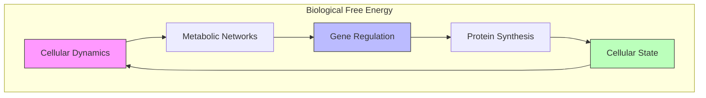

### 2. Neural Systems

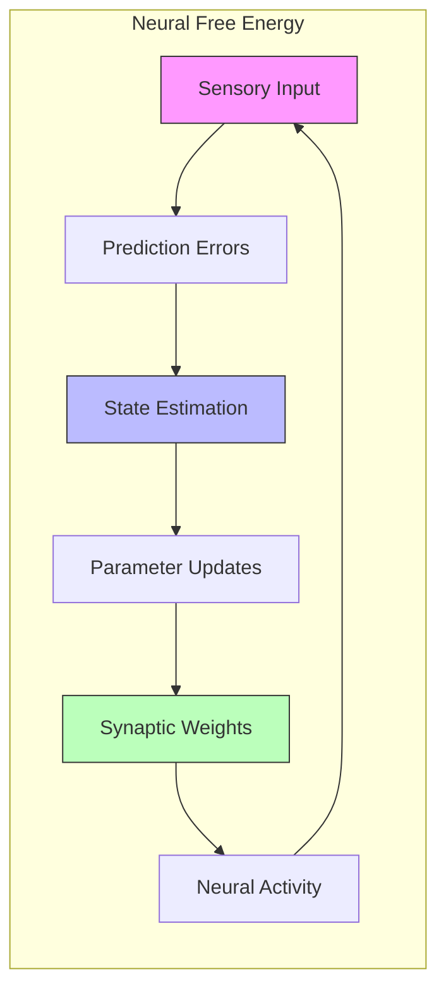

### 3. Social Systems

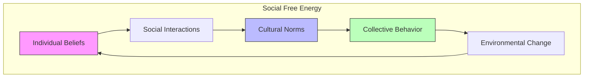

## Computational Complexity Analysis

### Time Complexity

1. **Belief Updates**: $O(d^3)$ for $d$-dimensional state space
2. **Free Energy Computation**: $O(d^2)$ for matrix operations
3. **Markov Blanket Identification**: $O(n^2)$ for $n$ variables

### Space Complexity

1. **State Representation**: $O(d)$ for state vectors
2. **Covariance Matrices**: $O(d^2)$ for precision matrices
3. **Model Parameters**: $O(d^2)$ for transition matrices

### Optimization Methods

1. **Gradient Descent**: $O(kd^2)$ for $k$ iterations
2. **Natural Gradient**: $O(kd^3)$ with Fisher information
3. **Variational EM**: $O(kd^3)$ for full covariance

## Best Practices

### Model Design
1. Choose appropriate state space dimensionality
2. Design informative priors
3. Structure hierarchical dependencies
4. Balance model complexity
5. Implement efficient numerics

### Implementation
1. Use stable matrix operations
2. Handle numerical precision
3. Implement parallel computation
4. Monitor convergence
5. Validate results

### Validation
1. Test with synthetic data
2. Compare with baselines
3. Cross-validate results
4. Analyze sensitivity
5. Benchmark performance

## Future Research Directions

### Theoretical Developments
1. **Quantum Extensions**: Quantum probability theory
2. **Category Theory**: Functorial relationships
3. **Information Geometry**: Wasserstein metrics

### Practical Advances
1. **Scalable Algorithms**: Large-scale systems
2. **Neural Implementation**: Brain-inspired architectures
3. **Real-world Applications**: Complex systems

### Open Problems
1. **Non-equilibrium Dynamics**: Far-from-equilibrium systems
2. **Scale Separation**: Multiple time scales
3. **Emergence**: Collective phenomena

## Markov Blanket Theory

### Formal Definition

```math
\begin{aligned}
& \text{Markov Blanket Partition:} \\
& \mathcal{S} = \{η, s, a, μ\} \\
& \text{where:} \\
& η: \text{external states} \\
& s: \text{sensory states} \\
& a: \text{active states} \\
& μ: \text{internal states}
\end{aligned}
```

### Conditional Independence

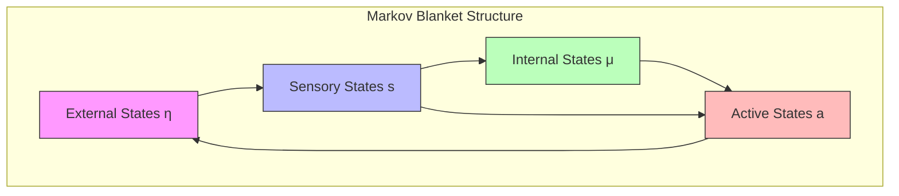

### Statistical Properties

```math
\begin{aligned}
& \text{Conditional Independence:} \\
& P(η|s,a,μ) = P(η|s,a) \\
& P(μ|s,a,η) = P(μ|s,a) \\
& \text{Flow:} \\
& \dot{x} = f(x) + ω \\
& \text{where } x = [η,s,a,μ]^T
\end{aligned}
```

## Technical Derivations

### Free Energy Decomposition

```math
\begin{aligned}
F &= \mathbb{E}_q[\log q(s) - \log p(o,s)] \\
&= \mathbb{E}_q[\log q(s) - \log p(s|o) - \log p(o)] \\
&= D_{KL}[q(s)||p(s|o)] - \log p(o) \\
&= \underbrace{D_{KL}[q(s)||p(s|o)]}_{\text{accuracy}} + \underbrace{\mathbb{E}_q[\log q(s)]}_{\text{complexity}}
\end{aligned}
```

### Variational Principle

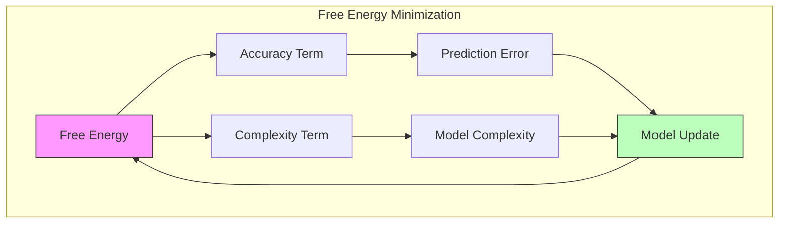

### Path Integral Formulation

```math
\begin{aligned}
& \text{Action:} \\
& S[q] = \int_0^T \mathcal{L}(q,\dot{q})dt \\
& \text{Lagrangian:} \\
& \mathcal{L}(q,\dot{q}) = F[q] + \frac{1}{2}\dot{q}^T\Gamma\dot{q} \\
& \text{Hamilton's Equations:} \\
& \dot{q} = \frac{\partial H}{\partial p}, \quad \dot{p} = -\frac{\partial H}{\partial q}
\end{aligned}
```

## Mathematical Foundations

### Information Geometry

```math
\begin{aligned}
& \text{Fisher Metric:} \\
& g_{ij}(θ) = \mathbb{E}_p\left[\frac{\partial \log p}{\partial θ^i}\frac{\partial \log p}{\partial θ^j}\right] \\
& \text{Natural Gradient:} \\
& \dot{θ} = -g^{ij}\frac{\partial F}{\partial θ^j} \\
& \text{Geodesic Flow:} \\
& \ddot{θ}^k + \Gamma^k_{ij}\dot{θ}^i\dot{θ}^j = 0
\end{aligned}
```

### Differential Geometry

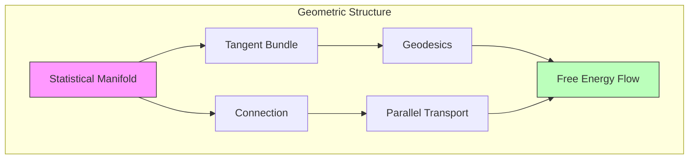

### Stochastic Processes

```math
\begin{aligned}
& \text{Langevin Dynamics:} \\
& dx = f(x)dt + σdW \\
& \text{Fokker-Planck Equation:} \\
& \frac{\partial p}{\partial t} = -\nabla \cdot (fp) + \frac{1}{2}\nabla^2(Dp) \\
& \text{Path Integral:} \\
& p(x_T|x_0) = \int \mathcal{D}[x]e^{-S[x]}
\end{aligned}
```

```python
def compute_fisher_metric(model, q_samples, n_samples=1000):
    """Compute Fisher information metric for a model.
    
    Args:
        model: Probabilistic model
        q_samples: Parameter samples
        n_samples: Number of samples
        
    Returns:
        fisher_metric: Fisher information matrix
    """
    n_params = q_samples.shape[1]
    fisher_metric = np.zeros((n_params, n_params))
    
    # Compute score function for each sample
    scores = np.zeros((n_samples, n_params))
    
    for i in range(n_samples):
        params = q_samples[i]
        
        # Compute gradients of log probability
        for j in range(n_params):
            # Finite difference approximation
            eps = 1e-5
            params_plus = params.copy()
            params_plus[j] += eps
            
            params_minus = params.copy()
            params_minus[j] -= eps
            
            log_p_plus = model.log_prob(params_plus)
            log_p_minus = model.log_prob(params_minus)
            
            scores[i, j] = (log_p_plus - log_p_minus) / (2 * eps)
    
    # Compute outer product of scores
    for i in range(n_samples):
        outer_product = np.outer(scores[i], scores[i])
        fisher_metric += outer_product
    
    fisher_metric /= n_samples
    return fisher_metric
```

### Validation
1. Check convergence of optimization
2. Analyze sensitivity to hyperparameters
3. Compare with alternative models
4. Test edge cases
5. Evaluate generalization performance

## Related Documentation
- [[active_inference]]
- [[variational_inference]]
- [[bayesian_brain_hypothesis]]
- [[markov_blanket]]
- [[predictive_coding]]
- [[information_theory]]
- [[statistical_physics]]
- [[self_organization]]
- [[autopoiesis]] 