# Functional Analysis

## Overview

Functional analysis studies vector spaces equipped with topologies and linear operators between them. It provides the mathematical foundation for infinite-dimensional analysis, essential for understanding continuous systems, probability theory, and quantum mechanics in cognitive modeling and active inference.

```mermaid
graph TD
    A[Functional Analysis] --> B[Normed Spaces]
    A --> C[Banach Spaces]
    A --> D[Hilbert Spaces]
    A --> E[Linear Operators]
    A --> F[Spectral Theory]
    A --> G[Dual Spaces]

    B --> B1[Norms & Metrics]
    B --> B2[Convergence]
    B --> B3[Completeness]

    C --> C1[Banach Spaces]
    C --> C2[Fixed Point Theory]
    C --> C3[Contraction Mapping]

    D --> D1[Inner Products]
    D --> D2[Orthogonality]
    D --> D3[Projections]

    E --> E1[Bounded Operators]
    E --> E2[Compact Operators]
    E --> E3[Self-Adjoint Operators]

    F --> F1[Spectrum]
    F --> F2[Resolvent]
    F --> F3[Functional Calculus]

    G --> G1[Dual Spaces]
    G --> G2[Weak Topology]
    G --> G3[Reflexive Spaces]

    style A fill:#ff9999,stroke:#05386b
```



## Normed Vector Spaces

### Norms and Seminorms

A norm on a vector space V over ℝ or ℂ is a function ‖·‖: V → ℝ satisfying:
- ‖v‖ ≥ 0, with equality iff v = 0 (positive definite)
- ‖αv‖ = |α|‖v‖ (homogeneous)
- ‖u + v‖ ≤ ‖u‖ + ‖v‖ (triangle inequality)

### Banach Spaces

Complete normed vector spaces where every Cauchy sequence converges.

### Examples
- ℝⁿ with Euclidean norm
- C([0,1]) with sup norm
- Lᵖ spaces with p-norms

## Hilbert Spaces

### Inner Product Spaces

Hilbert spaces are complete inner product spaces.

Inner product ⟨·,·⟩ satisfies:
- ⟨u,v⟩ = ⟨v,u⟩̄
- ⟨αu,v⟩ = α ⟨u,v⟩
- ⟨u + v,w⟩ = ⟨u,w⟩ + ⟨v,w⟩
- ⟨u,u⟩ > 0 for u ≠ 0

### Riesz Representation Theorem

Every continuous linear functional on a Hilbert space can be represented as an inner product.

### Orthogonal Projections

P: H → H with P² = P, P* = P, and im(P) ⊥ ker(P)

## Linear Operators

### Bounded Operators

Operators T: X → Y between normed spaces with ‖T‖ = sup_{‖x‖≤1} ‖Tx‖ < ∞

### Compact Operators

Operators where the image of the unit ball is precompact.

### Self-Adjoint Operators

T* = T, where T* is the adjoint operator.

## Spectral Theory

### Spectrum

σ(T) = {λ ∈ ℂ | T - λI not invertible}

### Resolvent

R(λ) = (T - λI)⁻¹ for λ ∉ σ(T)

### Spectral Theorem for Compact Self-Adjoint Operators

Every compact self-adjoint operator on a Hilbert space has an orthonormal basis of eigenvectors.

## Dual Spaces

### Continuous Linear Functionals

X* = {f: X → ℂ | f continuous linear}

### Weak Topology

Convergence in weak topology: x_n ⇀ x iff f(x_n) → f(x) ∀ f ∈ X*

### Reflexive Spaces

X** ≅ X (isometric isomorphism)

## Applications in Active Inference

### Function Spaces in Probability

L² spaces for stochastic processes and Gaussian measures.

### Operator Theory in Dynamical Systems

Evolution operators and their spectral properties.

### Functional Optimization

Calculus of variations and optimal control in infinite dimensions.

### Quantum Cognition

Hilbert space representations of cognitive states.

## Implementation

```python
import numpy as np
from typing import Union, Callable, Tuple
from scipy.sparse.linalg import LinearOperator

class FunctionalAnalysisTools:
    """Tools for functional analysis computations."""

    @staticmethod
    def gram_schmidt_orthogonalization(vectors: list,
                                     inner_product: Callable = None) -> list:
        """Gram-Schmidt orthogonalization in abstract Hilbert space.

        Args:
            vectors: List of vectors/functions
            inner_product: Inner product function (default: L2)

        Returns:
            Orthogonal basis
        """
        if inner_product is None:
            # L2 inner product for functions on [0,1]
            inner_product = lambda f, g: np.trapz(f * g, np.linspace(0, 1, len(f)))

        orthogonal_basis = []

        for v in vectors:
            # Project onto existing basis
            projection = np.zeros_like(v)
            for u in orthogonal_basis:
                coeff = inner_product(v, u) / inner_product(u, u)
                projection += coeff * u

            # Orthogonal component
            orthogonal_vector = v - projection

            # Normalize
            norm = np.sqrt(inner_product(orthogonal_vector, orthogonal_vector))
            if norm > 1e-10:
                orthogonal_basis.append(orthogonal_vector / norm)

        return orthogonal_basis

    @staticmethod
    def power_iteration(operator: LinearOperator,
                        initial_vector: np.ndarray,
                        max_iterations: int = 100,
                        tolerance: float = 1e-10) -> Tuple[np.ndarray, float]:
        """Power iteration for dominant eigenvalue.

        Args:
            operator: Linear operator
            initial_vector: Initial vector
            max_iterations: Maximum iterations
            tolerance: Convergence tolerance

        Returns:
            Dominant eigenvector and eigenvalue
        """
        v = initial_vector / np.linalg.norm(initial_vector)

        for _ in range(max_iterations):
            v_new = operator.matvec(v)
            eigenvalue = np.dot(v, v_new)

            v_new = v_new / np.linalg.norm(v_new)

            if np.linalg.norm(v_new - v) < tolerance:
                break

            v = v_new

        return v, eigenvalue

    @staticmethod
    def conjugate_gradient_solve(operator: LinearOperator,
                               b: np.ndarray,
                               initial_guess: np.ndarray = None,
                               max_iterations: int = 100,
                               tolerance: float = 1e-10) -> np.ndarray:
        """Conjugate gradient method for solving Ax = b.

        Args:
            operator: Positive definite operator
            b: Right-hand side
            initial_guess: Initial solution guess
            max_iterations: Maximum iterations
            tolerance: Convergence tolerance

        Returns:
            Solution vector
        """
        if initial_guess is None:
            x = np.zeros_like(b)
        else:
            x = initial_guess.copy()

        r = b - operator.matvec(x)
        p = r.copy()

        for _ in range(max_iterations):
            Ap = operator.matvec(p)
            alpha = np.dot(r, r) / np.dot(p, Ap)

            x = x + alpha * p
            r_new = r - alpha * Ap

            if np.linalg.norm(r_new) < tolerance:
                break

            beta = np.dot(r_new, r_new) / np.dot(r, r)
            p = r_new + beta * p
            r = r_new

        return x

    @staticmethod
    def compute_singular_values(operator: LinearOperator,
                              rank: int = 10) -> np.ndarray:
        """Approximate singular values using randomized SVD.

        Args:
            operator: Linear operator
            rank: Number of singular values to compute

        Returns:
            Approximate singular values
        """
        m, n = operator.shape

        # Random Gaussian matrix
        omega = np.random.randn(n, rank)

        # Range finder
        y = operator.matvec(omega)
        q, _ = np.linalg.qr(y)

        # SVD of projected operator
        b = operator.rmatvec(q)
        u_tilde, sigma, vt = np.linalg.svd(b.T, full_matrices=False)

        return sigma[:rank]
```

## Key Theorems

### Hahn-Banach Theorem

Extension of continuous linear functionals.

### Open Mapping Theorem

Surjective bounded linear operators are open.

### Closed Graph Theorem

Closed linear operators with closed graph are bounded.

### Uniform Boundedness Principle

Pointwise bounded families are uniformly bounded.

## References

- Rudin, W. (1991). Functional Analysis
- Conway, J. B. (1990). A Course in Functional Analysis
- Yosida, K. (1980). Functional Analysis

---

> **Infinite Dimensions**: Functional analysis extends finite-dimensional linear algebra to infinite-dimensional spaces, enabling the mathematical treatment of continuous systems and probability measures.

---

> **Operator Theory**: The study of linear operators provides powerful tools for understanding transformations in function spaces, essential for advanced mathematical modeling in cognition.
