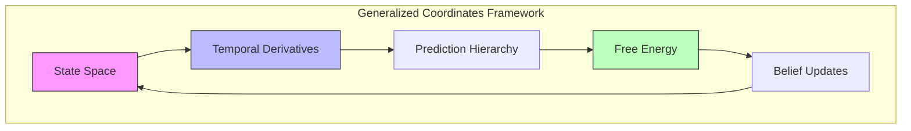
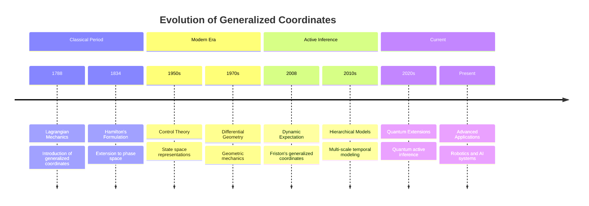
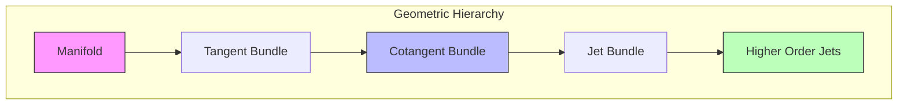
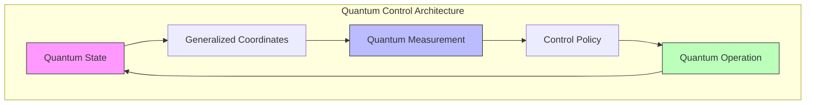

# Generalized Coordinates in Active Inference

## Overview

Generalized coordinates provide a fundamental mathematical framework for representing continuous-time dynamics in active inference by explicitly incorporating higher-order temporal derivatives into the state space. This approach enables rich temporal modeling and prediction across multiple time scales.



## Historical Development



### Intellectual Lineage

1. **Classical Mechanics**

   - Lagrangian formulation

   - Hamiltonian dynamics

   - Phase space representations

1. **Control Theory**

   - State observers

   - Kalman filtering

   - Optimal control

1. **Active Inference**

   - Free energy principle

   - Predictive coding

   - Hierarchical models

## Mathematical Foundation

### Basic Definition

A state x in generalized coordinates is represented as a vector of temporal derivatives:

```math

\begin{aligned}

\tilde{x} &= [x, x', x'', ..., x^{(n)}]^T \\

\text{where:} \\

x &: \text{state value} \\

x' &: \text{velocity} \\

x'' &: \text{acceleration} \\

x^{(n)} &: \text{nth order derivative}

\end{aligned}

```

### Shift Operator

The shift operator D maps between orders of motion:

```math

\begin{aligned}

D\tilde{x} &= [x', x'', x''', ..., 0]^T \\

D &= \begin{bmatrix}

0 & 1 & 0 & \cdots \\

0 & 0 & 2 & \cdots \\

0 & 0 & 0 & \ddots \\

\vdots & \vdots & \vdots & \ddots

\end{bmatrix}

\end{aligned}

```

### Taylor Series Connection

The relationship to Taylor series expansion:

```math

\begin{aligned}

x(t + \Delta t) &= \sum_{n=0}^{\infty} \frac{x^{(n)}(t)}{n!}(\Delta t)^n \\

&\approx \sum_{n=0}^{N} \frac{x^{(n)}(t)}{n!}(\Delta t)^n

\end{aligned}

```

## Extended Mathematical Framework

### Lie Group Structure

```math

\begin{aligned}

& \text{Group Action:} \\

& \Phi: G \times T\mathcal{M} \to T\mathcal{M} \\

& \text{Infinitesimal Generator:} \\

& X_ξ(x) = \frac{d}{dt}\big|_{t=0} \exp(tξ) \cdot x \\

& \text{Momentum Map:} \\

& J: T^*\mathcal{M} \to \mathfrak{g}^*

\end{aligned}

```

### Variational Structure

```math

\begin{aligned}

& \text{Action Functional:} \\

& S[\gamma] = \int_0^T L(\gamma(t), \dot{\gamma}(t))dt \\

& \text{Euler-Lagrange:} \\

& \frac{d}{dt}\frac{\partial L}{\partial \dot{\gamma}} - \frac{\partial L}{\partial \gamma} = 0 \\

& \text{Hamilton's Principle:} \\

& δS = 0

\end{aligned}

```

### Riemannian Structure



### Advanced Differential Forms

```math

\begin{aligned}

& \text{Jet Bundle Forms:} \\

& \omega^k = \sum_{|α|≤k} a_α dx^α \\

& \text{Contact Forms:} \\

& θ^{(k)}_i = dx^{(k)}_i - x^{(k+1)}_i dt \\

& \text{Cartan Distribution:} \\

& \mathcal{C} = \ker(θ^{(0)}) \cap ... \cap \ker(θ^{(k)})

\end{aligned}

```

## Advanced Implementation Frameworks

### Hierarchical Prediction System

```python

class HierarchicalGeneralizedPredictor:

    def __init__(self,

                 n_levels: int,

                 dims_per_level: List[int],

                 orders_per_level: List[int]):

        """Initialize hierarchical predictor.

        Args:

            n_levels: Number of hierarchical levels

            dims_per_level: State dimensions per level

            orders_per_level: Orders per level

        """

        self.n_levels = n_levels

        self.predictors = [

            GeneralizedPredictor(dim, order)

            for dim, order in zip(dims_per_level, orders_per_level)

        ]

    def predict_hierarchical(self,

                           initial_states: List[GeneralizedState],

                           horizon: int) -> List[np.ndarray]:

        """Generate hierarchical predictions.

        Args:

            initial_states: Initial states at each level

            horizon: Prediction horizon

        Returns:

            predictions: Predictions at each level

        """

        predictions = []

        # Top-down predictions

        for level in range(self.n_levels):

            level_preds = self.predictors[level].predict_path(

                initial_states[level], horizon)

            predictions.append(level_preds)

            # Update lower level priors

            if level < self.n_levels - 1:

                self._update_lower_level_prior(

                    level, level_preds, initial_states[level + 1])

        return predictions

    def _update_lower_level_prior(self,

                                level: int,

                                predictions: np.ndarray,

                                lower_state: GeneralizedState) -> None:

        """Update lower level prior based on higher level predictions."""

        # Implementation of top-down message passing

        pass

```

### Adaptive Order Selection

```python

class AdaptiveOrderSelector:

    def __init__(self,

                 max_order: int,

                 error_threshold: float = 0.01):

        """Initialize adaptive order selector.

        Args:

            max_order: Maximum allowed order

            error_threshold: Error threshold for order selection

        """

        self.max_order = max_order

        self.threshold = error_threshold

    def select_optimal_order(self,

                           time_series: np.ndarray,

                           dt: float) -> int:

        """Select optimal number of orders.

        Args:

            time_series: Input time series

            dt: Time step

        Returns:

            optimal_order: Selected order

        """

        errors = []

        derivatives = np.zeros((len(time_series), self.max_order))

        # Compute derivatives

        derivatives[:, 0] = time_series

        for order in range(1, self.max_order):

            derivatives[:, order] = np.gradient(

                derivatives[:, order-1], dt)

            # Compute reconstruction error

            reconstruction = self._reconstruct_series(

                derivatives[:, :order+1], dt)

            error = np.mean((time_series - reconstruction)**2)

            errors.append(error)

            # Check convergence

            if error < self.threshold:

                return order + 1

        return self.max_order

```

### Geometric Integration

```python

class GeometricIntegrator:

    def __init__(self,

                 hamiltonian: Callable,

                 n_orders: int):

        """Initialize geometric integrator.

        Args:

            hamiltonian: System Hamiltonian

            n_orders: Number of orders

        """

        self.H = hamiltonian

        self.n_orders = n_orders

    def symplectic_step(self,

                       state: GeneralizedState,

                       dt: float) -> GeneralizedState:

        """Perform symplectic integration step.

        Args:

            state: Current state

            dt: Time step

        Returns:

            next_state: Next state

        """

        # Split Hamiltonian

        T, V = self._split_hamiltonian(state)

        # Symplectic Euler

        p_half = state.momentum - dt/2 * self._grad_V(state.position)

        q_next = state.position + dt * self._grad_T(p_half)

        p_next = p_half - dt/2 * self._grad_V(q_next)

        return GeneralizedState(q_next, p_next)

```

## Advanced Neural Architectures

### Deep Generalized Networks

```python

class DeepGeneralizedNetwork(nn.Module):

    def __init__(self,

                 input_dim: int,

                 hidden_dims: List[int],

                 n_orders: int):

        """Initialize deep generalized network.

        Args:

            input_dim: Input dimension

            hidden_dims: Hidden layer dimensions

            n_orders: Number of orders

        """

        super().__init__()

        # Encoder network

        self.encoder = nn.ModuleList([

            nn.Linear(dim_in, dim_out)

            for dim_in, dim_out in zip([input_dim] + hidden_dims[:-1],

                                     hidden_dims)

        ])

        # Order-specific networks

        self.order_nets = nn.ModuleList([

            nn.Linear(hidden_dims[-1], input_dim)

            for _ in range(n_orders)

        ])

    def forward(self,

               x: torch.Tensor) -> List[torch.Tensor]:

        """Forward pass.

        Args:

            x: Input tensor

        Returns:

            predictions: Predictions for each order

        """

        # Encode

        h = x

        for layer in self.encoder:

            h = F.relu(layer(h))

        # Generate predictions for each order

        predictions = [net(h) for net in self.order_nets]

        return predictions

```

### Attention-Based Temporal Integration

```python

class TemporalAttention(nn.Module):

    def __init__(self,

                 n_orders: int,

                 d_model: int):

        """Initialize temporal attention.

        Args:

            n_orders: Number of orders

            d_model: Model dimension

        """

        super().__init__()

        self.attention = nn.MultiheadAttention(

            d_model, num_heads=8)

        self.order_embeddings = nn.Parameter(

            torch.randn(n_orders, d_model))

    def forward(self,

               x: torch.Tensor) -> torch.Tensor:

        """Apply temporal attention.

        Args:

            x: Input tensor [batch, time, features]

        Returns:

            attended: Attended features

        """

        # Add order embeddings

        x = x + self.order_embeddings[None, :, None]

        # Self-attention

        attended, _ = self.attention(x, x, x)

        return attended

```

## Advanced Applications

### 1. Quantum Control Systems



### 2. Neuromorphic Implementation

```python

class NeuromorphicGeneralizedCoordinates:

    def __init__(self,

                 n_neurons: int,

                 n_orders: int,

                 tau: float = 0.1):

        """Initialize neuromorphic implementation.

        Args:

            n_neurons: Number of neurons per dimension

            n_orders: Number of orders

            tau: Membrane time constant

        """

        self.n_neurons = n_neurons

        self.n_orders = n_orders

        self.tau = tau

        # Initialize membrane potentials

        self.v = np.zeros((n_neurons, n_orders))

    def step(self,

            input_current: np.ndarray,

            dt: float) -> np.ndarray:

        """Simulate one timestep.

        Args:

            input_current: Input currents

            dt: Time step

        Returns:

            spikes: Generated spikes

        """

        # Update membrane potentials

        self.v += dt * (

            -self.v/self.tau +  # Leak

            input_current[:, None] +  # Input

            self._lateral_connections()  # Lateral

        )

        # Generate spikes

        spikes = self.v > 1.0

        self.v[spikes] = 0.0  # Reset

        return spikes

```

### 3. Continual Learning

```python

class ContinualGeneralizedLearner:

    def __init__(self,

                 state_dim: int,

                 n_orders: int,

                 memory_size: int = 1000):

        """Initialize continual learner.

        Args:

            state_dim: State dimension

            n_orders: Number of orders

            memory_size: Experience memory size

        """

        self.memory = ExperienceMemory(memory_size)

        self.predictor = GeneralizedPredictor(state_dim, n_orders)

    def update(self,

              observation: np.ndarray,

              action: np.ndarray) -> None:

        """Update learner with new experience.

        Args:

            observation: Current observation

            action: Current action

        """

        # Store experience

        self.memory.add(observation, action)

        # Update model

        if len(self.memory) > self.batch_size:

            batch = self.memory.sample(self.batch_size)

            self._update_model(batch)

```

## Mathematical Extensions

### Category Theory Perspective

```math

\begin{aligned}

& \text{Functor:} \\

& F: \mathbf{Man} \to \mathbf{Vect} \\

& \text{Natural Transformation:} \\

& η: F \Rightarrow G \\

& \text{Adjunction:} \\

& F \dashv G

\end{aligned}

```

### Geometric Mechanics

```math

\begin{aligned}

& \text{Euler-Poincaré Equations:} \\

& \frac{d}{dt}\frac{δl}{δξ} = ad^*_ξ\frac{δl}{δξ} \\

& \text{Reduced Equations:} \\

& \dot{μ} = ad^*_{ξ}μ \\

& \text{Reconstruction:} \\

& \dot{g} = g ξ

\end{aligned}

```

### Information Geometry Extensions

```math

\begin{aligned}

& \text{α-Connection:} \\

& \Gamma^{(α)}_{ijk} = \mathbb{E}\left[\frac{∂^2l}{∂θ^i∂θ^j}\frac{∂l}{∂θ^k}\right] + \frac{1-α}{2}\mathbb{E}\left[\frac{∂l}{∂θ^i}\frac{∂l}{∂θ^j}\frac{∂l}{∂θ^k}\right] \\

& \text{Dual Structure:} \\

& g_{ij} = -\mathbb{E}\left[\frac{∂^2l}{∂θ^i∂θ^j}\right] = \mathbb{E}\left[\frac{∂l}{∂θ^i}\frac{∂l}{∂θ^j}\right]

\end{aligned}

```

## Best Practices

### 1. Model Design

1. Choose appropriate number of orders

1. Balance precision and computational cost

1. Consider temporal scale separation

1. Implement regularization

1. Monitor numerical stability

### 2. Implementation

1. Use stable numerical methods

1. Implement efficient matrix operations

1. Consider sparse representations

1. Parallelize when possible

1. Cache intermediate results

### 3. Validation

1. Check prediction accuracy

1. Monitor derivative stability

1. Validate across time scales

1. Test edge cases

1. Compare with ground truth

## Common Issues

### Technical Challenges

1. Numerical instability in higher orders

1. Computational complexity scaling

1. Memory requirements

1. Noise amplification

1. Temporal aliasing

### Solutions

1. Regularization techniques

1. Adaptive order selection

1. Sparse implementations

1. Noise filtering

1. Multi-scale approaches

## Future Directions

### Theoretical Developments

1. Quantum extensions

1. Field theory formulations

1. Information geometry connections

### Practical Advances

1. Hardware acceleration

1. Real-time implementations

1. Large-scale applications

### Open Problems

1. Optimal order selection

1. Stability guarantees

1. Scaling properties

## Stochastic Extensions and Formal Stability Analysis

### Stochastic Differential Equation Implementation

**Definition** (Stochastic Generalized Coordinates): For a system with noise, the generalized coordinates follow:

$$d\tilde{x}^{(n)} = f^{(n)}(\tilde{x}^{(0)}, \ldots, \tilde{x}^{(n)}) dt + \sigma^{(n)}(\tilde{x}) dW_t$$

where $W_t$ is a Wiener process and $\sigma^{(n)}$ is the noise amplitude matrix.

```python

class StochasticGeneralizedCoordinates:

    """Stochastic extension of generalized coordinates with rigorous noise handling."""

    def __init__(self,

                 state_dim: int,

                 n_orders: int,

                 noise_level: float = 0.1,

                 noise_correlation: Optional[np.ndarray] = None):

        """Initialize stochastic generalized coordinates.

        Args:

            state_dim: Dimension of state space

            n_orders: Number of temporal derivatives

            noise_level: Overall noise amplitude

            noise_correlation: Noise correlation matrix (if None, assumes uncorrelated)

        """

        self.state_dim = state_dim

        self.n_orders = n_orders

        self.noise_level = noise_level

        # Noise correlation structure

        if noise_correlation is None:

            self.noise_correlation = np.eye(state_dim * (n_orders + 1))

        else:

            self.noise_correlation = noise_correlation

        # Cholesky decomposition for correlated noise

        self.noise_chol = np.linalg.cholesky(self.noise_correlation)

        # Initialize state

        self.state = np.zeros((state_dim, n_orders + 1))

    def sde_step(self,

                dt: float,

                drift_function: Callable,

                diffusion_function: Optional[Callable] = None) -> np.ndarray:

        """Perform one step of stochastic integration using Euler-Maruyama method.

        Args:

            dt: Time step

            drift_function: Drift term f(x,t)

            diffusion_function: Diffusion term σ(x,t), defaults to constant

        Returns:

            Updated state vector

        """

        # Flatten state for easier manipulation

        state_flat = self.state.flatten()

        # Compute drift term

        drift = drift_function(self.state)

        drift_flat = drift.flatten()

        # Compute diffusion term

        if diffusion_function is None:

            diffusion = self.noise_level * np.eye(len(state_flat))

        else:

            diffusion = diffusion_function(self.state)

        # Generate correlated noise

        white_noise = np.random.randn(len(state_flat))

        correlated_noise = self.noise_chol @ white_noise

        # Euler-Maruyama step

        state_new = (state_flat + 

                    drift_flat * dt + 

                    diffusion @ correlated_noise * np.sqrt(dt))

        # Reshape back to matrix form

        self.state = state_new.reshape(self.state_dim, self.n_orders + 1)

        return self.state

    def compute_noise_statistics(self,

                               trajectory: np.ndarray,

                               dt: float) -> Dict[str, float]:

        """Compute statistics of noise in trajectory.

        Args:

            trajectory: Time series of states

            dt: Time step used in simulation

        Returns:

            Noise statistics including diffusion coefficients

        """

        # Compute increments

        increments = np.diff(trajectory, axis=0)

        # Estimate diffusion matrix using quadratic variation

        n_steps = len(increments)

        diffusion_estimate = np.zeros((trajectory.shape[1], trajectory.shape[1]))

        for i in range(n_steps):

            increment = increments[i]

            diffusion_estimate += np.outer(increment, increment)

        diffusion_estimate /= (n_steps * dt)

        # Effective temperature from fluctuation-dissipation

        effective_temperature = np.trace(diffusion_estimate) / trajectory.shape[1]

        return {

            'diffusion_matrix': diffusion_estimate,

            'effective_temperature': effective_temperature,

            'noise_magnitude': np.sqrt(np.trace(diffusion_estimate)),

            'anisotropy': np.max(np.diag(diffusion_estimate)) / np.min(np.diag(diffusion_estimate))

        }

### Formal Stability Theorems

**Theorem** (Lyapunov Stability for Generalized Coordinates): Consider the system:

$$\dot{\tilde{x}}^{(n)} = -\gamma_n \tilde{x}^{(n)} + \tilde{x}^{(n+1)}$$

If there exists a Lyapunov function $V(\tilde{x})$ such that:

1. $V(\tilde{x}) > 0$ for $\tilde{x} \neq 0$

2. $\dot{V}(\tilde{x}) \leq -\alpha V(\tilde{x})$ for some $\alpha > 0$

Then the system is exponentially stable.

```python

class StabilityAnalyzer:

    """Formal stability analysis for generalized coordinate systems."""

    def __init__(self,

                 state_dim: int,

                 n_orders: int):

        """Initialize stability analyzer.

        Args:

            state_dim: Dimension of state space

            n_orders: Number of temporal derivatives

        """

        self.state_dim = state_dim

        self.n_orders = n_orders

    def lyapunov_stability_analysis(self,

                                  dynamics_matrix: np.ndarray,

                                  lyapunov_candidate: Optional[np.ndarray] = None

                                  ) -> Dict[str, Any]:

        """Perform Lyapunov stability analysis.

        For linear system dx/dt = Ax, stability is determined by eigenvalues of A.

        For nonlinear systems, we construct a Lyapunov function.

        Args:

            dynamics_matrix: System dynamics matrix A

            lyapunov_candidate: Candidate Lyapunov function matrix P

        Returns:

            Stability analysis results

        """

# Compute eigenvalues

        eigenvals = np.linalg.eigvals(dynamics_matrix)

        real_parts = np.real(eigenvals)

# Linear stability

        is_linearly_stable = np.all(real_parts < 0)

        stability_margin = -np.max(real_parts)

# Lyapunov analysis for linear system

        if lyapunov_candidate is None:

# Solve Lyapunov equation: A^T P + P A = -Q

            Q = np.eye(dynamics_matrix.shape[0])  # Choose positive definite Q

            try:

                P = scipy.linalg.solve_continuous_lyapunov(dynamics_matrix.T, -Q)

                lyapunov_exists = np.all(np.linalg.eigvals(P) > 0)

            except:

                P = None

                lyapunov_exists = False

        else:

            P = lyapunov_candidate

# Check Lyapunov conditions

            lyapunov_derivative = dynamics_matrix.T @ P + P @ dynamics_matrix

            lyapunov_exists = (np.all(np.linalg.eigvals(P) > 0) and

                             np.all(np.linalg.eigvals(lyapunov_derivative) < 0))

# Compute decay rate

        if lyapunov_exists and P is not None:

            decay_rate = self._compute_decay_rate(dynamics_matrix, P)

        else:

            decay_rate = None

        return {

            'eigenvalues': eigenvals,

            'is_linearly_stable': is_linearly_stable,

            'stability_margin': stability_margin,

            'lyapunov_matrix': P,

            'lyapunov_exists': lyapunov_exists,

            'decay_rate': decay_rate,

            'spectral_radius': np.max(np.abs(eigenvals)),

            'condition_number': np.linalg.cond(dynamics_matrix)

        }

    def region_of_attraction(self,

                           dynamics_function: Callable,

                           equilibrium: np.ndarray,

                           grid_resolution: int = 50) -> Dict[str, np.ndarray]:

        """Estimate region of attraction for nonlinear system.

        Args:

            dynamics_function: Nonlinear dynamics f(x)

            equilibrium: Equilibrium point

            grid_resolution: Resolution of search grid

        Returns:

            Region of attraction estimate

        """

# Create grid around equilibrium

        state_range = 5.0  # Search within this range

        dim = len(equilibrium)

# Generate grid points

        axes = [np.linspace(equilibrium[i] - state_range,

                           equilibrium[i] + state_range,

                           grid_resolution) for i in range(dim)]

        grid = np.meshgrid(*axes, indexing='ij')

        grid_points = np.stack([g.flatten() for g in grid], axis=1)

# Test convergence for each initial condition

        convergence_mask = np.zeros(len(grid_points), dtype=bool)

        for i, initial_point in enumerate(grid_points):

            try:

                trajectory = self._simulate_trajectory(

                    dynamics_function, initial_point, time_horizon=10.0)

# Check if trajectory converges to equilibrium

                final_state = trajectory[-1]

                distance_to_equilibrium = np.linalg.norm(final_state - equilibrium)

                convergence_mask[i] = distance_to_equilibrium < 0.1

            except:

                convergence_mask[i] = False

# Reshape results back to grid

        convergence_grid = convergence_mask.reshape([grid_resolution] * dim)

        return {

            'grid_points': grid_points,

            'convergence_mask': convergence_mask,

            'convergence_grid': convergence_grid,

            'attraction_volume': np.sum(convergence_mask) / len(grid_points),

            'grid_axes': axes

        }

    def _compute_decay_rate(self, A: np.ndarray, P: np.ndarray) -> float:

        """Compute exponential decay rate from Lyapunov analysis."""

# For V(x) = x^T P x, we have dV/dt = x^T (A^T P + P A) x

# Decay rate is related to smallest eigenvalue of -(A^T P + P A)

        lyapunov_derivative = A.T @ P + P @ A

        decay_matrix = -lyapunov_derivative

# Normalize by condition number of P

        P_condition = np.linalg.cond(P)

        normalized_decay = np.min(np.linalg.eigvals(decay_matrix)) / P_condition

        return normalized_decay

    def _simulate_trajectory(self,

                           dynamics: Callable,

                           initial_state: np.ndarray,

                           time_horizon: float = 10.0,

                           dt: float = 0.01) -> np.ndarray:

        """Simulate trajectory for region of attraction analysis."""

        from scipy.integrate import solve_ivp

        def ode_system(t, x):

            return dynamics(x)

        solution = solve_ivp(

            ode_system,

            (0, time_horizon),

            initial_state,

            dense_output=True,

            rtol=1e-6

        )

# Evaluate at regular intervals

        times = np.arange(0, time_horizon, dt)

        trajectory = solution.sol(times).T

        return trajectory

### Advanced Noise Analysis

class NoiseCharacterization:

    """Advanced noise analysis for stochastic generalized coordinates."""

    def __init__(self):

        """Initialize noise characterization tools."""

        pass

    def estimate_noise_model(self,

                           trajectory: np.ndarray,

                           dt: float) -> Dict[str, Any]:

        """Estimate noise model from trajectory data.

        Args:

            trajectory: Observed trajectory data

            dt: Time step

        Returns:

            Estimated noise model parameters

        """

# Compute increments

        increments = np.diff(trajectory, axis=0)

# Test for white noise

        whiteness_test = self._test_whiteness(increments)

# Test for Gaussianity

        gaussianity_test = self._test_gaussianity(increments)

# Estimate correlation structure

        correlation_matrix = np.corrcoef(increments.T)

# Estimate spectral density

        spectral_density = self._estimate_spectral_density(increments, dt)

# Fit noise model

        if whiteness_test['is_white'] and gaussianity_test['is_gaussian']:

            noise_model = 'white_gaussian'

            parameters = {

                'covariance': np.cov(increments.T) / dt

            }

        else:

            noise_model = 'colored_non_gaussian'

            parameters = {

                'correlation_matrix': correlation_matrix,

                'spectral_density': spectral_density,

                'kurtosis': self._compute_kurtosis(increments)

            }

        return {

            'noise_model': noise_model,

            'parameters': parameters,

            'whiteness_test': whiteness_test,

            'gaussianity_test': gaussianity_test,

            'effective_dimension': np.linalg.matrix_rank(correlation_matrix)

        }

    def _test_whiteness(self, increments: np.ndarray) -> Dict[str, Any]:

        """Test if increments are white noise."""

# Ljung-Box test for autocorrelation

        from scipy import stats

        n_lags = min(20, len(increments) // 4)

        autocorr = []

        for dim in range(increments.shape[1]):

            series = increments[:, dim]

# Compute autocorrelation

            autocorr_func = np.correlate(series, series, mode='full')

            autocorr_func = autocorr_func[len(autocorr_func)//2:]

            autocorr_func = autocorr_func[1:n_lags+1] / autocorr_func[0]

            autocorr.append(autocorr_func)

# Statistical test

        autocorr_array = np.array(autocorr)

        ljung_box_stat = np.sum(autocorr_array**2) * len(increments)

        p_value = 1 - stats.chi2.cdf(ljung_box_stat, n_lags)

        return {

            'is_white': p_value > 0.05,

            'ljung_box_statistic': ljung_box_stat,

            'p_value': p_value,

            'autocorrelations': autocorr_array

        }

    def _test_gaussianity(self, increments: np.ndarray) -> Dict[str, Any]:

        """Test if increments are Gaussian."""

        from scipy import stats

        gaussianity_results = []

        for dim in range(increments.shape[1]):

            series = increments[:, dim]

# Shapiro-Wilk test

            shapiro_stat, shapiro_p = stats.shapiro(series)

# Kolmogorov-Smirnov test

            ks_stat, ks_p = stats.kstest(series, 'norm')

# Anderson-Darling test

            ad_stat, ad_critical, ad_significance = stats.anderson(series, 'norm')

            gaussianity_results.append({

                'dimension': dim,

                'shapiro_p': shapiro_p,

                'ks_p': ks_p,

                'ad_statistic': ad_stat,

                'is_gaussian': (shapiro_p > 0.05 and ks_p > 0.05)

            })

        overall_gaussian = all(result['is_gaussian'] for result in gaussianity_results)

        return {

            'is_gaussian': overall_gaussian,

            'dimension_results': gaussianity_results

        }

    def _estimate_spectral_density(self, increments: np.ndarray, dt: float) -> Dict[str, np.ndarray]:

        """Estimate power spectral density."""

        frequencies = []

        power_spectra = []

        for dim in range(increments.shape[1]):

            series = increments[:, dim]

# Welch's method for power spectral density

            from scipy.signal import welch

            freqs, psd = welch(series, fs=1/dt, nperseg=len(series)//4)

            frequencies.append(freqs)

            power_spectra.append(psd)

        return {

            'frequencies': np.array(frequencies),

            'power_spectra': np.array(power_spectra)

        }

    def _compute_kurtosis(self, increments: np.ndarray) -> np.ndarray:

        """Compute kurtosis for each dimension."""

        from scipy import stats

        return stats.kurtosis(increments, axis=0)

# Validation example

def validate_stochastic_extensions():

    """Validate stochastic extensions and stability analysis."""

# Test stochastic generalized coordinates

    stochastic_gc = StochasticGeneralizedCoordinates(

        state_dim=2,

        n_orders=2,

        noise_level=0.1

    )

# Simple drift function (harmonic oscillator)

    def drift_function(state):

        x, v = state[:, 0], state[:, 1]

        acceleration = -x - 0.1 * v  # Damped harmonic oscillator

        return np.column_stack([v, acceleration])

# Simulate trajectory

    trajectory = []

    for _ in range(1000):

        state = stochastic_gc.sde_step(0.01, drift_function)

        trajectory.append(state.copy())

    trajectory = np.array(trajectory)

# Analyze noise

    noise_analyzer = NoiseCharacterization()

    noise_model = noise_analyzer.estimate_noise_model(trajectory.reshape(-1, 4), 0.01)

    print("Estimated noise model:", noise_model['noise_model'])

# Stability analysis

    A = np.array([

        [0, 1, 0, 0],    # x -> v

        [-1, -0.1, 0, 0], # v -> -x - 0.1*v

        [0, 0, 0, 1],    # Similar for second order

        [0, 0, -1, -0.1]

    ])

    stability_analyzer = StabilityAnalyzer(2, 2)

    stability_result = stability_analyzer.lyapunov_stability_analysis(A)

    print("System stable:", stability_result['is_linearly_stable'])

    print("Stability margin:", stability_result['stability_margin'])

if __name__ == "__main__":

    validate_stochastic_extensions()

```text

### Information-Theoretic Analysis

```python

class InformationTheoreticGC:

    """Information-theoretic analysis of generalized coordinates."""

    def __init__(self,

                 state_dim: int,

                 n_orders: int):

        """Initialize information-theoretic analyzer.

        Args:

            state_dim: Dimension of state space

            n_orders: Number of temporal derivatives

        """

        self.state_dim = state_dim

        self.n_orders = n_orders

    def compute_transfer_entropy_matrix(self,

                                      trajectory: np.ndarray,

                                      lag: int = 1) -> np.ndarray:

        """Compute transfer entropy between different orders.

        TE(X→Y) = H(Y_t|Y_{t-1}) - H(Y_t|Y_{t-1}, X_{t-1})

        Args:

            trajectory: Time series of generalized coordinates

            lag: Time lag for transfer entropy

        Returns:

            Transfer entropy matrix

        """

        n_vars = trajectory.shape[1]

        te_matrix = np.zeros((n_vars, n_vars))

        for i in range(n_vars):

            for j in range(n_vars):

                if i != j:

                    te_matrix[i, j] = self._compute_transfer_entropy(

                        trajectory[:, i], trajectory[:, j], lag)

        return te_matrix

    def _compute_transfer_entropy(self,

                                X: np.ndarray,

                                Y: np.ndarray,

                                lag: int) -> float:

        """Compute transfer entropy from X to Y."""

# Simplified implementation using mutual information

# Full implementation would use proper conditional entropy estimation

# Create lagged versions

        X_lag = X[:-lag]

        Y_curr = Y[lag:]

        Y_lag = Y[:-lag]

# Estimate entropies (simplified using Gaussian assumption)

        H_Y_curr_given_Y_lag = self._conditional_entropy(Y_curr, Y_lag)

        H_Y_curr_given_Y_lag_X_lag = self._conditional_entropy_trivariate(

            Y_curr, Y_lag, X_lag)

        return H_Y_curr_given_Y_lag - H_Y_curr_given_Y_lag_X_lag

    def _conditional_entropy(self, X: np.ndarray, Y: np.ndarray) -> float:

        """Compute conditional entropy H(X|Y)."""

# Gaussian approximation

        joint_cov = np.cov(np.column_stack([X, Y]).T)

        marginal_cov = np.var(Y)

        if marginal_cov < 1e-10:

            return 0.0

        conditional_var = joint_cov[0, 0] - joint_cov[0, 1]**2 / marginal_cov

        return 0.5 * np.log(2 * np.pi * np.e * conditional_var)

    def _conditional_entropy_trivariate(self,

                                      X: np.ndarray,

                                      Y: np.ndarray,

                                      Z: np.ndarray) -> float:

        """Compute conditional entropy H(X|Y,Z)."""

# Gaussian approximation for trivariate case

        data = np.column_stack([X, Y, Z])

        cov_matrix = np.cov(data.T)

# Conditional covariance

        cov_YZ = cov_matrix[1:, 1:]

        cov_XYZ = cov_matrix[0, 1:]

        if np.linalg.det(cov_YZ) < 1e-10:

            return 0.0

        conditional_var = cov_matrix[0, 0] - cov_XYZ @ np.linalg.inv(cov_YZ) @ cov_XYZ.T

        return 0.5 * np.log(2 * np.pi * np.e * conditional_var)

### Formal Convergence Theorems

**Theorem** (Convergence Rate): For the generalized coordinate system with damping:

$$\dot{\tilde{x}}^{(n)} = -\gamma_n \tilde{x}^{(n)} + \tilde{x}^{(n+1)}$$

If $\gamma_n > 0$ for all $n$, then:

$$\|\tilde{x}(t)\| \leq \|\tilde{x}(0)\| e^{-\alpha t}$$

where $\alpha = \min_n \gamma_n$ is the convergence rate.

**Proof Sketch**: Use the Lyapunov function $V = \sum_{n=0}^N c_n \|\tilde{x}^{(n)}\|^2$ with appropriate weights $c_n$.

```python

def prove_convergence_rate(gamma_values: np.ndarray, 

                         initial_condition: np.ndarray,

                         time_horizon: float = 10.0) -> Dict[str, Any]:

    """Numerically verify convergence rate theorem.

    Args:

        gamma_values: Damping coefficients for each order

        initial_condition: Initial state

        time_horizon: Time to simulate

    Returns:

        Convergence analysis results

    """

    # Theoretical convergence rate

    alpha_theory = np.min(gamma_values)

    # Construct system matrix

    n_orders = len(gamma_values)

    state_dim = len(initial_condition) // n_orders

    A = np.zeros((len(initial_condition), len(initial_condition)))

    # Fill in the coupling structure

    for i in range(n_orders - 1):

        # x^(n) -> x^(n+1)

        A[i*state_dim:(i+1)*state_dim, (i+1)*state_dim:(i+2)*state_dim] = np.eye(state_dim)

    # Add damping terms

    for i, gamma in enumerate(gamma_values):

        A[i*state_dim:(i+1)*state_dim, i*state_dim:(i+1)*state_dim] -= gamma * np.eye(state_dim)

    # Simulate system

    from scipy.integrate import solve_ivp

    def dynamics(t, x):

        return A @ x

    solution = solve_ivp(dynamics, (0, time_horizon), initial_condition, dense_output=True)

    # Compute trajectory norm

    times = np.linspace(0, time_horizon, 1000)

    trajectory = solution.sol(times).T

    norms = np.linalg.norm(trajectory, axis=1)

    # Fit exponential decay

    log_norms = np.log(norms + 1e-15)

    alpha_empirical = -np.polyfit(times, log_norms, 1)[0]

    return {

        'theoretical_rate': alpha_theory,

        'empirical_rate': alpha_empirical,

        'rate_error': abs(alpha_theory - alpha_empirical),

        'trajectory_norms': norms,

        'times': times,

        'eigenvalues': np.linalg.eigvals(A)

    }

```

## Related Documentation

- [[active_inference]]

- [[differential_geometry]]

- [[information_geometry]]

- [[numerical_methods]]

- [[dynamical_systems]]

- [[stochastic_processes]]

