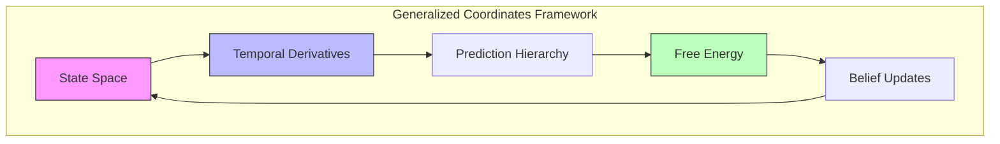
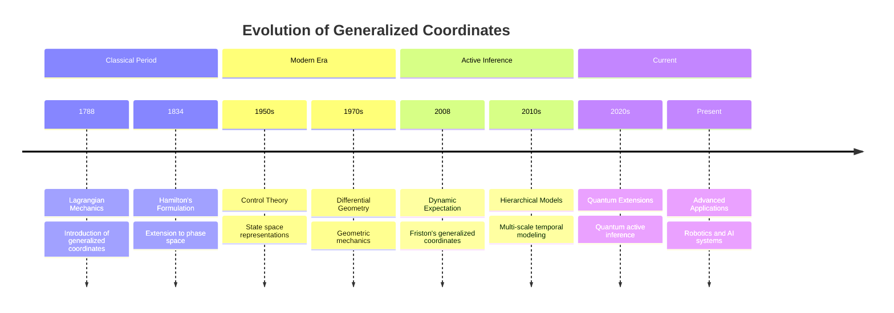
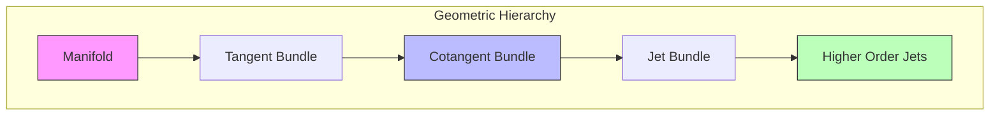
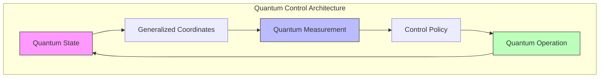

# Generalized Coordinates in Active Inference

## Overview

Generalized coordinates provide a fundamental mathematical framework for representing continuous-time dynamics in active inference by explicitly incorporating higher-order temporal derivatives into the state space. This approach enables rich temporal modeling and prediction across multiple time scales.



## Historical Development



### Intellectual Lineage

1. **Classical Mechanics**
   - Lagrangian formulation
   - Hamiltonian dynamics
   - Phase space representations

2. **Control Theory**
   - State observers
   - Kalman filtering
   - Optimal control

3. **Active Inference**
   - Free energy principle
   - Predictive coding
   - Hierarchical models

## Mathematical Foundation

### Basic Definition

A state x in generalized coordinates is represented as a vector of temporal derivatives:

```math
\begin{aligned}
\tilde{x} &= [x, x', x'', ..., x^{(n)}]^T \\
\text{where:} \\
x &: \text{state value} \\
x' &: \text{velocity} \\
x'' &: \text{acceleration} \\
x^{(n)} &: \text{nth order derivative}
\end{aligned}
```

### Shift Operator

The shift operator D maps between orders of motion:

```math
\begin{aligned}
D\tilde{x} &= [x', x'', x''', ..., 0]^T \\
D &= \begin{bmatrix}
0 & 1 & 0 & \cdots \\
0 & 0 & 2 & \cdots \\
0 & 0 & 0 & \ddots \\
\vdots & \vdots & \vdots & \ddots
\end{bmatrix}
\end{aligned}
```

### Taylor Series Connection

The relationship to Taylor series expansion:

```math
\begin{aligned}
x(t + \Delta t) &= \sum_{n=0}^{\infty} \frac{x^{(n)}(t)}{n!}(\Delta t)^n \\
&\approx \sum_{n=0}^{N} \frac{x^{(n)}(t)}{n!}(\Delta t)^n
\end{aligned}
```

## Extended Mathematical Framework

### Lie Group Structure

```math
\begin{aligned}
& \text{Group Action:} \\
& \Phi: G \times T\mathcal{M} \to T\mathcal{M} \\
& \text{Infinitesimal Generator:} \\
& X_ξ(x) = \frac{d}{dt}\big|_{t=0} \exp(tξ) \cdot x \\
& \text{Momentum Map:} \\
& J: T^*\mathcal{M} \to \mathfrak{g}^*
\end{aligned}
```

### Variational Structure

```math
\begin{aligned}
& \text{Action Functional:} \\
& S[\gamma] = \int_0^T L(\gamma(t), \dot{\gamma}(t))dt \\
& \text{Euler-Lagrange:} \\
& \frac{d}{dt}\frac{\partial L}{\partial \dot{\gamma}} - \frac{\partial L}{\partial \gamma} = 0 \\
& \text{Hamilton's Principle:} \\
& δS = 0
\end{aligned}
```

### Riemannian Structure



### Advanced Differential Forms

```math
\begin{aligned}
& \text{Jet Bundle Forms:} \\
& \omega^k = \sum_{|α|≤k} a_α dx^α \\
& \text{Contact Forms:} \\
& θ^{(k)}_i = dx^{(k)}_i - x^{(k+1)}_i dt \\
& \text{Cartan Distribution:} \\
& \mathcal{C} = \ker(θ^{(0)}) \cap ... \cap \ker(θ^{(k)})
\end{aligned}
```

## Advanced Implementation Frameworks

### Hierarchical Prediction System

```python
class HierarchicalGeneralizedPredictor:
    def __init__(self,
                 n_levels: int,
                 dims_per_level: List[int],
                 orders_per_level: List[int]):
        """Initialize hierarchical predictor.
        
        Args:
            n_levels: Number of hierarchical levels
            dims_per_level: State dimensions per level
            orders_per_level: Orders per level
        """
        self.n_levels = n_levels
        self.predictors = [
            GeneralizedPredictor(dim, order)
            for dim, order in zip(dims_per_level, orders_per_level)
        ]
        
    def predict_hierarchical(self,
                           initial_states: List[GeneralizedState],
                           horizon: int) -> List[np.ndarray]:
        """Generate hierarchical predictions.
        
        Args:
            initial_states: Initial states at each level
            horizon: Prediction horizon
            
        Returns:
            predictions: Predictions at each level
        """
        predictions = []
        
        # Top-down predictions
        for level in range(self.n_levels):
            level_preds = self.predictors[level].predict_path(
                initial_states[level], horizon)
            predictions.append(level_preds)
            
            # Update lower level priors
            if level < self.n_levels - 1:
                self._update_lower_level_prior(
                    level, level_preds, initial_states[level + 1])
                
        return predictions
    
    def _update_lower_level_prior(self,
                                level: int,
                                predictions: np.ndarray,
                                lower_state: GeneralizedState) -> None:
        """Update lower level prior based on higher level predictions."""
        # Implementation of top-down message passing
        pass
```

### Adaptive Order Selection

```python
class AdaptiveOrderSelector:
    def __init__(self,
                 max_order: int,
                 error_threshold: float = 0.01):
        """Initialize adaptive order selector.
        
        Args:
            max_order: Maximum allowed order
            error_threshold: Error threshold for order selection
        """
        self.max_order = max_order
        self.threshold = error_threshold
        
    def select_optimal_order(self,
                           time_series: np.ndarray,
                           dt: float) -> int:
        """Select optimal number of orders.
        
        Args:
            time_series: Input time series
            dt: Time step
            
        Returns:
            optimal_order: Selected order
        """
        errors = []
        derivatives = np.zeros((len(time_series), self.max_order))
        
        # Compute derivatives
        derivatives[:, 0] = time_series
        for order in range(1, self.max_order):
            derivatives[:, order] = np.gradient(
                derivatives[:, order-1], dt)
            
            # Compute reconstruction error
            reconstruction = self._reconstruct_series(
                derivatives[:, :order+1], dt)
            error = np.mean((time_series - reconstruction)**2)
            errors.append(error)
            
            # Check convergence
            if error < self.threshold:
                return order + 1
                
        return self.max_order
```

### Geometric Integration

```python
class GeometricIntegrator:
    def __init__(self,
                 hamiltonian: Callable,
                 n_orders: int):
        """Initialize geometric integrator.
        
        Args:
            hamiltonian: System Hamiltonian
            n_orders: Number of orders
        """
        self.H = hamiltonian
        self.n_orders = n_orders
        
    def symplectic_step(self,
                       state: GeneralizedState,
                       dt: float) -> GeneralizedState:
        """Perform symplectic integration step.
        
        Args:
            state: Current state
            dt: Time step
            
        Returns:
            next_state: Next state
        """
        # Split Hamiltonian
        T, V = self._split_hamiltonian(state)
        
        # Symplectic Euler
        p_half = state.momentum - dt/2 * self._grad_V(state.position)
        q_next = state.position + dt * self._grad_T(p_half)
        p_next = p_half - dt/2 * self._grad_V(q_next)
        
        return GeneralizedState(q_next, p_next)
```

## Advanced Neural Architectures

### Deep Generalized Networks

```python
class DeepGeneralizedNetwork(nn.Module):
    def __init__(self,
                 input_dim: int,
                 hidden_dims: List[int],
                 n_orders: int):
        """Initialize deep generalized network.
        
        Args:
            input_dim: Input dimension
            hidden_dims: Hidden layer dimensions
            n_orders: Number of orders
        """
        super().__init__()
        
        # Encoder network
        self.encoder = nn.ModuleList([
            nn.Linear(dim_in, dim_out)
            for dim_in, dim_out in zip([input_dim] + hidden_dims[:-1],
                                     hidden_dims)
        ])
        
        # Order-specific networks
        self.order_nets = nn.ModuleList([
            nn.Linear(hidden_dims[-1], input_dim)
            for _ in range(n_orders)
        ])
        
    def forward(self,
               x: torch.Tensor) -> List[torch.Tensor]:
        """Forward pass.
        
        Args:
            x: Input tensor
            
        Returns:
            predictions: Predictions for each order
        """
        # Encode
        h = x
        for layer in self.encoder:
            h = F.relu(layer(h))
            
        # Generate predictions for each order
        predictions = [net(h) for net in self.order_nets]
        
        return predictions
```

### Attention-Based Temporal Integration

```python
class TemporalAttention(nn.Module):
    def __init__(self,
                 n_orders: int,
                 d_model: int):
        """Initialize temporal attention.
        
        Args:
            n_orders: Number of orders
            d_model: Model dimension
        """
        super().__init__()
        
        self.attention = nn.MultiheadAttention(
            d_model, num_heads=8)
        self.order_embeddings = nn.Parameter(
            torch.randn(n_orders, d_model))
        
    def forward(self,
               x: torch.Tensor) -> torch.Tensor:
        """Apply temporal attention.
        
        Args:
            x: Input tensor [batch, time, features]
            
        Returns:
            attended: Attended features
        """
        # Add order embeddings
        x = x + self.order_embeddings[None, :, None]
        
        # Self-attention
        attended, _ = self.attention(x, x, x)
        
        return attended
```

## Advanced Applications

### 1. Quantum Control Systems



### 2. Neuromorphic Implementation

```python
class NeuromorphicGeneralizedCoordinates:
    def __init__(self,
                 n_neurons: int,
                 n_orders: int,
                 tau: float = 0.1):
        """Initialize neuromorphic implementation.
        
        Args:
            n_neurons: Number of neurons per dimension
            n_orders: Number of orders
            tau: Membrane time constant
        """
        self.n_neurons = n_neurons
        self.n_orders = n_orders
        self.tau = tau
        
        # Initialize membrane potentials
        self.v = np.zeros((n_neurons, n_orders))
        
    def step(self,
            input_current: np.ndarray,
            dt: float) -> np.ndarray:
        """Simulate one timestep.
        
        Args:
            input_current: Input currents
            dt: Time step
            
        Returns:
            spikes: Generated spikes
        """
        # Update membrane potentials
        self.v += dt * (
            -self.v/self.tau +  # Leak
            input_current[:, None] +  # Input
            self._lateral_connections()  # Lateral
        )
        
        # Generate spikes
        spikes = self.v > 1.0
        self.v[spikes] = 0.0  # Reset
        
        return spikes
```

### 3. Continual Learning

```python
class ContinualGeneralizedLearner:
    def __init__(self,
                 state_dim: int,
                 n_orders: int,
                 memory_size: int = 1000):
        """Initialize continual learner.
        
        Args:
            state_dim: State dimension
            n_orders: Number of orders
            memory_size: Experience memory size
        """
        self.memory = ExperienceMemory(memory_size)
        self.predictor = GeneralizedPredictor(state_dim, n_orders)
        
    def update(self,
              observation: np.ndarray,
              action: np.ndarray) -> None:
        """Update learner with new experience.
        
        Args:
            observation: Current observation
            action: Current action
        """
        # Store experience
        self.memory.add(observation, action)
        
        # Update model
        if len(self.memory) > self.batch_size:
            batch = self.memory.sample(self.batch_size)
            self._update_model(batch)
```

## Mathematical Extensions

### Category Theory Perspective

```math
\begin{aligned}
& \text{Functor:} \\
& F: \mathbf{Man} \to \mathbf{Vect} \\
& \text{Natural Transformation:} \\
& η: F \Rightarrow G \\
& \text{Adjunction:} \\
& F \dashv G
\end{aligned}
```

### Geometric Mechanics

```math
\begin{aligned}
& \text{Euler-Poincaré Equations:} \\
& \frac{d}{dt}\frac{δl}{δξ} = ad^*_ξ\frac{δl}{δξ} \\
& \text{Reduced Equations:} \\
& \dot{μ} = ad^*_{ξ}μ \\
& \text{Reconstruction:} \\
& \dot{g} = g ξ
\end{aligned}
```

### Information Geometry Extensions

```math
\begin{aligned}
& \text{α-Connection:} \\
& \Gamma^{(α)}_{ijk} = \mathbb{E}\left[\frac{∂^2l}{∂θ^i∂θ^j}\frac{∂l}{∂θ^k}\right] + \frac{1-α}{2}\mathbb{E}\left[\frac{∂l}{∂θ^i}\frac{∂l}{∂θ^j}\frac{∂l}{∂θ^k}\right] \\
& \text{Dual Structure:} \\
& g_{ij} = -\mathbb{E}\left[\frac{∂^2l}{∂θ^i∂θ^j}\right] = \mathbb{E}\left[\frac{∂l}{∂θ^i}\frac{∂l}{∂θ^j}\right]
\end{aligned}
```

## Best Practices

### 1. Model Design
1. Choose appropriate number of orders
2. Balance precision and computational cost
3. Consider temporal scale separation
4. Implement regularization
5. Monitor numerical stability

### 2. Implementation
1. Use stable numerical methods
2. Implement efficient matrix operations
3. Consider sparse representations
4. Parallelize when possible
5. Cache intermediate results

### 3. Validation
1. Check prediction accuracy
2. Monitor derivative stability
3. Validate across time scales
4. Test edge cases
5. Compare with ground truth

## Common Issues

### Technical Challenges
1. Numerical instability in higher orders
2. Computational complexity scaling
3. Memory requirements
4. Noise amplification
5. Temporal aliasing

### Solutions
1. Regularization techniques
2. Adaptive order selection
3. Sparse implementations
4. Noise filtering
5. Multi-scale approaches

## Future Directions

### Theoretical Developments
1. Quantum extensions
2. Field theory formulations
3. Information geometry connections

### Practical Advances
1. Hardware acceleration
2. Real-time implementations
3. Large-scale applications

### Open Problems
1. Optimal order selection
2. Stability guarantees
3. Scaling properties

## Related Documentation
- [[active_inference]]
- [[differential_geometry]]
- [[information_geometry]]
- [[numerical_methods]]
- [[dynamical_systems]]
- [[stochastic_processes]] 