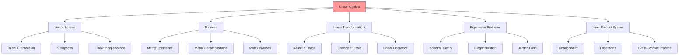

# Linear Algebra

## Overview

Linear algebra provides the mathematical foundation for representing and manipulating linear transformations, vector spaces, and systems of linear equations. In cognitive modeling and active inference, linear algebra enables efficient representation of state spaces, policy matrices, belief propagation, and dynamical system analysis.



## Vector Spaces

### Definition and Properties

A vector space V over a field F is a set equipped with two operations:
- Vector addition: V × V → V
- Scalar multiplication: F × V → V

satisfying the standard axioms of associativity, commutativity, distributivity, and existence of identity elements.

### Key Concepts

#### Linear Independence
A set of vectors {v₁, v₂, ..., vₙ} is linearly independent if:

∑ᵢ αᵢvᵢ = 0 ⇒ αᵢ = 0 ∀ i

#### Basis and Dimension
A basis is a linearly independent spanning set. The dimension of a vector space is the cardinality of any basis.

#### Subspaces
A subspace W ⊆ V is a subset that is itself a vector space under the inherited operations.

## Matrices and Linear Transformations

### Matrix Operations

#### Matrix Multiplication
For matrices A ∈ ℝᵐˣⁿ, B ∈ ℝⁿˣᵖ:

(A B)ᵢⱼ = ∑ₖ Aᵢₖ Bₖⱼ

#### Matrix Inverse
A square matrix A is invertible if there exists B such that A B = B A = I.

#### Determinant
det(A) measures the "volume scaling factor" of the linear transformation represented by A.

### Linear Transformations

A linear transformation T: V → W satisfies:
- T(u + v) = T(u) + T(v)
- T(αv) = α T(v)

#### Kernel and Image
- Kernel (null space): ker(T) = {v ∈ V | T(v) = 0}
- Image (range): im(T) = {T(v) | v ∈ V}

## Eigenvalue Problems

### Eigenvalues and Eigenvectors

For a square matrix A, λ is an eigenvalue with eigenvector v if:

A v = λ v

### Characteristic Equation
det(A - λ I) = 0

### Spectral Theorem
For symmetric matrices, there exists an orthogonal basis of eigenvectors.

## Inner Product Spaces

### Inner Products
An inner product ⟨·, ·⟩: V × V → ℝ satisfies:
- ⟨u, v⟩ = ⟨v, u⟩
- ⟨αu, v⟩ = α ⟨u, v⟩
- ⟨u + v, w⟩ = ⟨u, w⟩ + ⟨v, w⟩
- ⟨u, u⟩ ≥ 0, with equality iff u = 0

### Orthogonality
Vectors u, v are orthogonal if ⟨u, v⟩ = 0.

### Projections
The projection of v onto u is:

projᵤ(v) = (⟨v, u⟩ / ⟨u, u⟩) u

## Matrix Decompositions

### LU Decomposition
A = L U where L is lower triangular, U is upper triangular.

### QR Decomposition
A = Q R where Q is orthogonal, R is upper triangular.

### Singular Value Decomposition (SVD)
A = U Σ Vᵀ where U, V are orthogonal, Σ is diagonal with singular values.

### Eigenvalue Decomposition
For diagonalizable A: A = P D P⁻¹ where D is diagonal.

## Applications in Active Inference

### State Space Representation
Linear systems in active inference often use state space form:

dx/dt = A x + B u
y = C x + D u

### Belief Propagation
Message passing in factor graphs involves linear algebra operations on probability distributions.

### Policy Optimization
Linear algebra enables efficient computation of policy gradients and Hessian approximations.

### Dynamical Systems Analysis
Stability analysis and controllability rely on eigenvalue computations.

## Implementation

```python
import numpy as np
from typing import Union, Tuple, List, Optional

class LinearAlgebraTools:
    """Linear algebra utilities for cognitive modeling and active inference.

    This class provides computational tools for linear algebra operations
    commonly used in mathematical modeling of cognitive systems.
    """

    @staticmethod
    def gram_schmidt(vectors: np.ndarray,
                    normalize: bool = True) -> Tuple[np.ndarray, np.ndarray]:
        """Perform Gram-Schmidt orthogonalization on a set of vectors.

        Args:
            vectors: Input vectors as columns of a matrix (shape: m x n)
            normalize: Whether to normalize the orthogonal vectors

        Returns:
            Tuple of (orthogonal_matrix, upper_triangular_matrix)
                - Q: orthogonal matrix (m x n)
                - R: upper triangular matrix (n x n)

        Raises:
            ValueError: If input is not a 2D array

        Example:
            >>> vectors = np.array([[1, 1], [0, 1]])
            >>> Q, R = LinearAlgebraTools.gram_schmidt(vectors)
        """
        if vectors.ndim != 2:
            raise ValueError("Input must be a 2D array")

        m, n = vectors.shape
        Q = np.zeros((m, n), dtype=vectors.dtype)
        R = np.zeros((n, n), dtype=vectors.dtype)

        for j in range(n):
            v = vectors[:, j].copy()
            for i in range(j):
                R[i, j] = np.dot(Q[:, i], vectors[:, j])
                v = v - R[i, j] * Q[:, i]

            R[j, j] = np.linalg.norm(v)
            if R[j, j] > 1e-10:
                Q[:, j] = v / R[j, j] if normalize else v

        return Q, R

    @staticmethod
    def compute_eigenvalues(matrix: np.ndarray,
                           hermitian: bool = False) -> Tuple[np.ndarray, np.ndarray]:
        """Compute eigenvalues and eigenvectors of a square matrix.

        Args:
            matrix: Square matrix (n x n)
            hermitian: Whether the matrix is Hermitian (affects numerical stability)

        Returns:
            Tuple of (eigenvalues, eigenvectors)
                - eigenvalues: 1D array of length n
                - eigenvectors: 2D array (n x n), columns are eigenvectors

        Raises:
            ValueError: If matrix is not square

        Example:
            >>> A = np.array([[2, 1], [1, 2]])
            >>> eigenvals, eigenvecs = LinearAlgebraTools.compute_eigenvalues(A)
        """
        if matrix.shape[0] != matrix.shape[1]:
            raise ValueError("Matrix must be square")

        if hermitian:
            eigenvalues, eigenvectors = np.linalg.eigh(matrix)
        else:
            eigenvalues, eigenvectors = np.linalg.eig(matrix)

        return eigenvalues, eigenvectors

    @staticmethod
    def svd_decomposition(matrix: np.ndarray,
                         full_matrices: bool = True) -> Tuple[np.ndarray, np.ndarray, np.ndarray]:
        """Compute singular value decomposition of a matrix.

        Args:
            matrix: Input matrix (m x n)
            full_matrices: Whether to return full U and V matrices

        Returns:
            Tuple of (U, Sigma, V_transpose)
                - U: left singular vectors (m x k)
                - Sigma: singular values as diagonal matrix (k x k)
                - Vh: conjugate transpose of right singular vectors (k x n)

        Example:
            >>> A = np.random.randn(5, 3)
            >>> U, Sigma, Vh = LinearAlgebraTools.svd_decomposition(A)
        """
        U, s, Vh = np.linalg.svd(matrix, full_matrices=full_matrices)
        return U, np.diag(s), Vh

    @staticmethod
    def project_vector(vector: np.ndarray,
                      onto_vector: np.ndarray,
                      normalize: bool = True) -> np.ndarray:
        """Project a vector onto another vector using the orthogonal projection formula.

        Args:
            vector: Vector to project (shape: n,)
            onto_vector: Vector to project onto (shape: n,)
            normalize: Whether to use normalized projection

        Returns:
            Projection of vector onto onto_vector

        Raises:
            ValueError: If vectors have different shapes

        Example:
            >>> v = np.array([1, 2, 3])
            >>> u = np.array([1, 0, 0])
            >>> proj = LinearAlgebraTools.project_vector(v, u)
        """
        if vector.shape != onto_vector.shape:
            raise ValueError("Vectors must have the same shape")

        if normalize:
            onto_norm = np.linalg.norm(onto_vector)
            if onto_norm > 1e-10:
                onto_vector = onto_vector / onto_norm

        return (np.dot(vector, onto_vector) / np.dot(onto_vector, onto_vector)) * onto_vector
```

## Key Theorems

### Rank-Nullity Theorem
For a linear transformation T: V → W, dim(V) = dim(ker(T)) + dim(im(T))

### Cayley-Hamilton Theorem
Every square matrix satisfies its own characteristic equation.

### Spectral Theorem
A symmetric matrix has real eigenvalues and orthogonal eigenvectors.

## References

- Strang, G. (2009). Introduction to Linear Algebra
- Horn, R. A., & Johnson, C. R. (2012). Matrix Analysis
- Meyer, C. D. (2000). Matrix Analysis and Applied Linear Algebra

---

> **Foundational Mathematics**: Linear algebra provides the computational foundation for representing transformations, analyzing stability, and implementing efficient algorithms in cognitive systems.

---

> **Geometric Intuition**: Vector spaces and linear transformations offer geometric interpretations essential for understanding high-dimensional cognitive processes.
