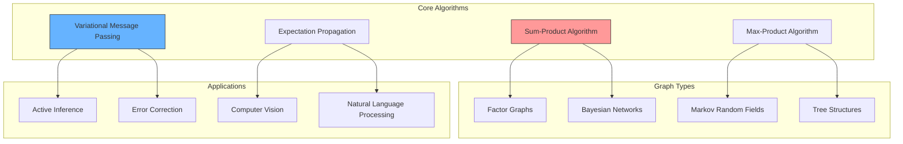
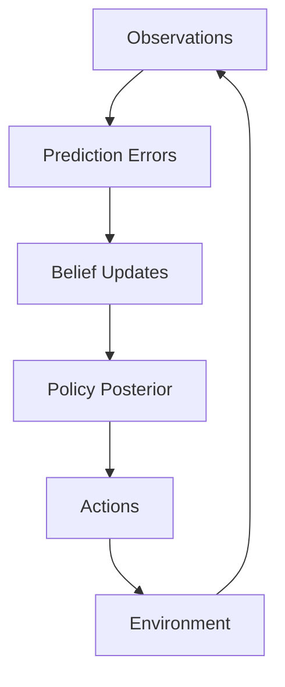

---

title: Message Passing Algorithms

type: mathematical_concept

status: active

created: 2024-03-20

modified: 2025-01-26

tags:

  - mathematics

  - algorithms

  - inference

  - graphical_models

  - belief_propagation

msc: ["68T05", "62H12"]

semantic_relations:

  - type: implements

    links:

      - [[factor_graphs]]

      - [[belief_propagation]]

      - [[variational_inference]]

  - type: foundation_for

    links:

      - [[active_inference_theory]]

      - [[free_energy_principle]]

      - [[probabilistic_inference]]

  - type: uses

    links:

      - [[probability_theory]]

      - [[information_theory]]

      - [[graph_theory]]

---

# Message Passing Algorithms

## Overview

Message passing algorithms constitute a fundamental class of distributed inference methods that enable efficient computation of marginal distributions and maximum a posteriori estimates on [[probabilistic_graphical_models]]. These algorithms form the computational backbone of [[active_inference_theory]], [[belief_updating]], and [[variational_inference]] by decomposing complex probabilistic computations into local message exchanges.



## Message Passing in Active Inference



Links: [[belief_updating]], [[policy_selection]], [[precision_weighting]].

## Mathematical Framework

### Probabilistic Factorization

For a joint distribution over variables $\mathbf{x} = (x_1, \ldots, x_n)$:

```math

p(\mathbf{x}) = \frac{1}{Z} \prod_{a} \psi_a(\mathbf{x}_a)

```

where:

- $\psi_a(\mathbf{x}_a)$ are factor functions

- $\mathbf{x}_a$ are variables connected to factor $a$

- $Z = \sum_{\mathbf{x}} \prod_{a} \psi_a(\mathbf{x}_a)$ is the partition function

Related concepts: [[factor_graphs]], [[probabilistic_graphical_models]], [[partition_function]]

## Core Principles

### 1. Distributed Computation

Message passing enables **distributed probabilistic inference** through local computations:

- **Locality**: Each node computes messages using only local information

- **Modularity**: Graph structure directly determines computational dependencies

- **Scalability**: Linear complexity in graph size for tree-structured models

- **Parallelization**: Independent message computations can be parallelized

### 2. Message Definitions

**Variable-to-Factor Messages:**

```math

\mu_{x \to f}(x) = \prod_{g \in N(x) \setminus \{f\}} \mu_{g \to x}(x)

```

**Factor-to-Variable Messages:**

```math

\mu_{f \to x}(x) = \sum_{\mathbf{x}_f \setminus \{x\}} \psi_f(\mathbf{x}_f) \prod_{y \in N(f) \setminus \{x\}} \mu_{y \to f}(y)

```

where:

- $N(x)$ denotes neighbors of variable $x$

- $N(f)$ denotes neighbors of factor $f$

- $\mathbf{x}_f$ are variables connected to factor $f$

### 3. Marginal Computation

**Variable Marginals (Beliefs):**

```math

p(x) \propto \prod_{f \in N(x)} \mu_{f \to x}(x)

```

**Factor Marginals:**

```math

p(\mathbf{x}_f) \propto \psi_f(\mathbf{x}_f) \prod_{x \in N(f)} \mu_{x \to f}(x)

```

### 4. Convergence Properties

**Tree Graphs**: Exact marginals after finite number of iterations

**Loopy Graphs**: Fixed point approximation (when convergent)

Related: [[belief_propagation]], [[factor_graphs]], [[marginal_computation]]

## Algorithms

### 1. [[belief_propagation|Belief Propagation]]

- Sum-product algorithm

- Max-product algorithm

- Tree-reweighted message passing

### 2. [[expectation_propagation|Expectation Propagation]]

- Moment matching

- Natural parameters

- Minimizing KL divergence

### 3. [[variational_message_passing|Variational Message Passing]]

- Mean field approximation

- Structured approximations

- Free energy minimization

## Implementation

### 1. Message Scheduling

```julia

function schedule_messages(graph)

    schedule = []

    for node in graph.nodes

        for neighbor in node.neighbors

            schedule.push((node, neighbor))

        end

    end

    return schedule

end

```

### 2. Message Updates

```julia

function update_message(source, target, message_type)

    if message_type == :var_to_factor

        return compute_var_to_factor(source, target)

    else

        return compute_factor_to_var(source, target)

    end

end

```

### 3. Convergence Checking

```julia

function check_convergence(messages, tolerance)

    return maximum(abs.(messages_new - messages_old)) < tolerance

end

```

## Applications

### 1. [[probabilistic_inference|Probabilistic Inference]]

- Marginal computation

- MAP estimation

- Posterior sampling

### 2. [[coding_theory|Coding Theory]]

- LDPC decoding

- Turbo codes

- Polar codes

### 3. [[optimization|Optimization]]

- Linear programming

- Constraint satisfaction

- Network flow

## Advanced Topics

### 1. [[convergence_analysis|Convergence Analysis]]

- Fixed point conditions

- Convergence rates

- Stability analysis

### 2. [[message_approximation|Message Approximation]]

- Particle methods

- Gaussian approximations

- Discrete approximations

### 3. [[parallel_message_passing|Parallel Message Passing]]

- Asynchronous updates

- Distributed computing

- GPU acceleration

## Best Practices

### 1. Numerical Stability

- Log-domain computations

- Message normalization

- Numerical underflow prevention

### 2. Performance Optimization

- Message caching

- Sparse operations

- Efficient data structures

### 3. Implementation Guidelines

- Message validation

- Error handling

- Debugging strategies

## Extensions

### 1. [[structured_prediction|Structured Prediction]]

- Sequence labeling

- Image segmentation

- Natural language processing

### 2. [[continuous_state_spaces|Continuous State Spaces]]

- Kalman filtering

- Particle filtering

- Gaussian processes

### 3. [[adaptive_message_passing|Adaptive Message Passing]]

- Dynamic schedules

- Adaptive precision

- Active message selection

## References

1. Pearl, J. (1988). Probabilistic Reasoning in Intelligent Systems

1. Minka, T. P. (2001). Expectation Propagation for Approximate Bayesian Inference

1. Winn, J., & Bishop, C. M. (2005). Variational Message Passing

