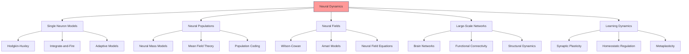

# Neural Dynamics

## Overview

Neural dynamics studies the temporal evolution of neural activity and collective behavior in nervous systems. In cognitive modeling, neural dynamics provides mathematical frameworks for understanding brain function, from single neurons to large-scale brain networks, forming the foundation for biologically plausible active inference implementations.



## Single Neuron Dynamics

### Hodgkin-Huxley Model

The classic biophysical model of action potential generation:

dV/dt = (I - g_Na m³ h (V - V_Na) - g_K n⁴ (V - V_K) - g_L (V - V_L)) / C

With gating variables following:
dm/dt = α_m(V)(1-m) - β_m(V)m

### Integrate-and-Fire Models

Simplified models focusing on threshold dynamics:

τ dv/dt = -v + I + noise
if v > v_thresh: spike, v = v_reset

### Adaptive Neuron Models

Incorporating spike-frequency adaptation:

τ dv/dt = -v + I - w
τ_w dw/dt = a v - w

## Population Dynamics

### Neural Mass Models

Mean-field descriptions of cortical populations:

d⟨V⟩/dt = ⟨I_syn⟩ / τ
d⟨I_syn⟩/dt = ⟨S(V)⟩ - 2⟨I_syn⟩/τ - ⟨I_syn⟩/τ²

### Wilson-Cowan Equations

Excitatory-inhibitory population dynamics:

τ_e dE/dt = -E + (1 - E) S_e(c_ee E - c_ei I + P_e)
τ_i dI/dt = -I + (1 - I) S_i(c_ie E - c_ii I + P_i)

### Mean Field Theory

Statistical mechanics approach to neural populations:

ρ(v,t) satisfies Fokker-Planck equation with drift and diffusion terms.

## Neural Field Dynamics

### Continuous Neural Fields

Spatiotemporal activity patterns:

∂u(x,t)/∂t = -u(x,t) + ∫ w(x,y) f(u(y,t)) dy + I(x,t)

### Amari Neural Field

Winner-take-all dynamics through lateral inhibition:

τ ∂u/∂t = -u + ∫ w(|x-y|) f(u(y)) dy + I(x)

### Traveling Waves

Pattern formation and propagation in neural tissues.

## Large-Scale Brain Dynamics

### Functional Connectivity

Time-varying correlations between brain regions:

C_ij(t) = ⟨[x_i(t) - μ_i][x_j(t) - μ_j]⟩

### Structural Dynamics

Network-level organization and information flow:

dX/dt = F(X) + coupling terms

### Default Mode Network

Spontaneous activity patterns during rest.

## Synaptic Plasticity Dynamics

### Spike-Timing Dependent Plasticity (STDP)

Hebbian learning with temporal constraints:

Δw ∝ exp(-|Δt|/τ) for potentiation/depression

### Homeostatic Plasticity

Activity-dependent scaling to maintain stability:

Target firing rates through multiplicative scaling.

### Metaplasticity

Plasticity of plasticity mechanisms.

## Applications in Active Inference

### Predictive Coding

Hierarchical error correction dynamics:

ε = prediction - observation
Update predictions to minimize ε

### Free Energy Minimization

Neural implementation of variational free energy minimization.

### Attention and Precision

Dynamic modulation of neural gain and connectivity.

## Implementation

```python
import numpy as np
from typing import Union, Tuple, Callable
from scipy.integrate import odeint

class NeuralDynamics:
    """Mathematical models of neural dynamics for cognitive modeling."""

    @staticmethod
    def wilson_cowan_equations(state: np.ndarray,
                              t: float,
                              params: dict) -> np.ndarray:
        """Wilson-Cowan excitatory-inhibitory population model.

        Args:
            state: [E, I] population activities
            t: time parameter
            params: model parameters

        Returns:
            Derivatives [dE/dt, dI/dt]
        """
        E, I = state

        # Unpack parameters
        tau_e = params.get('tau_e', 10.0)
        tau_i = params.get('tau_i', 10.0)
        c_ee = params.get('c_ee', 16.0)
        c_ei = params.get('c_ei', 12.0)
        c_ie = params.get('c_ie', 15.0)
        c_ii = params.get('c_ii', 3.0)
        P_e = params.get('P_e', 1.0)
        P_i = params.get('P_i', 1.0)
        a_e = params.get('a_e', 1.3)
        a_i = params.get('a_i', 2.0)
        theta_e = params.get('theta_e', 4.0)
        theta_i = params.get('theta_i', 3.7)

        # Sigmoid activation functions
        S_e = lambda x: 1 / (1 + np.exp(-a_e * (x - theta_e)))
        S_i = lambda x: 1 / (1 + np.exp(-a_i * (x - theta_i)))

        # Wilson-Cowan equations
        dE_dt = (-E + (1 - E) * S_e(c_ee * E - c_ei * I + P_e)) / tau_e
        dI_dt = (-I + (1 - I) * S_i(c_ie * E - c_ii * I + P_i)) / tau_i

        return np.array([dE_dt, dI_dt])

    @staticmethod
    def simulate_wilson_cowan(params: dict,
                             t_span: np.ndarray,
                             initial_state: np.ndarray = None) -> np.ndarray:
        """Simulate Wilson-Cowan dynamics.

        Args:
            params: model parameters
            t_span: time points
            initial_state: initial [E, I]

        Returns:
            Time series of [E, I] activities
        """
        if initial_state is None:
            initial_state = np.array([0.1, 0.05])

        solution = odeint(NeuralDynamics.wilson_cowan_equations,
                         initial_state, t_span, args=(params,))

        return solution

    @staticmethod
    def neural_field_equation(u: np.ndarray,
                             t: float,
                             params: dict) -> np.ndarray:
        """Neural field equation for continuous activity patterns.

        Args:
            u: activity field
            t: time
            params: parameters including kernel, nonlinearity, input

        Returns:
            Time derivative
        """
        # Extract parameters
        tau = params.get('tau', 1.0)
        w_kernel = params.get('w_kernel', None)
        nonlinearity = params.get('nonlinearity', lambda x: np.tanh(x))
        input_field = params.get('input_field', np.zeros_like(u))

        # Convolution with kernel
        if w_kernel is not None:
            convolution = np.convolve(u, w_kernel, mode='same')
        else:
            convolution = u

        # Neural field equation
        du_dt = (-u + nonlinearity(convolution) + input_field) / tau

        return du_dt

    @staticmethod
    def stdp_update(delta_t: float,
                   params: dict = None) -> float:
        """Spike-timing dependent plasticity update.

        Args:
            delta_t: t_post - t_pre
            params: STDP parameters

        Returns:
            Synaptic weight change
        """
        if params is None:
            params = {'A_plus': 0.01, 'A_minus': 0.0105,
                     'tau_plus': 16.8, 'tau_minus': 33.7}

        A_plus = params['A_plus']
        A_minus = params['A_minus']
        tau_plus = params['tau_plus']
        tau_minus = params['tau_minus']

        if delta_t > 0:  # Pre before post
            return -A_minus * np.exp(-delta_t / tau_minus)
        else:  # Post before pre
            return A_plus * np.exp(delta_t / tau_plus)
```

## Key Phenomena

### Synchronization
Neural populations can synchronize through coupling.

### Oscillations
Rhythmic activity at various frequencies (theta, alpha, gamma).

### Avalanches
Scale-invariant activity cascades in neural systems.

### Criticality
Systems operating at the edge of phase transitions.

## References

- Deco, G., et al. (2008). The dynamical foundations of motion and cognition
- Bressler, S. L., & Menon, V. (2010). Large-scale brain networks in cognition
- Breakspear, M. (2017). Dynamic models of large-scale brain activity

---

> **Biological Plausibility**: Neural dynamics provides mathematically grounded models of brain function that bridge neuroscience and cognitive modeling.

---

> **Emergent Behavior**: Complex cognitive phenomena emerge from the interaction of simple neural elements through dynamical principles.
