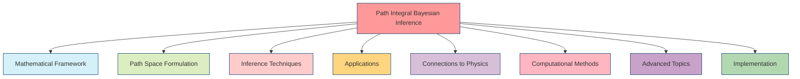
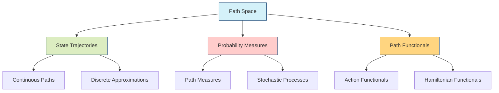
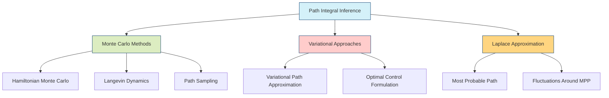
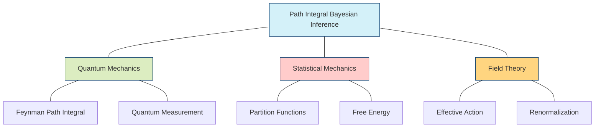
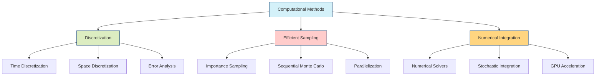
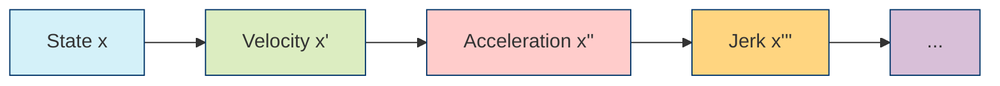
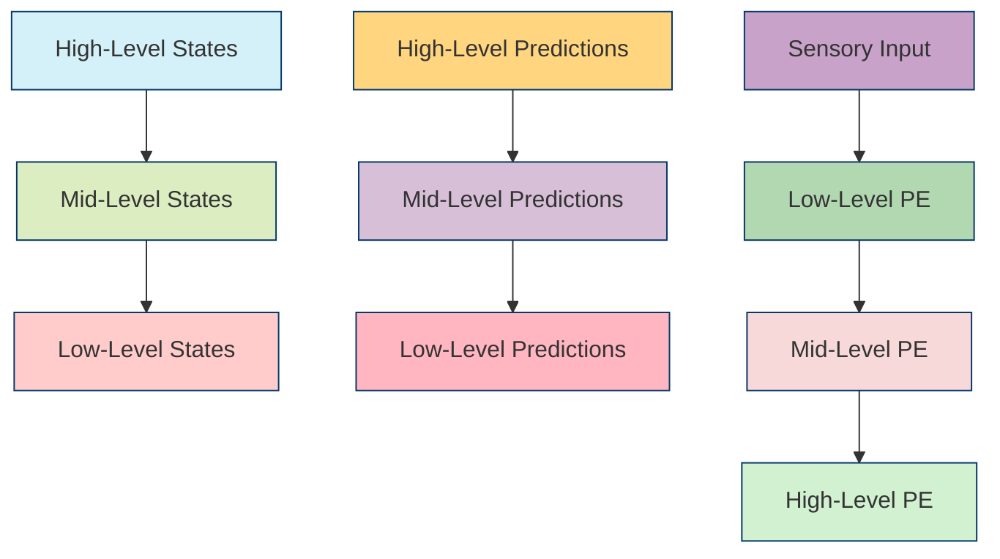

---

title: Path Integral Bayesian Inference

type: mathematical_concept

status: stable

created: 2024-03-15

tags:

  - mathematics

  - probability

  - path-integrals

  - bayesian-inference

  - statistical-physics

semantic_relations:

  - type: foundation

    links:

      - [[path_integral]]

      - [[probability_theory]]

      - [[bayesian_inference]]

      - [[bayes_theorem]]

  - type: implements

    links:

      - [[bayesian_networks]]

      - [[variational_inference]]

      - [[path_integral_free_energy]]

  - type: related

    links:

      - [[bayesian_graph_theory]]

      - [[stochastic_processes]]

      - [[continuous_discrete_inference]]

      - [[bayesian_renormalization]]

---

# Path Integral Bayesian Inference

## Overview

Path Integral Bayesian Inference combines [[path_integral|path integration]] techniques from statistical physics with [[bayesian_inference|Bayesian inference]] methods to provide a powerful framework for solving complex inference problems. This approach allows for traversing probability distributions over continuous trajectories in state space, enabling more expressive and powerful inference in both deterministic and stochastic systems.



## Mathematical Framework

### Path Integral Formulation

The path integral formulation of Bayesian inference represents the posterior probability of a trajectory $x(t)$ given observations $y$ as:

```math

P(x(t)|y) = \frac{1}{Z} e^{-S[x(t)]}

```

where:

- $S[x(t)]$ is the action functional, incorporating both prior dynamics and observation likelihood

- $Z$ is the normalization constant (partition function)

### Extended Action Functionals

The action functional can be decomposed into multiple terms:

```math

S[x(t)] = S_{\text{prior}}[x(t)] + S_{\text{likelihood}}[x(t),y] + S_{\text{constraints}}[x(t)]

```

For dynamical systems with general noise structures:

```math

S_{\text{prior}}[x(t)] = \int_{t_0}^{t_1} \left[\frac{1}{2}(\dot{x}(t) - f(x(t),t))^T \Sigma^{-1} (\dot{x}(t) - f(x(t),t)) + \frac{1}{2}\log|\Sigma|\right] dt

```

where:

- $f(x(t),t)$ represents the deterministic dynamics

- $\Sigma$ is the noise covariance matrix

- Additional terms can represent constraints or regularization

### Information Geometry

The path integral formulation naturally connects to information geometry through:

```math

ds^2 = \int_{t_0}^{t_1} g_{\mu\nu}(x(t)) dx^\mu(t) dx^\nu(t)

```

where $g_{\mu\nu}$ is the Fisher-Rao metric tensor.

## Path Space Formulation



### 1. State-Space Trajectories

Path integrals operate on trajectories through state space, rather than just single points:

```math

x(t): [t_0, t_1] \rightarrow \mathcal{X}

```

where $\mathcal{X}$ is the state space.

### 2. Measure on Path Space

The path measure defines a probability distribution over all possible trajectories:

```math

\mathcal{D}[x(t)] = \prod_{t \in [t_0, t_1]} dx(t)

```

### 3. Path Probability

The probability of a specific path is:

```math

P[x(t)] = \frac{1}{Z} e^{-S[x(t)]}

```

where $Z = \int \mathcal{D}[x(t)] e^{-S[x(t)]}$ is the path integral normalization.

## Inference Techniques



### 1. Monte Carlo Path Sampling

```python

def path_integral_mcmc(prior_dynamics, likelihood_model, observations, 

                      num_samples, step_size):

    """

    Perform Monte Carlo sampling over paths using Metropolis-Hastings

    """

    current_path = initialize_path()

    accepted_paths = []

    for i in range(num_samples):

        # Propose a new path with a small perturbation

        proposed_path = perturb_path(current_path, step_size)

        # Calculate acceptance probability

        current_action = calculate_action(current_path, prior_dynamics, 

                                         likelihood_model, observations)

        proposed_action = calculate_action(proposed_path, prior_dynamics,

                                          likelihood_model, observations)

        acceptance_prob = min(1, exp(-(proposed_action - current_action)))

        # Accept or reject the proposed path

        if random() < acceptance_prob:

            current_path = proposed_path

        accepted_paths.append(current_path)

    return accepted_paths

```

### 2. Variational Path Approximation

The Variational Path Approximation minimizes the KL divergence between the true posterior and a simpler approximating path distribution:

```math

\text{KL}(q[x(t)] || p[x(t)|y]) = \int \mathcal{D}[x(t)] q[x(t)] \log \frac{q[x(t)]}{p[x(t)|y]}

```

### 3. Most Probable Path

The Most Probable Path (MPP) is the trajectory that maximizes the posterior probability:

```math

x_{MPP}(t) = \arg\max_{x(t)} P(x(t)|y) = \arg\min_{x(t)} S[x(t)]

```

This can be found through variational calculus, leading to the Euler-Lagrange equations.

## Applications

```mermaid

mindmap

  root((Path Integral<br>Bayesian<br>Inference))

    Stochastic Dynamical Systems

      State Estimation

      Parameter Inference

      System Identification

    Continuous-Time Bayesian Networks

      Continuous Time Processes

      Coupled Oscillator Networks

      Gene Regulatory Networks

    Bayesian Filtering

      Nonlinear Filtering

      Particle Filtering

      Continuous-Discrete Filtering

    Control Theory

      Optimal Control

      Stochastic Control

      Path Planning

    Statistical Physics

      Sampling Complex Systems

      Phase Transitions

      Critical Phenomena

```

### 1. Continuous-Time Dynamical Systems

Path integral methods are particularly suited for inferring hidden states and parameters in continuous-time stochastic dynamical systems:

```math

dx(t) = f(x(t), \theta, t)dt + g(x(t), \theta, t)dW(t)

```

where $W(t)$ is a Wiener process, and observations are typically made at discrete times.

### 2. Continuous-Time Bayesian Networks

Path integrals enable Bayesian inference in networks with continuous-time dynamics, where variables evolve according to coupled differential equations.

### 3. Bridging Discrete and Continuous Models

Path integrals provide a natural framework for connecting discrete-time observations with continuous-time generative models.

## Connections to Physics



### 1. Statistical Physics Analogy

The path integral formulation establishes direct connections to statistical physics:

- The action functional $S[x(t)]$ corresponds to the energy of a path

- The normalization $Z$ corresponds to the partition function

- The posterior sampling corresponds to Boltzmann sampling

### 2. Renormalization Connection

The [[bayesian_renormalization|renormalization group]] techniques from physics can be applied to Bayesian inference, allowing for effective coarse-graining of complex models and handling of multi-scale phenomena.

### 3. Field Theory Methods

Techniques from quantum field theory, such as perturbation theory and diagrammatic expansions, can be adapted for complex Bayesian inference problems.

## Computational Methods



### 1. Discretization Strategies

```julia

function discretize_path(time_points, path_function)

    """

    Convert a continuous path to a discrete representation

    """

    discretized_path = [path_function(t) for t in time_points]

    return discretized_path

end

function path_action_discrete(path, time_points, prior_dynamics, noise_variance)

    """

    Calculate the discretized action of a path

    """

    action = 0.0

    dt = time_points[2] - time_points[1]

    for i in 1:(length(path)-1)

        x_curr = path[i]

        x_next = path[i+1]

        t = time_points[i]

        # Numerical derivative

        dx_dt = (x_next - x_curr) / dt

        # Expected dynamics

        f_x = prior_dynamics(x_curr, t)

        # Contribution to action from this segment

        segment_action = (dt / (2 * noise_variance)) * norm(dx_dt - f_x)^2

        action += segment_action

    end

    return action

end

```

### 2. Advanced Sampling Methods

```python

def hamiltonian_monte_carlo(initial_path, num_leapfrog, step_size, num_samples,

                           action_function, grad_action_function):

    """

    Hamiltonian Monte Carlo for path sampling

    """

    current_path = initial_path

    accepted_paths = []

    for i in range(num_samples):

        # Sample momentum

        p = np.random.normal(size=len(current_path))

        # Initial Hamiltonian

        current_action = action_function(current_path)

        initial_hamiltonian = current_action + 0.5 * np.sum(p**2)

        # Leapfrog integration

        q = current_path.copy()

        grad_q = grad_action_function(q)

        for j in range(num_leapfrog):

            # Half step for momentum

            p -= 0.5 * step_size * grad_q

            # Full step for position

            q += step_size * p

            # Update gradient

            grad_q = grad_action_function(q)

            # Half step for momentum

            p -= 0.5 * step_size * grad_q

        # Calculate new Hamiltonian

        proposed_action = action_function(q)

        final_hamiltonian = proposed_action + 0.5 * np.sum(p**2)

        # Metropolis acceptance

        acceptance_prob = min(1, np.exp(initial_hamiltonian - final_hamiltonian))

        if np.random.random() < acceptance_prob:

            current_path = q

        accepted_paths.append(current_path)

    return accepted_paths

```

### 3. GPU Acceleration

Modern implementations leverage GPUs for massive parallelization of path sampling and evaluation, enabling inference in high-dimensional systems.

## Advanced Topics

### Functional Derivatives

Key equations in path space involve functional derivatives:

```math

\frac{\delta S[x(t)]}{\delta x(t)} = 0

```

This leads to the Euler-Lagrange equations:

```math

\frac{d}{dt}\frac{\partial \mathcal{L}}{\partial \dot{x}} - \frac{\partial \mathcal{L}}{\partial x} = 0

```

### Stochastic Differential Equations

The connection to SDEs is made explicit through the Fokker-Planck equation:

```math

\frac{\partial P}{\partial t} = -\nabla \cdot (f P) + \frac{1}{2}\nabla \cdot (D \nabla P)

```

## Enhanced Computational Methods

### Adaptive Path Sampling

```python

class AdaptivePathSampler:

    def __init__(self, prior_dynamics, likelihood_model, noise_model):

        self.prior_dynamics = prior_dynamics

        self.likelihood_model = likelihood_model

        self.noise_model = noise_model

        self.adaptation_params = {'step_size': 0.1, 'target_acceptance': 0.65}

    def sample_paths(self, initial_path, n_samples, adaptation_interval=100):

        """

        Adaptive path sampling with automatic step size tuning

        """

        current_path = initial_path

        accepted_paths = []

        acceptance_history = []

        for i in range(n_samples):

            # Propose path using current step size

            proposed_path = self._propose_path(current_path)

            # Compute acceptance probability

            log_accept_ratio = (

                self._compute_log_posterior(proposed_path) -

                self._compute_log_posterior(current_path)

            )

            # Accept/reject

            accepted = log(random()) < log_accept_ratio

            if accepted:

                current_path = proposed_path

            accepted_paths.append(current_path)

            acceptance_history.append(accepted)

            # Adapt step size

            if (i + 1) % adaptation_interval == 0:

                self._adapt_step_size(acceptance_history[-adaptation_interval:])

        return accepted_paths

    def _compute_log_posterior(self, path):

        """

        Compute log posterior probability of a path

        """

        prior_term = self._compute_prior_action(path)

        likelihood_term = self._compute_likelihood_action(path)

        return -(prior_term + likelihood_term)

    def _adapt_step_size(self, recent_acceptances):

        """

        Adapt step size based on acceptance rate

        """

        current_acceptance = mean(recent_acceptances)

        target = self.adaptation_params['target_acceptance']

        # Adjust step size logarithmically

        log_step = log(self.adaptation_params['step_size'])

        log_step += 0.1 * (current_acceptance - target)

        self.adaptation_params['step_size'] = exp(log_step)

```

### Hamiltonian Path Dynamics

```python

class HamiltonianPathSampler:

    def __init__(self, action_functional, mass_matrix=None):

        self.action_functional = action_functional

        self.mass_matrix = mass_matrix or np.eye(dim)

    def sample_trajectory(self, initial_path, n_steps, step_size):

        """

        Sample paths using Hamiltonian dynamics

        """

        current_path = initial_path

        current_momentum = self._sample_momentum()

        # Initial half step for momentum

        current_momentum -= step_size/2 * self._compute_force(current_path)

        for _ in range(n_steps):

            # Full step for position

            current_path += step_size * self._compute_velocity(current_momentum)

            # Full step for momentum (except at end)

            if _ < n_steps - 1:

                current_momentum -= step_size * self._compute_force(current_path)

        # Final half step for momentum

        current_momentum -= step_size/2 * self._compute_force(current_path)

        return current_path

    def _compute_force(self, path):

        """

        Compute force as negative gradient of action

        """

        return -self._compute_action_gradient(path)

    def _compute_velocity(self, momentum):

        """

        Compute velocity from momentum using mass matrix

        """

        return np.linalg.solve(self.mass_matrix, momentum)

```

## Advanced Applications

### Quantum Field Theory Integration

```python

class QuantumPathIntegral:

    def __init__(self, hamiltonian, beta, n_time_slices):

        self.hamiltonian = hamiltonian

        self.beta = beta  # inverse temperature

        self.n_slices = n_time_slices

    def compute_partition_function(self, grid_points):

        """

        Compute quantum partition function using path integral

        """

        # Initialize paths

        paths = self._initialize_paths(grid_points)

        # Compute action

        action = self._compute_quantum_action(paths)

        # Monte Carlo integration

        Z = self._monte_carlo_integrate(action)

        return Z

    def _compute_quantum_action(self, paths):

        """

        Compute quantum action including kinetic and potential terms

        """

        dt = self.beta / self.n_slices

        # Kinetic term

        kinetic = sum((paths[:, 1:] - paths[:, :-1])**2) / (2 * dt)

        # Potential term

        potential = dt * sum(self.hamiltonian(paths))

        return kinetic + potential

```

### Stochastic Control Theory

```python

class OptimalPathController:

    def __init__(self, dynamics, cost_function, noise_model):

        self.dynamics = dynamics

        self.cost_function = cost_function

        self.noise_model = noise_model

    def compute_optimal_control(self, initial_state, target_state, time_horizon):

        """

        Compute optimal control using path integral formulation

        """

        # Setup path integral

        def action(path, control):

            running_cost = self._compute_running_cost(path, control)

            terminal_cost = self._compute_terminal_cost(path[-1], target_state)

            return running_cost + terminal_cost

        # Sample optimal paths

        paths = self._sample_optimal_paths(initial_state, action)

        # Extract control policy

        control_policy = self._extract_control_policy(paths)

        return control_policy

    def _sample_optimal_paths(self, initial_state, action):

        """

        Sample paths weighted by exp(-action)

        """

        sampler = HamiltonianPathSampler(action)

        paths = sampler.sample_multiple_trajectories()

        return paths

```

## Active Inference and Free Energy

### Free Energy Principle in Path Integrals

The Free Energy Principle (FEP) in continuous time can be formulated as a path integral:

```math

F = \int_{t_0}^{t_1} F(x(t), \mu(t), a(t)) dt

```

where:

- $x(t)$ represents hidden states

- $\mu(t)$ represents internal states (expectations)

- $a(t)$ represents actions

- $F$ is the variational free energy

The variational free energy decomposes into accuracy and complexity terms:

```math

F = \underbrace{E_q[\ln q(x) - \ln p(x,y)]}_{\text{Complexity}} - \underbrace{\ln p(y)}_{\text{Accuracy}}

```

### Generalized Coordinates and Active Inference

In continuous time, states are represented in generalized coordinates of motion:



The generative model in continuous time takes the form:

```math

dx = f(x,v,\theta)dt + \sigma_x dW_x

dy = g(x,\theta)dt + \sigma_y dW_y

```

### Implementation of Continuous-Time Active Inference

```python

class ContinuousActiveInference:

    """Continuous-time active inference using generalized coordinates."""

    def __init__(self, n_states, n_obs, n_orders=3, dt=0.01):

        self.n_states = n_states

        self.n_obs = n_obs

        self.n_orders = n_orders

        self.dt = dt

        # Initialize state in generalized coordinates

        self.state = ContinuousState(

            belief_means=np.zeros((n_states, n_orders)),

            belief_precisions=np.ones((n_states, n_orders)),

            dt=dt

        )

        # Create shift operator for generalized coordinates

        self.D = self._create_shift_operator()

    def _compute_free_energy(self, obs, states, action=None):

        """Compute variational free energy with path integral terms.

        F = Accuracy + Complexity + Expected Flow + Entropy

        """

        # Accuracy term (prediction error)

        pred_obs = self._sensory_mapping(states)

        sensory_pe = 0.5 * np.sum((obs - pred_obs)**2)

        # Complexity term (KL divergence from prior)

        complexity = 0.5 * np.sum(states[:, 0]**2)

        # Expected flow term

        if action is not None:

            pred_flow = self._flow_mapping(states, action)

            flow_pe = 0.0

            for i in range(self.n_orders-1):

                flow_error = states[:, i+1] - pred_flow[:, i]

                flow_pe += 0.5 * np.sum(flow_error**2)

        else:

            flow_pe = 0.0

        # Entropy term

        entropy = -0.5 * np.sum(np.log(self.state.belief_precisions + 1e-8))

        return sensory_pe + complexity + flow_pe - entropy

```

### Path Integral Policy for Active Inference

The optimal policy in active inference can be derived through path integral control:

```python

class PathIntegralPolicy:

    def __init__(self, n_samples=100, horizon=10, temperature=1.0):

        self.n_samples = n_samples

        self.horizon = horizon

        self.temperature = temperature

    def compute_optimal_action(self, initial_state, dynamics, free_energy):

        """Compute optimal action using path integral control."""

        trajectories = []

        costs = []

        # Sample trajectories

        for _ in range(self.n_samples):

            trajectory = self.sample_trajectory(initial_state, dynamics)

            cost = self.compute_path_cost(trajectory, free_energy)

            trajectories.append(trajectory)

            costs.append(cost)

        # Compute weights using soft-max

        weights = self.softmax(-np.array(costs) / self.temperature)

        # Compute weighted average of initial actions

        optimal_action = np.sum([w * t[0] for w, t in zip(weights, trajectories)], axis=0)

        return optimal_action

    def softmax(self, x):

        """Compute softmax with temperature scaling."""

        exp_x = np.exp(x - np.max(x))

        return exp_x / exp_x.sum()

```

### Hierarchical Active Inference

Active inference naturally extends to hierarchical models through nested generative models:



Implementation of hierarchical active inference:

```python

class HierarchicalActiveInference:

    def __init__(self, layer_sizes, n_orders=3):

        self.layers = []

        for i in range(len(layer_sizes)-1):

            layer = ContinuousActiveInference(

                n_states=layer_sizes[i],

                n_obs=layer_sizes[i+1],

                n_orders=n_orders

            )

            self.layers.append(layer)

    def update_beliefs(self, observation):

        """Update beliefs across hierarchy."""

        # Bottom-up pass

        prediction_errors = []

        current_input = observation

        for layer in self.layers:

            # Update layer beliefs

            states, pe = layer.update_beliefs(current_input)

            prediction_errors.append(pe)

            # Generate predictions for next layer

            current_input = layer._sensory_mapping(states)

        # Top-down pass

        for layer, pe in zip(reversed(self.layers), reversed(prediction_errors)):

            layer.update_precisions(pe)

```

### Free Energy and Path Integral Control

The connection between free energy minimization and path integral control becomes explicit through the relationship:

```math

P(\tau|a) \propto \exp(-S[\tau]/\lambda)

```

where:

- $\tau$ is a trajectory

- $S[\tau]$ is the path cost (action)

- $\lambda$ is the temperature parameter

This leads to an optimal control law:

```python

def compute_optimal_control(self, initial_state, target_state, n_samples=100):

    """Compute optimal control using path integral formulation."""

    def action_cost(path, control):

        # Free energy along path

        F = self._compute_path_free_energy(path)

        # Control cost

        U = 0.5 * np.sum(control**2)

        # Terminal cost

        terminal_cost = np.sum((path[-1] - target_state)**2)

        return F + U + terminal_cost

    paths = self._sample_paths(initial_state, n_samples)

    costs = [action_cost(p, self._extract_control(p)) for p in paths]

    # Path integral control

    weights = np.exp(-np.array(costs) / self.temperature)

    weights /= weights.sum()

    # Compute optimal control

    optimal_control = np.sum([w * self._extract_control(p) 

                            for w, p in zip(weights, paths)], axis=0)

    return optimal_control

```

### Advanced Applications in Active Inference

#### 1. Neural Implementation

```python

class NeuralActiveInference:

    def __init__(self, network_architecture):

        self.layers = []

        for size_in, size_out in zip(network_architecture[:-1], 

                                    network_architecture[1:]):

            layer = {

                'weights': np.random.randn(size_out, size_in) * 0.1,

                'prediction_error': np.zeros(size_out),

                'state': np.zeros(size_out)

            }

            self.layers.append(layer)

    def update(self, input_data):

        """Update neural network using prediction error minimization."""

        # Forward pass (predictions)

        current_input = input_data

        for layer in self.layers:

            predicted = np.tanh(layer['weights'] @ current_input)

            layer['prediction_error'] = current_input - predicted

            layer['state'] = predicted

            current_input = predicted

        # Backward pass (error propagation)

        for i in reversed(range(len(self.layers))):

            if i > 0:  # Not first layer

                self.layers[i-1]['prediction_error'] = (

                    self.layers[i]['weights'].T @ 

                    self.layers[i]['prediction_error']

                )

```

#### 2. Robotics Control

```python

class ActiveInferenceController:

    def __init__(self, plant_model, sensor_model):

        self.plant_model = plant_model

        self.sensor_model = sensor_model

        self.belief_state = None

    def compute_control(self, observation):

        """Compute control signal using active inference."""

        # Update beliefs about state

        self.belief_state = self._update_beliefs(observation)

        # Compute expected free energy for different actions

        action_space = self._discretize_action_space()

        G = np.zeros(len(action_space))

        for i, action in enumerate(action_space):

            # Predict next state

            next_state = self.plant_model.predict(self.belief_state, action)

            # Compute expected free energy

            G[i] = self._expected_free_energy(next_state)

        # Select action that minimizes expected free energy

        optimal_action = action_space[np.argmin(G)]

        return optimal_action

```

## References

1. Friston, K. J., et al. (2010). Action and behavior: a free-energy formulation

1. Buckley, C. L., et al. (2017). The free energy principle for action and perception

1. Da Costa, L., et al. (2020). Active inference on continuous time: a real-time implementation

1. Baltieri, M., & Buckley, C. L. (2019). PID control as a process of active inference

1. Isomura, T., & Friston, K. (2018). In vitro neural networks minimize variational free energy

1. Tschantz, A., et al. (2020). Learning action-oriented models through active inference

1. Millidge, B., et al. (2021). Neural active inference: Deep learning of prediction, action, and precision

1. Bogacz, R. (2017). A tutorial on the free-energy framework for modelling perception and learning

