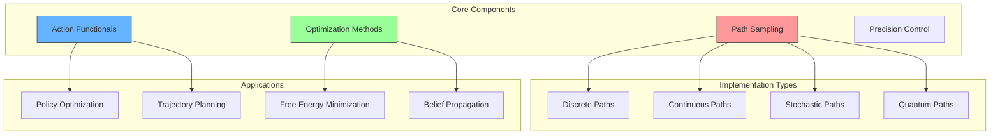

# Path Integral Implementations

## Overview

This document provides comprehensive implementations of path integral methods for active inference and cognitive modeling. Path integrals offer powerful computational tools for trajectory optimization, policy evaluation, and uncertainty quantification in complex systems.



## Core Mathematical Framework

### Path Integral Definition
For a system with state $\mathbf{x}(t)$ and action functional $S[\mathbf{x}]$:

```math
Z = \int \mathcal{D}[\mathbf{x}(t)] \exp(-S[\mathbf{x}(t)]/\hbar)
```

where:
- $\mathcal{D}[\mathbf{x}(t)]$ is the path measure
- $S[\mathbf{x}(t)]$ encodes dynamics and constraints
- $\hbar$ is an effective temperature parameter

Related concepts: [[path_integral_theory]], [[variational_calculus]], [[statistical_physics]]

### Action Functional Forms

For active inference applications:

```math
S[\mathbf{x}, \mathbf{u}] = \int_{t_0}^{T} \left[ \frac{1}{2}|\dot{\mathbf{x}} - f(\mathbf{x}, \mathbf{u})|^2 + C(\mathbf{x}, \mathbf{u}) \right] dt
```

where:
- $f(\mathbf{x}, \mathbf{u})$ represents system dynamics
- $C(\mathbf{x}, \mathbf{u})$ is the cost function
- $\mathbf{u}(t)$ are control inputs

## Implementation Classes

### 1. Basic Path Sampler

```python
import numpy as np
from typing import Callable, Tuple, Optional
from scipy.integrate import solve_ivp
import matplotlib.pyplot as plt

class PathIntegralSampler:
    """
    Core path sampling for active inference applications.
    
    Mathematical Foundation:
        - [[stochastic_processes]] - Random trajectory generation
        - [[monte_carlo_methods]] - Sampling techniques
        - [[importance_sampling]] - Weighted sampling
    
    Related Methods:
        - [[message_passing]] - Belief propagation
        - [[variational_inference]] - Approximate inference
    """
    
    def __init__(self,
                 state_dim: int,
                 action_dim: int,
                 time_horizon: float,
                 n_timesteps: int,
                 temperature: float = 1.0):
        """Initialize path sampler.
        
        Args:
            state_dim: Dimensionality of state space
            action_dim: Dimensionality of action space  
            time_horizon: Total integration time
            n_timesteps: Number of discrete time steps
            temperature: Temperature parameter (higher = more exploration)
        """
        self.state_dim = state_dim
        self.action_dim = action_dim
        self.T = time_horizon
        self.dt = time_horizon / n_timesteps
        self.n_steps = n_timesteps
        self.temperature = temperature
        
        # Time grid
        self.t = np.linspace(0, time_horizon, n_timesteps + 1)
        
    def sample_paths(self,
                    initial_state: np.ndarray,
                    dynamics: Callable,
                    n_samples: int = 1000,
                    noise_scale: float = 0.1) -> Tuple[np.ndarray, np.ndarray]:
        """
        Sample trajectory paths using stochastic dynamics.
        
        Mathematics:
            - Implements stochastic differential equation integration
            - Uses Euler-Maruyama scheme for noise integration
            - Related to [[stochastic_calculus]]
        
        Args:
            initial_state: Starting state
            dynamics: Function f(x, u, t) -> dx/dt
            n_samples: Number of path samples
            noise_scale: Magnitude of stochastic noise
            
        Returns:
            paths: Array of shape (n_samples, n_steps+1, state_dim)
            actions: Array of shape (n_samples, n_steps, action_dim)
        """
        paths = np.zeros((n_samples, self.n_steps + 1, self.state_dim))
        actions = np.zeros((n_samples, self.n_steps, self.action_dim))
        
        # Initialize all paths at starting state
        paths[:, 0] = initial_state
        
        for t_idx in range(self.n_steps):
            current_time = self.t[t_idx]
            current_states = paths[:, t_idx]
            
            # Sample random actions (could be replaced with policy)
            current_actions = np.random.randn(n_samples, self.action_dim) * noise_scale
            actions[:, t_idx] = current_actions
            
            # Integrate dynamics for each sample
            for sample_idx in range(n_samples):
                x = current_states[sample_idx]
                u = current_actions[sample_idx]
                
                # Deterministic dynamics
                dx_det = dynamics(x, u, current_time)
                
                # Stochastic term
                dx_stoch = np.random.randn(self.state_dim) * noise_scale * np.sqrt(self.dt)
                
                # Euler-Maruyama integration
                paths[sample_idx, t_idx + 1] = x + dx_det * self.dt + dx_stoch
                
        return paths, actions
        
    def compute_path_weights(self,
                           paths: np.ndarray,
                           actions: np.ndarray,
                           cost_function: Callable) -> np.ndarray:
        """
        Compute importance weights for path samples.
        
        Mathematics:
            - Implements exp(-S/temperature) weighting
            - Related to [[statistical_physics]] and [[boltzmann_distribution]]
        
        Args:
            paths: Sampled trajectories
            actions: Control actions
            cost_function: Function computing path cost
            
        Returns:
            weights: Normalized importance weights
        """
        n_samples = paths.shape[0]
        weights = np.zeros(n_samples)
        
        for i in range(n_samples):
            # Compute total cost for this path
            total_cost = 0.0
            
            for t_idx in range(self.n_steps):
                x = paths[i, t_idx]
                u = actions[i, t_idx]
                t = self.t[t_idx]
                
                # Add instantaneous cost
                total_cost += cost_function(x, u, t) * self.dt
            
            # Convert cost to weight (Boltzmann-like)
            weights[i] = np.exp(-total_cost / self.temperature)
        
        # Normalize weights
        weights /= np.sum(weights)
        
        return weights
```

### 2. Advanced Path Optimizer

```python
class PathOptimizer:
    """
    Advanced optimization methods for path integrals.
    
    Theoretical Foundation:
        - [[variational_methods]] - Calculus of variations
        - [[optimal_control]] - Control theory principles
        - [[information_geometry]] - Natural gradient methods
    """
    
    def __init__(self, 
                 sampler: PathIntegralSampler,
                 method: str = 'natural_gradient'):
        """Initialize path optimizer.
        
        Args:
            sampler: Path sampling object
            method: Optimization method ('gradient', 'natural_gradient', 'newton')
        """
        self.sampler = sampler
        self.method = method
        self.metric_computer = InformationMetric()
        
    def optimize_trajectory(self,
                          initial_path: np.ndarray,
                          cost_function: Callable,
                          dynamics: Callable,
                          n_iterations: int = 100,
                          learning_rate: float = 0.01) -> Tuple[np.ndarray, np.ndarray]:
        """
        Optimize trajectory using variational methods.
        
        Mathematics:
            - Implements natural gradient descent on path space
            - Uses [[fisher_information]] metric for natural gradients
            - Related to [[riemannian_optimization]]
        
        Args:
            initial_path: Starting trajectory guess
            cost_function: Objective to minimize
            dynamics: System dynamics
            n_iterations: Number of optimization steps
            learning_rate: Step size parameter
            
        Returns:
            optimized_path: Optimal trajectory
            cost_history: Cost evolution during optimization
        """
        current_path = initial_path.copy()
        cost_history = []
        
        for iteration in range(n_iterations):
            # Compute gradient of cost functional
            gradient = self._compute_functional_gradient(
                current_path, cost_function, dynamics)
            
            if self.method == 'natural_gradient':
                # Compute Fisher information metric
                metric = self.metric_computer.compute_path_metric(
                    current_path, dynamics)
                
                # Natural gradient update
                natural_grad = np.linalg.solve(metric, gradient.flatten())
                update = natural_grad.reshape(gradient.shape)
                
            elif self.method == 'gradient':
                # Standard gradient descent
                update = gradient
                
            elif self.method == 'newton':
                # Newton's method (requires Hessian)
                hessian = self._compute_functional_hessian(
                    current_path, cost_function, dynamics)
                update = np.linalg.solve(hessian, gradient.flatten())
                update = update.reshape(gradient.shape)
            
            # Update path
            current_path -= learning_rate * update
            
            # Compute current cost
            current_cost = self._evaluate_path_cost(
                current_path, cost_function)
            cost_history.append(current_cost)
            
            # Check convergence
            if iteration > 0 and abs(cost_history[-1] - cost_history[-2]) < 1e-6:
                print(f"Converged after {iteration} iterations")
                break
                
        return current_path, np.array(cost_history)
    
    def _compute_functional_gradient(self,
                                   path: np.ndarray,
                                   cost_function: Callable,
                                   dynamics: Callable,
                                   eps: float = 1e-6) -> np.ndarray:
        """
        Compute functional gradient using finite differences.
        
        Mathematics:
            - Implements variational derivative δS/δx(t)
            - Uses [[functional_derivatives]] and [[calculus_of_variations]]
        """
        n_steps, state_dim = path.shape
        gradient = np.zeros_like(path)
        
        for t_idx in range(n_steps):
            for dim in range(state_dim):
                # Perturb path at this point
                path_plus = path.copy()
                path_plus[t_idx, dim] += eps
                
                path_minus = path.copy()
                path_minus[t_idx, dim] -= eps
                
                # Compute cost difference
                cost_plus = self._evaluate_path_cost(path_plus, cost_function)
                cost_minus = self._evaluate_path_cost(path_minus, cost_function)
                
                # Finite difference gradient
                gradient[t_idx, dim] = (cost_plus - cost_minus) / (2 * eps)
        
        return gradient
    
    def _evaluate_path_cost(self,
                          path: np.ndarray,
                          cost_function: Callable) -> float:
        """Evaluate total cost for a given path."""
        total_cost = 0.0
        dt = self.sampler.dt
        
        for t_idx in range(len(path) - 1):
            x = path[t_idx]
            t = t_idx * dt
            
            # For now, assume zero control input
            u = np.zeros(self.sampler.action_dim)
            
            total_cost += cost_function(x, u, t) * dt
            
        return total_cost

class InformationMetric:
    """
    Compute information-geometric metrics for path optimization.
    
    Theory:
        - [[information_geometry]] - Statistical manifolds
        - [[fisher_information]] - Information metrics
        - [[natural_gradients]] - Geometric optimization
    """
    
    def compute_path_metric(self,
                          path: np.ndarray,
                          dynamics: Callable,
                          noise_cov: Optional[np.ndarray] = None) -> np.ndarray:
        """
        Compute Fisher information metric for path space.
        
        Mathematics:
            - Metric tensor G_ij = E[∂log p/∂θ_i ∂log p/∂θ_j]
            - For stochastic dynamics with Gaussian noise
            - Related to [[riemannian_geometry]]
        
        Args:
            path: Current trajectory
            dynamics: System dynamics function
            noise_cov: Noise covariance matrix
            
        Returns:
            metric: Fisher information matrix
        """
        n_points, state_dim = path.shape
        total_params = n_points * state_dim
        
        if noise_cov is None:
            noise_cov = np.eye(state_dim)
        
        # Initialize metric tensor
        metric = np.zeros((total_params, total_params))
        
        # Compute metric using dynamics Jacobian
        for t_idx in range(n_points - 1):
            # Current state and time
            x = path[t_idx]
            t = t_idx * (1.0 / n_points)  # Normalized time
            
            # Compute Jacobian of dynamics
            jacobian = self._compute_dynamics_jacobian(x, dynamics, t)
            
            # Contribution to Fisher metric
            start_idx = t_idx * state_dim
            end_idx = (t_idx + 1) * state_dim
            
            metric[start_idx:end_idx, start_idx:end_idx] += (
                jacobian.T @ np.linalg.inv(noise_cov) @ jacobian
            )
        
        # Add regularization for numerical stability
        metric += np.eye(total_params) * 1e-6
        
        return metric
    
    def _compute_dynamics_jacobian(self,
                                 state: np.ndarray,
                                 dynamics: Callable,
                                 time: float,
                                 eps: float = 1e-6) -> np.ndarray:
        """Compute Jacobian of dynamics function."""
        state_dim = len(state)
        jacobian = np.zeros((state_dim, state_dim))
        
        for i in range(state_dim):
            state_plus = state.copy()
            state_plus[i] += eps
            
            state_minus = state.copy()
            state_minus[i] -= eps
            
            # Zero control for now
            u = np.zeros(1)  # Placeholder
            
            f_plus = dynamics(state_plus, u, time)
            f_minus = dynamics(state_minus, u, time)
            
            jacobian[:, i] = (f_plus - f_minus) / (2 * eps)
        
        return jacobian
```

### 3. Precision Parameter Optimization

```python
class PrecisionOptimizer:
    """
    Optimize precision parameters in path integral formulations.
    
    Mathematical Foundation:
        - [[hierarchical_inference]] - Multi-level optimization
        - [[hyperparameter_optimization]] - Parameter learning
        - [[empirical_bayes]] - Evidence-based parameter selection
    """
    
    def __init__(self, 
                 learning_rate: float = 0.01,
                 regularization: float = 1e-4):
        """Initialize precision optimizer.
        
        Args:
            learning_rate: Update step size
            regularization: Regularization strength
        """
        self.learning_rate = learning_rate
        self.regularization = regularization
        
    def optimize_precision_parameters(self,
                                    paths: np.ndarray,
                                    prediction_errors: np.ndarray,
                                    n_iterations: int = 50) -> np.ndarray:
        """
        Optimize precision parameters using prediction errors.
        
        Mathematics:
            - Maximizes evidence lower bound (ELBO)
            - Uses [[automatic_differentiation]] for gradients
            - Related to [[variational_em]] algorithm
        
        Args:
            paths: Trajectory samples
            prediction_errors: Errors at each time step
            n_iterations: Number of optimization steps
            
        Returns:
            precision_matrix: Optimized precision parameters
        """
        n_samples, n_steps, error_dim = prediction_errors.shape
        
        # Initialize precision matrix
        precision = np.eye(error_dim)
        
        for iteration in range(n_iterations):
            # Compute gradient of log evidence
            grad_precision = self._compute_precision_gradient(
                prediction_errors, precision)
            
            # Add regularization
            grad_precision += self.regularization * precision
            
            # Update precision matrix
            precision += self.learning_rate * grad_precision
            
            # Ensure positive definiteness
            precision = self._project_to_positive_definite(precision)
            
        return precision
    
    def _compute_precision_gradient(self,
                                  errors: np.ndarray,
                                  precision: np.ndarray) -> np.ndarray:
        """
        Compute gradient of log evidence w.r.t. precision.
        
        Mathematics:
            - ∂/∂Λ log p(e|Λ) where Λ is precision matrix
            - For multivariate Gaussian error model
        """
        n_samples, n_steps, error_dim = errors.shape
        
        # Compute sample covariance of errors
        flat_errors = errors.reshape(-1, error_dim)
        empirical_cov = np.cov(flat_errors.T)
        
        # Gradient: Λ^(-1) - empirical_cov
        gradient = np.linalg.inv(precision) - empirical_cov
        
        return gradient
    
    def _project_to_positive_definite(self,
                                    matrix: np.ndarray,
                                    min_eigenval: float = 1e-6) -> np.ndarray:
        """Project matrix to positive definite cone."""
        eigenvals, eigenvecs = np.linalg.eigh(matrix)
        eigenvals = np.maximum(eigenvals, min_eigenval)
        return eigenvecs @ np.diag(eigenvals) @ eigenvecs.T
```

## Application Examples

### 1. Free Energy Minimization

```python
def free_energy_path_integral_example():
    """
    Example of using path integrals for free energy minimization.
    
    Theory:
        - [[free_energy_principle]] - Minimization principle
        - [[active_inference]] - Action through inference
        - [[policy_optimization]] - Optimal behavior
    """
    
    # System parameters
    state_dim = 2  # Position and velocity
    action_dim = 1  # Force input
    time_horizon = 5.0
    n_timesteps = 100
    
    # Initialize sampler
    sampler = PathIntegralSampler(
        state_dim=state_dim,
        action_dim=action_dim,
        time_horizon=time_horizon,
        n_timesteps=n_timesteps,
        temperature=1.0
    )
    
    # Define system dynamics (simple oscillator)
    def dynamics(x, u, t):
        """Harmonic oscillator with control."""
        position, velocity = x[0], x[1]
        acceleration = -position + u[0]  # Spring + control
        return np.array([velocity, acceleration])
    
    # Define cost function (free energy proxy)
    def cost_function(x, u, t):
        """Free energy-inspired cost function."""
        # State cost (deviation from origin)
        state_cost = 0.5 * np.sum(x**2)
        
        # Control cost (effort)
        control_cost = 0.1 * np.sum(u**2)
        
        # Prediction error (if target is origin)
        prediction_error = np.sum(x**2)
        
        return state_cost + control_cost + prediction_error
    
    # Initial state
    initial_state = np.array([2.0, 0.0])  # Start away from equilibrium
    
    # Sample paths
    paths, actions = sampler.sample_paths(
        initial_state=initial_state,
        dynamics=dynamics,
        n_samples=1000,
        noise_scale=0.5
    )
    
    # Compute weights
    weights = sampler.compute_path_weights(
        paths=paths,
        actions=actions,
        cost_function=cost_function
    )
    
    # Find best path (maximum weight)
    best_idx = np.argmax(weights)
    best_path = paths[best_idx]
    best_actions = actions[best_idx]
    
    # Visualize results
    plt.figure(figsize=(12, 8))
    
    plt.subplot(2, 2, 1)
    plt.plot(sampler.t, best_path[:, 0], 'b-', linewidth=2, label='Position')
    plt.plot(sampler.t, best_path[:, 1], 'r-', linewidth=2, label='Velocity')
    plt.xlabel('Time')
    plt.ylabel('State')
    plt.title('Optimal Trajectory')
    plt.legend()
    plt.grid(True)
    
    plt.subplot(2, 2, 2)
    plt.plot(sampler.t[:-1], best_actions[:, 0], 'g-', linewidth=2)
    plt.xlabel('Time')
    plt.ylabel('Control')
    plt.title('Optimal Control')
    plt.grid(True)
    
    plt.subplot(2, 2, 3)
    plt.hist(weights, bins=50, alpha=0.7)
    plt.xlabel('Path Weight')
    plt.ylabel('Frequency')
    plt.title('Weight Distribution')
    plt.grid(True)
    
    plt.subplot(2, 2, 4)
    # Phase portrait
    plt.plot(best_path[:, 0], best_path[:, 1], 'b-', linewidth=2)
    plt.scatter(best_path[0, 0], best_path[0, 1], c='g', s=100, label='Start')
    plt.scatter(best_path[-1, 0], best_path[-1, 1], c='r', s=100, label='End')
    plt.xlabel('Position')
    plt.ylabel('Velocity')
    plt.title('Phase Portrait')
    plt.legend()
    plt.grid(True)
    
    plt.tight_layout()
    plt.show()
    
    return best_path, best_actions, weights

# Run example
if __name__ == "__main__":
    optimal_path, optimal_actions, path_weights = free_energy_path_integral_example()
```

### 2. Belief State Trajectory Optimization

```python
def belief_trajectory_optimization():
    """
    Optimize trajectories in belief space using path integrals.
    
    Mathematical Framework:
        - [[belief_space]] - Space of probability distributions
        - [[information_geometry]] - Geometric structure on beliefs
        - [[fisher_information]] - Natural metric on belief space
    """
    
    # Belief space parameters
    belief_dim = 3  # Simplex in R^3
    n_timesteps = 50
    time_horizon = 2.0
    
    # Initialize belief sampler
    sampler = PathIntegralSampler(
        state_dim=belief_dim,
        action_dim=belief_dim,  # Actions update beliefs
        time_horizon=time_horizon,
        n_timesteps=n_timesteps,
        temperature=0.5
    )
    
    def belief_dynamics(belief, action, t):
        """
        Belief update dynamics using natural gradient flow.
        
        Mathematics:
            - db/dt = -G^(-1) ∇F(b) where G is Fisher metric
            - Related to [[natural_gradient_flow]]
        """
        # Ensure belief stays on simplex
        belief = np.abs(belief)
        belief = belief / np.sum(belief)
        
        # Simple belief update (could be more sophisticated)
        update = action - 0.1 * (belief - np.ones(belief_dim) / belief_dim)
        
        return update
    
    def belief_cost(belief, action, t):
        """
        Cost function for belief trajectories.
        
        Components:
            - Information cost: KL divergence from target
            - Action cost: Control effort
            - Entropy regularization
        """
        # Ensure valid probability distribution
        belief = np.abs(belief)
        belief = belief / (np.sum(belief) + 1e-10)
        
        # Target belief (uniform distribution)
        target_belief = np.ones(belief_dim) / belief_dim
        
        # KL divergence cost
        kl_cost = np.sum(belief * np.log((belief + 1e-10) / (target_belief + 1e-10)))
        
        # Action cost
        action_cost = 0.1 * np.sum(action**2)
        
        # Entropy regularization (encourage exploration)
        entropy = -np.sum(belief * np.log(belief + 1e-10))
        entropy_cost = -0.01 * entropy  # Negative because we want high entropy
        
        return kl_cost + action_cost + entropy_cost
    
    # Initial belief (concentrated on first element)
    initial_belief = np.array([0.8, 0.15, 0.05])
    
    # Sample belief trajectories
    belief_paths, belief_actions = sampler.sample_paths(
        initial_state=initial_belief,
        dynamics=belief_dynamics,
        n_samples=500,
        noise_scale=0.1
    )
    
    # Normalize to ensure valid beliefs
    for i in range(belief_paths.shape[0]):
        for t in range(belief_paths.shape[1]):
            belief_paths[i, t] = np.abs(belief_paths[i, t])
            belief_paths[i, t] /= np.sum(belief_paths[i, t]) + 1e-10
    
    # Compute path weights
    weights = sampler.compute_path_weights(
        paths=belief_paths,
        actions=belief_actions,
        cost_function=belief_cost
    )
    
    # Find optimal belief trajectory
    best_idx = np.argmax(weights)
    optimal_belief_path = belief_paths[best_idx]
    
    # Visualize belief evolution
    plt.figure(figsize=(15, 10))
    
    # Plot belief components over time
    plt.subplot(2, 3, 1)
    for i in range(belief_dim):
        plt.plot(sampler.t, optimal_belief_path[:, i], 
                linewidth=2, label=f'Belief {i+1}')
    plt.xlabel('Time')
    plt.ylabel('Belief Probability')
    plt.title('Optimal Belief Evolution')
    plt.legend()
    plt.grid(True)
    
    # Plot on simplex (2D projection)
    plt.subplot(2, 3, 2)
    # Use barycentric coordinates for visualization
    x_coords = optimal_belief_path[:, 1] + 0.5 * optimal_belief_path[:, 2]
    y_coords = 0.866 * optimal_belief_path[:, 2]  # sqrt(3)/2
    
    plt.plot(x_coords, y_coords, 'b-', linewidth=2)
    plt.scatter(x_coords[0], y_coords[0], c='g', s=100, label='Start')
    plt.scatter(x_coords[-1], y_coords[-1], c='r', s=100, label='End')
    
    # Draw simplex boundary
    simplex_x = [0, 1, 0.5, 0]
    simplex_y = [0, 0, 0.866, 0]
    plt.plot(simplex_x, simplex_y, 'k--', alpha=0.5)
    
    plt.xlabel('Simplex X')
    plt.ylabel('Simplex Y')
    plt.title('Belief Trajectory on Simplex')
    plt.legend()
    plt.axis('equal')
    plt.grid(True)
    
    # Plot weight distribution
    plt.subplot(2, 3, 3)
    plt.hist(weights, bins=30, alpha=0.7)
    plt.xlabel('Path Weight')
    plt.ylabel('Frequency')
    plt.title('Path Weight Distribution')
    plt.grid(True)
    
    # Plot cost evolution
    plt.subplot(2, 3, 4)
    costs = []
    for t_idx in range(len(sampler.t) - 1):
        belief = optimal_belief_path[t_idx]
        action = belief_actions[best_idx, t_idx]
        t = sampler.t[t_idx]
        cost = belief_cost(belief, action, t)
        costs.append(cost)
    
    plt.plot(sampler.t[:-1], costs, 'r-', linewidth=2)
    plt.xlabel('Time')
    plt.ylabel('Instantaneous Cost')
    plt.title('Cost Evolution')
    plt.grid(True)
    
    # Plot entropy evolution
    plt.subplot(2, 3, 5)
    entropies = []
    for t_idx in range(len(sampler.t)):
        belief = optimal_belief_path[t_idx]
        entropy = -np.sum(belief * np.log(belief + 1e-10))
        entropies.append(entropy)
    
    plt.plot(sampler.t, entropies, 'g-', linewidth=2)
    plt.xlabel('Time')
    plt.ylabel('Entropy')
    plt.title('Belief Entropy Evolution')
    plt.grid(True)
    
    # Plot sample trajectories
    plt.subplot(2, 3, 6)
    # Show a few sample trajectories
    n_show = 10
    indices = np.random.choice(belief_paths.shape[0], n_show, replace=False)
    
    for idx in indices:
        plt.plot(sampler.t, belief_paths[idx, :, 0], 'b-', alpha=0.3)
    
    plt.plot(sampler.t, optimal_belief_path[:, 0], 'r-', linewidth=3, label='Optimal')
    plt.xlabel('Time')
    plt.ylabel('Belief Component 1')
    plt.title('Sample Belief Trajectories')
    plt.legend()
    plt.grid(True)
    
    plt.tight_layout()
    plt.show()
    
    return optimal_belief_path, weights

# Run belief optimization example
if __name__ == "__main__":
    optimal_beliefs, belief_weights = belief_trajectory_optimization()
```

## Performance Considerations

### Computational Complexity
- **Path Sampling**: O(N × T × D) where N=samples, T=timesteps, D=dimensions
- **Weight Computation**: O(N × T) for simple cost functions
- **Optimization**: O(I × N × T × D) where I=iterations

### Memory Requirements
- **Storage**: Paths require O(N × T × D) memory
- **Gradients**: Additional O(T × D) for optimization
- **Metrics**: Fisher information matrices: O(T²D²)

### Optimization Strategies
1. **Adaptive Sampling**: Adjust sample size based on convergence
2. **Hierarchical Methods**: Coarse-to-fine refinement
3. **Parallel Computation**: Distribute path sampling across cores
4. **GPU Acceleration**: Use tensor operations for batch processing

## Integration with Active Inference

### Connection to Expected Free Energy
Path integrals naturally implement expected free energy minimization:

```math
G[\pi] = \mathbb{E}_{\pi}[F[q(s_{t+1}|o_{t+1})] + \mathbb{E}_{q(s_{t+1})}[H[p(o_{t+1}|s_{t+1})]]]
```

### Policy Optimization
Use path integral methods for:
- **Policy Gradient**: Natural gradients on policy manifolds
- **Value Function Approximation**: Path-based value estimates
- **Exploration**: Automatic exploration through sampling

### Hierarchical Planning
Extend to multi-scale planning:
- **Temporal Hierarchies**: Different time scales
- **Spatial Hierarchies**: Different abstraction levels
- **Goal Hierarchies**: Nested objective structures

## Related Documentation

### Mathematical Foundations
- [[path_integral_theory]] - Theoretical foundations
- [[variational_calculus]] - Calculus of variations
- [[stochastic_calculus]] - Stochastic differential equations
- [[information_geometry]] - Geometric structures

### Computational Methods
- [[monte_carlo_methods]] - Sampling techniques
- [[optimization_theory]] - Optimization algorithms
- [[numerical_methods]] - Numerical analysis
- [[automatic_differentiation]] - Gradient computation

### Applications
- [[active_inference_theory]] - Active inference framework
- [[policy_optimization]] - Optimal control
- [[belief_space_planning]] - Planning in belief space
- [[free_energy_minimization]] - Energy minimization

## Future Developments

### Research Directions
1. **Quantum Path Integrals**: Quantum mechanical extensions
2. **Non-Markovian Dynamics**: Memory effects in trajectories
3. **Infinite-Dimensional Paths**: Functional space methods
4. **Multi-Agent Path Integrals**: Collective behavior

### Implementation Improvements
1. **Adaptive Discretization**: Smart grid refinement
2. **Machine Learning Integration**: Neural path approximators
3. **Hardware Optimization**: Specialized computing architectures
4. **Real-Time Applications**: Online path optimization

---

**See Also**: [[README]] for overview, [[path_integral_theory]] for theory, [[monte_carlo_methods]] for sampling 