# Probability Theory

## Overview

Probability theory provides the mathematical foundation for reasoning under uncertainty, forming the basis for modern approaches to cognitive modeling, machine learning, and statistical inference.

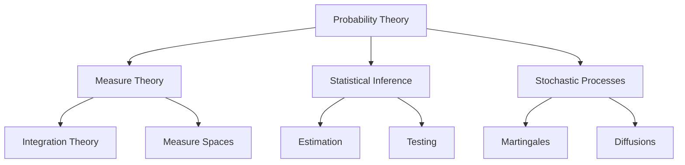

### Historical Development

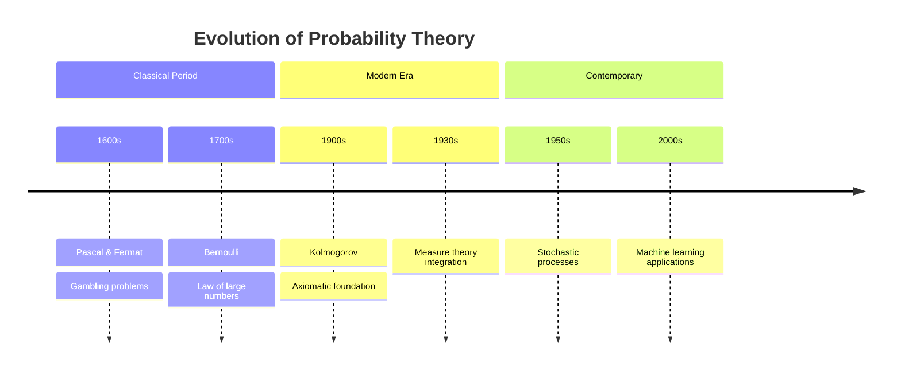

## Fundamentals

### Probability Spaces

#### Measure Space

```math

(\Omega, \mathcal{F}, P)

```

where:

- $\Omega$ is sample space

- $\mathcal{F}$ is σ-algebra

- $P$ is probability measure

```mermaid

graph TD

    A[Sample Space Ω] --> B[Events F]

    B --> C[Probability Measure P]

    C --> D[P: F → [0,1]]

    D --> E[P(Ω) = 1]

    D --> F[P(∅) = 0]

    D --> G[Countable Additivity]

```

#### Axioms

1. Non-negativity: $P(A) \geq 0$

1. Normalization: $P(\Omega) = 1$

1. Additivity: $P(\cup_i A_i) = \sum_i P(A_i)$ for disjoint sets

### Random Variables

#### Definition

A measurable function $X: \Omega \rightarrow \mathbb{R}$

```mermaid

graph LR

    A[Sample Space Ω] -->|X| B[Real Line ℝ]

    B -->|F_X| C[Probability [0,1]]

    style A fill:#f9f,stroke:#333

    style B fill:#bbf,stroke:#333

    style C fill:#bfb,stroke:#333

```

#### Distribution Function

```math

F_X(x) = P(X \leq x)

```

#### Density Function

```math

f_X(x) = \frac{d}{dx}F_X(x)

```

### Probability Diagrams

#### Venn Diagrams

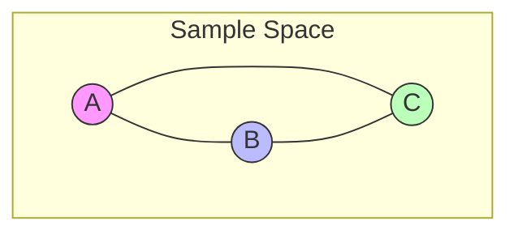

#### Distribution Plots

```python

def plot_distributions():

    """Plot common probability distributions."""

    fig, axes = plt.subplots(2, 2, figsize=(12, 8))

    # Normal distribution

    x = np.linspace(-4, 4, 100)

    axes[0,0].plot(x, norm.pdf(x, 0, 1))

    axes[0,0].set_title('Normal Distribution')

    # Exponential distribution

    x = np.linspace(0, 4, 100)

    axes[0,1].plot(x, expon.pdf(x))

    axes[0,1].set_title('Exponential Distribution')

    # Beta distribution

    x = np.linspace(0, 1, 100)

    axes[1,0].plot(x, beta.pdf(x, 2, 5))

    axes[1,0].set_title('Beta Distribution')

    # Gamma distribution

    x = np.linspace(0, 10, 100)

    axes[1,1].plot(x, gamma.pdf(x, 2))

    axes[1,1].set_title('Gamma Distribution')

    plt.tight_layout()

    return fig

```

## Probability Structures

### Topological Probability Spaces

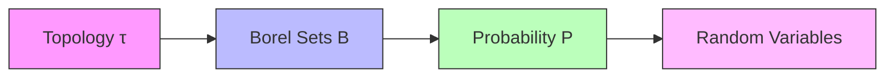

#### Polish Spaces

```math

\begin{aligned}

& \text{Complete Metric Space:} \\

& (X,d) \text{ with Cauchy completion} \\

& \text{Second Countable:} \\

& \exists \text{ countable base for topology}

\end{aligned}

```

### Probability Metrics Space

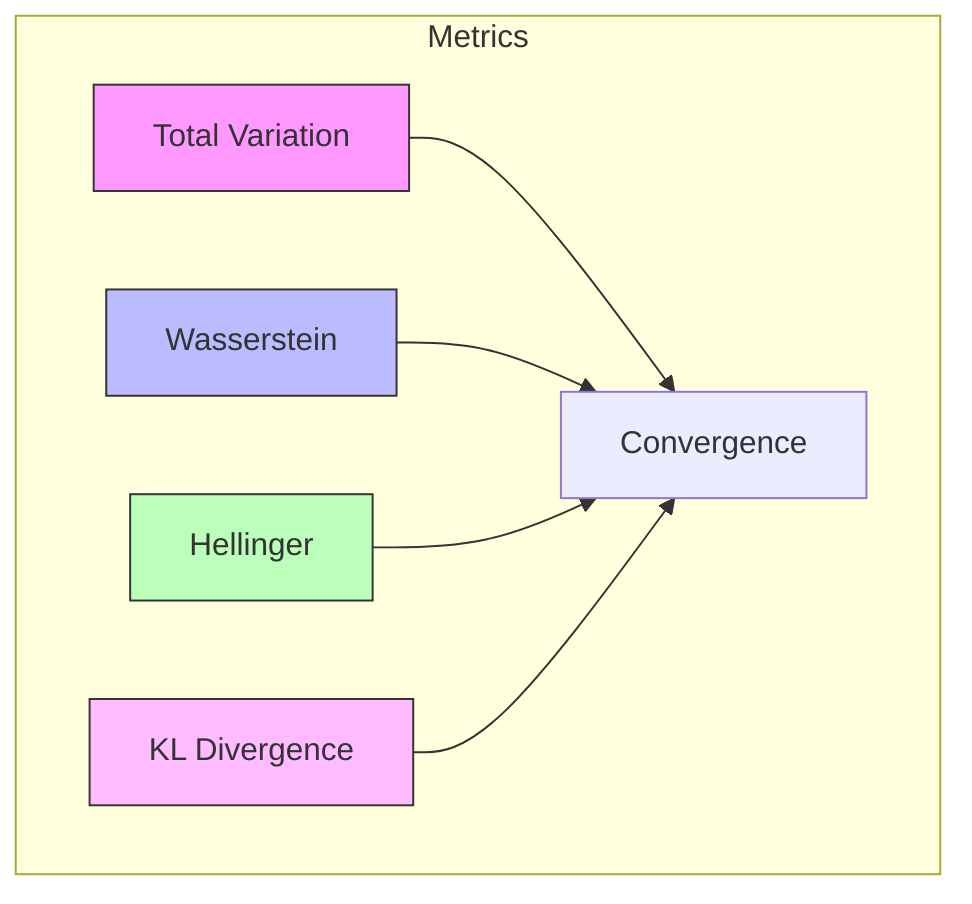

### Distribution Hierarchies

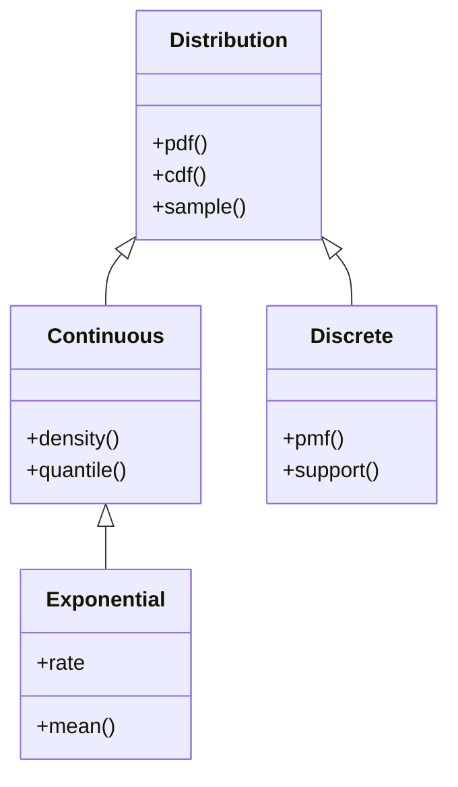

## Advanced Concepts

### Measure-Theoretic Probability

#### Integration Theory

```math

\mathbb{E}[X] = \int_\Omega X dP = \int_\mathbb{R} x dF_X(x)

```

#### Integration Theory Visualization

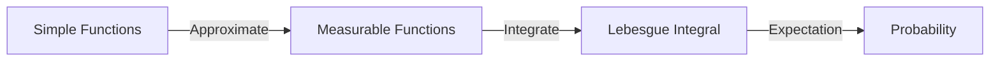

#### Product Measures

```math

P(A \times B) = (P_1 \otimes P_2)(A \times B) = P_1(A)P_2(B)

```

### Stochastic Process Structures

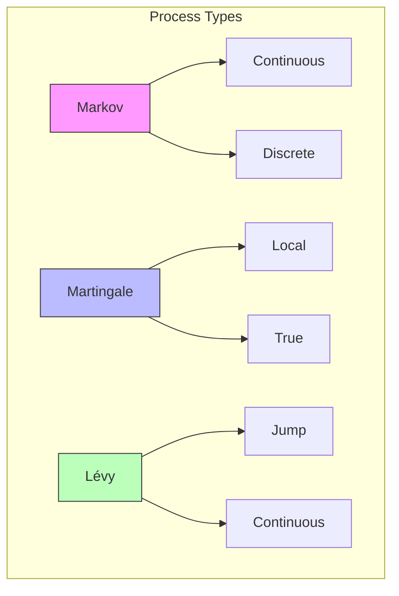

### Characteristic Functions

#### Definition

```math

\phi_X(t) = \mathbb{E}[e^{itX}] = \int_{-\infty}^{\infty} e^{itx}dF_X(x)

```

#### Properties

1. $|\phi_X(t)| \leq 1$

1. $\phi_X(0) = 1$

1. $\phi_X(-t) = \overline{\phi_X(t)}$

### Martingale Theory

#### Definition

```math

\mathbb{E}[X_{n+1}|\mathcal{F}_n] = X_n

```

where $\mathcal{F}_n$ is filtration

#### Optional Stopping

```math

\mathbb{E}[X_\tau] = \mathbb{E}[X_0]

```

for bounded stopping time $\tau$

### Ergodic Theory

#### Ergodic Theorem

```math

\lim_{n \to \infty} \frac{1}{n}\sum_{k=1}^n f(T^k x) = \int_X f d\mu

```

for measure-preserving transformation T

#### Mixing Conditions

```math

\lim_{n \to \infty} \mu(A \cap T^{-n}B) = \mu(A)\mu(B)

```

### Large Deviations

#### Cramér's Theorem

```math

\begin{aligned}

& \text{Rate Function:} \\

& I(x) = \sup_{\theta \in \mathbb{R}}(\theta x - \log M(\theta)) \\

& \text{Large Deviation Principle:} \\

& \lim_{n \to \infty} \frac{1}{n}\log P(S_n/n \in A) = -\inf_{x \in A} I(x)

\end{aligned}

```

### Optimal Transport

#### Wasserstein Distance

```math

W_p(μ,ν) = \left(\inf_{\gamma \in \Gamma(μ,ν)} \int \|x-y\|^p d\gamma(x,y)\right)^{1/p}

```

#### Kantorovich Duality

```math

W_1(μ,ν) = \sup_{f: \text{Lip}(f) \leq 1} \int f d(μ-ν)

```

## Advanced Geometric Structures

### Information Geometry

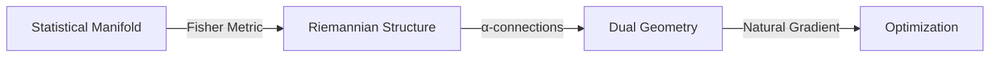

#### Fisher Information Metric

```math

\begin{aligned}

& g_{ij}(θ) = \mathbb{E}_{p(x|θ)}\left[\frac{∂\log p(x|θ)}{∂θ^i}\frac{∂\log p(x|θ)}{∂θ^j}\right] \\

& \text{Geodesic Equation:} \\

& \ddot{θ}^k + \Gamma^k_{ij}\dot{θ}^i\dot{θ}^j = 0

\end{aligned}

```

### Optimal Transport Geometry

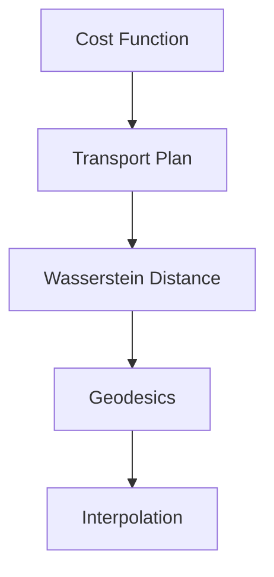

#### Kantorovich Problem

```math

\begin{aligned}

& \inf_{π \in \Pi(μ,ν)} \int_{X×Y} c(x,y)dπ(x,y) \\

& \text{Subject to:} \\

& π(A×Y) = μ(A), \quad π(X×B) = ν(B)

\end{aligned}

```

## Computational Methods

### MCMC Convergence Diagnostics

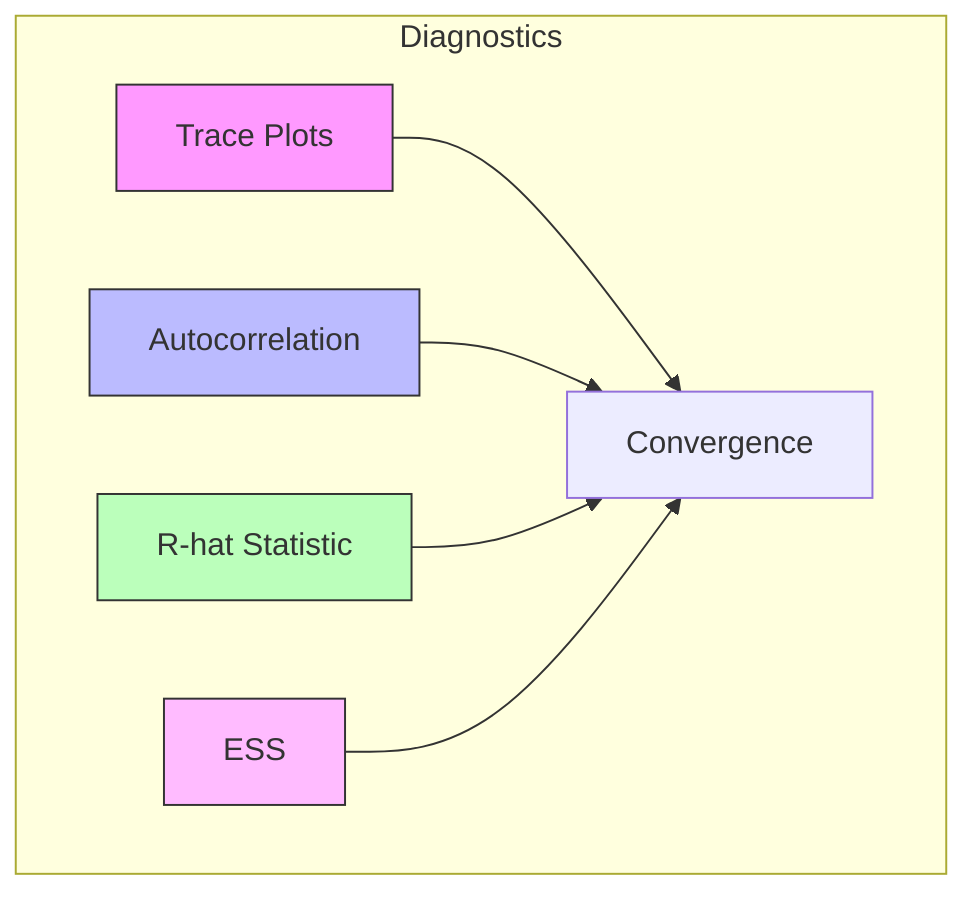

### Sampling Efficiency

```python

class MCMCDiagnostics:

    def __init__(self,

                 chains: np.ndarray):

        """Initialize MCMC diagnostics.

        Args:

            chains: MCMC chains [n_chains, n_samples, n_params]

        """

        self.chains = chains

    def plot_diagnostics(self) -> Dict[str, plt.Figure]:

        """Plot comprehensive diagnostics."""

        figs = {}

        # Trace plots

        fig_trace = self._plot_traces()

        figs['trace'] = fig_trace

        # Autocorrelation

        fig_acf = self._plot_autocorr()

        figs['acf'] = fig_acf

        # Rank plots

        fig_rank = self._plot_rank()

        figs['rank'] = fig_rank

        return figs

```

## Advanced Visualizations

#### Phase Space Plots

```python

def plot_phase_space(

    process: StochasticProcess,

    n_trajectories: int = 100

) -> plt.Figure:

    """Plot phase space of stochastic process."""

    fig = plt.figure(figsize=(10, 10))

    ax = fig.add_subplot(111, projection='3d')

    for _ in range(n_trajectories):

        path = process.simulate_path(1000, 0.01)

        ax.plot3D(path[:,0], path[:,1], path[:,2], 

                 alpha=0.1, lw=0.5)

    return fig

```

#### Distribution Evolution

```python

def plot_distribution_evolution(

    initial: ProbabilityDistribution,

    transition: Callable,

    n_steps: int = 10

) -> plt.Figure:

    """Plot evolution of probability distribution."""

    fig, axes = plt.subplots(2, n_steps//2, figsize=(15, 6))

    dist = initial

    for i in range(n_steps):

        row, col = i//5, i%5

        dist = transition(dist)

        x = np.linspace(dist.support[0], dist.support[1], 100)

        axes[row,col].plot(x, dist.pdf(x))

        axes[row,col].set_title(f't = {i}')

    return fig

```

## Advanced Probability Models

### Lévy Processes

```python

class LevyProcess:

    def __init__(self,

                 characteristic_exponent: Callable,

                 drift: float = 0.0,

                 diffusion: float = 0.0):

        """Initialize Lévy process.

        Args:

            characteristic_exponent: Jump measure

            drift: Drift parameter

            diffusion: Diffusion parameter

        """

        self.psi = characteristic_exponent

        self.mu = drift

        self.sigma = diffusion

    def simulate_path(self,

                     n_steps: int,

                     dt: float,

                     method: str = 'euler') -> np.ndarray:

        """Simulate Lévy process path.

        Args:

            n_steps: Number of steps

            dt: Time step

            method: Integration method

        Returns:

            path: Simulated path

        """

        path = np.zeros(n_steps)

        time = np.arange(n_steps) * dt

        # Continuous part

        W = np.random.normal(0, np.sqrt(dt), n_steps)

        path += self.mu * time + self.sigma * np.cumsum(W)

        # Jump part

        N = self.simulate_jumps(n_steps, dt)

        path += N

        return path

```

### Diffusion Processes

```python

class DiffusionProcess:

    def __init__(self,

                 drift: Callable,

                 diffusion: Callable):

        """Initialize diffusion process.

        Args:

            drift: Drift function μ(x,t)

            diffusion: Diffusion function σ(x,t)

        """

        self.mu = drift

        self.sigma = diffusion

    def simulate_path(self,

                     x0: float,

                     n_steps: int,

                     dt: float,

                     scheme: str = 'milstein') -> np.ndarray:

        """Simulate diffusion path.

        Args:

            x0: Initial value

            n_steps: Number of steps

            dt: Time step

            scheme: Integration scheme

        Returns:

            path: Simulated path

        """

        x = np.zeros(n_steps)

        x[0] = x0

        t = np.arange(n_steps) * dt

        for i in range(n_steps-1):

            dW = np.random.normal(0, np.sqrt(dt))

            if scheme == 'euler':

                x[i+1] = x[i] + self.mu(x[i],t[i])*dt + \

                         self.sigma(x[i],t[i])*dW

            elif scheme == 'milstein':

                sigma_prime = grad(self.sigma, 0)

                x[i+1] = x[i] + self.mu(x[i],t[i])*dt + \

                         self.sigma(x[i],t[i])*dW + \

                         0.5*self.sigma(x[i],t[i])*sigma_prime(x[i],t[i])*(dW**2 - dt)

        return x

```

### Markov Chain Monte Carlo

```python

class MCMCSampler:

    def __init__(self,

                 target: Callable,

                 proposal: Callable,

                 n_chains: int = 4):

        """Initialize MCMC sampler.

        Args:

            target: Target distribution

            proposal: Proposal distribution

            n_chains: Number of parallel chains

        """

        self.target = target

        self.proposal = proposal

        self.n_chains = n_chains

    def hamiltonian_monte_carlo(self,

                              n_samples: int,

                              initial_state: np.ndarray,

                              step_size: float = 0.1,

                              n_steps: int = 10) -> np.ndarray:

        """Run Hamiltonian Monte Carlo.

        Args:

            n_samples: Number of samples

            initial_state: Initial state

            step_size: Leapfrog step size

            n_steps: Number of leapfrog steps

        Returns:

            samples: HMC samples

        """

        def hamiltonian(q: np.ndarray, p: np.ndarray) -> float:

            """Compute Hamiltonian."""

            return -self.target(q) + 0.5 * np.sum(p**2)

        samples = np.zeros((n_samples, *initial_state.shape))

        current_q = initial_state

        for i in range(n_samples):

            # Sample momentum

            current_p = np.random.normal(0, 1, size=initial_state.shape)

            # Leapfrog integration

            q = current_q

            p = current_p

            # Half step for momentum

            p -= step_size * grad(lambda x: -self.target(x))(q) / 2

            # Alternate full steps for position and momentum

            for _ in range(n_steps):

                q += step_size * p

                if _ != n_steps - 1:

                    p -= step_size * grad(lambda x: -self.target(x))(q)

            # Half step for momentum

            p -= step_size * grad(lambda x: -self.target(x))(q) / 2

            # Metropolis acceptance

            current_H = hamiltonian(current_q, current_p)

            proposed_H = hamiltonian(q, p)

            if np.random.random() < np.exp(current_H - proposed_H):

                current_q = q

            samples[i] = current_q

        return samples

```

### Sequential Monte Carlo

```python

class ParticleFilter:

    def __init__(self,

                 transition_model: Callable,

                 observation_model: Callable,

                 n_particles: int = 1000):

        """Initialize particle filter.

        Args:

            transition_model: State transition p(x_t|x_{t-1})

            observation_model: Observation likelihood p(y_t|x_t)

            n_particles: Number of particles

        """

        self.f = transition_model

        self.g = observation_model

        self.n = n_particles

    def filter(self,

              observations: np.ndarray,

              initial_distribution: Callable) -> Tuple[np.ndarray, np.ndarray]:

        """Run particle filter.

        Args:

            observations: Observation sequence

            initial_distribution: Initial state distribution

        Returns:

            particles,weights: Filtered particles and weights

        """

        T = len(observations)

        d = observations.shape[1]

        # Initialize particles

        particles = np.zeros((T, self.n, d))

        weights = np.zeros((T, self.n))

        # Initial state

        particles[0] = initial_distribution(self.n)

        weights[0] = 1.0 / self.n

        for t in range(1, T):

            # Predict

            particles[t] = self.f(particles[t-1])

            # Update

            weights[t] = self.g(observations[t], particles[t])

            weights[t] /= np.sum(weights[t])

            # Resample if needed

            if self.effective_sample_size(weights[t]) < self.n/2:

                indices = self.systematic_resample(weights[t])

                particles[t] = particles[t][indices]

                weights[t] = 1.0 / self.n

        return particles, weights

    @staticmethod

    def effective_sample_size(weights: np.ndarray) -> float:

        """Compute effective sample size."""

        return 1.0 / np.sum(weights**2)

    @staticmethod

    def systematic_resample(weights: np.ndarray) -> np.ndarray:

        """Perform systematic resampling."""

        N = len(weights)

        positions = (np.random.random() + np.arange(N)) / N

        indices = np.zeros(N, dtype=int)

        cumsum = np.cumsum(weights)

        i, j = 0, 0

        while i < N:

            if positions[i] < cumsum[j]:

                indices[i] = j

                i += 1

            else:

                j += 1

        return indices

```

### Advanced Probability Metrics

```python

class ProbabilityMetrics:

    @staticmethod

    def total_variation(p: np.ndarray,

                       q: np.ndarray) -> float:

        """Compute total variation distance.

        Args:

            p,q: Probability distributions

        Returns:

            tv: Total variation distance

        """

        return 0.5 * np.sum(np.abs(p - q))

    @staticmethod

    def hellinger(p: np.ndarray,

                 q: np.ndarray) -> float:

        """Compute Hellinger distance.

        Args:

            p,q: Probability distributions

        Returns:

            h: Hellinger distance

        """

        return np.sqrt(0.5 * np.sum((np.sqrt(p) - np.sqrt(q))**2))

    @staticmethod

    def wasserstein(x: np.ndarray,

                   y: np.ndarray,

                   p: int = 1) -> float:

        """Compute Wasserstein distance.

        Args:

            x,y: Sample points

            p: Order of distance

        Returns:

            w: Wasserstein distance

        """

        # Sort samples

        x_sorted = np.sort(x)

        y_sorted = np.sort(y)

        # Compute distance

        return np.power(

            np.mean(np.abs(x_sorted - y_sorted)**p),

            1/p

        )

```

### Advanced Visualization

```python

class ProbabilityVisualizer:

    @staticmethod

    def plot_process_paths(paths: np.ndarray,

                          time: np.ndarray,

                          confidence: float = 0.95) -> plt.Figure:

        """Plot stochastic process paths.

        Args:

            paths: Sample paths

            time: Time points

            confidence: Confidence level

        Returns:

            fig: Plot figure

        """

        fig, ax = plt.subplots(figsize=(10, 6))

        # Plot mean path

        mean_path = np.mean(paths, axis=0)

        ax.plot(time, mean_path, 'b-', label='Mean')

        # Plot confidence bands

        alpha = (1 - confidence) / 2

        lower = np.quantile(paths, alpha, axis=0)

        upper = np.quantile(paths, 1-alpha, axis=0)

        ax.fill_between(time, lower, upper, alpha=0.2,

                       label=f'{confidence*100}% CI')

        # Plot sample paths

        for path in paths[::10]:  # Plot every 10th path

            ax.plot(time, path, 'k-', alpha=0.1)

        ax.grid(True)

        ax.legend()

        return fig

    @staticmethod

    def plot_copula(samples: np.ndarray,

                   marginals: List[str] = None) -> plt.Figure:

        """Plot copula structure.

        Args:

            samples: Multivariate samples

            marginals: Marginal distribution names

        Returns:

            fig: Plot figure

        """

        d = samples.shape[1]

        fig, axes = plt.subplots(d, d, figsize=(3*d, 3*d))

        for i in range(d):

            for j in range(d):

                if i != j:

                    axes[i,j].scatter(samples[:,j], samples[:,i],

                                    alpha=0.1, s=1)

                else:

                    axes[i,j].hist(samples[:,i], bins=50)

                if marginals:

                    if i == d-1:

                        axes[i,j].set_xlabel(marginals[j])

                    if j == 0:

                        axes[i,j].set_ylabel(marginals[i])

        plt.tight_layout()

        return fig

```

## Advanced Topics

### Optimal Transport Theory

- Monge-Kantorovich problem

- Wasserstein geometry

- Displacement interpolation

- Brenier's theorem

### Stochastic Analysis

- Itô calculus

- Stratonovich integral

- Stochastic differential equations

- Malliavin calculus

### Information Geometry

- Statistical manifolds

- Fisher information

- α-connections

- Amari-Chentsov tensor

### Random Matrix Theory

- Wigner matrices

- Free probability

- Large deviation principles

- Tracy-Widom law

## Future Directions

### Quantum Probability

- Quantum measure theory

- Non-commutative probability

- Quantum stochastic processes

- Quantum information theory

### Machine Learning Applications

- Neural SDEs

- Normalizing flows

- Score-based generative models

- Probabilistic programming

### Theoretical Developments

- Rough paths theory

- Regularity structures

- Geometric measure theory

- Optimal transport methods

## Implementation Framework

### Probability Distributions

```python

class ProbabilityDistribution:

    def __init__(self,

                 name: str,

                 params: Dict[str, float]):

        """Initialize probability distribution.

        Args:

            name: Distribution name

            params: Distribution parameters

        """

        self.name = name

        self.params = params

        self._validate_parameters()

    def pdf(self,

           x: np.ndarray) -> np.ndarray:

        """Compute probability density.

        Args:

            x: Input values

        Returns:

            density: PDF values

        """

        raise NotImplementedError

    def cdf(self,

           x: np.ndarray) -> np.ndarray:

        """Compute cumulative distribution.

        Args:

            x: Input values

        Returns:

            cumulative: CDF values

        """

        raise NotImplementedError

    def sample(self,

              n: int,

              seed: Optional[int] = None) -> np.ndarray:

        """Generate random samples.

        Args:

            n: Number of samples

            seed: Random seed

        Returns:

            samples: Random samples

        """

        raise NotImplementedError

```

### Statistical Inference

```python

class StatisticalInference:

    def __init__(self,

                 distribution: ProbabilityDistribution):

        """Initialize statistical inference.

        Args:

            distribution: Probability distribution

        """

        self.dist = distribution

    def maximum_likelihood(self,

                         data: np.ndarray) -> Dict[str, float]:

        """Compute MLE estimates.

        Args:

            data: Observed data

        Returns:

            params: ML parameter estimates

        """

        def neg_log_likelihood(params):

            self.dist.params = params

            return -np.sum(np.log(self.dist.pdf(data)))

        result = minimize(neg_log_likelihood, x0=self.dist.params)

        return dict(zip(self.dist.params.keys(), result.x))

    def bayesian_inference(self,

                         data: np.ndarray,

                         prior: ProbabilityDistribution) -> ProbabilityDistribution:

        """Perform Bayesian inference.

        Args:

            data: Observed data

            prior: Prior distribution

        Returns:

            posterior: Posterior distribution

        """

        # Implement MCMC or variational inference

        raise NotImplementedError

```

### Monte Carlo Methods

```python

class MonteCarloSampler:

    def __init__(self,

                 target: Callable,

                 proposal: ProbabilityDistribution):

        """Initialize Monte Carlo sampler.

        Args:

            target: Target distribution

            proposal: Proposal distribution

        """

        self.target = target

        self.proposal = proposal

    def metropolis_hastings(self,

                          n_samples: int,

                          initial: np.ndarray) -> np.ndarray:

        """Run Metropolis-Hastings algorithm.

        Args:

            n_samples: Number of samples

            initial: Initial state

        Returns:

            samples: MCMC samples

        """

        samples = [initial]

        current = initial

        for _ in range(n_samples - 1):

            # Propose new state

            proposal = self.proposal.sample(1)

            # Compute acceptance ratio

            ratio = min(1, self.target(proposal) / self.target(current))

            # Accept/reject

            if np.random.random() < ratio:

                current = proposal

            samples.append(current)

        return np.array(samples)

```

## Advanced Applications

### Information Theory

```python

class InformationTheory:

    @staticmethod

    def entropy(p: np.ndarray) -> float:

        """Compute Shannon entropy.

    Args:

        p: Probability distribution

    Returns:

        H: Entropy value

    """

        return -np.sum(p * np.log2(p + 1e-10))

    @staticmethod

    def kl_divergence(p: np.ndarray,

                     q: np.ndarray) -> float:

    """Compute KL divergence.

    Args:

        p: First distribution

        q: Second distribution

    Returns:

        KL: KL divergence

    """

        return np.sum(p * np.log2((p + 1e-10) / (q + 1e-10)))

    @staticmethod

    def mutual_information(joint: np.ndarray) -> float:

        """Compute mutual information.

        Args:

            joint: Joint distribution

        Returns:

            I: Mutual information

        """

        p_x = np.sum(joint, axis=1)

        p_y = np.sum(joint, axis=0)

        H_x = InformationTheory.entropy(p_x)

        H_y = InformationTheory.entropy(p_y)

        H_xy = InformationTheory.entropy(joint.flatten())

        return H_x + H_y - H_xy

```

### Stochastic Processes

```python

class StochasticProcess:

    def __init__(self,

                 transition: Callable,

                 initial: ProbabilityDistribution):

        """Initialize stochastic process.

        Args:

            transition: Transition kernel

            initial: Initial distribution

        """

        self.transition = transition

        self.initial = initial

    def simulate_path(self,

                     n_steps: int,

                     dt: float) -> np.ndarray:

        """Simulate process path.

        Args:

            n_steps: Number of steps

            dt: Time step

        Returns:

            path: Simulated path

        """

        path = [self.initial.sample(1)]

        for _ in range(n_steps - 1):

            next_state = self.transition(path[-1], dt)

            path.append(next_state)

        return np.array(path)

```

## Visualization Tools

### Distribution Plots

```python

def plot_distribution_family(

    dist_class: Type[ProbabilityDistribution],

    param_range: Dict[str, np.ndarray]

) -> plt.Figure:

    """Plot family of distributions.

    Args:

        dist_class: Distribution class

        param_range: Parameter ranges

    Returns:

        fig: Plot figure

    """

    fig, ax = plt.subplots(figsize=(10, 6))

    x = np.linspace(-4, 4, 100)

    for params in product(*param_range.values()):

        dist = dist_class(dict(zip(param_range.keys(), params)))

        ax.plot(x, dist.pdf(x), label=str(params))

    ax.legend()

    ax.grid(True)

    return fig

```

### Probability Maps

```python

def plot_probability_map(

    joint_dist: np.ndarray,

    x_label: str = 'X',

    y_label: str = 'Y'

) -> plt.Figure:

    """Plot joint probability map.

    Args:

        joint_dist: Joint distribution

        x_label: X-axis label

        y_label: Y-axis label

    Returns:

        fig: Plot figure

    """

    fig, ax = plt.subplots(figsize=(8, 8))

    im = ax.imshow(joint_dist, cmap='viridis')

    plt.colorbar(im)

    ax.set_xlabel(x_label)

    ax.set_ylabel(y_label)

    return fig

```

## Best Practices

### Implementation

1. Use log-space computations

1. Implement numerical stability

1. Validate probability axioms

1. Handle edge cases

1. Use vectorized operations

1. Implement error checking

### Modeling

1. Choose appropriate distributions

1. Validate assumptions

1. Consider conjugate priors

1. Test inference methods

1. Use cross-validation

1. Monitor convergence

### Computation

1. Use stable algorithms

1. Implement vectorization

1. Handle numerical precision

1. Validate results

1. Use efficient data structures

1. Implement caching

## Common Issues

### Numerical Stability

1. Underflow/overflow

1. Division by zero

1. Log of zero

1. Precision loss

1. Floating-point errors

1. Catastrophic cancellation

### Solutions

1. Log-space arithmetic

1. Stable algorithms

1. Numerical safeguards

1. Error checking

1. Regularization

1. Robust implementations

## Related Topics

- [[measure_theory|Measure Theory]]

- [[information_theory|Information Theory]]

- [[statistics|Statistics]]

- [[bayesian_inference|Bayesian Inference]]

- [[stochastic_processes|Stochastic Processes]]

- [[statistical_learning|Statistical Learning]]

- [[random_variables|Random Variables]]

- [[probability_distributions|Probability Distributions]]

## References

1. [[kolmogorov_1933]] - "Foundations of the Theory of Probability"

1. [[feller_1968]] - "An Introduction to Probability Theory and Its Applications"

1. [[billingsley_1995]] - "Probability and Measure"

1. [[durrett_2019]] - "Probability: Theory and Examples"

1. [[williams_1991]] - "Probability with Martingales"

1. [[kallenberg_2002]] - "Foundations of Modern Probability"

