# Renormalization Group and Generative Models

[[Renormalization Groups]] (RG) and [[Generative Models]] are two powerful frameworks that, despite originating from distinct fields—[[statistical_physics|statistical physics]] and [[machine_learning|machine learning]] respectively—share deep conceptual connections. Recent research has increasingly highlighted the intersection between RG methods and [[bayesian_inference|Bayesian inference]], revealing a rich theoretical structure that unifies [[statistical_foundations|statistical inference]], [[information_theory|information theory]], and physical [[coarse-graining]] processes.

## Renormalization Groups: Overview and Principles

Renormalization groups constitute a central theoretical framework in [[physics]], particularly in [[quantum_field_theory|quantum field theory]] and [[statistical_physics|statistical mechanics]]. The fundamental idea behind RG is to systematically study how physical systems behave when observed at different scales. The RG approach involves "coarse-graining," a procedure where microscopic degrees of freedom are integrated out or averaged over, resulting in effective theories at larger scales. This method allows physicists to understand how physical parameters evolve as the scale of observation changes, identifying [[fixed points]] and [[critical_phenomena|critical phenomena]].

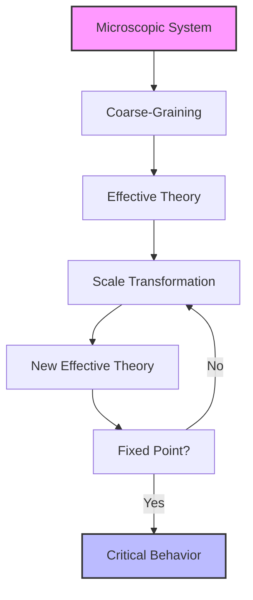

## Exact Renormalization Group (ERG)

The [[Exact Renormalization Group]] (ERG) is a continuous formulation of RG flows, describing how [[probability_theory|probability distributions]] or coupling constants evolve smoothly across scales. ERG flows can be viewed as functional diffusion processes, governed by [[differential_equations|differential equations]] that describe how probability distributions transform systematically under changes in scale. ERG provides a rigorous mathematical foundation for RG approaches, making explicit the transformations of probability distributions across scales.

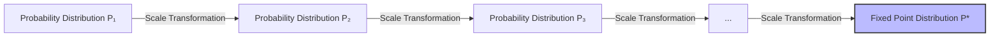

## Bayesian Renormalization: Bridging Bayesian Inference and RG

A particularly compelling development is the explicit connection between RG methods and [[bayesian_networks|Bayesian inference]] through an information-theoretic perspective known as [[Bayesian Renormalization]]. [[belief_updating|Bayesian inference]] involves updating prior probability distributions into posterior distributions using observed data. It quantifies uncertainty about parameters or models given observed data through [[bayes_theorem|Bayes' theorem]]:

$$P(\theta|D) = \frac{P(D|\theta)P(\theta)}{P(D)}$$

Here, the posterior distribution updates prior beliefs about parameters based on observed data.

Bayesian Renormalization reframes RG as a form of inverse Bayesian inference. Specifically, it leverages the [[Dynamical Bayesian Inference]] scheme, where Bayesian updating is represented by a one-parameter family of probability distributions evolving according to an integro-differential equation derived from Bayes' law. In this framework:

- ERG flow is interpreted as a functional diffusion process in probability distribution space.

- The [[information_geometry|Fisher Information metric]] emerges naturally as an intrinsic geometric structure defining an "RG scale" based on information-theoretic distinguishability between nearby models.

- This emergent scale serves as an effective correlation length, quantifying how precisely different parameterizations can be distinguished given finite observations.

Thus, Bayesian Renormalization explicitly connects the scale transformations inherent in RG with the precision and uncertainty quantification central to Bayesian inference.

## Fisher Geometry and Information-Theoretic Interpretation

Central to this correspondence is the [[information_geometry|Fisher information metric]], which measures sensitivity of probability distributions to parameter variations. In Bayesian Renormalization:

- The Fisher information metric defines an intrinsic geometric structure on parameter space.

- It sets a natural "information-theoretic scale" analogous to momentum or energy scales in traditional RG.

- Coarse-graining in this context corresponds to reducing model complexity by integrating out parameters that cannot be distinguished beyond a certain precision threshold.

This approach has significant implications for practical applications beyond physics. For instance, it provides a principled method for [[data_compression|data compression]] and efficient representation learning in machine learning contexts such as [[generative_models|generative modeling]] and [[diffusion_models|diffusion-based learning paradigms]].

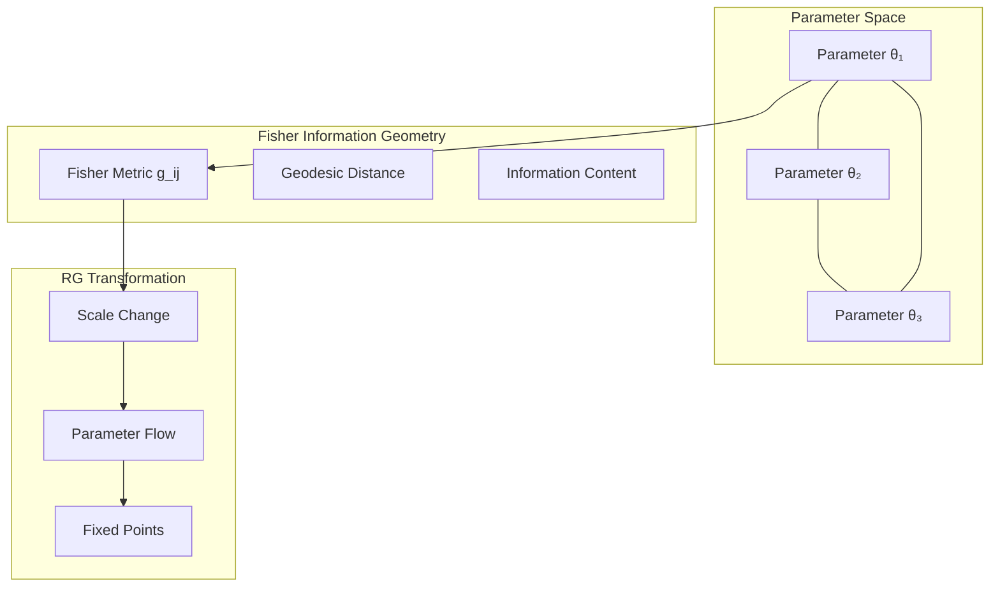

## Generative Models and Their Relation to RG

[[probabilistic_models|Generative models]] are probabilistic models used extensively in [[machine_learning|machine learning]] to represent complex data distributions. They aim at modeling data (e.g., images, text) as samples drawn from an unknown underlying distribution. The goal is typically either to generate new realistic samples (generative AI) or perform inference tasks such as anomaly detection or classification.

### Key Types of Generative Models

1. **[[variational_autoencoders|Variational Autoencoders (VAEs)]]**: Neural network-based generative models that learn compressed latent representations of data through variational inference.

1. **[[generative_adversarial_networks|Generative Adversarial Networks (GANs)]]**: A framework where two neural networks (generator and discriminator) compete in a minimax game.

1. **[[diffusion_models|Diffusion Models]]**: Models that learn to reverse a gradual noising process, generating data by iteratively denoising random noise.

1. **[[normalizing_flows|Normalizing Flows]]**: Invertible transformations that map a simple base distribution to a complex target distribution.

1. **[[energy_based_models|Energy-Based Models (EBMs)]]**: Define an energy function that assigns low energy to in-distribution samples.

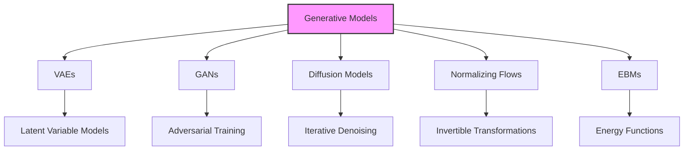

## Theoretical Connections Between RG and Generative Models

The conceptual parallels between RG and generative models are profound and multifaceted:

### Hierarchical Structure and Scale Separation

Both frameworks naturally implement hierarchical structures across different scales:

1. **In RG**: Physical systems are described through effective theories at different scales, with each level containing emergent properties not obvious at microscopic scales.

1. **In Generative Models**: Hierarchical generative models (like deep VAEs or flow-based models) learn representations at multiple scales, with higher levels capturing more abstract or coarse-grained features.

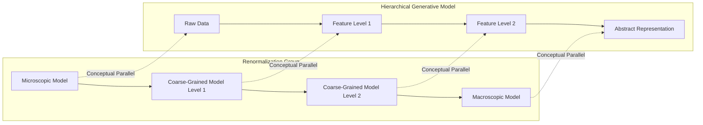

### Information Bottlenecks and Relevance

Both approaches naturally implement information bottlenecks:

1. **In RG**: Irrelevant microscopic details are systematically integrated out, keeping only information relevant at the observation scale.

1. **In Generative Models**: Particularly in VAEs, the latent space forms an information bottleneck where only statistically relevant features are preserved.

### RG Flow and Generative Process

The processes in both frameworks can be viewed through similar mathematical lenses:

1. **RG Flow**: A sequence of transformations mapping probability distributions at different scales.

1. **Generative Process**: A sequence of transformations mapping a simple prior distribution to a complex data distribution.

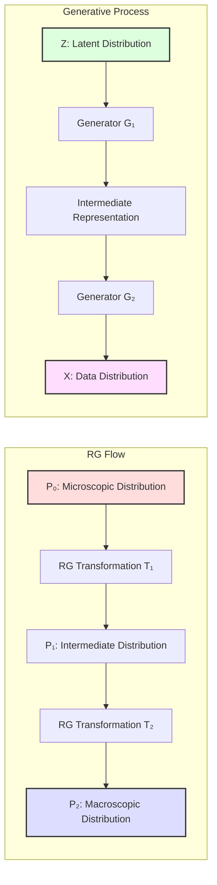

## Active Inference and Renormalization Group Theory

The [[active_inference_theory|Active Inference]] framework represents a significant extension of the connections between renormalization groups and generative models. Active Inference, rooted in the [[free_energy_principle|Free Energy Principle]], provides a unifying account of perception, learning, and action through hierarchical generative modeling and variational inference. The connections between Active Inference and RG reveal profound insights into how biological and artificial systems model and interact with their environments.

### Hierarchical Predictive Processing in Active Inference

Active Inference employs hierarchical generative models where:

1. Higher levels generate predictions about lower levels (top-down processing)

1. Prediction errors propagate upward (bottom-up processing)

1. The system dynamically minimizes [[variational_free_energy|variational free energy]] through perception, learning, and action

This hierarchical structure bears striking resemblance to RG procedures:

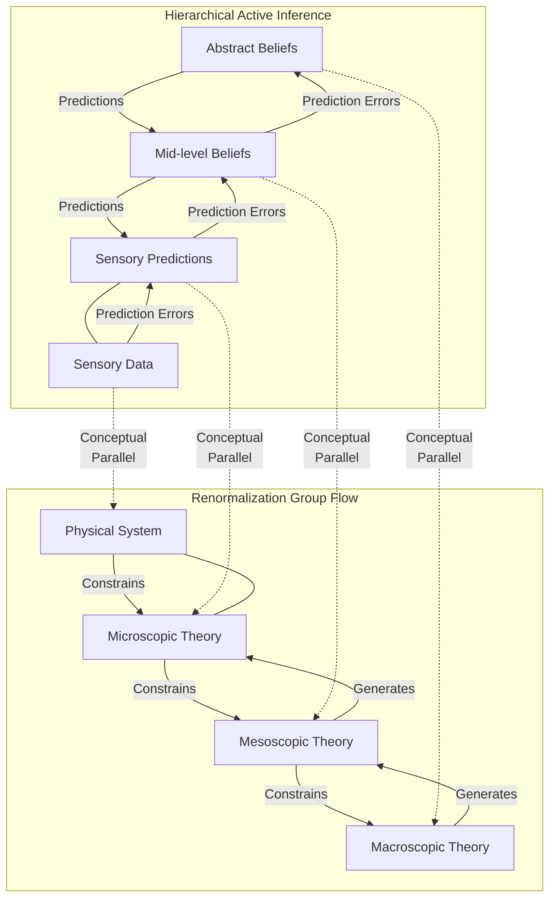

### Free Energy Minimization as Scale-Dependent Flow

The minimization of [[variational_free_energy|variational free energy]] (VFE) and [[expected_free_energy|expected free energy]] (EFE) in Active Inference has profound connections to RG flows:

1. **Scale-Dependent Information Flow**: Just as RG flows describe how information propagates across scales, minimizing free energy in Active Inference represents information flow across hierarchical levels.

1. **Precision-Weighting as Scale Parameter**: The precision parameters in Active Inference function analogously to scale parameters in RG, determining the relative influence of different hierarchical levels.

1. **Fixed Points and Attractors**: Both frameworks exhibit fixed points representing stable configurations - in RG these are critical points of phase transitions, while in Active Inference these represent learned patterns or behavioral policies.

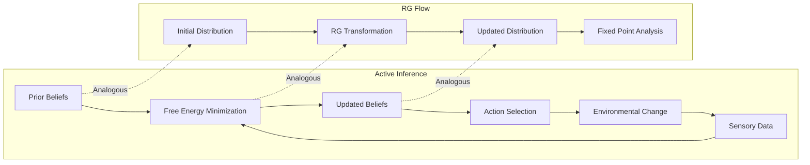

### Geometric Formulations

[[geometric_active_inference|Geometric Active Inference]] explicitly connects with the geometric interpretation of RG:

1. **Information Geometry**: Both frameworks leverage [[information_geometry|information geometry]] to characterize the space of probability distributions, with the Fisher information metric playing a central role.

1. **Geodesic Flows**: In geometric formulations of Active Inference, belief updating follows geodesic paths in statistical manifolds, analogous to RG flows in distribution space.

1. **Natural Gradient Descent**: Both approaches benefit from natural gradient methods that respect the information-geometric structure of parameter spaces.

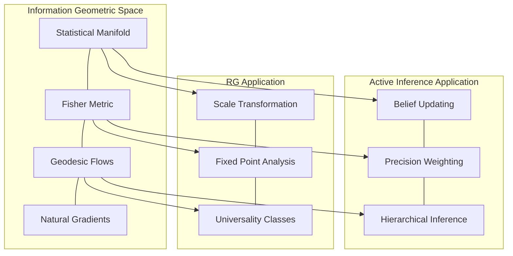

### Markov Blankets and Coarse-Graining

The concept of [[markov_blanket|Markov blankets]] in Active Inference provides a formal boundary separating internal and external states, with direct parallels to coarse-graining in RG:

1. **Statistical Independence**: Markov blankets induce conditional independence between internal and external states, analogous to how RG separates relevant from irrelevant degrees of freedom.

1. **Emergent Boundaries**: Just as RG identifies natural scales at which to describe physical systems, Markov blankets identify natural boundaries around self-organizing systems.

1. **Nested Hierarchies**: Both frameworks naturally support nested structures - hierarchical RG transformations and nested Markov blankets in complex adaptive systems.

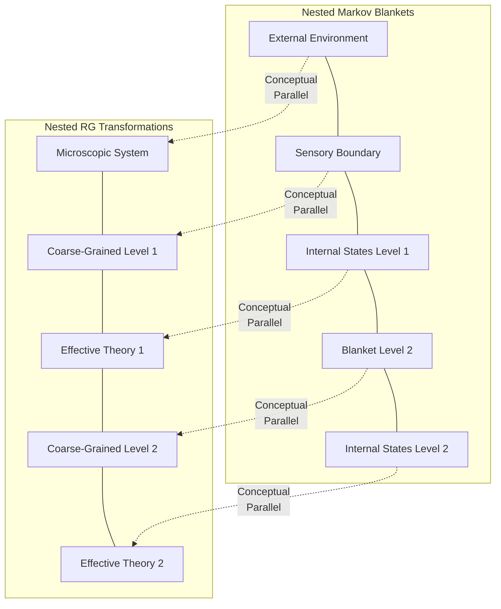

## Applications at the Interface

The confluence of RG methods and generative modeling has led to several innovative applications:

1. **[[renormalization_based_generative_models|Renormalization-Based Generative Models]]**: Generative models explicitly incorporating RG principles for multiscale generation.

1. **[[variational_renormalization_group|Variational Renormalization Group]]**: Using [[variational_inference|variational inference]] methods to approximate RG transformations.

1. **[[information_bottleneck|Information Bottleneck Methods]]**: Techniques explicitly optimizing the trade-off between compression and prediction.

1. **[[feature_disentanglement|Feature Disentanglement]]**: Methods separating features by their characteristic scales.

## Active Inference and Renormalization Group: Deep Connections

The [[active_inference_theory|Active Inference]] framework represents a particularly powerful extension of the connections between Renormalization Groups and generative models. Active Inference, rooted in the [[free_energy_principle|Free Energy Principle]], provides a unifying theory of perception, learning, and action through hierarchical generative modeling and variational inference.

### Hierarchical Predictive Processing as Scale Transformation

Active Inference employs hierarchical generative models where:

1. Higher levels in the cortical hierarchy generate predictions about lower levels (top-down processing)

1. Prediction errors propagate upward (bottom-up processing)

1. The system dynamically minimizes [[variational_free_energy|variational free energy]] through perception, learning, and action

This hierarchical structure bears striking resemblance to RG procedures:

### Precision Weighting as Scale Parameter

In Active Inference, precision parameters (inverse variances of prediction errors) determine the relative influence of different levels in the hierarchy. These precisions function strikingly similarly to scale parameters in RG:

1. **Higher Precision = Finer Scale**: High precision at a particular level means that level exerts strong constraints on adjacent levels, analogous to finer-scale physics constraining effective theories.

1. **Dynamic Precision Adjustment**: The brain actively modulates precision (through mechanisms like attention) to emphasize different scales of processing depending on context.

1. **Fixed Points in Learning**: Learning in Active Inference involves finding configurations where prediction errors are minimized across scales, analogous to identifying fixed points in RG flows.

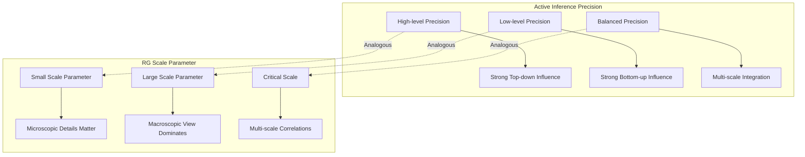

### Markov Blankets and Effective Field Theories

The concept of [[markov_blanket|Markov blankets]] in Active Inference provides a formal boundary separating internal and external states. This parallels how effective field theories in RG separate relevant from irrelevant degrees of freedom:

1. **Statistical Shielding**: Markov blankets statistically shield internal from external variables, just as RG procedures isolate relevant variables at each scale.

1. **Nested Structure**: Both frameworks naturally support nested hierarchies - RG transformations across multiple scales, and nested Markov blankets in complex biological systems.

1. **Emergent Autonomy**: Just as effective theories gain autonomy from microscopic details, systems with Markov blankets exhibit a degree of dynamical independence from their environment.

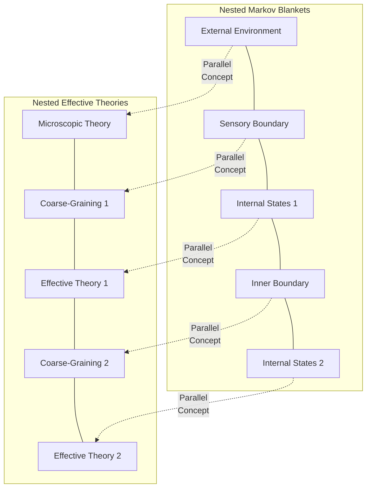

### Path Integral Formulations

The [[path_integral_free_energy|path integral formulation of active inference]] provides a particularly deep connection to RG methods:

1. **Action Minimization**: Both frameworks involve minimizing action-like functionals across configurations.

1. **[[stochastic_active_inference|Stochastic Dynamics]]**: Both can be expressed in terms of Langevin dynamics and other stochastic processes across scales.

1. **Least Action Principle**: The path of least variational free energy in Active Inference parallels the least action principle in physics that underlies RG.

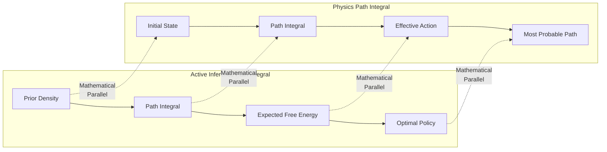

## Multi-Scale Applications of the Combined Framework

The synthesis of RG methods with Active Inference opens several powerful application domains:

### 1. Neuroscientific Models of Hierarchical Processing

The combined framework offers new perspectives in computational neuroscience:

- **Cortical Hierarchies**: Formal models of how the brain processes information at multiple scales simultaneously

- **Neuropsychiatric Disorders**: Understanding conditions like schizophrenia and autism as disorders of precision weighting across scales

- **Developmental Trajectories**: Modeling how the brain's generative models develop through progressively more sophisticated coarse-graining operations

### 2. Artificial Intelligence with Scale-Awareness

Novel AI architectures emerge from this intersection:

- **[[geometric_active_inference|Geometric Active Inference]]**: AI systems that explicitly represent the geometry of belief spaces across scales

- **[[measure_theoretic_active_inference|Measure-Theoretic Models]]**: Formal frameworks unifying probability theory, information geometry, and physical coarse-graining

- **Adaptive Resolution Systems**: AI that can dynamically adjust its processing resolution based on task demands

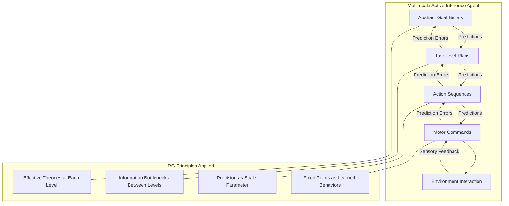

### 3. Complex Adaptive Systems Analysis

The combined framework provides powerful tools for analyzing complex systems:

- **[[emergence|Emergent Phenomena]]**: Formal characterization of how properties emerge at different scales

- **[[self_organization|Self-Organization]]**: Models of how systems self-organize through multi-scale free energy minimization

- **Phase Transitions in Behavior**: Identifying critical transitions in cognitive and behavioral patterns

## Open Questions and Future Directions

Several exciting open questions exist at this intersection:

1. Can we develop more rigorous mathematical connections between specific generative model architectures and RG flows?

1. How can we leverage RG-inspired approaches to improve generative model training and stability?

1. Can RG perspectives provide new insights into the interpretability of deep learning models?

1. What are the implications of this connection for [[information_theory|information-theoretic]] approaches to [[complex_systems|complex systems]]?

1. How can the synthesis of Active Inference and RG inform our understanding of consciousness and self-organization in biological systems?

1. Can we develop practical algorithms that leverage these connections for more efficient hierarchical learning in artificial systems?

1. How might these frameworks help bridge the gap between microscopic neural dynamics and macroscopic cognitive phenomena?

1. What role does the [[markov_blanket|Markov blanket]] formalism play in defining appropriate coarse-graining procedures in complex adaptive systems?

## Related Concepts

- [[statistical_physics|Statistical Physics]]

- [[variational_inference|Variational Inference]]

- [[information_theory|Information Theory]]

- [[probabilistic_graphical_models|Probabilistic Graphical Models]]

- [[machine_learning|Machine Learning]]

- [[complex_systems|Complex Systems]]

- [[information_geometry|Information Geometry]]

- [[bayesian_networks|Bayesian Networks]]

- [[active_inference_theory|Active Inference Theory]]

- [[free_energy_principle|Free Energy Principle]]

- [[variational_free_energy|Variational Free Energy]]

- [[expected_free_energy|Expected Free Energy]]

- [[markov_blanket|Markov Blanket]]

- [[stochastic_active_inference|Stochastic Active Inference]]

- [[geometric_active_inference|Geometric Active Inference]]

- [[measure_theoretic_active_inference|Measure-Theoretic Active Inference]]

- [[path_integral_free_energy|Path Integral Free Energy]]

