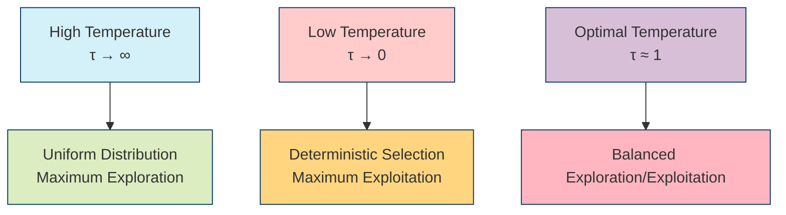

---

title: Softmax Function

type: mathematical_concept
id: softmax_function_001

status: stable

created: 2025-08-08
modified: 2025-12-03

tags: [mathematics, probability, optimization, normalization, active-inference]
aliases: [softargmax, normalized_exponential]

semantic_relations:

  - type: implements

    links: [[policy_selection]], [[action_distribution]]

  - type: foundation

    links: [[probability_theory]], [[information_theory]]

  - type: relates

    links: [[temperature_parameter]], [[precision_parameter]], [[numerical_stability]], [[exploration_exploitation]]

---

# Softmax Function

## Overview

The softmax function transforms a vector of real numbers into a probability distribution. It plays a crucial role in [[active_inference]] for converting expected free energies into action probabilities, enabling probabilistic decision-making under uncertainty.

```mermaid
graph LR
    A[Input Vector<br>x ∈ ℝⁿ] --> B[Softmax Function]
    B --> C[Probability Distribution<br>p ∈ [0,1]ⁿ, Σpᵢ=1]
    D[Temperature/Precision<br>Parameter] --> B
    style A fill:#d4f1f9,stroke:#05386b
    style B fill:#ffcccb,stroke:#05386b
    style C fill:#dcedc1,stroke:#05386b
    style D fill:#ffd580,stroke:#05386b
```

## Mathematical Definition

### Standard Softmax

```math
\operatorname{softmax}(x)_i = \frac{e^{x_i}}{\sum_{j=1}^n e^{x_j}} \quad \forall i \in \{1, \dots, n\}
```

### Tempered Softmax

```math
\operatorname{softmax}_\tau(x)_i = \frac{e^{x_i/\tau}}{\sum_{j=1}^n e^{x_j/\tau}}
```

where:
- $\tau > 0$ is the temperature parameter
- When $\tau \to 0$, the distribution becomes deterministic (winner-takes-all)
- When $\tau \to \infty$, the distribution becomes uniform

### Precision-Weighted Softmax

```math
\operatorname{softmax}_\gamma(x)_i = \frac{e^{\gamma x_i}}{\sum_{j=1}^n e^{\gamma x_j}}
```

where:
- $\gamma = 1/\tau$ is the precision parameter
- Higher precision concentrates probability mass on higher-value actions

## Properties

### Probabilistic Normalization

```math
\sum_{i=1}^n \operatorname{softmax}(x)_i = 1 \quad \forall x \in \mathbb{R}^n
```

### Convexity

The softmax function is convex and continuously differentiable.

### Log-Sum-Exp Relationship

```math
\ln \sum_{j=1}^n e^{x_j} = \operatorname{logsumexp}(x)
```

## Implementation

### Basic Implementation

```python
import numpy as np

def softmax(x, temperature=1.0):
    """Compute softmax with temperature parameter."""
    if temperature == 0:
        # Deterministic case
        result = np.zeros_like(x)
        result[np.argmax(x)] = 1.0
        return result

    # Apply temperature scaling
    scaled_x = x / temperature

    # For numerical stability, subtract max
    shifted_x = scaled_x - np.max(scaled_x)

    # Compute exponentials
    exp_x = np.exp(shifted_x)

    # Normalize
    return exp_x / np.sum(exp_x)
```

### Numerically Stable Implementation

```python
def softmax_stable(x, temperature=1.0):
    """Numerically stable softmax implementation."""
    if temperature == 0:
        result = np.zeros_like(x)
        result[np.argmax(x)] = 1.0
        return result

    # Temperature scaling
    scaled_x = x / temperature

    # Subtract maximum for numerical stability
    x_max = np.max(scaled_x)
    shifted_x = scaled_x - x_max

    # Compute exponentials
    exp_x = np.exp(shifted_x)

    # Normalize
    sum_exp = np.sum(exp_x)

    # Handle edge cases
    if sum_exp == 0:
        return np.ones_like(x) / len(x)  # Uniform distribution

    return exp_x / sum_exp
```

### Vectorized Implementation

```python
def softmax_batch(X, temperature=1.0):
    """Batch softmax for multiple vectors."""
    if temperature == 0:
        # Deterministic case
        batch_size, n = X.shape
        result = np.zeros_like(X)
        max_indices = np.argmax(X, axis=1)
        result[np.arange(batch_size), max_indices] = 1.0
        return result

    # Temperature scaling
    scaled_X = X / temperature

    # Subtract max along each row for stability
    X_max = np.max(scaled_X, axis=1, keepdims=True)
    shifted_X = scaled_X - X_max

    # Compute exponentials
    exp_X = np.exp(shifted_X)

    # Normalize along each row
    return exp_X / np.sum(exp_X, axis=1, keepdims=True)
```

### Gradient Computation

```python
def softmax_gradient(p):
    """Compute gradient of softmax output w.r.t. input."""
    # For softmax, the Jacobian is p_i * (δ_ij - p_j)
    n = len(p)
    jacobian = np.zeros((n, n))

    for i in range(n):
        for j in range(n):
            if i == j:
                jacobian[i, j] = p[i] * (1 - p[i])
            else:
                jacobian[i, j] = -p[i] * p[j]

    return jacobian
```

## Active Inference Context

### Policy Selection

In [[active_inference]], softmax converts expected free energies into action probabilities:

```math
p(a) = \operatorname{softmax}_\gamma(-G(a))
```

where:
- $G(a)$ is the [[expected_free_energy]] for action $a$
- $\gamma$ is the [[precision_parameter]]
- The negative sign ensures higher probability for lower free energy

### Exploration vs Exploitation



## Numerical Stability

### Common Issues

1. **Overflow**: Large positive inputs cause `exp()` overflow
2. **Underflow**: Large negative inputs cause `exp()` underflow
3. **Precision Loss**: Subtractive cancellation in normalization

### Solutions

```python
def softmax_safe(x, temperature=1.0, clip_value=500.0):
    """Numerically safe softmax with input clipping."""
    # Clip inputs to prevent overflow/underflow
    scaled_x = np.clip(x / temperature, -clip_value, clip_value)

    # Subtract max for additional stability
    x_max = np.max(scaled_x)
    shifted_x = scaled_x - x_max

    # Compute exponentials with clipping
    exp_x = np.exp(np.clip(shifted_x, -clip_value, clip_value))

    # Normalize
    sum_exp = np.sum(exp_x)

    if sum_exp == 0 or not np.isfinite(sum_exp):
        return np.ones_like(x) / len(x)  # Fallback to uniform

    return exp_x / sum_exp
```

### Log-Softmax for Stability

```python
def log_softmax(x, temperature=1.0):
    """Compute log probabilities directly for numerical stability."""
    scaled_x = x / temperature

    # Subtract max for stability
    x_max = np.max(scaled_x)
    shifted_x = scaled_x - x_max

    # Compute log-sum-exp
    log_sum_exp = x_max + np.log(np.sum(np.exp(shifted_x)))

    return shifted_x - log_sum_exp
```

## Applications

### Machine Learning

- **Classification**: Converting logits to probabilities in neural networks
- **Reinforcement Learning**: Policy gradients and action selection
- **Attention Mechanisms**: Weighted averaging in transformers

### Active Inference

- **Policy Selection**: Converting free energies to action probabilities
- **Belief Updating**: Soft normalization in probabilistic inference
- **Precision Control**: Temperature-based exploration modulation

### Optimization

- **Soft Constraints**: Relaxed constraint satisfaction
- **Regularization**: Entropy regularization in optimization
- **Sampling**: Importance sampling and Gibbs sampling

## Related Concepts

### Probability Distributions

- [[categorical_distribution]]
- [[gumbel_softmax]]
- [[sparsemax]]

### Decision Theory

- [[policy_selection]]
- [[action_distribution]]
- [[expected_free_energy]]

### Information Theory

- [[entropy]]
- [[kl_divergence]]
- [[mutual_information]]

## References

1. Bridle, J. S. (1990). Probabilistic interpretation of feedforward classification network outputs, with relationships to statistical pattern recognition.

1. Hinton, G. E., & Salakhutdinov, R. R. (2006). Reducing the dimensionality of data with neural networks.

1. Friston, K., FitzGerald, T., Rigoli, F., Schwartenbeck, P., & Pezzulo, G. (2017). Active inference: a process theory. Neural computation, 29(1), 1-49.

## See Also

- [[policy_selection]]
- [[action_distribution]]
- [[precision_parameter]]
- [[temperature_parameter]]
- [[numerical_stability]]
- [[exploration_exploitation]]
- [[active_inference]]

