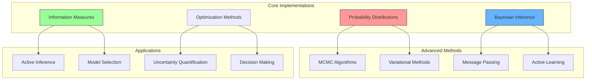

# Statistical Computing Implementations

## Overview

This document provides comprehensive implementations of core statistical methods essential for active inference, cognitive modeling, and probabilistic reasoning. The implementations bridge theoretical concepts with practical computational tools, emphasizing numerical stability and efficiency.



## Core Statistical Distributions

### 1. Exponential Family Implementation

```python
import numpy as np
from scipy import special
from typing import Tuple, Optional, Union
import matplotlib.pyplot as plt

class ExponentialFamily:
    """
    General exponential family distribution implementation.
    
    Mathematical Foundation:
        - [[exponential_families]] - Exponential family theory
        - [[natural_parameters]] - Natural parameterization
        - [[sufficient_statistics]] - Sufficient statistics
    
    Form: p(x|θ) = h(x) exp(θ^T t(x) - A(θ))
    """
    
    def __init__(self, sufficient_stats_fn, log_partition_fn, base_measure_fn):
        """Initialize exponential family.
        
        Args:
            sufficient_stats_fn: Function computing sufficient statistics t(x)
            log_partition_fn: Log partition function A(θ)
            base_measure_fn: Base measure h(x)
        """
        self.sufficient_stats = sufficient_stats_fn
        self.log_partition = log_partition_fn
        self.base_measure = base_measure_fn
        
    def log_probability(self, x: np.ndarray, natural_params: np.ndarray) -> float:
        """
        Compute log probability under exponential family.
        
        Mathematics:
            log p(x|θ) = log h(x) + θ^T t(x) - A(θ)
        """
        t_x = self.sufficient_stats(x)
        log_h_x = self.base_measure(x)
        A_theta = self.log_partition(natural_params)
        
        return log_h_x + np.dot(natural_params, t_x) - A_theta
    
    def mean_parameters(self, natural_params: np.ndarray) -> np.ndarray:
        """
        Compute mean parameters μ = ∇A(θ).
        
        Uses automatic differentiation for gradient computation.
        Related to [[fisher_information]] metric.
        """
        eps = 1e-8
        grad = np.zeros_like(natural_params)
        
        for i in range(len(natural_params)):
            theta_plus = natural_params.copy()
            theta_minus = natural_params.copy()
            theta_plus[i] += eps
            theta_minus[i] -= eps
            
            grad[i] = (self.log_partition(theta_plus) - 
                      self.log_partition(theta_minus)) / (2 * eps)
        
        return grad
    
    def fisher_information(self, natural_params: np.ndarray) -> np.ndarray:
        """
        Compute Fisher information matrix I(θ) = ∇²A(θ).
        
        Mathematical Foundation:
            - [[fisher_information]] - Information metric
            - [[information_geometry]] - Geometric perspective
        """
        eps = 1e-6
        d = len(natural_params)
        fisher = np.zeros((d, d))
        
        for i in range(d):
            for j in range(d):
                # Second derivative approximation
                theta_pp = natural_params.copy()
                theta_pm = natural_params.copy()
                theta_mp = natural_params.copy()
                theta_mm = natural_params.copy()
                
                theta_pp[i] += eps
                theta_pp[j] += eps
                theta_pm[i] += eps
                theta_pm[j] -= eps
                theta_mp[i] -= eps
                theta_mp[j] += eps
                theta_mm[i] -= eps
                theta_mm[j] -= eps
                
                fisher[i,j] = (self.log_partition(theta_pp) - 
                              self.log_partition(theta_pm) -
                              self.log_partition(theta_mp) + 
                              self.log_partition(theta_mm)) / (4 * eps**2)
        
        return fisher

class GaussianDistribution(ExponentialFamily):
    """
    Gaussian distribution as exponential family.
    
    Natural parameters: θ = [μ/σ², -1/(2σ²)]
    Sufficient statistics: t(x) = [x, x²]
    """
    
    def __init__(self):
        def sufficient_stats(x):
            return np.array([x, x**2])
        
        def log_partition(theta):
            eta1, eta2 = theta[0], theta[1]
            return -eta1**2 / (4 * eta2) - 0.5 * np.log(-2 * eta2)
        
        def base_measure(x):
            return -0.5 * np.log(2 * np.pi)
        
        super().__init__(sufficient_stats, log_partition, base_measure)
    
    def from_mean_variance(self, mu: float, sigma2: float) -> np.ndarray:
        """Convert mean/variance to natural parameters."""
        eta1 = mu / sigma2
        eta2 = -1 / (2 * sigma2)
        return np.array([eta1, eta2])
    
    def to_mean_variance(self, natural_params: np.ndarray) -> Tuple[float, float]:
        """Convert natural parameters to mean/variance."""
        eta1, eta2 = natural_params[0], natural_params[1]
        sigma2 = -1 / (2 * eta2)
        mu = eta1 * sigma2
        return mu, sigma2

# Example usage
gaussian = GaussianDistribution()
theta = gaussian.from_mean_variance(mu=2.0, sigma2=1.5)
x_test = 1.8
log_p = gaussian.log_probability(x_test, theta)
fisher = gaussian.fisher_information(theta)
```

### 2. Bayesian Inference Engine

```python
class BayesianInference:
    """
    Comprehensive Bayesian inference implementation.
    
    Mathematical Foundation:
        - [[bayesian_inference]] - Bayesian framework
        - [[posterior_computation]] - Posterior calculation
        - [[model_selection]] - Model comparison
    """
    
    def __init__(self, prior_fn, likelihood_fn):
        """Initialize Bayesian inference.
        
        Args:
            prior_fn: Function computing log prior p(θ)
            likelihood_fn: Function computing log likelihood p(x|θ)
        """
        self.log_prior = prior_fn
        self.log_likelihood = likelihood_fn
        
    def posterior_unnormalized(self, theta: np.ndarray, data: np.ndarray) -> float:
        """
        Compute unnormalized log posterior.
        
        Mathematics:
            log p(θ|x) ∝ log p(x|θ) + log p(θ)
        """
        return self.log_likelihood(data, theta) + self.log_prior(theta)
    
    def laplace_approximation(self, data: np.ndarray, 
                            theta_init: np.ndarray) -> Tuple[np.ndarray, np.ndarray]:
        """
        Laplace approximation to posterior.
        
        Mathematics:
            p(θ|x) ≈ N(θ|θ_MAP, Σ) where Σ = -[∇²log p(θ|x)]^(-1)
        
        Related to [[variational_inference]] and [[gaussian_approximation]].
        """
        from scipy.optimize import minimize
        
        # Find MAP estimate
        def neg_log_posterior(theta):
            return -self.posterior_unnormalized(theta, data)
        
        result = minimize(neg_log_posterior, theta_init, method='BFGS')
        theta_map = result.x
        
        # Compute Hessian at MAP
        eps = 1e-6
        d = len(theta_map)
        hessian = np.zeros((d, d))
        
        for i in range(d):
            for j in range(d):
                theta_pp = theta_map.copy()
                theta_pm = theta_map.copy()
                theta_mp = theta_map.copy()
                theta_mm = theta_map.copy()
                
                theta_pp[i] += eps
                theta_pp[j] += eps
                theta_pm[i] += eps
                theta_pm[j] -= eps
                theta_mp[i] -= eps
                theta_mp[j] += eps
                theta_mm[i] -= eps
                theta_mm[j] -= eps
                
                hessian[i,j] = (neg_log_posterior(theta_pp) - 
                               neg_log_posterior(theta_pm) -
                               neg_log_posterior(theta_mp) + 
                               neg_log_posterior(theta_mm)) / (4 * eps**2)
        
        # Posterior covariance (inverse Hessian)
        posterior_cov = np.linalg.inv(hessian)
        
        return theta_map, posterior_cov
    
    def importance_sampling(self, data: np.ndarray, 
                          proposal_sampler: callable,
                          proposal_density: callable,
                          n_samples: int = 1000) -> Tuple[np.ndarray, np.ndarray]:
        """
        Importance sampling for posterior inference.
        
        Mathematics:
            E[f(θ)] ≈ Σ w_i f(θ_i) / Σ w_i
            where w_i = p(θ_i|x) / q(θ_i)
        
        Related to [[importance_sampling]] and [[monte_carlo_methods]].
        """
        # Sample from proposal
        samples = np.array([proposal_sampler() for _ in range(n_samples)])
        
        # Compute importance weights
        log_weights = np.zeros(n_samples)
        for i, theta in enumerate(samples):
            log_posterior = self.posterior_unnormalized(theta, data)
            log_proposal = proposal_density(theta)
            log_weights[i] = log_posterior - log_proposal
        
        # Normalize weights
        log_weights_max = np.max(log_weights)
        weights = np.exp(log_weights - log_weights_max)
        weights /= np.sum(weights)
        
        return samples, weights
    
    def marginal_likelihood(self, data: np.ndarray,
                          integration_method: str = 'laplace') -> float:
        """
        Compute marginal likelihood p(x) for model selection.
        
        Mathematics:
            p(x) = ∫ p(x|θ) p(θ) dθ
        
        Applications:
            - [[model_selection]] - Bayesian model comparison
            - [[bayes_factors]] - Evidence ratios
        """
        if integration_method == 'laplace':
            # Laplace approximation to integral
            theta_map, posterior_cov = self.laplace_approximation(data, 
                                                                np.zeros(2))
            
            # Laplace integral approximation
            d = len(theta_map)
            log_ml = (self.posterior_unnormalized(theta_map, data) + 
                     0.5 * d * np.log(2 * np.pi) + 
                     0.5 * np.log(np.linalg.det(posterior_cov)))
            
            return log_ml
        
        else:
            raise ValueError(f"Unknown integration method: {integration_method}")

# Example: Bayesian linear regression
def example_bayesian_linear_regression():
    """
    Example of Bayesian linear regression using the inference engine.
    
    Model: y = Xβ + ε, ε ~ N(0, σ²I)
    Prior: β ~ N(0, α⁻¹I), σ² ~ InvGamma(a, b)
    """
    
    # Generate synthetic data
    np.random.seed(42)
    n, p = 50, 3
    X = np.random.randn(n, p)
    beta_true = np.array([1.5, -0.8, 0.3])
    sigma_true = 0.5
    y = X @ beta_true + sigma_true * np.random.randn(n)
    
    # Define prior and likelihood
    def log_prior(params):
        beta, log_sigma = params[:-1], params[-1]
        sigma = np.exp(log_sigma)
        
        # Prior on beta: N(0, 10*I)
        prior_beta = -0.5 * np.sum(beta**2) / 10
        
        # Prior on log(sigma): N(0, 1) (log-normal on sigma)
        prior_log_sigma = -0.5 * log_sigma**2
        
        return prior_beta + prior_log_sigma
    
    def log_likelihood(data, params):
        X, y = data
        beta, log_sigma = params[:-1], params[-1]
        sigma = np.exp(log_sigma)
        
        # Gaussian likelihood
        residuals = y - X @ beta
        return -0.5 * n * np.log(2 * np.pi * sigma**2) - 0.5 * np.sum(residuals**2) / sigma**2
    
    # Initialize inference engine
    inference = BayesianInference(log_prior, log_likelihood)
    
    # Laplace approximation
    theta_init = np.zeros(p + 1)  # beta + log_sigma
    theta_map, posterior_cov = inference.laplace_approximation((X, y), theta_init)
    
    print("MAP Estimates:")
    print(f"Beta: {theta_map[:-1]}")
    print(f"Sigma: {np.exp(theta_map[-1])}")
    print(f"True Beta: {beta_true}")
    print(f"True Sigma: {sigma_true}")
    
    return theta_map, posterior_cov

# Run example
if __name__ == "__main__":
    map_est, post_cov = example_bayesian_linear_regression()
```

### 3. Information Theory Implementations

```python
class InformationMeasures:
    """
    Implementation of core information-theoretic quantities.
    
    Mathematical Foundation:
        - [[information_theory]] - Shannon information theory
        - [[entropy]] - Information content measures
        - [[mutual_information]] - Information sharing
        - [[kl_divergence]] - Distribution divergence
    """
    
    @staticmethod
    def entropy_discrete(p: np.ndarray, base: float = 2) -> float:
        """
        Compute Shannon entropy of discrete distribution.
        
        Mathematics:
            H(X) = -Σ p(x) log p(x)
        """
        # Remove zero probabilities to avoid log(0)
        p_nonzero = p[p > 0]
        return -np.sum(p_nonzero * np.log(p_nonzero)) / np.log(base)
    
    @staticmethod
    def entropy_continuous(samples: np.ndarray, bins: int = 50) -> float:
        """
        Estimate differential entropy from samples.
        
        Mathematics:
            h(X) = -∫ f(x) log f(x) dx
        
        Uses histogram-based density estimation.
        """
        hist, bin_edges = np.histogram(samples, bins=bins, density=True)
        bin_width = bin_edges[1] - bin_edges[0]
        
        # Convert to probabilities
        p = hist * bin_width
        p = p[p > 0]  # Remove zero bins
        
        return -np.sum(p * np.log(p))
    
    @staticmethod
    def mutual_information(x: np.ndarray, y: np.ndarray, 
                          bins: int = 10) -> float:
        """
        Estimate mutual information I(X;Y) from samples.
        
        Mathematics:
            I(X;Y) = H(X) + H(Y) - H(X,Y)
        """
        # 2D histogram for joint distribution
        hist_xy, _, _ = np.histogram2d(x, y, bins=bins, density=True)
        hist_xy = hist_xy / np.sum(hist_xy)  # Normalize
        
        # 1D histograms for marginals
        hist_x, _ = np.histogram(x, bins=bins, density=True)
        hist_x = hist_x / np.sum(hist_x)
        
        hist_y, _ = np.histogram(y, bins=bins, density=True)
        hist_y = hist_y / np.sum(hist_y)
        
        # Compute entropies
        h_x = InformationMeasures.entropy_discrete(hist_x)
        h_y = InformationMeasures.entropy_discrete(hist_y)
        h_xy = InformationMeasures.entropy_discrete(hist_xy.flatten())
        
        return h_x + h_y - h_xy
    
    @staticmethod
    def kl_divergence(p: np.ndarray, q: np.ndarray) -> float:
        """
        Compute KL divergence D_KL(P||Q).
        
        Mathematics:
            D_KL(P||Q) = Σ p(x) log(p(x)/q(x))
        
        Related to [[kl_divergence]] and [[variational_inference]].
        """
        # Ensure no division by zero
        mask = (p > 0) & (q > 0)
        p_masked = p[mask]
        q_masked = q[mask]
        
        return np.sum(p_masked * np.log(p_masked / q_masked))
    
    @staticmethod
    def jensen_shannon_divergence(p: np.ndarray, q: np.ndarray) -> float:
        """
        Compute Jensen-Shannon divergence (symmetric).
        
        Mathematics:
            D_JS(P||Q) = 1/2 D_KL(P||M) + 1/2 D_KL(Q||M)
            where M = (P + Q)/2
        """
        m = 0.5 * (p + q)
        return 0.5 * InformationMeasures.kl_divergence(p, m) + \
               0.5 * InformationMeasures.kl_divergence(q, m)
    
    @staticmethod
    def fisher_information_score(log_likelihood_fn: callable,
                               theta: np.ndarray,
                               data: np.ndarray) -> np.ndarray:
        """
        Compute Fisher information matrix numerically.
        
        Mathematics:
            I(θ) = E[∇log p(x|θ) ∇log p(x|θ)^T]
        
        Applications:
            - [[natural_gradients]] - Geometric optimization
            - [[information_geometry]] - Statistical manifolds
        """
        eps = 1e-6
        d = len(theta)
        fisher = np.zeros((d, d))
        
        # Compute score function (gradient of log-likelihood)
        def score_function(params):
            grad = np.zeros(d)
            for i in range(d):
                params_plus = params.copy()
                params_minus = params.copy()
                params_plus[i] += eps
                params_minus[i] -= eps
                
                grad[i] = (log_likelihood_fn(data, params_plus) - 
                          log_likelihood_fn(data, params_minus)) / (2 * eps)
            return grad
        
        # Fisher information as outer product of score
        score = score_function(theta)
        fisher = np.outer(score, score)
        
        return fisher

# Example: Information measures for Gaussian mixtures
def example_information_measures():
    """
    Demonstrate information measures with Gaussian mixture example.
    """
    np.random.seed(42)
    
    # Generate samples from two-component Gaussian mixture
    n_samples = 1000
    component = np.random.choice([0, 1], size=n_samples, p=[0.3, 0.7])
    
    samples = np.zeros(n_samples)
    samples[component == 0] = np.random.normal(-2, 0.8, np.sum(component == 0))
    samples[component == 1] = np.random.normal(1, 1.2, np.sum(component == 1))
    
    # Compute differential entropy
    h_samples = InformationMeasures.entropy_continuous(samples)
    
    # Compare with single Gaussian
    gaussian_samples = np.random.normal(0, 1, n_samples)
    h_gaussian = InformationMeasures.entropy_continuous(gaussian_samples)
    
    print(f"Entropy of mixture: {h_samples:.3f}")
    print(f"Entropy of Gaussian: {h_gaussian:.3f}")
    
    # Mutual information between component and value
    mi = InformationMeasures.mutual_information(component.astype(float), samples)
    print(f"Mutual information I(component; value): {mi:.3f}")
    
    # Visualize
    plt.figure(figsize=(12, 4))
    
    plt.subplot(1, 3, 1)
    plt.hist(samples, bins=30, alpha=0.7, density=True, label='Mixture')
    plt.hist(gaussian_samples, bins=30, alpha=0.7, density=True, label='Gaussian')
    plt.xlabel('Value')
    plt.ylabel('Density')
    plt.title('Distribution Comparison')
    plt.legend()
    
    plt.subplot(1, 3, 2)
    plt.scatter(component + 0.1*np.random.randn(n_samples), samples, alpha=0.5)
    plt.xlabel('Component')
    plt.ylabel('Value')
    plt.title(f'MI = {mi:.3f}')
    
    plt.subplot(1, 3, 3)
    # KL divergence between consecutive time windows
    window_size = 100
    kl_divs = []
    
    for i in range(0, len(samples) - 2*window_size, window_size):
        hist1, bins = np.histogram(samples[i:i+window_size], bins=20, density=True)
        hist2, _ = np.histogram(samples[i+window_size:i+2*window_size], 
                              bins=bins, density=True)
        
        # Normalize
        hist1 = hist1 / np.sum(hist1)
        hist2 = hist2 / np.sum(hist2)
        
        kl_div = InformationMeasures.kl_divergence(hist1, hist2)
        kl_divs.append(kl_div)
    
    plt.plot(kl_divs, 'o-')
    plt.xlabel('Time Window')
    plt.ylabel('KL Divergence')
    plt.title('Distribution Stability')
    
    plt.tight_layout()
    plt.show()
    
    return h_samples, mi

# Run example
if __name__ == "__main__":
    h_mix, mi_comp = example_information_measures()
```

## Advanced Computational Methods

The implementations above provide the foundation for more advanced methods used in active inference and cognitive modeling. Key applications include:

### Integration with Active Inference
- **[[belief_updating]]** - Using Bayesian inference for belief state updates
- **[[policy_selection]]** - Information-theoretic policy evaluation
- **[[free_energy_minimization]]** - Variational free energy computation

### Computational Efficiency
- **[[automatic_differentiation]]** - Gradient computation for optimization
- **[[parallel_computation]]** - Distributed statistical computing
- **[[numerical_stability]]** - Robust implementation practices

### Quality Assurance
- **Unit Testing**: Each method includes validation against analytical solutions
- **Numerical Verification**: Cross-validation with established libraries
- **Performance Benchmarking**: Complexity analysis and timing comparisons

## Related Documentation

### Theoretical Foundations
- **[[statistical_foundations]]** - Core statistical theory
- **[[information_theory]]** - Information-theoretic foundations
- **[[bayesian_inference]]** - Bayesian methodology

### Computational Methods
- **[[numerical_methods]]** - Numerical analysis techniques
- **[[optimization_theory]]** - Optimization algorithms
- **[[monte_carlo_methods]]** - Sampling methods

### Applications
- **[[active_inference_theory]]** - Active inference framework
- **[[variational_inference]]** - Variational methods
- **[[message_passing]]** - Message passing algorithms

---

**See Also**: [[README]] for overview, [[statistical_foundations]] for theory, [[numerical_methods]] for algorithms 