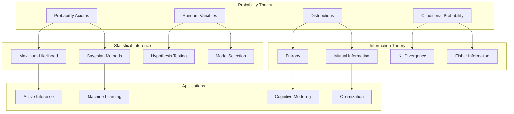

# Statistical Foundations

## Overview

Statistical foundations provide the mathematical bedrock for all probabilistic reasoning, cognitive modeling, and active inference. This comprehensive framework encompasses probability theory, statistical inference, information theory, and optimization methods that underpin modern computational approaches to understanding intelligent systems.



## Mathematical Prerequisites

Understanding statistical foundations requires familiarity with:
- [[measure_theory]] - Rigorous probability foundations
- [[calculus]] - Differentiation and integration
- [[linear_algebra]] - Vector spaces and matrix operations
- [[real_analysis]] - Convergence and continuity concepts

## Probability Theory

### Core Axioms and Definitions

The foundation of probability rests on three axioms (Kolmogorov, 1933):

```math
\begin{aligned}
& \text{Axiom 1: } P(A) \geq 0 \text{ for all events } A \\
& \text{Axiom 2: } P(\Omega) = 1 \text{ where } \Omega \text{ is the sample space} \\
& \text{Axiom 3: } P\left(\bigcup_{i=1}^{\infty} A_i\right) = \sum_{i=1}^{\infty} P(A_i) \text{ for disjoint events}
\end{aligned}
```

**Key Concepts:**
- **[[probability_theory]]** - Fundamental probability theory
- **[[measure_theory]]** - Measure-theoretic foundations
- **[[random_variables]]** - Random variable theory
- **[[probability_distributions]]** - Distribution families

### Random Variables and Distributions

A random variable $X$ is a measurable function from the sample space to the real numbers:

```math
X: \Omega \to \mathbb{R}
```

**Distribution Functions:**
- **Cumulative Distribution Function (CDF)**: $F_X(x) = P(X \leq x)$
- **Probability Density Function (PDF)**: $f_X(x) = \frac{dF_X(x)}{dx}$ (for continuous)
- **Probability Mass Function (PMF)**: $p_X(x) = P(X = x)$ (for discrete)

**Important Distribution Families:**
- **[[exponential_families]]** - Exponential family distributions
- **[[gaussian_distributions]]** - Normal distributions
- **[[conjugate_priors]]** - Conjugate prior families
- **[[maximum_entropy_distributions]]** - MaxEnt principles

### Conditional Probability and Independence

**Conditional Probability:**
```math
P(A|B) = \frac{P(A \cap B)}{P(B)} \quad \text{if } P(B) > 0
```

**Independence:**
```math
P(A \cap B) = P(A)P(B) \iff A \perp B
```

**Conditional Independence:**
```math
A \perp B | C \iff P(A \cap B | C) = P(A|C)P(B|C)
```

Related concepts: [[conditional_independence]], [[d_separation]], [[markov_properties]]

### Advanced Probability Theory

**Stochastic Processes:**
- **[[stochastic_processes]]** - Random processes theory
- **[[markov_processes]]** - Markovian dynamics
- **[[martingale_theory]]** - Martingales and stopping times
- **[[brownian_motion]]** - Wiener processes

**Limit Theorems:**
- **Law of Large Numbers**: Sample means converge to population means
- **Central Limit Theorem**: Normalized sums converge to normal distributions
- **[[ergodic_theory]]** - Long-term behavior of dynamical systems

## Statistical Inference

Statistical inference provides methods for drawing conclusions about populations from sample data, handling uncertainty through probabilistic reasoning.

### Maximum Likelihood Estimation

**Likelihood Function:**
For data $\mathbf{x} = (x_1, \ldots, x_n)$ and parameter $\theta$:

```math
L(\theta; \mathbf{x}) = \prod_{i=1}^n f(x_i; \theta)
```

**Maximum Likelihood Estimator:**
```math
\hat{\theta}_{ML} = \arg\max_\theta L(\theta; \mathbf{x}) = \arg\max_\theta \log L(\theta; \mathbf{x})
```

**Properties:**
- **Consistency**: $\hat{\theta}_{ML} \xrightarrow{p} \theta_0$ as $n \to \infty$
- **Asymptotic Normality**: $\sqrt{n}(\hat{\theta}_{ML} - \theta_0) \xrightarrow{d} \mathcal{N}(0, I(\theta_0)^{-1})$
- **Efficiency**: Achieves Cramér-Rao lower bound asymptotically

Related: [[maximum_likelihood]], [[fisher_information]], [[asymptotic_theory]]

### Bayesian Inference

**Bayes' Theorem:**
```math
p(\theta|\mathbf{x}) = \frac{p(\mathbf{x}|\theta)p(\theta)}{p(\mathbf{x})} \propto p(\mathbf{x}|\theta)p(\theta)
```

**Components:**
- **Prior**: $p(\theta)$ - beliefs before observing data
- **Likelihood**: $p(\mathbf{x}|\theta)$ - data generating process
- **Posterior**: $p(\theta|\mathbf{x})$ - updated beliefs
- **Evidence**: $p(\mathbf{x}) = \int p(\mathbf{x}|\theta)p(\theta)d\theta$

**Posterior Computation Methods:**
- **[[conjugate_priors]]** - Analytic posterior forms
- **[[mcmc]]** - Markov Chain Monte Carlo
- **[[variational_inference]]** - Variational approximation
- **[[importance_sampling]]** - Weighted sampling

**Bayesian Decision Theory:**
```math
\delta^* = \arg\min_\delta \int L(\theta, \delta) p(\theta|\mathbf{x}) d\theta
```

Related: [[bayesian_inference]], [[posterior_computation]], [[model_selection]]

### Hypothesis Testing

**Classical Framework:**
- **Null Hypothesis**: $H_0: \theta \in \Theta_0$
- **Alternative Hypothesis**: $H_1: \theta \in \Theta_1$
- **Test Statistic**: $T(\mathbf{x})$
- **Critical Region**: $R = \{x: T(x) > c\}$

**Error Types:**
- **Type I Error**: $\alpha = P(\text{Reject } H_0 | H_0 \text{ true})$
- **Type II Error**: $\beta = P(\text{Accept } H_0 | H_1 \text{ true})$
- **Power**: $1 - \beta = P(\text{Reject } H_0 | H_1 \text{ true})$

**Neyman-Pearson Lemma:**
Most powerful test for simple hypotheses uses likelihood ratio:
```math
\Lambda(\mathbf{x}) = \frac{L(\theta_1; \mathbf{x})}{L(\theta_0; \mathbf{x})}
```

**Bayesian Hypothesis Testing:**
- **Bayes Factor**: $BF_{10} = \frac{p(\mathbf{x}|H_1)}{p(\mathbf{x}|H_0)}$
- **Posterior Odds**: $\frac{p(H_1|\mathbf{x})}{p(H_0|\mathbf{x})} = BF_{10} \times \frac{p(H_1)}{p(H_0)}$

Related: [[hypothesis_testing]], [[neyman_pearson]], [[bayes_factors]]

### Model Selection and Validation

**Information Criteria:**
- **Akaike Information Criterion**: $AIC = 2k - 2\log L$
- **Bayesian Information Criterion**: $BIC = k\log n - 2\log L$
- **Deviance Information Criterion**: $DIC = \bar{D} + p_D$

**Cross-Validation:**
- **Leave-One-Out**: $CV = \frac{1}{n}\sum_{i=1}^n L(y_i, \hat{y}_{-i})$
- **K-Fold**: Partition data into $k$ folds
- **Time Series CV**: Respect temporal ordering

**Bayesian Model Selection:**
- **Marginal Likelihood**: $p(\mathbf{x}|M) = \int p(\mathbf{x}|\theta, M)p(\theta|M)d\theta$
- **Model Posterior**: $p(M|\mathbf{x}) \propto p(\mathbf{x}|M)p(M)$

Related: [[model_selection]], [[cross_validation]], [[information_criteria]]

## Information Theory

Information theory provides the mathematical foundation for quantifying uncertainty, information content, and the efficiency of information transmission and storage.

### Shannon Entropy

**Discrete Entropy:**
For a discrete random variable $X$ with PMF $p(x)$:
```math
H(X) = -\sum_{x} p(x) \log p(x)
```

**Differential Entropy:**
For a continuous random variable with PDF $f(x)$:
```math
h(X) = -\int f(x) \log f(x) dx
```

**Properties:**
- **Non-negativity**: $H(X) \geq 0$
- **Maximum**: $H(X) \leq \log |X|$ with equality for uniform distribution
- **Additivity**: $H(X,Y) = H(X) + H(Y|X)$

Related: [[entropy]], [[maximum_entropy_principle]], [[differential_entropy]]

### Mutual Information

**Definition:**
```math
I(X;Y) = \sum_{x,y} p(x,y) \log \frac{p(x,y)}{p(x)p(y)} = H(X) - H(X|Y)
```

**Properties:**
- **Symmetry**: $I(X;Y) = I(Y;X)$
- **Non-negativity**: $I(X;Y) \geq 0$
- **Chain Rule**: $I(X;Y,Z) = I(X;Y) + I(X;Z|Y)$

**Conditional Mutual Information:**
```math
I(X;Y|Z) = H(X|Z) - H(X|Y,Z)
```

Related: [[mutual_information]], [[conditional_mutual_information]], [[information_gain]]

### Divergence Measures

**Kullback-Leibler Divergence:**
```math
D_{KL}(P||Q) = \sum_x p(x) \log \frac{p(x)}{q(x)} = \mathbb{E}_P\left[\log \frac{p(X)}{q(X)}\right]
```

**Properties:**
- **Non-negativity**: $D_{KL}(P||Q) \geq 0$ with equality iff $P = Q$
- **Asymmetry**: $D_{KL}(P||Q) \neq D_{KL}(Q||P)$ in general
- **Convexity**: KL divergence is convex in both arguments

**Jensen-Shannon Divergence:**
```math
D_{JS}(P||Q) = \frac{1}{2}D_{KL}\left(P||\frac{P+Q}{2}\right) + \frac{1}{2}D_{KL}\left(Q||\frac{P+Q}{2}\right)
```

Related: [[kl_divergence]], [[jensen_shannon_divergence]], [[f_divergences]]

### Fisher Information

**Fisher Information Matrix:**
For parameter $\theta$:
```math
I_{ij}(\theta) = \mathbb{E}\left[\frac{\partial \log p(X|\theta)}{\partial \theta_i}\frac{\partial \log p(X|\theta)}{\partial \theta_j}\right]
```

**Cramér-Rao Bound:**
For any unbiased estimator $\hat{\theta}$:
```math
\text{Var}(\hat{\theta}) \geq I(\theta)^{-1}
```

**Connection to KL Divergence:**
```math
I(\theta) = \lim_{\epsilon \to 0} \frac{2}{\epsilon^2} D_{KL}(p(\cdot|\theta) || p(\cdot|\theta + \epsilon))
```

Related: [[fisher_information]], [[information_geometry]], [[cramer_rao_bound]]

### Information-Theoretic Applications

**Active Learning:**
Select data points that maximize information gain:
```math
x^* = \arg\max_x I(\theta; y|x)
```

**Model Selection:**
Minimum Description Length principle:
```math
\text{MDL} = -\log p(\mathbf{x}|\hat{\theta}) + \frac{k}{2}\log n
```

**Channel Capacity:**
Maximum information transmission rate:
```math
C = \max_{p(x)} I(X;Y)
```

Related: [[information_gain]], [[minimum_description_length]], [[channel_capacity]]

## Optimization Methods

### Gradient-Based
- [[gradient_descent]] - First-order methods
- [[natural_gradients]] - Information geometry
- [[conjugate_gradients]] - Second-order methods
- [[stochastic_optimization]] - Stochastic methods

### Variational Methods
- [[variational_inference]] - VI algorithms
- [[expectation_maximization]] - EM algorithm
- [[variational_bayes]] - VB methods
- [[message_passing]] - Message algorithms

## Implementation

### Numerical Methods
- [[monte_carlo]] - MC methods
- [[importance_sampling]] - IS techniques
- [[mcmc]] - MCMC algorithms
- [[particle_methods]] - Particle filters

### Software Tools
- [[statistical_computing]] - Computing tools
- [[probabilistic_programming]] - PPL frameworks
- [[inference_engines]] - Inference libraries
- [[visualization_tools]] - Plotting utilities

## Applications

### Model Validation
- [[cross_validation]] - CV methods
- [[bootstrapping]] - Bootstrap techniques
- [[model_diagnostics]] - Diagnostic tools
- [[residual_analysis]] - Residual checks

### Performance Analysis
- [[convergence_analysis]] - Convergence study
- [[complexity_analysis]] - Computational cost
- [[stability_analysis]] - Numerical stability
- [[sensitivity_analysis]] - Parameter sensitivity

## Documentation Links
- [[../../docs/research/research_documentation_index|Research Documentation]]
- [[../../docs/guides/implementation_guides_index|Implementation Guides]]
- [[../../docs/api/api_documentation_index|API Documentation]]
- [[../../docs/examples/usage_examples_index|Usage Examples]]

## References
- [[casella_berger]] - Statistical Inference
- [[mackay]] - Information Theory
- [[robert_casella]] - Monte Carlo Methods
- [[bishop]] - Pattern Recognition 