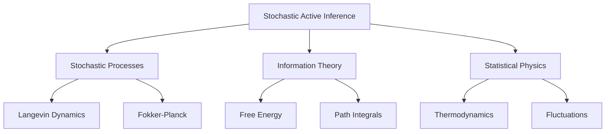
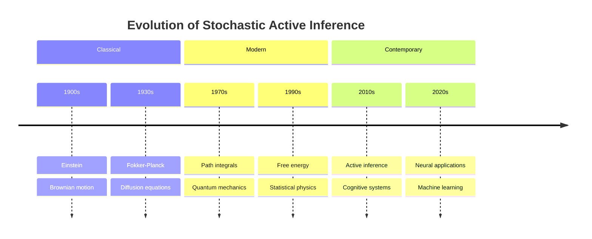
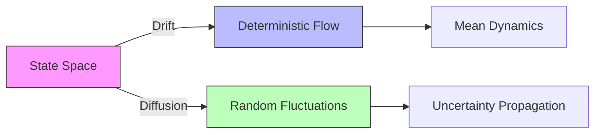
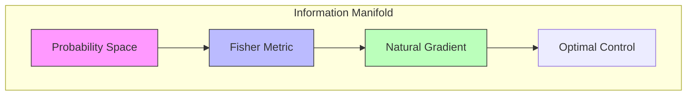
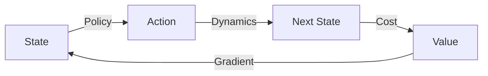

---

title: Stochastic Active Inference

type: concept

status: stable

created: 2024-03-20

tags:

  - mathematics

  - stochastic_processes

  - probability_theory

  - active_inference

semantic_relations:

  - type: foundation

    links:

      - [[stochastic_processes]]

      - [[probability_theory]]

      - [[measure_theory]]

      - [[statistical_physics]]

  - type: implements

    links:

      - [[active_inference]]

      - [[free_energy_principle]]

  - type: relates

    links:

      - [[path_integral_free_energy]]

      - [[variational_methods]]

      - [[optimal_control]]

---

# Stochastic Active Inference

## Overview



### Historical Development



Stochastic Active Inference extends the active inference framework to handle uncertainty and noise in both perception and action. This approach combines stochastic processes, statistical physics, and information theory to provide a comprehensive treatment of probabilistic inference and decision-making.

## Mathematical Foundation

### 1. Stochastic Processes

#### Langevin Dynamics

```math

dX_t = b(X_t)dt + \sigma(X_t)dW_t

```

where:

- $X_t$ is state process

- $b$ is drift term

- $\sigma$ is diffusion term

- $W_t$ is Wiener process

#### Fokker-Planck Equation

```math

\frac{\partial p}{\partial t} = -\nabla \cdot (bp) + \frac{1}{2}\nabla \cdot (\Sigma \nabla p)

```

where:

- $p$ is probability density

- $\Sigma = \sigma\sigma^T$ is diffusion matrix

### 2. Path Integrals

#### Path Probability

```math

P[x(t)] \propto \exp\left(-\frac{1}{2}\int_0^T |\sigma^{-1}(\dot{x} - b)|^2 dt\right)

```

#### Action Functional

```math

S[x] = \int_0^T \left(\frac{1}{2}|\sigma^{-1}(\dot{x} - b)|^2 + \nabla \cdot b\right) dt

```

### 3. Information Theory

#### Relative Entropy Rate

```math

\dot{D}_{KL}[p||q] = \lim_{t \to 0} \frac{1}{t}D_{KL}[p_t||q_t]

```

#### Fisher Information Flow

```math

\mathcal{I}(t) = \mathbb{E}_{p_t}\left[\left(\frac{\partial \log p_t}{\partial t}\right)^2\right]

```

## Stochastic Free Energy

### 1. Stochastic Variational Free Energy

#### Definition

```math

F_t[q] = \mathbb{E}_{q_t}[\log q_t - \log p_t] + \frac{1}{2}\mathbb{E}_{q_t}[|\sigma^{-1}(\dot{x} - b)|^2]

```

#### Flow Equation

```math

\frac{d}{dt}F_t = -\mathcal{I}(t) + \dot{D}_{KL}[q_t||p_t]

```

### 2. Stochastic Expected Free Energy

#### Definition

```math

G_t(\pi) = \mathbb{E}_{q_t}\left[\log q_t(s|\pi) - \log p_t(o,s)\right] + \frac{1}{2}\mathbb{E}_{q_t}[|\sigma^{-1}(\dot{s} - b_\pi)|^2]

```

#### Components

```math

G_t = \underbrace{\mathbb{E}_{q_t}[D_{KL}[q_t(s|\pi)||p_t(s|o,\pi)]]}_{\text{epistemic value}} + \underbrace{\mathbb{E}_{q_t}[\log q_t(o|\pi) - \log p_t(o)]}_{\text{pragmatic value}} + \underbrace{\frac{1}{2}\mathbb{E}_{q_t}[|\sigma^{-1}(\dot{s} - b_\pi)|^2]}_{\text{dynamic cost}}

```

## Implementation

### 1. Stochastic Integration

```python

class StochasticIntegrator:

    def __init__(self,

                 drift: Callable,

                 diffusion: Callable):

        """Initialize stochastic integrator.

        Args:

            drift: Drift function b(x,t)

            diffusion: Diffusion function σ(x,t)

        """

        self.b = drift

        self.sigma = diffusion

    def euler_maruyama(self,

                      x0: np.ndarray,

                      dt: float,

                      n_steps: int) -> np.ndarray:

        """Euler-Maruyama integration.

        Args:

            x0: Initial state

            dt: Time step

            n_steps: Number of steps

        Returns:

            path: Integration path

        """

        x = x0.copy()

        path = [x0]

        for _ in range(n_steps):

            # Compute drift and diffusion

            b = self.b(x)

            sigma = self.sigma(x)

            # Generate noise

            dW = np.random.randn(*x.shape) * np.sqrt(dt)

            # Update state

            x = x + b * dt + sigma @ dW

            path.append(x)

        return np.array(path)

    def milstein(self,

                x0: np.ndarray,

                dt: float,

                n_steps: int) -> np.ndarray:

        """Milstein integration.

        Args:

            x0: Initial state

            dt: Time step

            n_steps: Number of steps

        Returns:

            path: Integration path

        """

        x = x0.copy()

        path = [x0]

        for _ in range(n_steps):

            # Compute terms

            b = self.b(x)

            sigma = self.sigma(x)

            dsigma = self.compute_derivative(self.sigma, x)

            # Generate noise

            dW = np.random.randn(*x.shape) * np.sqrt(dt)

            # Update state

            x = x + b * dt + sigma @ dW + \

                0.5 * sigma @ dsigma @ (dW**2 - dt)

            path.append(x)

        return np.array(path)

```

### 2. Path Integral Methods

```python

class PathIntegralSampler:

    def __init__(self,

                 action: Callable,

                 n_particles: int = 1000):

        """Initialize path integral sampler.

        Args:

            action: Action functional

            n_particles: Number of particles

        """

        self.S = action

        self.n = n_particles

    def sample_paths(self,

                    x0: np.ndarray,

                    dt: float,

                    n_steps: int) -> np.ndarray:

        """Sample paths using path integral.

        Args:

            x0: Initial state

            dt: Time step

            n_steps: Number of steps

        Returns:

            paths: Sampled paths

        """

        # Initialize particles

        paths = np.zeros((self.n, n_steps + 1, *x0.shape))

        paths[:,0] = x0

        # Sample paths

        for i in range(n_steps):

            # Propose moves

            proposals = self.propose_moves(paths[:,i])

            # Compute weights

            weights = self.compute_weights(paths[:,i], proposals)

            # Resample

            indices = self.resample(weights)

            paths[:,i+1] = proposals[indices]

        return paths

    def compute_weights(self,

                       current: np.ndarray,

                       proposed: np.ndarray) -> np.ndarray:

        """Compute importance weights.

        Args:

            current: Current states

            proposed: Proposed states

        Returns:

            weights: Importance weights

        """

        # Compute action difference

        dS = self.S(proposed) - self.S(current)

        # Return weights

        return np.exp(-dS)

```

### 3. Stochastic Optimization

```python

class StochasticOptimizer:

    def __init__(self,

                 objective: Callable,

                 learning_rate: float = 0.1,

                 noise_scale: float = 0.1):

        """Initialize stochastic optimizer.

        Args:

            objective: Objective function

            learning_rate: Learning rate

            noise_scale: Noise scale

        """

        self.f = objective

        self.lr = learning_rate

        self.scale = noise_scale

    def optimize(self,

                x0: np.ndarray,

                n_steps: int = 1000) -> np.ndarray:

        """Perform stochastic optimization.

        Args:

            x0: Initial point

            n_steps: Number of steps

        Returns:

            x_opt: Optimized point

        """

        x = x0.copy()

        for _ in range(n_steps):

            # Compute gradient

            grad = self.compute_gradient(x)

            # Add noise

            noise = np.random.randn(*x.shape) * self.scale

            # Update parameters

            x = x - self.lr * grad + noise

            # Anneal noise

            self.scale *= 0.995

        return x

```

## Applications

### 1. Stochastic Control

- Optimal control

- Risk-sensitive control

- Robust control

- Adaptive control

### 2. Learning

- Stochastic gradient descent

- Langevin dynamics

- MCMC methods

- Particle filters

### 3. Decision Making

- Risk assessment

- Uncertainty quantification

- Exploration strategies

- Adaptive policies

## Best Practices

### 1. Numerical Methods

1. Use appropriate integrators

1. Control step size

1. Monitor stability

1. Handle boundary conditions

### 2. Sampling

1. Choose proper proposals

1. Monitor acceptance rates

1. Implement resampling

1. Check convergence

### 3. Implementation

1. Efficient computation

1. Parallel sampling

1. Adaptive methods

1. Error analysis

## Common Issues

### 1. Technical Challenges

1. Numerical instability

1. Sample degeneracy

1. Curse of dimensionality

1. Computational cost

### 2. Solutions

1. Adaptive step size

1. Importance sampling

1. Dimensionality reduction

1. Parallel computation

## Related Topics

- [[stochastic_processes]]

- [[probability_theory]]

- [[statistical_physics]]

- [[path_integral_free_energy]]

- [[optimal_control]]

- [[variational_methods]]

## Advanced Stochastic Framework

### Phase Space Structure



#### Stochastic Differential Geometry

```math

\begin{aligned}

& \text{Stratonovich Form:} \\

& dX_t = b(X_t)dt + \sigma(X_t) \circ dW_t \\

& \text{Itô-Stratonovich Correction:} \\

& b_{\text{Itô}} = b_{\text{Strat}} - \frac{1}{2}\sum_{j=1}^m \sigma^j \partial_x \sigma^j

\end{aligned}

```

### Information Geometry of Stochastic Systems



#### Fisher-Rao Metric

```math

\begin{aligned}

& \text{Metric Tensor:} \\

& g_{ij}(θ,t) = \mathbb{E}_{p(x,t|θ)}\left[\frac{∂\log p}{∂θ^i}\frac{∂\log p}{∂θ^j}\right] \\

& \text{Geodesic Flow:} \\

& \ddot{θ}^k + Γ^k_{ij}\dot{θ}^i\dot{θ}^j = -g^{kl}\frac{∂F}{∂θ^l}

\end{aligned}

```

## Stochastic Control Theory

### Optimal Control Framework



#### Hamilton-Jacobi-Bellman

```math

\begin{aligned}

& \text{Value Function:} \\

& -\frac{∂V}{∂t} = \min_u\left\{L(x,u) + \frac{∂V}{∂x}f(x,u) + \frac{1}{2}\text{tr}(σσ^T\frac{∂^2V}{∂x^2})\right\} \\

& \text{Optimal Control:} \\

& u^*(x,t) = \arg\min_u\left\{L(x,u) + \frac{∂V}{∂x}f(x,u)\right\}

\end{aligned}

```

### Risk-Sensitive Control

```python

class RiskSensitiveController:

    def __init__(self,

                 dynamics: StochasticDynamics,

                 cost: Callable,

                 risk_factor: float = 1.0):

        """Initialize risk-sensitive controller.

        Args:

            dynamics: System dynamics

            cost: Cost function

            risk_factor: Risk sensitivity

        """

        self.dynamics = dynamics

        self.cost = cost

        self.theta = risk_factor

    def compute_optimal_control(self,

                              state: np.ndarray,

                              time_horizon: float,

                              n_samples: int = 1000) -> np.ndarray:

        """Compute risk-sensitive optimal control.

        Args:

            state: Current state

            time_horizon: Planning horizon

            n_samples: Number of trajectory samples

        Returns:

            u_opt: Optimal control

        """

        # Sample trajectories

        trajectories = self.dynamics.sample_trajectories(

            state, time_horizon, n_samples)

        # Compute exponential cost

        costs = np.array([self.cost(traj) for traj in trajectories])

        exp_costs = np.exp(self.theta * costs)

        # Risk-sensitive expectation

        risk_value = -1/self.theta * np.log(np.mean(exp_costs))

        # Compute optimal control

        u_opt = self._minimize_risk_value(risk_value)

        return u_opt

```

## Advanced Numerical Methods

### Adaptive Integration

```python

class AdaptiveIntegrator:

    def __init__(self,

                 dynamics: StochasticDynamics,

                 tolerance: float = 1e-6):

        """Initialize adaptive integrator.

        Args:

            dynamics: Stochastic dynamics

            tolerance: Error tolerance

        """

        self.dynamics = dynamics

        self.tol = tolerance

    def integrate(self,

                 initial_state: np.ndarray,

                 time_span: Tuple[float, float]) -> Tuple[np.ndarray, np.ndarray]:

        """Perform adaptive integration.

        Args:

            initial_state: Initial condition

            time_span: Integration interval

        Returns:

            times,states: Integration results

        """

        times = [time_span[0]]

        states = [initial_state]

        while times[-1] < time_span[1]:

            # Estimate local error

            dt = self._estimate_step_size(states[-1], times[-1])

            # Take step

            next_state = self._step(states[-1], dt)

            # Update solution

            times.append(times[-1] + dt)

            states.append(next_state)

        return np.array(times), np.array(states)

```

### Particle Methods

```python

class StochasticParticleFilter:

    def __init__(self,

                 n_particles: int,

                 dynamics: StochasticDynamics,

                 observation_model: Callable):

        """Initialize particle filter.

        Args:

            n_particles: Number of particles

            dynamics: System dynamics

            observation_model: Observation likelihood

        """

        self.n = n_particles

        self.dynamics = dynamics

        self.observe = observation_model

    def update(self,

              particles: np.ndarray,

              weights: np.ndarray,

              observation: np.ndarray) -> Tuple[np.ndarray, np.ndarray]:

        """Update particle filter.

        Args:

            particles: Current particles

            weights: Current weights

            observation: New observation

        Returns:

            new_particles,new_weights: Updated filter

        """

        # Predict

        predicted = self.dynamics.evolve(particles)

        # Update weights

        likelihoods = self.observe(predicted, observation)

        new_weights = weights * likelihoods

        new_weights /= np.sum(new_weights)

        # Resample if needed

        if self._effective_particles(new_weights) < self.n/2:

            predicted, new_weights = self._resample(predicted, new_weights)

        return predicted, new_weights

```

## Advanced Visualization Tools

### Phase Space Analysis

```python

def plot_stochastic_flow(

    dynamics: StochasticDynamics,

    domain: Tuple[np.ndarray, np.ndarray],

    n_trajectories: int = 100

) -> plt.Figure:

    """Plot stochastic flow in phase space.

    Args:

        dynamics: System dynamics

        domain: Phase space domain

        n_trajectories: Number of trajectories

    Returns:

        fig: Flow visualization

    """

    fig = plt.figure(figsize=(12, 8))

    ax = fig.add_subplot(111)

    # Plot mean flow

    X, Y = np.meshgrid(*[np.linspace(d[0], d[1], 20) for d in domain])

    U, V = dynamics.drift([X, Y])

    ax.streamplot(X, Y, U, V, color='k', alpha=0.3)

    # Plot sample trajectories

    for _ in range(n_trajectories):

        traj = dynamics.sample_trajectory(

            np.random.uniform(*domain[0], size=2),

            n_steps=100

        )

        ax.plot(traj[:,0], traj[:,1], 'r-', alpha=0.1)

    return fig

```

### Information Geometry Visualization

```python

def plot_information_geometry(

    manifold: StochasticManifold,

    param_range: Dict[str, Tuple[float, float]]

) -> plt.Figure:

    """Visualize information geometry.

    Args:

        manifold: Statistical manifold

        param_range: Parameter ranges

    Returns:

        fig: Geometry visualization

    """

    fig = plt.figure(figsize=(15, 5))

    # Plot metric tensor

    ax1 = fig.add_subplot(131)

    theta = np.linspace(*param_range['theta'], 100)

    g = [manifold.metric_tensor([t]) for t in theta]

    ax1.plot(theta, g)

    ax1.set_title('Metric Tensor')

    # Plot geodesics

    ax2 = fig.add_subplot(132)

    for t0 in np.linspace(*param_range['theta'], 5):

        geo = manifold.geodesic(t0)

        ax2.plot(geo[:,0], geo[:,1])

    ax2.set_title('Geodesics')

    # Plot free energy

    ax3 = fig.add_subplot(133)

    F = [manifold.free_energy([t]) for t in theta]

    ax3.plot(theta, F)

    ax3.set_title('Free Energy')

    return fig

```

## Advanced Topics

### Quantum Extensions

- Quantum stochastic differential equations

- Quantum filtering theory

- Open quantum systems

- Quantum control theory

### Machine Learning Applications

- Neural stochastic differential equations

- Stochastic normalizing flows

- Diffusion models

- Deep active inference

### Theoretical Developments

- Non-equilibrium thermodynamics

- Information geometry

- Optimal transport

- Rough path theory

## Future Research Directions

### Theoretical Challenges

- Non-Markovian processes

- Path-dependent dynamics

- Infinite-dimensional systems

- Quantum generalizations

### Computational Challenges

- High-dimensional sampling

- Long-time stability

- Adaptive algorithms

- Real-time implementation

### Applications

- Biological systems

- Robotics control

- Financial modeling

- Climate prediction

## References

- [[stochastic_processes]]

- [[probability_theory]]

- [[statistical_physics]]

- [[path_integral_free_energy]]

- [[optimal_control]]

- [[variational_methods]]

