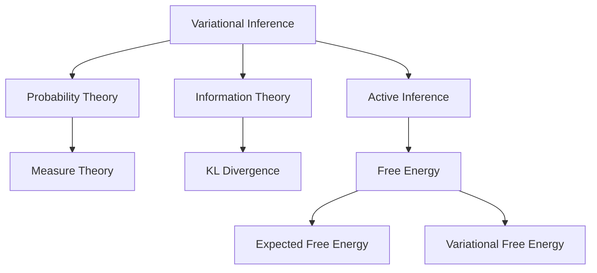

---

title: Variational Inference

type: mathematical_concept

status: stable

created: 2024-02-12

tags:

  - mathematics

  - probability

  - computation

  - active_inference

semantic_relations:

  - type: foundation

    links:

      - [[probability_theory]]

      - [[information_theory]]

      - [[optimization_theory]]

  - type: implements

    links:

      - [[active_inference]]

      - [[free_energy_principle]]

      - [[variational_free_energy]]

      - [[expected_free_energy]]

  - type: uses

    links:

      - [[kl_divergence]]

      - [[evidence_lower_bound]]

      - [[mean_field_approximation]]

  - type: relates

    links:

      - [[predictive_coding]]

      - [[message_passing]]

      - [[bayesian_inference]]

      - [[belief_updating]]

---

# Variational Inference

## Overview

Variational Inference (VI) is a method for approximating complex probability distributions through optimization. It forms the mathematical foundation for many cognitive modeling approaches, including predictive coding and active inference.



## Core Concepts

### Evidence Lower Bound

```math

\mathcal{L} = \mathbb{E}_{q(z)}[\log p(x,z) - \log q(z)]

```

where:

- $\mathcal{L}$ is ELBO

- $q(z)$ is variational distribution

- $p(x,z)$ is joint distribution

### KL Divergence

```math

D_{KL}(q||p) = \mathbb{E}_{q(z)}[\log q(z) - \log p(z)]

```

where:

- $D_{KL}$ is KL divergence

- $q(z)$ is approximate posterior

- $p(z)$ is true posterior

## Active Inference Connection

### Free Energy Principle

```math

F = \mathbb{E}_{q(s)}[\log q(s) - \log p(o,s)]

```

where:

- $F$ is variational free energy

- $s$ are hidden states

- $o$ are observations

### Expected Free Energy

```math

G(\pi) = \mathbb{E}_{q(o,s|\pi)}[\log q(s|\pi) - \log p(o,s|\pi)]

```

where:

- $G$ is expected free energy

- $\pi$ is policy

- $q(o,s|\pi)$ is predicted distribution

### Hierarchical Inference

```math

\begin{aligned}

F_i &= \mathbb{E}_{q(s_i)}[\log q(s_i) - \log p(s_{i-1}|s_i) - \log p(s_i|s_{i+1})] \\

F_{total} &= \sum_i F_i

\end{aligned}

```

where:

- $F_i$ is level-specific free energy

- $s_i$ are states at level $i$

## Implementation Framework

### Variational Distribution

```python

import numpy as np

import torch

import torch.nn as nn

from typing import List, Tuple, Optional

from torch.distributions import Normal, kl_divergence

class VariationalDistribution(nn.Module):

    def __init__(self,

                 input_size: int,

                 hidden_size: int,

                 latent_size: int):

        """Initialize variational distribution.

        Args:

            input_size: Input dimension

            hidden_size: Hidden dimension

            latent_size: Latent dimension

        """

        super().__init__()

        # Encoder network

        self.encoder = nn.Sequential(

            nn.Linear(input_size, hidden_size),

            nn.ReLU(),

            nn.Linear(hidden_size, hidden_size),

            nn.ReLU()

        )

        # Distribution parameters

        self.mean = nn.Linear(hidden_size, latent_size)

        self.log_var = nn.Linear(hidden_size, latent_size)

    def forward(self,

               x: torch.Tensor) -> Tuple[torch.Tensor, torch.Tensor, torch.Tensor]:

        """Forward pass through distribution.

        Args:

            x: Input tensor

        Returns:

            z: Sampled latent

            mean: Distribution mean

            log_var: Log variance

        """

        # Encode input

        h = self.encoder(x)

        # Get distribution parameters

        mean = self.mean(h)

        log_var = self.log_var(h)

        # Sample using reparameterization

        std = torch.exp(0.5 * log_var)

        eps = torch.randn_like(std)

        z = mean + eps * std

        return z, mean, log_var

```

### Active Inference Implementation

```python

class ActiveInferenceModel(nn.Module):

    def __init__(self,

                 state_dim: int,

                 obs_dim: int,

                 hidden_dim: int):

        """Initialize active inference model.

        Args:

            state_dim: State dimension

            obs_dim: Observation dimension

            hidden_dim: Hidden dimension

        """

        super().__init__()

        # Recognition model (encoder)

        self.recognition = VariationalDistribution(

            obs_dim, hidden_dim, state_dim

        )

        # Generative model (decoder)

        self.generative = nn.Sequential(

            nn.Linear(state_dim, hidden_dim),

            nn.ReLU(),

            nn.Linear(hidden_dim, obs_dim)

        )

        # Policy network

        self.policy = nn.Sequential(

            nn.Linear(state_dim, hidden_dim),

            nn.ReLU(),

            nn.Linear(hidden_dim, 1)

        )

    def infer_state(self,

                   obs: torch.Tensor) -> Tuple[torch.Tensor, torch.Tensor, torch.Tensor]:

        """Infer hidden state from observation."""

        return self.recognition(obs)

    def generate_obs(self,

                    state: torch.Tensor) -> torch.Tensor:

        """Generate observation from state."""

        return self.generative(state)

    def compute_free_energy(self,

                          obs: torch.Tensor,

                          state: torch.Tensor,

                          mean: torch.Tensor,

                          log_var: torch.Tensor) -> torch.Tensor:

        """Compute variational free energy."""

        # Reconstruction error

        pred_obs = self.generate_obs(state)

        recon_error = torch.sum((obs - pred_obs)**2, dim=1)

        # KL divergence

        kl_div = -0.5 * torch.sum(

            1 + log_var - mean**2 - torch.exp(log_var),

            dim=1

        )

        return torch.mean(recon_error + kl_div)

    def compute_expected_free_energy(self,

                                   state: torch.Tensor) -> torch.Tensor:

        """Compute expected free energy for policy selection."""

        return self.policy(state)

```

### Hierarchical Active Inference

```python

class HierarchicalActiveInference(nn.Module):

    def __init__(self,

                 dims: List[int],

                 hidden_dim: int):

        """Initialize hierarchical model.

        Args:

            dims: Dimensions at each level

            hidden_dim: Hidden dimension

        """

        super().__init__()

        # Create hierarchy

        self.levels = nn.ModuleList([

            ActiveInferenceModel(

                dims[i], dims[i-1], hidden_dim

            ) for i in range(1, len(dims))

        ])

    def update_beliefs(self,

                      obs: torch.Tensor) -> List[Tuple[torch.Tensor, ...]]:

        """Update beliefs across hierarchy."""

        states = []

        current = obs

        # Bottom-up pass

        for level in self.levels:

            state, mean, log_var = level.infer_state(current)

            states.append((state, mean, log_var))

            current = state

        return states

```

## Advanced Topics

### Information Geometry

```math

\begin{aligned}

& \text{Fisher Metric:} \\

& g_{ij}(\theta) = \mathbb{E}_{p(x|\theta)}\left[\frac{\partial \log p(x|\theta)}{\partial \theta^i}\frac{\partial \log p(x|\theta)}{\partial \theta^j}\right] \\

& \text{Natural Gradient:} \\

& \dot{\theta} = -g^{ij}(\theta)\frac{\partial F}{\partial \theta^j} \\

& \text{α-Connection:} \\

& \Gamma_{ijk}^{(α)} = \mathbb{E}\left[\frac{\partial^2 \log p}{\partial \theta^i \partial \theta^j}\frac{\partial \log p}{\partial \theta^k} + \frac{1-α}{2}\frac{\partial \log p}{\partial \theta^i}\frac{\partial \log p}{\partial \theta^j}\frac{\partial \log p}{\partial \theta^k}\right]

\end{aligned}

```

### Geometric Structures

#### Statistical Manifold

```math

\begin{aligned}

& \text{Manifold:} \\

& \mathcal{M} = \{p_\theta : \theta \in \Theta\} \\

& \text{Tangent Space:} \\

& T_p\mathcal{M} = \text{span}\left\{\frac{\partial}{\partial \theta^i}\right\} \\

& \text{Cotangent Space:} \\

& T_p^*\mathcal{M} = \text{span}\{d\theta^i\}

\end{aligned}

```

#### Geodesic Flow

```math

\begin{aligned}

& \text{Geodesic Equation:} \\

& \ddot{\theta}^k + \Gamma_{ij}^k\dot{\theta}^i\dot{\theta}^j = 0 \\

& \text{Parallel Transport:} \\

& \nabla_{\dot{\gamma}}\dot{\gamma} = 0 \\

& \text{Curvature:} \\

& R(X,Y)Z = \nabla_X\nabla_YZ - \nabla_Y\nabla_XZ - \nabla_{[X,Y]}Z

\end{aligned}

```

### Advanced Variational Methods

#### Normalizing Flows

```math

\begin{aligned}

& \text{Change of Variables:} \\

& q_K(z_K) = q_0(z_0)\prod_{k=1}^K\left|\det\frac{\partial f_k}{\partial z_{k-1}}\right|^{-1} \\

& \text{Flow ELBO:} \\

& \mathcal{L} = \mathbb{E}_{q_0(z_0)}\left[\log p(x,z_K) - \log q_0(z_0) + \sum_{k=1}^K\log\left|\det\frac{\partial f_k}{\partial z_{k-1}}\right|\right]

\end{aligned}

```

#### Stochastic Variational Inference

```math

\begin{aligned}

& \text{Natural Parameters:} \\

& \eta = \mathbb{E}_{q(z)}[t(z)] \\

& \text{Stochastic Update:} \\

& \eta_{t+1} = (1-\rho_t)\eta_t + \rho_t\tilde{\eta}_t \\

& \text{where } \rho_t = (t + \tau)^{-\kappa}

\end{aligned}

```

### Implementation Framework

#### Advanced Normalizing Flows

```python

class NormalizingFlow(nn.Module):

    def __init__(self,

                 dim: int,

                 flow_length: int):

        """Initialize normalizing flow.

        Args:

            dim: Dimension of space

            flow_length: Number of flow steps

        """

        super().__init__()

        self.flows = nn.ModuleList([

            InvertibleFlow(dim) for _ in range(flow_length)

        ])

    def forward(self,

               z0: torch.Tensor) -> Tuple[torch.Tensor, torch.Tensor]:

        """Apply flow transformation.

        Args:

            z0: Initial points

        Returns:

            zk,log_det: Transformed points and log determinant

        """

        zk = z0

        log_det = torch.zeros(z0.size(0))

        for flow in self.flows:

            zk, ldj = flow(zk)

            log_det += ldj

        return zk, log_det

    def inverse(self,

               zk: torch.Tensor) -> torch.Tensor:

        """Apply inverse flow transformation.

        Args:

            zk: Final points

        Returns:

            z0: Initial points

        """

        z0 = zk

        for flow in reversed(self.flows):

            z0 = flow.inverse(z0)

        return z0

```

#### Geometric Optimization

```python

class GeometricOptimizer:

    def __init__(self,

                 manifold: RiemannianManifold,

                 learning_rate: float = 0.1):

        """Initialize geometric optimizer.

        Args:

            manifold: Riemannian manifold

            learning_rate: Learning rate

        """

        self.M = manifold

        self.lr = learning_rate

    def natural_gradient_step(self,

                            params: torch.Tensor,

                            grad: torch.Tensor) -> torch.Tensor:

        """Perform natural gradient step.

        Args:

            params: Current parameters

            grad: Euclidean gradient

        Returns:

            new_params: Updated parameters

        """

        # Compute metric tensor

        G = self.M.metric_tensor(params)

        # Solve for natural gradient

        nat_grad = torch.linalg.solve(G, grad)

        # Retract along geodesic

        new_params = self.M.exp_map(

            params, -self.lr * nat_grad

        )

        return new_params

    def parallel_transport(self,

                         vector: torch.Tensor,

                         curve: Geodesic) -> torch.Tensor:

        """Parallel transport vector along curve.

        Args:

            vector: Tangent vector

            curve: Geodesic curve

        Returns:

            transported: Transported vector

        """

        # Get connection coefficients

        Gamma = self.M.christoffel_symbols(curve.point)

        # Transport equation

        return self._solve_transport_equation(

            vector, curve, Gamma

        )

```

### Advanced Applications

#### Hierarchical Variational Models

```python

class HierarchicalVariationalModel(nn.Module):

    def __init__(self,

                 dims: List[int],

                 flow_length: int = 4):

        """Initialize hierarchical model.

        Args:

            dims: Dimensions at each level

            flow_length: Flow length per level

        """

        super().__init__()

        # Create hierarchy

        self.levels = nn.ModuleList([

            VariationalLevel(

                dims[i], dims[i-1], flow_length

            ) for i in range(1, len(dims))

        ])

        # Create flows between levels

        self.flows = nn.ModuleList([

            NormalizingFlow(dims[i], flow_length)

            for i in range(len(dims)-1)

        ])

    def forward(self,

               x: torch.Tensor) -> Tuple[List[torch.Tensor], torch.Tensor]:

        """Forward pass through hierarchy.

        Args:

            x: Input tensor

        Returns:

            states,kl: Hierarchical states and KL

        """

        states = []

        kl = 0

        # Bottom-up pass

        current = x

        for level, flow in zip(self.levels, self.flows):

            # Infer state

            state, level_kl = level(current)

            states.append(state)

            kl += level_kl

            # Transform to next level

            current, ldj = flow(state)

            kl -= ldj.mean()

        return states, kl

```

#### Variational Message Passing

```python

class VariationalMessagePassing:

    def __init__(self,

                 graph: FactorGraph,

                 max_iter: int = 100):

        """Initialize message passing.

        Args:

            graph: Factor graph

            max_iter: Maximum iterations

        """

        self.graph = graph

        self.max_iter = max_iter

    def update_beliefs(self) -> Dict[str, Distribution]:

        """Update beliefs using message passing.

        Returns:

            beliefs: Updated beliefs

        """

        messages = self._initialize_messages()

        for _ in range(self.max_iter):

            # Variable to factor messages

            v2f = self._compute_v2f_messages(messages)

            # Factor to variable messages

            f2v = self._compute_f2v_messages(messages)

            # Update messages

            messages = self._update_messages(v2f, f2v)

            # Check convergence

            if self._check_convergence(messages):

                break

        return self._compute_beliefs(messages)

```

### Advanced Visualization

#### Manifold Visualization

```python

def plot_statistical_manifold(

    manifold: RiemannianManifold,

    points: torch.Tensor,

    geodesics: List[Geodesic]

) -> plt.Figure:

    """Plot statistical manifold.

    Args:

        manifold: Riemannian manifold

        points: Points on manifold

        geodesics: Geodesic curves

    Returns:

        fig: Plot figure

    """

    fig = plt.figure(figsize=(10, 10))

    ax = fig.add_subplot(111, projection='3d')

    # Plot points

    ax.scatter(

        points[:,0], points[:,1], points[:,2],

        c='b', alpha=0.5

    )

    # Plot geodesics

    for geo in geodesics:

        path = geo.compute_path(100)

        ax.plot3D(

            path[:,0], path[:,1], path[:,2],

            'r-', alpha=0.3

        )

    # Plot metric tensor

    for p in points[::10]:

        G = manifold.metric_tensor(p)

        plot_ellipsoid(ax, p, G)

    return fig

```

#### Flow Visualization

```python

def visualize_flow_transformation(

    flow: NormalizingFlow,

    samples: torch.Tensor,

    n_steps: int = 10

) -> plt.Figure:

    """Visualize flow transformation.

    Args:

        flow: Normalizing flow

        samples: Initial samples

        n_steps: Number of steps

    Returns:

        fig: Plot figure

    """

    fig, axes = plt.subplots(2, n_steps//2, figsize=(15, 6))

    z = samples

    for i in range(n_steps):

        # Transform samples

        z, _ = flow.flows[i](z)

        # Plot distribution

        row, col = i//5, i%5

        axes[row,col].hist2d(

            z[:,0].numpy(), z[:,1].numpy(),

            bins=50, density=True

        )

        axes[row,col].set_title(f'Step {i+1}')

    return fig

```

## Best Practices

### Model Design

1. Choose appropriate architectures

1. Design latent space

1. Initialize parameters

1. Consider hierarchical structure

1. Use normalizing flows

1. Implement geometric methods

### Implementation

1. Monitor convergence

1. Handle numerical stability

1. Validate inference

1. Test reconstruction

1. Use parallel transport

1. Implement geodesic updates

### Training

1. Tune learning rates

1. Balance loss components

1. Monitor KL divergence

1. Validate learning

1. Use natural gradients

1. Implement flow-based methods

## Common Issues

### Technical Challenges

1. Posterior collapse

1. Latent space issues

1. Gradient problems

1. Training instability

1. Metric degeneracy

1. Flow invertibility

### Solutions

1. KL annealing

1. Warm-up period

1. Gradient clipping

1. Careful initialization

1. Regularization

1. Stable flows

## Related Topics

- [[active_inference]]

- [[active_inference_agent]]

- [[probability_theory]]

- [[information_theory]]

- [[optimization_theory]]

- [[free_energy_principle]]

- [[differential_geometry]]

- [[information_geometry]]

- [[optimal_transport]]

