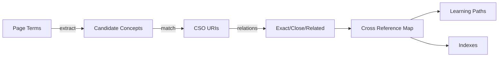

---

title: Computer Science Ontology (CSO)

type: knowledge_base

status: stable

tags: [ontology, computer-science, knowledge-graph]

semantic_relations:

  - type: relates

    links: [cross_reference_map, mathematics_resources]

---

# Computer Science Ontology (CSO)

The Computer Science Ontology organizes CS topics and their relations. It supports semantic indexing, discovery, and analytics across publications and repositories.

## Applications

- Tagging documents with standardized topics

- Discovering related areas and trends

- Mapping internal pages to external concepts for interoperability

## Integration workflow

1. Extract candidate topics and aliases from pages

1. Match to CSO concepts (labels/relations)

1. Record URIs and relation types (exact/close/related)

1. Propagate links to indexes and learning paths

See also: [[cross_reference_map]].

