# HyperSpace Ontology

## Overview

The HyperSpace ontology provides a unified mathematical framework for understanding spaces, time, and abstract structures through the lens of [[category_theory]] and active inference. This framework connects physical, computational, cognitive, and virtual spaces into a coherent mathematical structure.

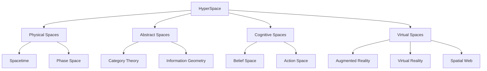
```mermaid
graph TD
    A[HyperSpace] --> B[Physical Spaces]
    A --> C[Abstract Spaces]
    A --> D[Cognitive Spaces]
    A --> E[Virtual Spaces]
    B --> F[Spacetime]
    B --> G[Phase Space]
    C --> H[Category Theory]
    C --> I[Information Geometry]
    D --> J[Belief Space]
    D --> K[Action Space]
    E --> L[Augmented Reality]
    E --> M[Virtual Reality]
    E --> N[Spatial Web]
```

## Foundational Structure

### Mathematical Foundations

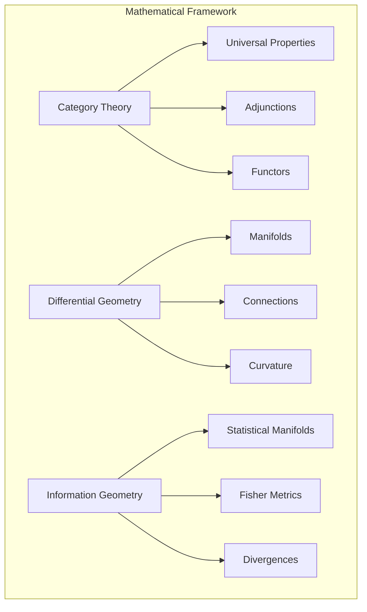
```mermaid
graph TD
    subgraph "Mathematical Framework"
        A[Category Theory] --> B[Universal Properties]
        A --> C[Adjunctions]
        A --> D[Functors]
        
        E[Differential Geometry] --> F[Manifolds]
        E --> G[Connections]
        E --> H[Curvature]
        
        I[Information Geometry] --> J[Statistical Manifolds]
        I --> K[Fisher Metrics]
        I --> L[Divergences]
    end
```

### Categorical Structures

1. **Base Categories**
   - [[topological_spaces|Top]]
   - [[manifold_category|Mfd]]
   - [[metric_spaces|Met]]
   - [[probability_spaces|Prob]]

2. **Functorial Relations**
   ```mermaid
   graph LR
       subgraph "Category Relations"
           A[Top] --> B[Mfd]
           B --> C[Met]
           C --> D[Prob]
           E[Vect] --> F[Hilb]
       end
   ```

3. **Natural Transformations**
   - [[forgetful_functors]]
   - [[inclusion_functors]]
   - [[realization_functors]]

## Geometric Framework

### Differential Structure

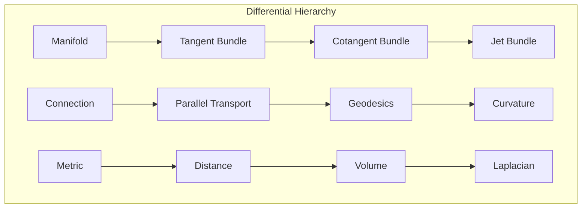
```mermaid
graph TD
    subgraph "Differential Hierarchy"
        A[Manifold] --> B[Tangent Bundle]
        B --> C[Cotangent Bundle]
        C --> D[Jet Bundle]
        
        E[Connection] --> F[Parallel Transport]
        F --> G[Geodesics]
        G --> H[Curvature]
        
        I[Metric] --> J[Distance]
        J --> K[Volume]
        K --> L[Laplacian]
    end
```

### Information Geometry

1. **Statistical Manifolds**
   ```math
   \begin{aligned}
   & \text{Fisher Metric:} \\
   & g_{ij}(\theta) = \mathbb{E}_{p_\theta}\left[\frac{\partial \log p_\theta}{\partial \theta^i}\frac{\partial \log p_\theta}{\partial \theta^j}\right] \\
   & \text{α-Connection:} \\
   & \Gamma_{ijk}^{(\alpha)} = \mathbb{E}_{p_\theta}\left[\partial_i\partial_j\ell\partial_k\ell + \frac{1-\alpha}{2}\partial_i\ell\partial_j\ell\partial_k\ell\right]
   \end{aligned}
   ```

2. **Divergence Measures**
   - [[kullback_leibler_divergence]]
   - [[wasserstein_metric]]
   - [[f_divergences]]

## Reality Integration Framework

### Spatial-Temporal Structure

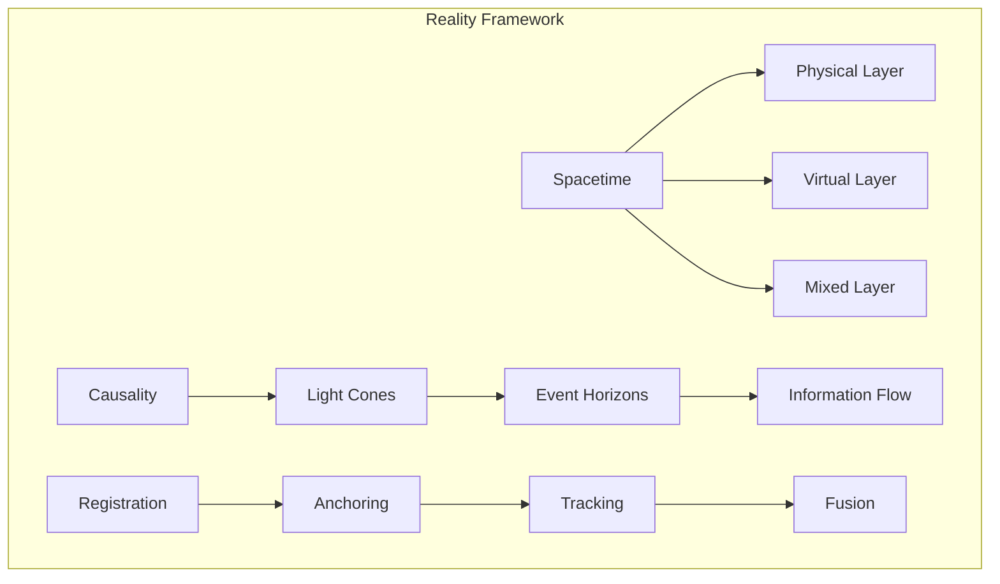
```mermaid
graph TD
    subgraph "Reality Framework"
        A[Spacetime] --> B[Physical Layer]
        A --> C[Virtual Layer]
        A --> D[Mixed Layer]
        
        E[Causality] --> F[Light Cones]
        F --> G[Event Horizons]
        G --> H[Information Flow]
        
        I[Registration] --> J[Anchoring]
        J --> K[Tracking]
        K --> L[Fusion]
    end
```

### Bundle Theory

1. **Principal Bundles**
   ```math
   \begin{aligned}
   & P(M,G) \to M \\
   & \text{where:} \\
   & M: \text{base manifold} \\
   & G: \text{structure group} \\
   & \omega: \text{connection 1-form}
   \end{aligned}
   ```

2. **Associated Bundles**
   - [[frame_bundles]]
   - [[spinor_bundles]]
   - [[reality_bundles]]

### Quantum Extensions

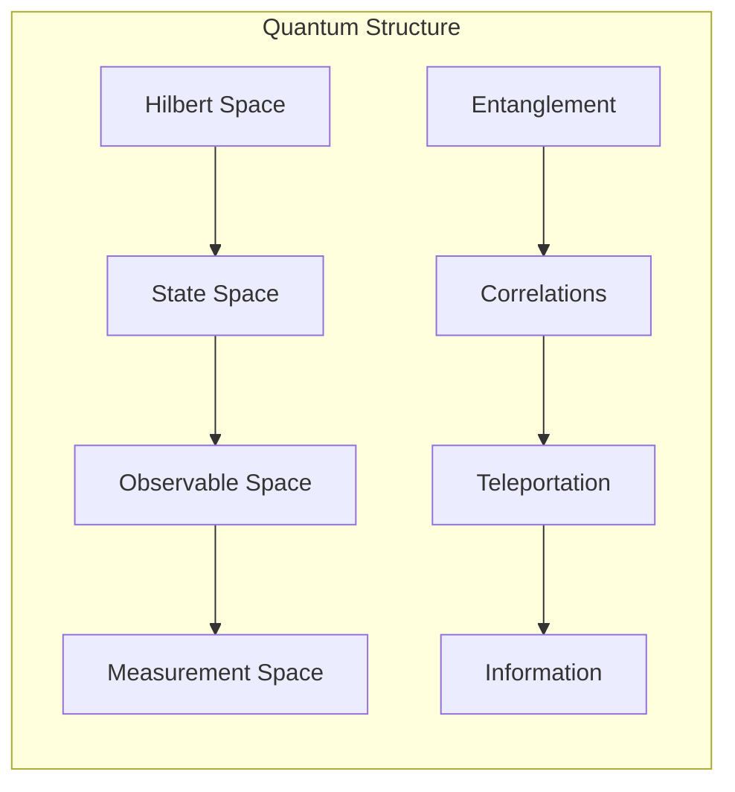
```mermaid
graph LR
    subgraph "Quantum Structure"
        A[Hilbert Space] --> B[State Space]
        B --> C[Observable Space]
        C --> D[Measurement Space]
        
        E[Entanglement] --> F[Correlations]
        F --> G[Teleportation]
        G --> H[Information]
    end
```

## Implementation Framework

### System Architecture

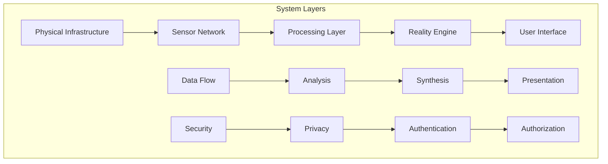
```mermaid
graph TD
    subgraph "System Layers"
        A[Physical Infrastructure] --> B[Sensor Network]
        B --> C[Processing Layer]
        C --> D[Reality Engine]
        D --> E[User Interface]
        
        F[Data Flow] --> G[Analysis]
        G --> H[Synthesis]
        H --> I[Presentation]
        
        J[Security] --> K[Privacy]
        K --> L[Authentication]
        L --> M[Authorization]
    end
```

### Reality Engine Components

1. **Perception Pipeline**
   - [[sensor_fusion|Sensor Fusion]]
   - [[scene_understanding|Scene Understanding]]
   - [[object_recognition|Object Recognition]]
   - [[spatial_mapping|Spatial Mapping]]

2. **Reality Synthesis**
   ```mermaid
   graph LR
       subgraph "Synthesis Pipeline"
           A[Scene Graph] --> B[Physics Engine]
           B --> C[Renderer]
           C --> D[Display]
           
           E[Input] --> F[Processing]
           F --> G[Response]
           G --> H[Feedback]
       end
   ```

3. **Interaction Systems**
   - [[gesture_recognition]]
   - [[voice_commands]]
   - [[haptic_feedback]]
   - [[brain_computer_interface]]

## Advanced Topics

### Quantum Reality Processing

1. **Quantum States**
   ```math
   \begin{aligned}
   & \text{State Vector:} \\
   & |\psi\rangle = \sum_i \alpha_i|i\rangle \\
   & \text{Density Matrix:} \\
   & \rho = \sum_i p_i|\psi_i\rangle\langle\psi_i|
   \end{aligned}
   ```

2. **Quantum Operations**
   - [[quantum_gates]]
   - [[quantum_measurements]]
   - [[quantum_channels]]

### Neural Architectures

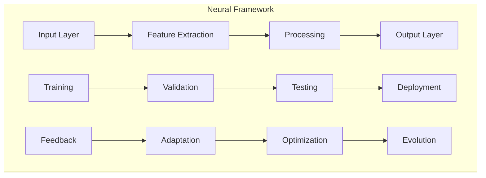
```mermaid
graph TD
    subgraph "Neural Framework"
        A[Input Layer] --> B[Feature Extraction]
        B --> C[Processing]
        C --> D[Output Layer]
        
        E[Training] --> F[Validation]
        F --> G[Testing]
        G --> H[Deployment]
        
        I[Feedback] --> J[Adaptation]
        J --> K[Optimization]
        K --> L[Evolution]
    end
```

## Security Framework

### Privacy Architecture

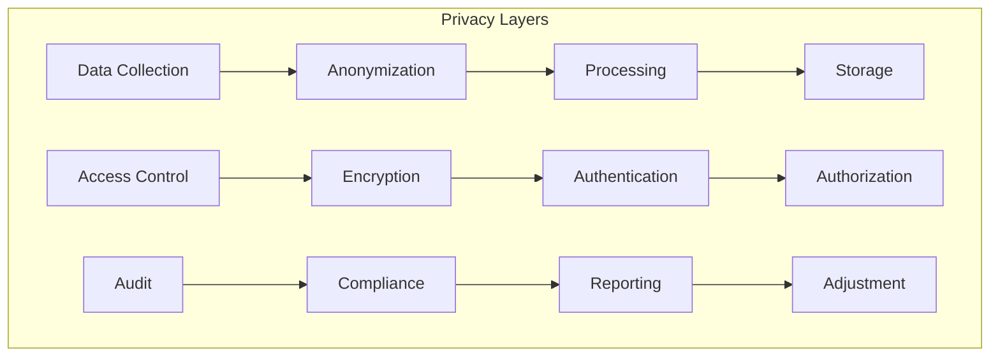
```mermaid
graph TD
    subgraph "Privacy Layers"
        A[Data Collection] --> B[Anonymization]
        B --> C[Processing]
        C --> D[Storage]
        
        E[Access Control] --> F[Encryption]
        F --> G[Authentication]
        G --> H[Authorization]
        
        I[Audit] --> J[Compliance]
        J --> K[Reporting]
        K --> L[Adjustment]
    end
```

### Security Measures

1. **Data Protection**
   - [[encryption_methods]]
   - [[access_control]]
   - [[privacy_preservation]]

2. **System Security**
   - [[network_security]]
   - [[device_security]]
   - [[application_security]]

## Performance Optimization

### Optimization Framework

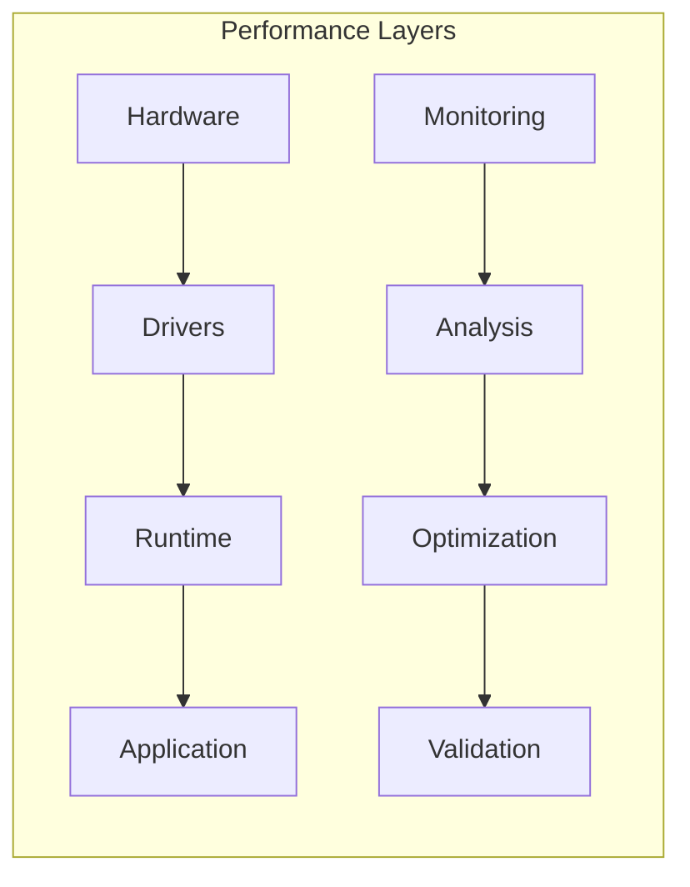
```mermaid
graph LR
    subgraph "Performance Layers"
        A[Hardware] --> B[Drivers]
        B --> C[Runtime]
        C --> D[Application]
        
        E[Monitoring] --> F[Analysis]
        F --> G[Optimization]
        G --> H[Validation]
    end
```

### Optimization Strategies

1. **Computational**
   - [[parallel_processing]]
   - [[distributed_computing]]
   - [[quantum_acceleration]]

2. **Memory**
   - [[cache_optimization]]
   - [[memory_management]]
   - [[data_structures]]

## Structural Hierarchy

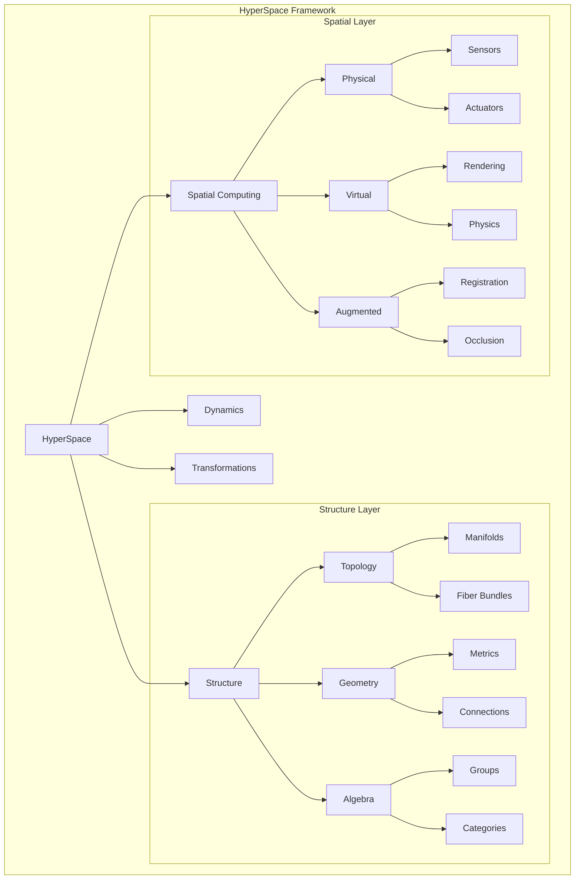
```mermaid
graph TD
    subgraph "HyperSpace Framework"
        A[HyperSpace] --> B[Structure]
        A --> C[Dynamics]
        A --> D[Transformations]
        A --> E[Spatial Computing]
        
        subgraph "Structure Layer"
            B --> B1[Topology]
            B --> B2[Geometry]
            B --> B3[Algebra]
            B1 --> B1a[Manifolds]
            B1 --> B1b[Fiber Bundles]
            B2 --> B2a[Metrics]
            B2 --> B2b[Connections]
            B3 --> B3a[Groups]
            B3 --> B3b[Categories]
        end

        subgraph "Spatial Layer"
            E --> E1[Physical]
            E --> E2[Virtual]
            E --> E3[Augmented]
            E1 --> E1a[Sensors]
            E1 --> E1b[Actuators]
            E2 --> E2a[Rendering]
            E2 --> E2b[Physics]
            E3 --> E3a[Registration]
            E3 --> E3b[Occlusion]
        end
    end
```

## Spatial Computing Integration

### Coordinate Systems Hierarchy

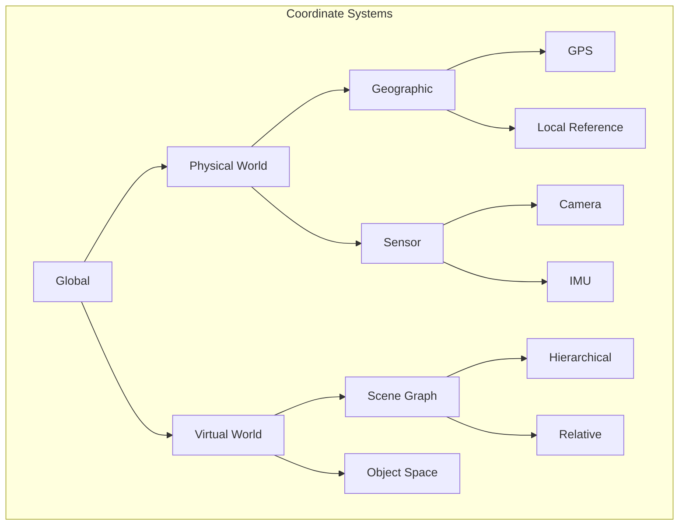
```mermaid
graph TD
    subgraph "Coordinate Systems"
        A[Global] --> B[Physical World]
        A --> C[Virtual World]
        B --> D[Geographic]
        B --> E[Sensor]
        C --> F[Scene Graph]
        C --> G[Object Space]
        D --> H[GPS]
        D --> I[Local Reference]
        E --> J[Camera]
        E --> K[IMU]
        F --> L[Hierarchical]
        F --> M[Relative]
    end
```

### Transformation Categories

1. **Spatial Transformations**
   - [[rigid_body_transformations]]
   - [[projective_transformations]]
   - [[conformal_mappings]]
   - [[coordinate_changes]]

2. **Reality Transformations**
   - [[physical_to_virtual]]
   - [[virtual_to_augmented]]
   - [[mixed_reality_blending]]
   - [[reality_anchoring]]

3. **Information Flows**
   - [[sensor_fusion]]
   - [[spatial_queries]]
   - [[geometric_inference]]
   - [[occlusion_handling]]

## Geometric Foundations

### Manifold Structure

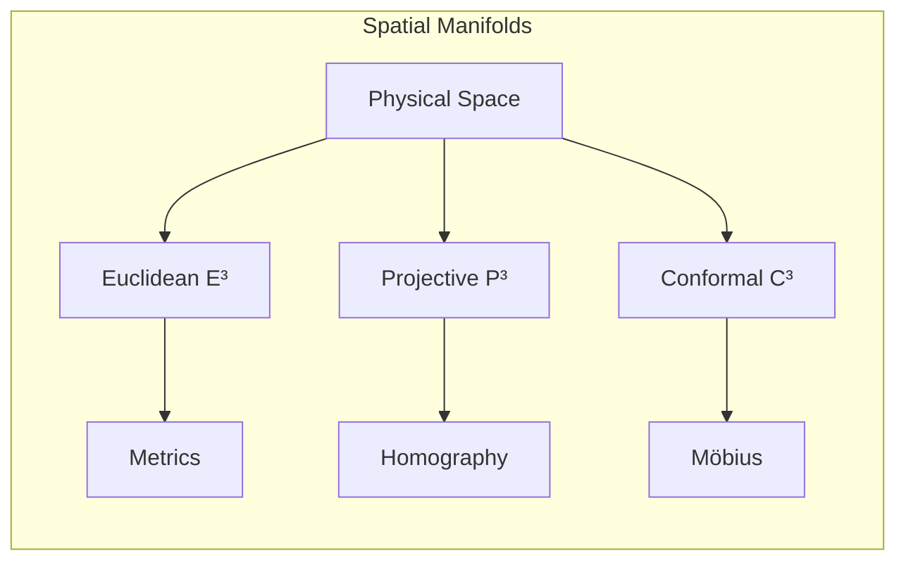
```mermaid
graph LR
    subgraph "Spatial Manifolds"
        A[Physical Space] --> B[Euclidean E³]
        A --> C[Projective P³]
        A --> D[Conformal C³]
        B --> E[Metrics]
        C --> F[Homography]
        D --> G[Möbius]
    end
```

### Bundle Structures

1. **Principal Bundles**
   - Base: Physical space
   - Fiber: [[transformation_group]]
   - Structure: [[gauge_theory]]

2. **Associated Bundles**
   - Virtual content
   - Augmented overlays
   - Spatial anchors

3. **Section Spaces**
   - Reality fields
   - Mixed reality maps
   - Spatial web manifolds

## Information Architecture

### Category Theory View

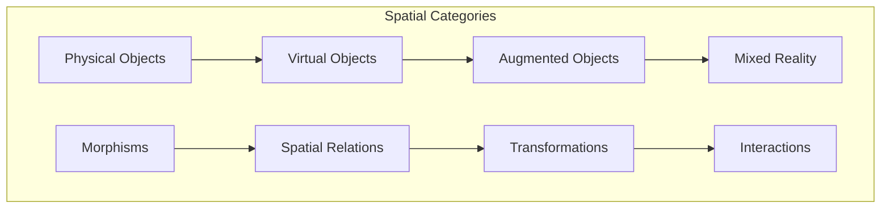
```mermaid
graph TD
    subgraph "Spatial Categories"
        A[Physical Objects] --> B[Virtual Objects]
        B --> C[Augmented Objects]
        C --> D[Mixed Reality]
        
        E[Morphisms] --> F[Spatial Relations]
        F --> G[Transformations]
        G --> H[Interactions]
    end
```

### Sheaf Structure

1. **Local Data**
   - [[spatial_measurements]]
   - [[virtual_content]]
   - [[augmented_overlays]]

2. **Gluing Conditions**
   - [[coordinate_compatibility]]
   - [[reality_consistency]]
   - [[information_coherence]]

3. **Global Sections**
   - [[unified_reality_field]]
   - [[spatial_web_topology]]
   - [[mixed_reality_continuum]]

## Applications

### Spatial Web Architecture

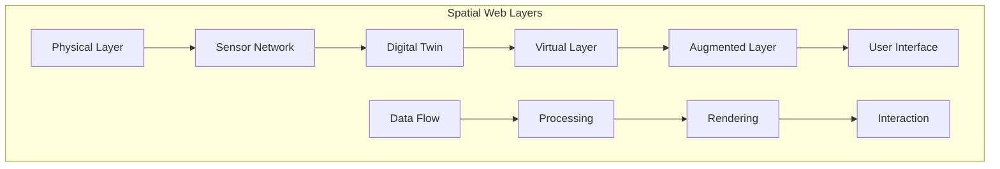
```mermaid
graph TD
    subgraph "Spatial Web Layers"
        A[Physical Layer] --> B[Sensor Network]
        B --> C[Digital Twin]
        C --> D[Virtual Layer]
        D --> E[Augmented Layer]
        E --> F[User Interface]
        
        G[Data Flow] --> H[Processing]
        H --> I[Rendering]
        I --> J[Interaction]
    end
```

### Reality Mapping

1. **Physical Reality**
   - [[sensor_networks]]
   - [[spatial_mapping]]
   - [[environment_understanding]]

2. **Virtual Reality**
   - [[scene_graphs]]
   - [[physics_simulation]]
   - [[rendering_pipelines]]

3. **Augmented Reality**
   - [[registration_systems]]
   - [[occlusion_handling]]
   - [[reality_anchoring]]

## Implementation Guidelines

### Design Principles

1. **Structural Integrity**
   - Maintain mathematical rigor
   - Ensure categorical consistency
   - Preserve geometric invariants

2. **Reality Integration**
   - Seamless physical-virtual mapping
   - Consistent coordinate systems
   - Robust reality anchoring

3. **Information Flow**
   - Efficient data structures
   - Coherent transformations
   - Optimal query systems

### Best Practices

1. **Mathematical Framework**
   - Use appropriate geometric models
   - Implement robust transformations
   - Maintain categorical consistency

2. **Reality Management**
   - Handle multiple coordinate frames
   - Ensure spatial consistency
   - Manage reality transitions

3. **System Architecture**
   - Design scalable structures
   - Implement efficient queries
   - Optimize data flow

## Future Directions

### Research Areas

1. **Theoretical Extensions**
   - [[quantum_spatial_computing]]
   - [[topological_data_analysis]]
   - [[categorical_dynamics]]

2. **Technical Advances**
   - [[distributed_spatial_computing]]
   - [[quantum_registration]]
   - [[holographic_interfaces]]

3. **Applications**
   - [[spatial_intelligence]]
   - [[reality_synthesis]]
   - [[universal_computing]]

### Open Problems

1. **Theoretical Challenges**
   - Unified reality theory
   - Quantum-classical bridge
   - Categorical dynamics

2. **Technical Challenges**
   - Real-time performance
   - Scalable architecture
   - Universal compatibility

3. **Application Challenges**
   - User experience
   - Reality coherence
   - System integration

## Related Topics
- [[spatial_web]]
- [[augmented_reality]]
- [[virtual_reality]]
- [[category_theory]]
- [[differential_geometry]]
- [[information_geometry]]
- [[active_inference]]
- [[quantum_mechanics]]
- [[neural_networks]]

## Spatiotemporal Framework

### Location Spaces

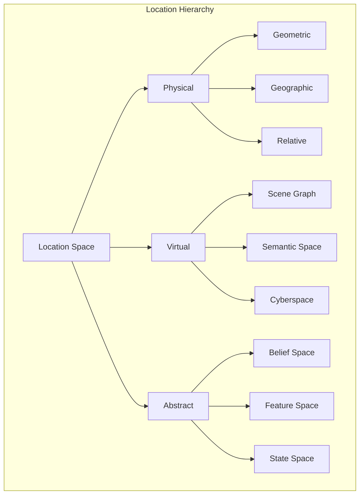
```mermaid
graph TD
    subgraph "Location Hierarchy"
        A[Location Space] --> B[Physical]
        A --> C[Virtual]
        A --> D[Abstract]
        
        B --> B1[Geometric]
        B --> B2[Geographic]
        B --> B3[Relative]
        
        C --> C1[Scene Graph]
        C --> C2[Semantic Space]
        C --> C3[Cyberspace]
        
        D --> D1[Belief Space]
        D --> D2[Feature Space]
        D --> D3[State Space]
    end
```

1. **Physical Location Structures**
   ```math
   \begin{aligned}
   & \text{Metric Space:} \\
   & (X, d): d(x,y) \geq 0, d(x,y) = d(y,x), d(x,z) \leq d(x,y) + d(y,z) \\
   & \text{Geodesic Space:} \\
   & \gamma: [0,1] \to X, \text{ length}(\gamma) = d(x,y)
   \end{aligned}
   ```

2. **Virtual Location Mappings**
   - [[scene_graph_topology]]
   - [[semantic_embeddings]]
   - [[virtual_coordinates]]

3. **Abstract Location Theory**
   ```math
   \begin{aligned}
   & \text{Category of Locations:} \\
   & \mathcal{L} = (Ob(\mathcal{L}), Hom(\mathcal{L}), \circ) \\
   & \text{Locator Functor:} \\
   & F: \mathcal{P} \to \mathcal{L}
   \end{aligned}
   ```

### Temporal Structures

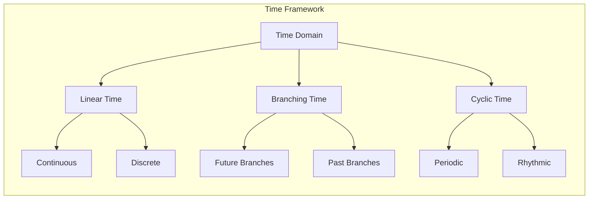
```mermaid
graph LR
    subgraph "Time Framework"
        A[Time Domain] --> B[Linear Time]
        A --> C[Branching Time]
        A --> D[Cyclic Time]
        
        B --> B1[Continuous]
        B --> B2[Discrete]
        
        C --> C1[Future Branches]
        C --> C2[Past Branches]
        
        D --> D1[Periodic]
        D --> D2[Rhythmic]
    end
```

1. **Temporal Categories**
   ```math
   \begin{aligned}
   & \text{Time Category:} \\
   & \mathcal{T} = (\text{Time}, \leq, +) \\
   & \text{Duration Functor:} \\
   & D: \mathcal{T} \to \mathbb{R}_+ \\
   & \text{Temporal Logic:} \\
   & \square \phi, \diamond \phi, \phi \mathcal{U} \psi
   \end{aligned}
   ```

2. **Causal Structures**
   - [[causal_cones]]
   - [[event_horizons]]
   - [[temporal_boundaries]]

### Abstract State Spaces

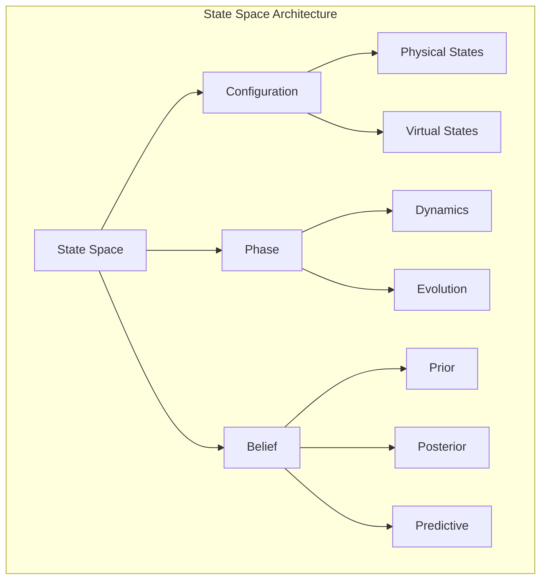
```mermaid
graph TD
    subgraph "State Space Architecture"
        A[State Space] --> B[Configuration]
        A --> C[Phase]
        A --> D[Belief]
        
        B --> B1[Physical States]
        B --> B2[Virtual States]
        
        C --> C1[Dynamics]
        C --> C2[Evolution]
        
        D --> D1[Prior]
        D --> D2[Posterior]
        D --> D3[Predictive]
    end
```

1. **State Manifolds**
   ```math
   \begin{aligned}
   & \text{State Bundle:} \\
   & \pi: E \to M \\
   & \text{Section Space:} \\
   & \Gamma(E) = \{s: M \to E \mid \pi \circ s = id_M\} \\
   & \text{State Flow:} \\
   & \phi_t: E \to E, \quad \frac{d}{dt}\phi_t = X_H \circ \phi_t
   \end{aligned}
   ```

2. **Active Inference States**
   - [[belief_states|Belief States]]
   - [[action_states|Action States]]
   - [[policy_states|Policy States]]

## Spatial Web Integration

### Location-Based Services

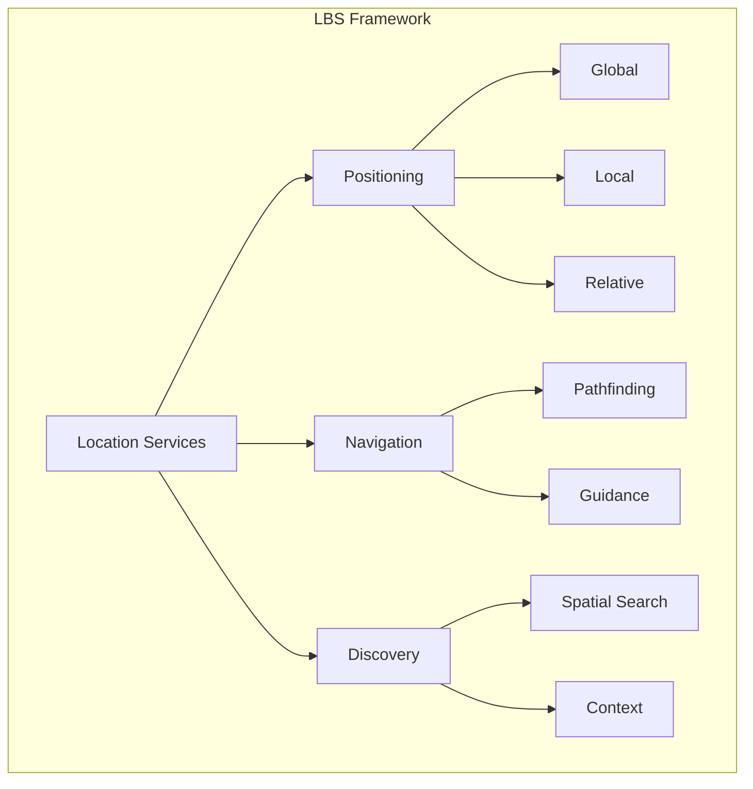
```mermaid
graph TD
    subgraph "LBS Framework"
        A[Location Services] --> B[Positioning]
        A --> C[Navigation]
        A --> D[Discovery]
        
        B --> B1[Global]
        B --> B2[Local]
        B --> B3[Relative]
        
        C --> C1[Pathfinding]
        C --> C2[Guidance]
        
        D --> D1[Spatial Search]
        D --> D2[Context]
    end
```

### Temporal Processing

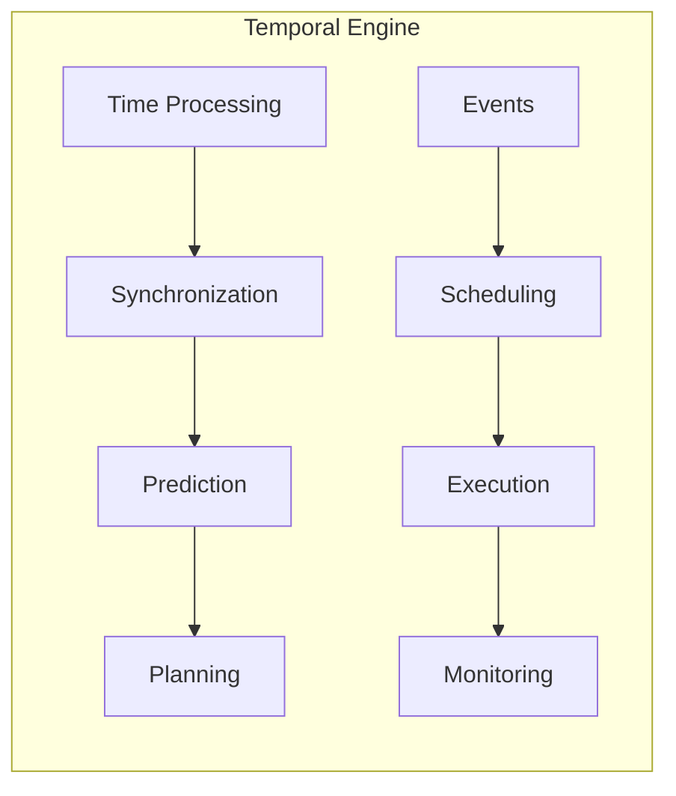
```mermaid
graph LR
    subgraph "Temporal Engine"
        A[Time Processing] --> B[Synchronization]
        B --> C[Prediction]
        C --> D[Planning]
        
        E[Events] --> F[Scheduling]
        F --> G[Execution]
        G --> H[Monitoring]
    end
```

### State Management

1. **State Transitions**
   ```math
   \begin{aligned}
   & \text{Transition Probability:} \\
   & P(s_{t+1}|s_t,a_t) \\
   & \text{Value Function:} \\
   & V(s) = \mathbb{E}[\sum_{t=0}^{\infty} \gamma^t r_t|s_0=s] \\
   & \text{Policy:} \\
   & \pi(a|s) = \sigma(-F(s,a))
   \end{aligned}
   ```

2. **State Synchronization**
   - [[state_replication]]
   - [[consistency_protocols]]
   - [[conflict_resolution]]

## Active Inference Framework

### Belief Dynamics

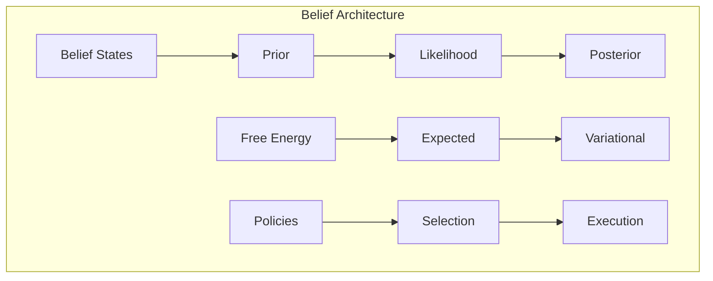
```mermaid
graph TD
    subgraph "Belief Architecture"
        A[Belief States] --> B[Prior]
        B --> C[Likelihood]
        C --> D[Posterior]
        
        E[Free Energy] --> F[Expected]
        F --> G[Variational]
        
        H[Policies] --> I[Selection]
        I --> J[Execution]
    end
```

### Spatial Inference

1. **Spatial Beliefs**
   ```math
   \begin{aligned}
   & \text{Spatial Prior:} \\
   & p(x|m) = \mathcal{N}(\mu_x, \Sigma_x) \\
   & \text{Location Likelihood:} \\
   & p(o|x) = \prod_i p(o_i|x) \\
   & \text{Posterior Location:} \\
   & q(x) = \arg\min_q F[q]
   \end{aligned}
   ```

2. **Spatial Policies**
   - [[navigation_policies]]
   - [[exploration_policies]]
   - [[interaction_policies]]

## Advanced Mathematical Frameworks

### Differential Cohomology

```mermaid
graph TD
    subgraph "Cohomology Framework"
        A[Differential Forms] --> B[de Rham Cohomology]
        B --> C[Characteristic Classes]
        C --> D[Index Theory]
        
        E[Sheaf Theory] --> F[Čech Cohomology]
        F --> G[Spectral Sequences]
        G --> H[Derived Categories]
    end
```

1. **Differential Forms**
   ```math
   \begin{aligned}
   & \text{Exterior Derivative:} \\
   & d: \Omega^k(M) \to \Omega^{k+1}(M) \\
   & \text{Integration:} \\
   & \int_M \omega = \lim_{|\mathcal{P}| \to 0} \sum_{σ \in \mathcal{P}} \omega(σ) \\
   & \text{Stokes' Theorem:} \\
   & \int_M d\omega = \int_{\partial M} \omega
   \end{aligned}
   ```

2. **Characteristic Classes**
   - [[chern_classes]]
   - [[pontryagin_classes]]
   - [[euler_class]]

### Geometric Measure Theory

```mermaid
graph LR
    subgraph "Measure Structure"
        A[Hausdorff Measure] --> B[Rectifiable Sets]
        B --> C[Currents]
        C --> D[Varifolds]
        
        E[Area Formula] --> F[Coarea Formula]
        F --> G[Federer Principle]
    end
```

1. **Measure Theoretic Foundations**
   ```math
   \begin{aligned}
   & \text{Hausdorff Measure:} \\
   & \mathcal{H}^s(A) = \lim_{δ \to 0} \inf\{\sum_i r_i^s : A \subset \bigcup_i B(x_i,r_i), r_i < δ\} \\
   & \text{Density:} \\
   & \Theta^s(μ,x) = \lim_{r \to 0} \frac{μ(B(x,r))}{ω_sr^s} \\
   & \text{Rectifiability:} \\
   & \mathcal{H}^s\text{-measurable } E \text{ is rectifiable if } E \subset \bigcup_{i=1}^∞ f_i(\mathbb{R}^s)
   \end{aligned}
   ```

2. **Geometric Integration**
   - [[area_formula]]
   - [[coarea_formula]]
   - [[current_theory]]

### Higher Category Theory

```mermaid
graph TD
    subgraph "Higher Categories"
        A[n-Categories] --> B[∞-Categories]
        B --> C[Derived Stacks]
        C --> D[Motivic Theory]
        
        E[Operads] --> F[Higher Operads]
        F --> G[Factorization Homology]
        G --> H[Topological QFT]
    end
```

1. **∞-Categories**
   ```math
   \begin{aligned}
   & \text{Simplicial Sets:} \\
   & X_n = \text{Hom}(Δ[n], X) \\
   & \text{Model Categories:} \\
   & \mathcal{M} = (W, Cof, Fib) \\
   & \text{Quillen Equivalence:} \\
   & F: \mathcal{C} \rightleftarrows \mathcal{D} :G
   \end{aligned}
   ```

2. **Higher Structures**
   - [[infinity_groupoids]]
   - [[derived_categories]]
   - [[stable_homotopy]]

## Advanced Computational Frameworks

### Geometric Deep Learning

```mermaid
graph TD
    subgraph "Geometric Learning"
        A[Manifold Learning] --> B[Group Equivariance]
        B --> C[Gauge Theory]
        C --> D[Fiber Networks]
        
        E[Message Passing] --> F[Attention]
        F --> G[Pooling]
        G --> H[Covariance]
    end
```

1. **Equivariant Networks**
   ```math
   \begin{aligned}
   & \text{Group Action:} \\
   & ρ_{\text{out}} \circ Φ = Φ \circ ρ_{\text{in}} \\
   & \text{Convolution:} \\
   & [f *_G k](x) = \int_G k(g^{-1}x)f(g)dg \\
   & \text{Attention:} \\
   & \text{Att}(Q,K,V) = \text{softmax}(\frac{QK^T}{\sqrt{d_k}})V
   \end{aligned}
   ```

2. **Geometric Architectures**
   - [[gauge_cnns]]
   - [[fiber_bundles_networks]]
   - [[geometric_transformers]]

### Quantum Computing Integration

```mermaid
graph LR
    subgraph "Quantum Framework"
        A[Quantum States] --> B[Gates]
        B --> C[Measurements]
        C --> D[Error Correction]
        
        E[Topology] --> F[Braiding]
        F --> G[Anyons]
        G --> H[TQC]
    end
```

1. **Quantum Operations**
   ```math
   \begin{aligned}
   & \text{Quantum Channel:} \\
   & \mathcal{E}(ρ) = \sum_k E_k ρ E_k^† \\
   & \text{Measurement:} \\
   & p(k) = \text{Tr}(M_k ρ M_k^†) \\
   & \text{Evolution:} \\
   & \frac{d}{dt}ρ = -i[H,ρ] + \mathcal{L}(ρ)
   \end{aligned}
   ```

2. **Quantum Algorithms**
   - [[quantum_fourier]]
   - [[quantum_phase_estimation]]
   - [[quantum_error_correction]]

## Advanced Space-Time-Abstract Framework

### Unified Space Theory

```mermaid
graph TD
    subgraph "Space Hierarchy"
        A[Universal Space] --> B[Physical Space]
        A --> C[Information Space]
        A --> D[Cognitive Space]
        
        B --> B1[Metric Space]
        B --> B2[Topological Space]
        B --> B3[Manifold Space]
        
        C --> C1[Probability Space]
        C --> C2[Feature Space]
        C --> C3[State Space]
        
        D --> D1[Belief Space]
        D --> D2[Action Space]
        D --> D3[Policy Space]
    end
```

1. **Physical Space Structures**
   - [[riemannian_manifolds|Riemannian Geometry]]
   - [[minkowski_spacetime|Special Relativity]]
   - [[lorentzian_manifolds|General Relativity]]
   - [[phase_space|Hamiltonian Mechanics]]
   - [[symplectic_manifolds|Symplectic Geometry]]
   - [[contact_manifolds|Contact Geometry]]

2. **Information Space Structures**
   - [[statistical_manifolds|Statistical Geometry]]
   - [[quantum_state_space|Quantum States]]
   - [[hilbert_spaces|Hilbert Space]]
   - [[banach_spaces|Banach Space]]
   - [[probability_spaces|Probability Theory]]
   - [[measure_spaces|Measure Theory]]

3. **Cognitive Space Structures**
   - [[belief_manifolds|Belief Geometry]]
   - [[action_manifolds|Action Geometry]]
   - [[policy_spaces|Policy Manifolds]]
   - [[free_energy_landscapes|Free Energy Geometry]]
   - [[prediction_spaces|Predictive Manifolds]]
   - [[attention_spaces|Attention Geometry]]

### Advanced Temporal Frameworks

```mermaid
graph TD
    subgraph "Time Structures"
        A[Temporal Framework] --> B[Physical Time]
        A --> C[Logical Time]
        A --> D[Cognitive Time]
        
        B --> B1[Relativistic]
        B --> B2[Quantum]
        B --> B3[Thermodynamic]
        
        C --> C1[Causal]
        C --> C2[Temporal Logic]
        C --> C3[Process Algebra]
        
        D --> D1[Subjective]
        D --> D2[Predictive]
        D --> D3[Active Inference]
    end
```

1. **Physical Time Theories**
   - [[relativistic_time|Relativistic Time]]
   - [[quantum_time|Quantum Time]]
   - [[thermodynamic_time|Arrow of Time]]
   - [[dynamical_time|Dynamical Systems]]
   - [[geometric_time|Geometric Time]]
   - [[emergent_time|Emergent Time]]

2. **Logical Time Structures**
   - [[temporal_logic|Temporal Logic]]
   - [[process_calculi|Process Calculi]]
   - [[causal_sets|Causal Sets]]
   - [[event_structures|Event Structures]]
   - [[branching_time|Branching Time]]
   - [[linear_time|Linear Time]]

3. **Cognitive Time Models**
   - [[predictive_time|Predictive Processing]]
   - [[active_inference_time|Active Inference Time]]
   - [[subjective_time|Subjective Time]]
   - [[memory_time|Memory Time]]
   - [[attention_time|Attention Time]]
   - [[learning_time|Learning Time]]

### Abstract Space Integration

```mermaid
graph LR
    subgraph "Abstract Framework"
        A[Abstract Spaces] --> B[Category Theory]
        A --> C[Topos Theory]
        A --> D[Type Theory]
        
        B --> B1[∞-Categories]
        B --> B2[Enriched Categories]
        
        C --> C1[Sheaf Theory]
        C --> C2[Stack Theory]
        
        D --> D1[Dependent Types]
        D --> D2[Homotopy Types]
    end
```

1. **Category Theoretic Structures**
   - [[monoidal_categories|Monoidal Categories]]
   - [[enriched_categories|Enriched Categories]]
   - [[higher_categories|Higher Categories]]
   - [[model_categories|Model Categories]]
   - [[derived_categories|Derived Categories]]
   - [[dg_categories|DG Categories]]

2. **Topos Theoretic Structures**
   - [[elementary_topoi|Elementary Topoi]]
   - [[grothendieck_topoi|Grothendieck Topoi]]
   - [[higher_topoi|Higher Topoi]]
   - [[sheaf_theory|Sheaf Theory]]
   - [[stack_theory|Stack Theory]]
   - [[derived_stacks|Derived Stacks]]

3. **Type Theoretic Structures**
   - [[dependent_types|Dependent Types]]
   - [[homotopy_types|Homotopy Types]]
   - [[linear_types|Linear Types]]
   - [[modal_types|Modal Types]]
   - [[quantum_types|Quantum Types]]
   - [[effect_types|Effect Types]]

### Integration Frameworks

```mermaid
graph TD
    subgraph "Integration Structure"
        A[Integration Framework] --> B[Geometric]
        A --> C[Algebraic]
        A --> D[Computational]
        
        B --> B1[Differential]
        B --> B2[Measure]
        
        C --> C1[Homological]
        C --> C2[Categorical]
        
        D --> D1[Type Theory]
        D --> D2[Programming]
    end
```

1. **Geometric Integration**
   - [[differential_forms|Differential Forms]]
   - [[integration_theory|Integration Theory]]
   - [[measure_theory|Measure Theory]]
   - [[geometric_integration|Geometric Integration]]
   - [[stochastic_integration|Stochastic Integration]]
   - [[path_integrals|Path Integrals]]

2. **Algebraic Integration**
   - [[homology_theory|Homology Theory]]
   - [[cohomology_theory|Cohomology Theory]]
   - [[k_theory|K-Theory]]
   - [[motivic_integration|Motivic Integration]]
   - [[derived_integration|Derived Integration]]
   - [[categorical_integration|Categorical Integration]]

3. **Computational Integration**
   - [[type_theory_integration|Type Theory Integration]]
   - [[program_synthesis|Program Synthesis]]
   - [[formal_verification|Formal Verification]]
   - [[automated_reasoning|Automated Reasoning]]
   - [[proof_assistants|Proof Assistants]]
   - [[dependent_types|Dependent Types]]