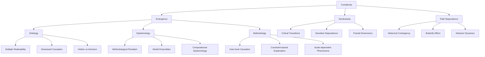

---

title: Complexity and Philosophy

type: philosophy

status: stable

tags: [complexity, philosophy, emergence]

semantic_relations:

  - type: relates

    links: [systems_theory, emergence_self_organization, operationalism]

---

# Complexity and Philosophy

Complexity science challenges classical reductionism by emphasizing emergence, nonlinearity, and path dependence. Philosophical implications include new views on explanation, causation, and methodology in the sciences. This intersection explores how complexity theory transforms traditional philosophical questions about reality, knowledge, and scientific method.

## Core Philosophical Challenges

### Reductionism vs Emergence

Classical reductionism assumes complex systems can be fully understood by analyzing their constituent parts. Complexity theory introduces emergence - properties that arise at system level but cannot be predicted from component analysis alone.

**Philosophical Implications:**
- **Multiple Realizability**: Same higher-level properties can emerge from different lower-level implementations
- **Downward Causation**: Higher-level patterns can influence lower-level components
- **Holism vs Atomism**: Tension between whole-system understanding and component analysis

### Determinism vs Historicity

Complex systems often exhibit path dependence and historical contingency, challenging deterministic views of causation.

**Key Concepts:**
- **Path Dependence**: System evolution depends on historical sequence of events
- **Critical Transitions**: Abrupt changes triggered by small perturbations
- **Sensitivity to Initial Conditions**: Butterfly effect and chaotic dynamics

### Explanation and Understanding

Complexity requires new approaches to scientific explanation beyond traditional mechanistic models.

**Explanatory Frameworks:**
- **Mechanistic Explanation**: Component interactions and causal chains
- **Dynamical Explanation**: Phase space trajectories and attractor landscapes
- **Computational Explanation**: Algorithmic processes and information flow

## Themes

### Ontological Implications

- **Emergent Ontology**: Reality has multiple levels with genuinely new properties
- **Process Philosophy**: Reality as dynamic processes rather than static substances
- **Relational Ontology**: Entities defined by relationships rather than intrinsic properties

### Epistemological Implications

- **Methodological Pluralism**: Multiple approaches needed for complex systems
- **Model Ensembles**: Using multiple models to capture different aspects
- **Computational Epistemology**: Understanding through simulation and computation

### Methodological Implications

- **Inter-level Causation**: Causal influences between different organizational levels
- **Constraint-based Explanation**: System behavior shaped by boundary conditions
- **Scale-dependent Phenomena**: Properties that change with observational scale

## Relationship to Active Inference

Complexity theory provides philosophical foundations for Active Inference by addressing:

- **Hierarchical Processing**: Multiple scales of inference and control
- **Emergent Cognition**: Intelligence arising from simple inference rules
- **Adaptive Landscapes**: Free energy landscapes in complex state spaces

See: [[systems_theory]], [[emergence_self_organization]], [[operationalism]].

## Concept Map

