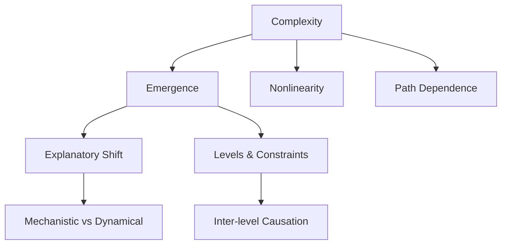

---

title: Complexity and Philosophy

type: philosophy

status: stable

tags: [complexity, philosophy, emergence]

semantic_relations:

  - type: relates

    links: [systems_theory, emergence_self_organization, operationalism]

---

# Complexity and Philosophy

Complexity science challenges classical reductionism by emphasizing emergence, nonlinearity, and path dependence. Philosophical implications include new views on explanation, causation, and methodology in the sciences.

## Themes

- Emergent properties and multiple realizability

- Mechanistic vs dynamical explanations

- Inter-level causation and constraints

- Methodological pluralism and model ensembles

See: [[systems_theory]], [[emergence_self_organization]], [[operationalism]].

## Concept map

