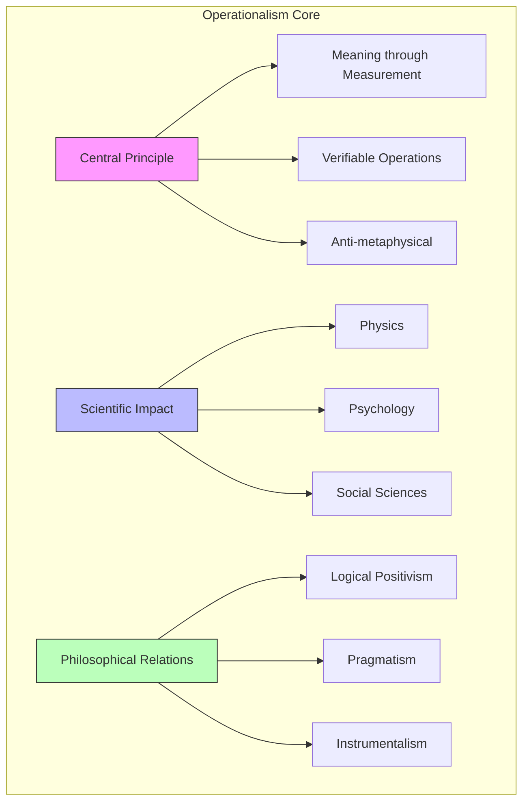
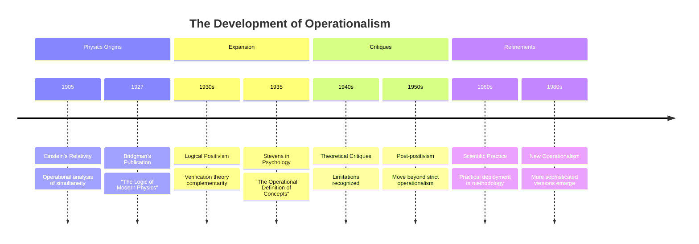
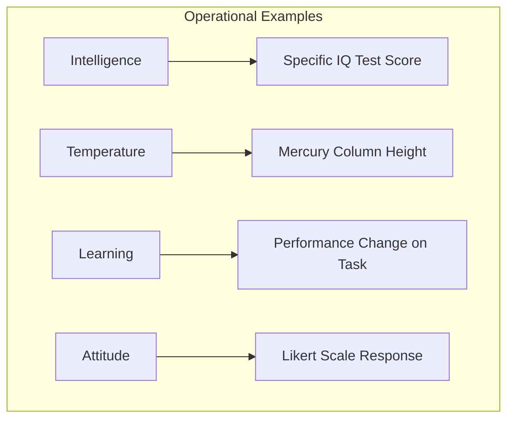
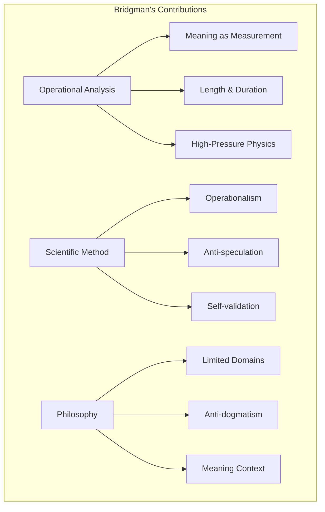
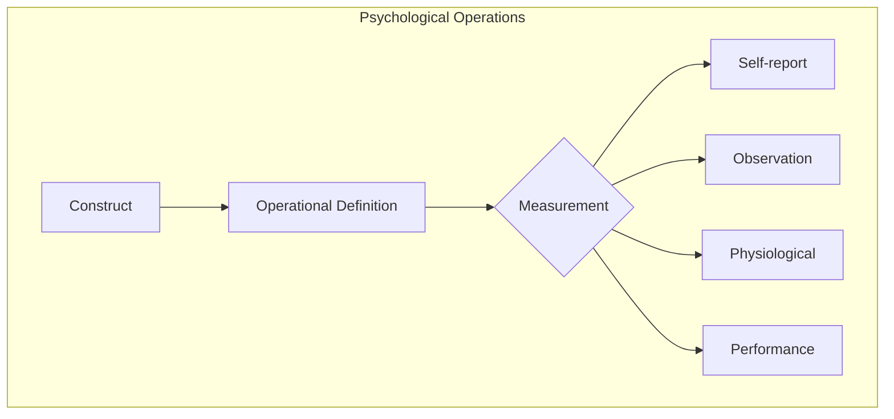
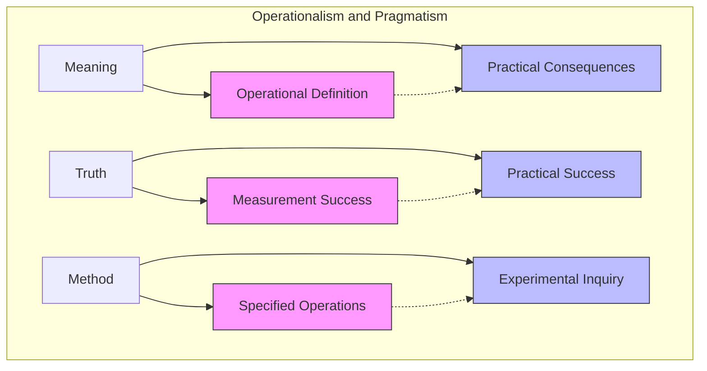
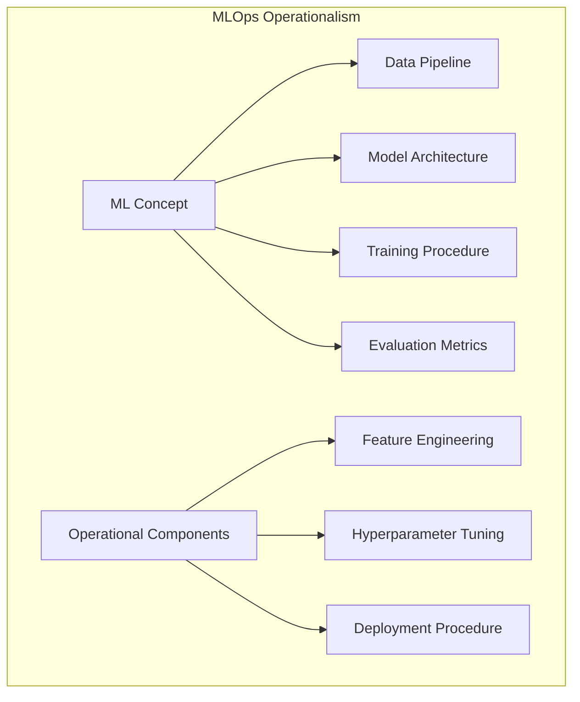
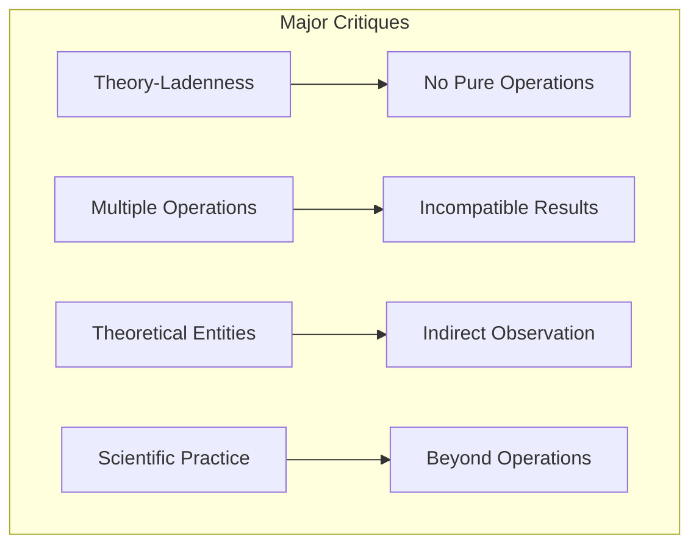

---

title: Operationalism

type: concept

status: stable

created: 2024-03-21

tags:

  - philosophy

  - philosophy_of_science

  - methodology

  - measurement

semantic_relations:

  - type: foundational_theory

    links:

      - [[philosophy_of_science]]

      - [[logical_positivism]]

      - [[verification_theory]]

  - type: relates

    links:

      - [[pragmatism]]

      - [[instrumentalism]]

      - [[scientific_method]]

      - [[measurement_theory]]

      - [[physics]]

---

# Operationalism

## Overview

Operationalism (also known as operationism or operational definition) is a philosophical and methodological approach that defines theoretical concepts solely in terms of the operations or procedures used to measure or observe them. Emerging from physics in the 1920s and subsequently influencing [[philosophy_of_science]], [[psychology]], and social sciences, operationalism represents a significant attempt to ground scientific concepts in empirically verifiable operations rather than abstract metaphysical properties.



## Historical Development

### Origins in Physics



Operationalism as a formal doctrine was introduced by Percy W. Bridgman in his 1927 book "The Logic of Modern Physics," though similar ideas appeared earlier in [[albert_einstein|Einstein's]] work on [[theory_of_relativity|relativity]]. Bridgman, a Nobel Prize-winning physicist, sought to clarify physical concepts by defining them in terms of measurement operations after Einstein's revolution in physics showed how concepts like "simultaneity" required operational specification.

### Influence and Evolution

Operationalism spread beyond physics to influence:

1. **[[logical_positivism|Logical Positivism]]**: Operationalism aligned with [[verification_theory|verification principle]]

1. **Scientific Psychology**: S.S. Stevens adopted operationalism to define psychological concepts

1. **Social Sciences**: Operational definitions became standard methodological practice

1. **Behavioral Sciences**: [[b_f_skinner|B.F. Skinner's]] [[behaviorism]] embraced operational definitions

Over time, strict operationalism was modified to address criticisms, leading to:

1. **Liberal Operationalism**: Multiple operations can define the same concept

1. **Constructive Operationalism**: Operations construct rather than merely define concepts

1. **Pragmatic Operationalism**: Focus on practical scientific utility rather than philosophical purity

## Core Principles

### Operational Definition

```math

\begin{aligned}

\text{Concept Definition:} \\

C = \{O_1, O_2, ..., O_n\} \\

\text{where:} \\

O_i = \text{distinct measurement/observation procedure}

\end{aligned}

```

An operational definition specifies:

1. **Measurement Procedures**: The exact operations used to measure the concept

1. **Observable Outcomes**: The empirical results of those operations

1. **Quantification Method**: How results translate to numerical or categorical values

1. **Standard Conditions**: The context in which operations must occur

This approach shares conceptual similarities with the [[verification_theory|verification principle]] in [[logical_positivism]] and aspects of [[pragmatism]], though with a more specific focus on measurement operations.

### Examples of Operational Definitions



Classic examples include:

1. **Length**: The number of standard measuring units that can be placed end-to-end alongside an object

1. **Intelligence**: The score obtained on a specific [[intelligence_testing|intelligence test]]

1. **Temperature**: The height of mercury in a standardized thermometer

1. **Hunger**: Self-reported rating on a numerical scale or time since last meal

These examples illustrate how theoretical concepts are transformed into precise measurement procedures, enabling consistent scientific investigation across different researchers and contexts.

### Philosophical Underpinnings

Operationalism rests on several philosophical commitments:

1. **Anti-metaphysical Stance**: Rejection of unobservable essences or properties

1. **[[verification_theory|Verificationism]]**: Meaning requires empirical verification

1. **[[scientific_anti-realism|Anti-realism]]**: Skepticism about the reality of theoretical entities

1. **[[pragmatism|Pragmatism]]**: Focus on practical consequences rather than abstract truth

These philosophical positions align operationalism with broader empiricist trends in 20th-century philosophy, including [[logical_empiricism]], [[instrumentalism]], and aspects of [[pragmatism]].

## Key Figures

### Percy W. Bridgman (1882-1961)



Bridgman, a Nobel Prize-winning physicist, contributed:

- **Physical Measurements**: Pioneered high-pressure [[experimental_physics|physics techniques]]

- **Operational Analysis**: Applied operational thinking to fundamental physical concepts

- **Scientific Methodology**: Advocated for rigorous experimental standards

- **Philosophy of Science**: Developed operationalism as an anti-dogmatic stance

Bridgman's approach emerged from his practical work as an experimental physicist and his concern with the conceptual clarity needed for scientific progress following Einstein's revolutionary theories.

### Stanley Smith Stevens (1906-1973)

Stevens extended operationalism to psychology by:

- **[[measurement_scales|Measurement Scales]]**: Developing the theory of measurement scales (nominal, ordinal, interval, ratio)

- **[[psychophysics|Psychophysics]]**: Operationalizing the relationship between physical stimuli and psychological sensations

- **Methodological Rigor**: Standardizing operational procedures in experimental psychology

- **Definition Reform**: Reconceptualizing psychological concepts in operational terms

Stevens' work was crucial in establishing psychology as a quantitative science with rigorous measurement procedures, enabling more systematic empirical research in the field.

### B.F. Skinner (1904-1990)

Skinner's radical [[behaviorism]] incorporated operationalism through:

- **Behavioral Operations**: Defining psychological concepts in terms of observable behavior

- **[[operant_conditioning|Operant Conditioning]]**: Operationalizing learning as measurable behavior change

- **Anti-mentalism**: Rejecting unobservable mental states in favor of behavioral operations

- **Measurement Precision**: Developing precise measurement techniques for behavior

Skinner's behaviorism represented one of the most thorough applications of operationalist principles in psychology, with lasting impacts on [[behavioral_therapy]], [[experimental_psychology]], and [[learning_theory]].

## Operational Methods in Science

### Physics and Natural Sciences

```python

class OperationalMeasurement:

    def __init__(self,

                 concept: str,

                 instrument: MeasurementInstrument,

                 protocol: MeasurementProtocol):

        """Initialize an operational measurement.

        Args:

            concept: The concept being measured

            instrument: The physical apparatus used

            protocol: The standardized procedure

        """

        self.concept = concept

        self.instrument = instrument

        self.protocol = protocol

        self.calibration_data = {}

        self.measurement_results = []

    def calibrate(self) -> bool:

        """Calibrate the measurement instrument."""

        self.calibration_data = self.instrument.run_calibration_procedure(

            self.protocol.calibration_standards

        )

        return self.is_calibrated()

    def is_calibrated(self) -> bool:

        """Check if properly calibrated."""

        return self.instrument.check_calibration(self.calibration_data)

    def measure(self, system: PhysicalSystem) -> MeasurementResult:

        """Perform the measurement operation."""

        if not self.is_calibrated():

            raise MeasurementError("Instrument not calibrated")

        # Follow operational protocol

        raw_data = self.protocol.collect_data(system, self.instrument)

        # Process according to operational definition

        result = self.protocol.process_data(raw_data)

        self.measurement_results.append(result)

        return result

```

In physics, operational methods include:

1. **Standardized Instruments**: Precisely specified measurement apparatus

1. **Calibration Procedures**: Operations to ensure instrument accuracy

1. **Measurement Protocols**: Step-by-step procedures for obtaining measurements

1. **Data Processing Rules**: Explicit calculations to convert raw data to results

These operational methods form the foundation of experimental physics and other natural sciences, ensuring reproducibility and objectivity in scientific investigations.

### Psychology and Social Sciences



Operational approaches in behavioral sciences include:

1. **[[psychometrics|Psychometric Tests]]**: Standardized instruments with specific administration procedures

1. **[[behavioral_observation|Behavioral Observation]]**: Codified protocols for recording and categorizing behavior

1. **[[experimental_manipulation|Experimental Manipulations]]**: Precise procedures for manipulating independent variables

1. **[[statistical_analysis|Statistical Operations]]**: Explicit computational procedures for analyzing data

The adoption of operational definitions in psychology and social sciences has been crucial for establishing these fields as empirical sciences, though it has also generated important debates about the relationship between operational measures and theoretical constructs.

## Applications and Extensions

### Scientific Methodology

Operationalism shaped scientific methodology through:

1. **[[experimental_design|Experimental Design]]**: Emphasis on precisely defined operations

1. **Variable Definition**: Requirements for explicit operational definitions

1. **[[reproducibility|Replicability]]**: Standardization of procedures to ensure repeatability

1. **Instrumentation**: Development of standardized measurement instruments

These methodological contributions have become standard practice in scientific research across disciplines, encoded in conventions like detailed methods sections in research papers.

### Measurement Theory

```math

\begin{aligned}

\text{Stevens' Measurement Theory:} \\

& \text{Nominal Scale}: X \sim Y \iff f(X) \sim f(Y) \\

& \text{Ordinal Scale}: X > Y \iff f(X) > f(Y) \\

& \text{Interval Scale}: (X - Y) \propto (f(X) - f(Y)) \\

& \text{Ratio Scale}: X/Y = f(X)/f(Y)

\end{aligned}

```

Operationalism contributed to [[measurement_theory]] by:

1. **Measurement Scales**: Developing the theory of different measurement scales

1. **Measurement Validity**: Criteria for evaluating operational definitions

1. **Measurement Error**: Analysis of operational sources of error

1. **Theory of Indicators**: How operations relate to theoretical constructs

This framework continues to inform how scientists conceptualize and implement measurements across diverse domains, from physics to psychology.

### Computer Science and AI

Modern extensions include:

1. **Computable Definitions**: Concepts defined as algorithms or computational procedures

1. **[[machine_learning_operations|Machine Learning Operations (MLOps)]]**: Operational specifications for AI systems

1. **[[reproducible_research|Reproducible Research]]**: Computational notebooks as operational definitions

1. **[[digital_phenotyping|Digital Phenotyping]]**: Behavioral concepts operationalized through digital measurements

These applications extend operationalism's legacy into digital domains, where precise operational specifications are essential for reliable computing systems and data science.

## Relationship with Pragmatism

### Conceptual Connections



Operationalism and [[pragmatism]] share important philosophical affinities:

1. **Meaning through Consequences**: Both link meaning to concrete outcomes (operations or practical effects)

1. **[[verification_theory|Verificationism]]**: Both emphasize verification through action or measurement

1. **[[anti-foundationalism|Anti-foundationalism]]**: Both reject appeals to abstract essences or foundations

1. **[[scientific_method|Scientific Method]]**: Both valorize scientific methodology as exemplary

Despite these similarities, important differences exist:

1. **Scope**: Operationalism focuses specifically on measurement operations; pragmatism addresses broader practical consequences

1. **Context**: Operationalism emerged from physics; pragmatism from philosophical problems of meaning and truth

1. **Social Dimension**: Pragmatism emphasizes community and social aspects more extensively

1. **Metaphysical Commitments**: Most pragmatists (especially Dewey and James) have richer metaphysical views than operationalists

### Historical Interactions

The historical relationship between these traditions includes:

1. **Parallel Development**: Both emerged as responses to similar philosophical problems in the early 20th century

1. **Mutual Influence**: Operationalism was influenced by pragmatist ideas about meaning and verification

1. **Convergent Evolution**: Both evolved toward more nuanced positions in response to criticisms

1. **Contemporary Synthesis**: Modern versions often incorporate elements from both traditions

### Synthesis in Contemporary Practice

```python

class PragmaticOperationalism:

    def __init__(self,

                 theoretical_concept: Concept,

                 measurement_operations: List[Operation],

                 practical_contexts: List[Context]):

        """Initialize a pragmatic-operational approach.

        Args:

            theoretical_concept: The concept to define

            measurement_operations: Specific measurement procedures

            practical_contexts: Contexts where concept is applied

        """

        self.concept = theoretical_concept

        self.operations = measurement_operations

        self.contexts = practical_contexts

    def evaluate_meaning(self) -> ConceptualMeaning:

        """Evaluate meaning through both operations and practical consequences."""

        # Operational component

        operational_meaning = self._derive_operational_meaning()

        # Pragmatic component

        practical_meaning = self._derive_practical_meaning()

        # Integrated meaning

        integrated_meaning = self._integrate_meanings(

            operational_meaning, practical_meaning)

        return integrated_meaning

    def _derive_operational_meaning(self) -> OperationalMeaning:

        """Define meaning through measurement operations."""

        results = {}

        for operation in self.operations:

            results[operation.name] = operation.expected_results()

        return OperationalMeaning(results)

    def _derive_practical_meaning(self) -> PracticalMeaning:

        """Define meaning through practical consequences."""

        consequences = {}

        for context in self.contexts:

            consequences[context.name] = self.concept.predict_effects(context)

        return PracticalMeaning(consequences)

    def _integrate_meanings(self,

                          operational: OperationalMeaning,

                          practical: PracticalMeaning) -> ConceptualMeaning:

        """Integrate operational and practical aspects of meaning."""

        # Identify convergences and divergences

        convergences = operational.find_convergences(practical)

        divergences = operational.find_divergences(practical)

        # Develop integrated meaning that accounts for both

        return ConceptualMeaning(

            operational_aspect=operational,

            practical_aspect=practical,

            convergences=convergences,

            divergences=divergences

        )

```

Modern scientific practice often synthesizes operationalist and pragmatist approaches through:

1. **Operational Pragmatism**: Defining concepts through operations while considering broader practical contexts

1. **Contextual Operations**: Recognizing that operations are embedded in practical contexts

1. **Theoretical Integration**: Using both approaches to connect theory with practice

1. **Methodological Pluralism**: Employing multiple operational definitions guided by pragmatic concerns

## Digital and Computational Extensions

### Machine Learning Operations (MLOps)



Operationalism finds significant extension in modern machine learning practices:

1. **Algorithm Specification**: Precise operational definitions of algorithms

1. **[[reproducible_ml|Reproducible Pipelines]]**: End-to-end operational specifications of ML workflows

1. **Performance Metrics**: Operational definitions of model quality

1. **Data Processing**: Standardized operational procedures for data preparation

1. **Model Deployment**: Operational specification of how models are served and monitored

This application of operationalism is critical for ensuring reproducibility in increasingly complex computational systems.

### Quantum Computing

Operationalism has special relevance to [[quantum_computing]], where:

1. **Quantum Operations**: Precise specification of quantum gates and operations

1. **Measurement Procedures**: Explicit operational definitions of quantum measurements

1. **Quantum Algorithms**: Step-by-step procedural specifications

1. **Error Quantification**: Operational definitions of quantum error rates

The field's inherent connections to measurement theory and the [[copenhagen_interpretation|Copenhagen interpretation]] of quantum mechanics (which has operationalist elements) make it a natural domain for operationalist approaches.

### Reproducible Research

```python

class ReproducibleAnalysis:

    def __init__(self,

                 dataset_url: str,

                 preprocessing_steps: List[Operation],

                 analysis_procedures: List[Operation],

                 visualization_operations: List[Operation]):

        """Initialize reproducible analysis with operational definitions.

        Args:

            dataset_url: Location of dataset

            preprocessing_steps: Data preparation operations

            analysis_procedures: Statistical analysis operations

            visualization_operations: Plot generation operations

        """

        self.dataset_url = dataset_url

        self.preprocessing = preprocessing_steps

        self.analysis = analysis_procedures

        self.visualization = visualization_operations

        self.results = {}

    def execute(self) -> Results:

        """Execute all operations in sequence."""

        # Load data

        data = self._load_data(self.dataset_url)

        # Preprocess

        for step in self.preprocessing:

            data = step.execute(data)

            self.results[f"preprocess_{step.name}"] = data

        # Analyze

        for procedure in self.analysis:

            result = procedure.execute(data)

            self.results[f"analysis_{procedure.name}"] = result

        # Visualize

        for vis_op in self.visualization:

            plot = vis_op.execute(self.results)

            self.results[f"plot_{vis_op.name}"] = plot

        return Results(self.results)

    def get_operational_definition(self) -> str:

        """Generate complete operational definition of the analysis."""

        ops_def = "# Reproducible Analysis Operational Definition\n\n"

        # Dataset specification

        ops_def += f"## Dataset\n{self.dataset_url}\n\n"

        # Preprocessing operations

        ops_def += "## Preprocessing Steps\n"

        for step in self.preprocessing:

            ops_def += f"### {step.name}\n```{step.code}```\n\n"

        # Analysis operations

        ops_def += "## Analysis Procedures\n"

        for proc in self.analysis:

            ops_def += f"### {proc.name}\n```{proc.code}```\n\n"

        # Visualization operations

        ops_def += "## Visualization Operations\n"

        for vis in self.visualization:

            ops_def += f"### {vis.name}\n```{vis.code}```\n\n"

        return ops_def

```

The [[reproducible_research]] movement extends operationalism by:

1. **Computational Notebooks**: Complete operational definitions of analyses

1. **Data Provenance**: Operational tracking of data transformations

1. **Environment Specifications**: Precise operational definitions of computational environments

1. **Version Control**: Operational tracking of changes to code and data

These practices ensure that scientific results can be reproduced by others following the same operational procedures.

## Critique and Limitations

### Philosophical Critiques



Major criticisms include:

1. **[[theory_ladenness|Theory-Ladenness]]**: Operations themselves presuppose theoretical frameworks

1. **Concept Unity**: Same concept can have multiple, incompatible operational definitions

1. **[[theoretical_entities|Theoretical Entities]]**: Many important scientific entities cannot be directly observed

1. **Scientific Progress**: Scientific advancement often outruns operational definitions

These critiques were particularly developed by philosophers such as [[willard_van_orman_quine|W.V.O. Quine]], [[thomas_kuhn|Thomas Kuhn]], and [[wilfrid_sellars|Wilfrid Sellars]], who challenged the sharp distinction between theoretical terms and observational terms assumed by operationalism.

### Scientific Practice Issues

Practical limitations in scientific contexts:

1. **[[construct_validity|Construct Validity]]**: Operations may not capture the intended construct

1. **Reductionism**: Complex concepts reduced to simplistic operations

1. **Innovation Barrier**: Strict operationalism can impede theoretical innovation

1. **Incommensurability**: Different operational measures may be incomparable

1. **Contextual Variation**: Operations may work differently in different contexts

1. **Historical Contingency**: Operations depend on available technology and methods

These practical issues limit the application of strict operationalism in scientific practice, particularly in rapidly evolving fields.

### Modified Operationalism

In response to critiques, operationalism evolved:

1. **Multiple Operations**: Acceptance of multiple operational definitions for the same concept

1. **[[convergent_validity|Convergent Validity]]**: Focus on convergence across different operations

1. **Theoretical Context**: Recognition of the theory-laden nature of operations

1. **Pragmatic Applications**: Emphasis on utility rather than strict verification

1. **Levels of Analysis**: Operations appropriate to different levels of investigation

1. **Bootstrapping**: Operations and theories co-evolve through scientific progress

These modifications have allowed operationalism to remain relevant while addressing its most significant limitations, especially when combined with insights from [[pragmatism]], [[scientific_realism]], and [[post-positivism]].

## Implementation Framework

### Constructing Operational Definitions

```python

def create_operational_definition(construct: Construct,

                                 operations: List[Operation],

                                 validation_criteria: ValidationCriteria) -> OperationalDefinition:

    """Create an operational definition of a scientific construct.

    Args:

        construct: The theoretical construct to be defined

        operations: The measurement/observation procedures

        validation_criteria: Standards for validating the definition

    Returns:

        operational_def: The complete operational definition

    """

    # Ensure operations are well-specified

    for op in operations:

        if not op.is_well_specified():

            raise SpecificationError(f"Operation {op.name} not fully specified")

    # Create initial definition

    operational_def = OperationalDefinition(construct, operations)

    # Validate the definition

    validation_results = validate_definition(operational_def, validation_criteria)

    operational_def.set_validation_results(validation_results)

    # Document limitations

    limitations = identify_limitations(operational_def)

    operational_def.set_limitations(limitations)

    return operational_def

```

Best practices for creating operational definitions:

1. **Specificity**: Precisely specify all aspects of the measurement procedure

1. **Feasibility**: Ensure operations can be practically implemented

1. **Reliability**: Design operations that produce consistent results

1. **Validity**: Ensure operations actually measure the intended construct

1. **Transparency**: Clearly document all operational details

1. **Limitations**: Acknowledge the boundaries of the operational definition

These practices ensure that operational definitions serve their scientific purpose while recognizing their inherent limitations.

### Operational Analysis

```python

class OperationalAnalysis:

    def __init__(self,

                 scientific_concept: Concept):

        """Initialize operational analysis of a concept.

        Args:

            scientific_concept: Concept to analyze

        """

        self.concept = scientific_concept

        self.current_operations = []

        self.proposed_operations = []

    def analyze_current_operations(self) -> OperationalAssessment:

        """Analyze how the concept is currently operationalized."""

        operations = self.concept.extract_current_operations()

        self.current_operations = operations

        assessment = {

            'clear_operations': self._evaluate_clarity(operations),

            'empirical_adequacy': self._evaluate_empirical_adequacy(operations),

            'consistency': self._evaluate_consistency(operations),

            'limitations': self._identify_limitations(operations)

        }

        return OperationalAssessment(assessment)

    def propose_improved_operations(self) -> List[Operation]:

        """Propose operational definitions."""

        limitations = self.analyze_current_operations().limitations

        proposed = []

        for limitation in limitations:

            improved_ops = self._generate_improvements(limitation)

            proposed.extend(improved_ops)

        self.proposed_operations = proposed

        return proposed

```

## Best Practices

### Scientific Applications

1. **Explicitness**: Make all operations and procedures explicit

1. **Precision**: Specify operations with maximal precision

1. **Standardization**: Develop standardized operational protocols

1. **Documentation**: Thoroughly document all operational details

1. **Validation**: Validate operations through multiple approaches

1. **Limitations**: Acknowledge limits of operational definitions

1. **Refinement**: Continuously improve operational definitions

These practices ensure that operational definitions contribute to scientific progress while recognizing their provisional nature.

### Common Pitfalls

1. **Inadequate Specification**: Vague or incomplete operational details

1. **Reification Error**: Treating the operation as identical to the concept

1. **Construct Underrepresentation**: Operations that capture only part of a concept

1. **Irrelevant Variance**: Operations that measure unintended constructs

1. **Technological Dependency**: Operations tied to specific technologies

1. **Cultural Bias**: Operations that assume cultural contexts

1. **Historical Limitations**: Operations constrained by current knowledge

1. **Theory Blindness**: Failing to recognize theoretical assumptions in operations

1. **Procedure Fetishism**: Emphasizing procedure over understanding

1. **Verification Overreach**: Assuming all meaningful concepts must be operationally defined

Avoiding these pitfalls requires a sophisticated understanding of both the strengths and limitations of operational approaches.

## Contemporary Relevance

### Scientific Practice

Modern science maintains operational approaches through:

1. **Methods Sections**: Detailed operational specifications in scientific papers

1. **Standardized Reporting**: CONSORT, PRISMA, and other reporting standards

1. **[[open_science|Open Science]]**: Sharing operational details for reproducibility

1. **[[preregistration|Pre-registration]]**: Specifying operations before conducting research

These practices institutionalize operationalism's emphasis on explicit measurement procedures while acknowledging its limitations through more sophisticated theoretical frameworks.

### Philosophy of Science

Contemporary philosophical discussions include:

1. **[[new_experimentalism|New Experimentalism]]**: Focus on experimental practices beyond theory

1. **[[model_based_science|Model-Based Science]]**: How operational procedures relate to theoretical models

1. **[[scientific_realism|Scientific Realism Debate]]**: Status of operationally-defined entities

1. **[[data_intensive_science|Data-Intensive Science]]**: Operational definitions in big data contexts

1. **[[post-positivism|Post-positivist Philosophy]]**: Integration of operational approaches with broader philosophical perspectives

1. **[[science_and_values|Science and Values]]**: How values influence operational definitions

These discussions reflect the continued relevance of operationalist themes in philosophy of science, though often in modified forms that address classical operationalism's limitations.

### Emerging Fields

Operationalization remains central in:

1. **[[precision_medicine|Precision Medicine]]**: Operationalizing personalized treatment protocols

1. **[[computational_social_science|Computational Social Science]]**: Digital operational definitions of social phenomena

1. **[[robotics]]**: Operationalizing sensor data for autonomous systems

1. **[[quantum_computing|Quantum Computing]]**: Operational specifications for quantum operations

1. **[[neuroimaging]]**: Operational definitions of neural states and processes

1. **[[synthetic_biology]]**: Operational specifications for biological engineering

1. **[[digital_humanities]]**: Computational operationalization of humanistic concepts

In these emerging fields, operational approaches must balance precise measurement specifications with theoretical sophistication, often incorporating insights from both operationalism and pragmatism.

## Related Topics

- [[logical_positivism]]

- [[verification_theory]]

- [[pragmatism]]

- [[instrumentalism]]

- [[scientific_realism]]

- [[measurement_theory]]

- [[behaviorism]]

- [[experimental_design]]

- [[methodology]]

- [[philosophy_of_science]]

- [[reproducible_research]]

- [[data_science]]

- [[machine_learning_operations]]

- [[theory_ladenness]]

- [[construct_validity]]

## References

- [[bridgman_1927]] - "The Logic of Modern Physics"

- [[stevens_1935]] - "The Operational Definition of Psychological Concepts"

- [[hempel_1965]] - "Aspects of Scientific Explanation"

- [[chang_2009]] - "Operationalism"

- [[feest_2005]] - "Operationism in psychology: What the debate is about, what the debate should be about"

- [[hood_2008]] - "Measurement in Science"

- [[kuhn_1962]] - "The Structure of Scientific Revolutions"

- [[quine_1951]] - "Two Dogmas of Empiricism"

- [[longino_1990]] - "Science as Social Knowledge"

- [[wimsatt_2007]] - "Re-Engineering Philosophy for Limited Beings"

