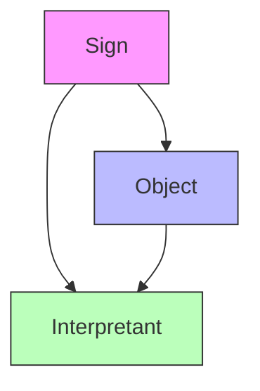
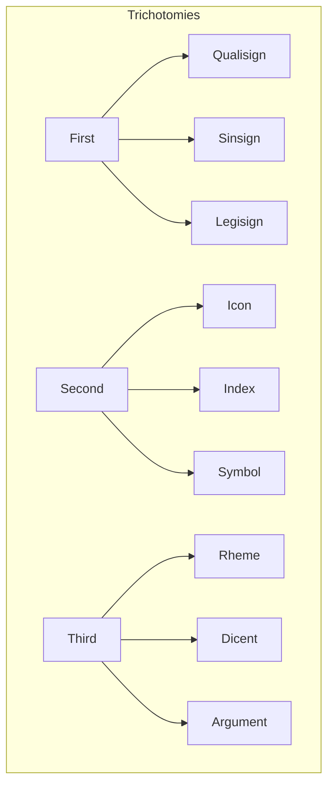
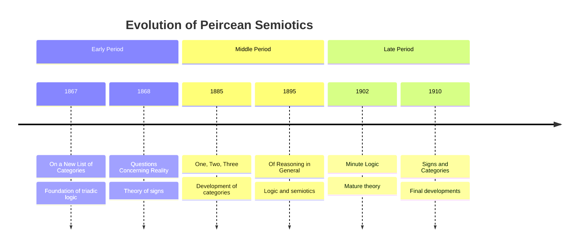
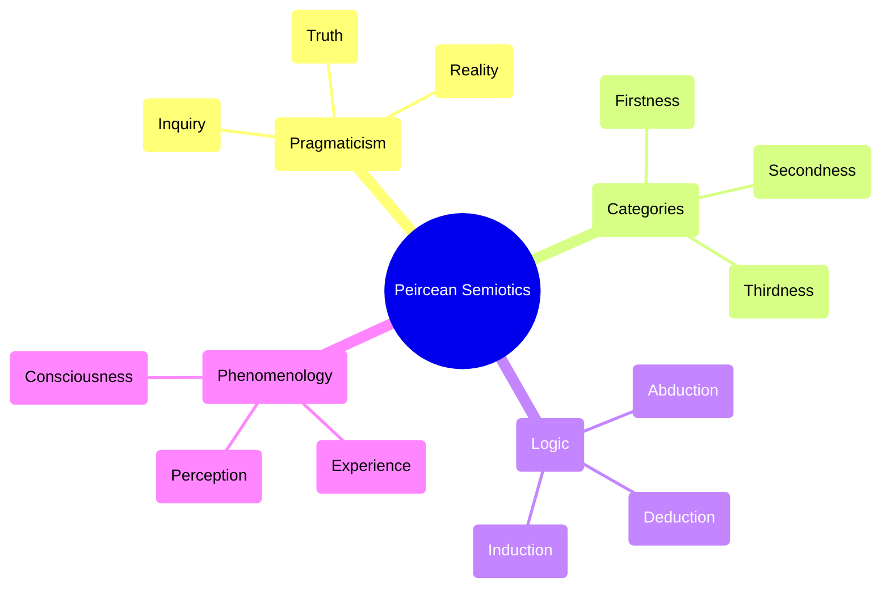
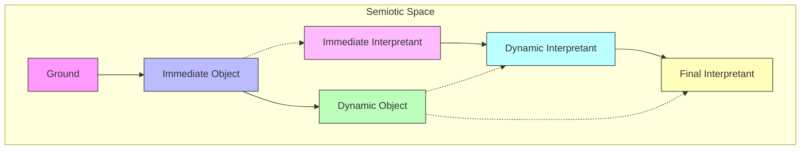
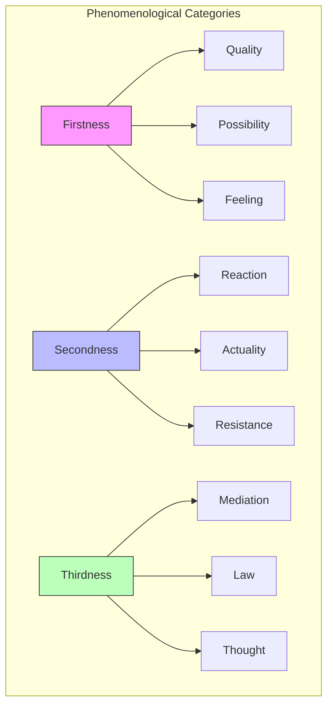
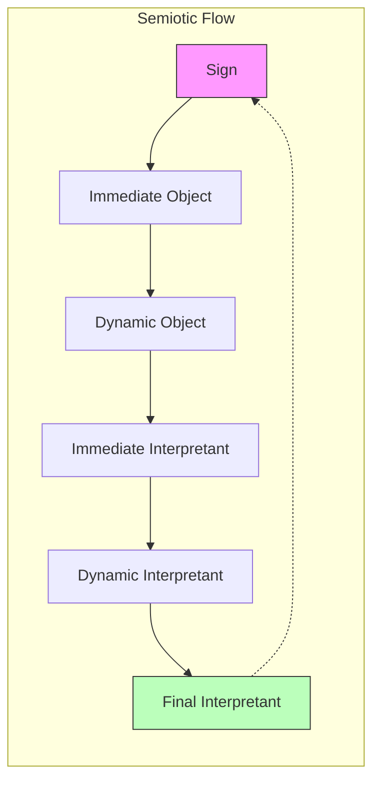

# Peircean Semiotics

## Overview

Peircean Semiotics, developed by Charles Sanders Peirce, provides a comprehensive theory of signs, meaning, and representation. It forms a foundational framework for understanding how meaning emerges through triadic sign relations and serves as a basis for modern theories of [[active_inference|active inference]] and [[information_theory|information processing]].



## Core Concepts

### Triadic Sign Relation

#### Components
1. **Sign** (Representamen)
   - Physical or mental representation
   - Vehicle of meaning
   - Interface between object and interpretant

2. **Object**
   - What the sign refers to
   - Can be physical or abstract
   - Immediate and dynamic aspects

3. **Interpretant**
   - Effect produced by sign
   - Mental or physical response
   - Leads to further semiosis

```math
\begin{aligned}
& \text{Semiotic Function:} \\
& S: (R \times O) \to I \\
& \text{where:} \\
& R \text{ is representamen space} \\
& O \text{ is object space} \\
& I \text{ is interpretant space}
\end{aligned}
```

### Sign Types

#### Trichotomies
1. **First Trichotomy** (Sign in itself)
   - Qualisign: Quality
   - Sinsign: Actual event/thing
   - Legisign: Law/convention

2. **Second Trichotomy** (Sign-object relation)
   - Icon: Resemblance
   - Index: Causal/physical connection
   - Symbol: Convention/law

3. **Third Trichotomy** (Sign-interpretant relation)
   - Rheme: Possibility
   - Dicent: Fact
   - Argument: Reason



## Mathematical Formalization

### Category Theory Perspective

#### Semiotic Categories
```math
\begin{aligned}
& \text{Objects:} \\
& \text{Ob}(\mathcal{C}) = \{R, O, I\} \\
& \text{Morphisms:} \\
& \text{Hom}(R,O), \text{Hom}(O,I), \text{Hom}(R,I) \\
& \text{Composition:} \\
& \text{Hom}(R,I) = \text{Hom}(O,I) \circ \text{Hom}(R,O)
\end{aligned}
```

#### Functorial Relations
```math
\begin{aligned}
& F: \mathcal{C}_{\text{sign}} \to \mathcal{C}_{\text{meaning}} \\
& G: \mathcal{C}_{\text{meaning}} \to \mathcal{C}_{\text{action}}
\end{aligned}
```

### Information-Theoretic View

#### Semiotic Information
```math
\begin{aligned}
& I(S;O) = \sum_{s,o} p(s,o)\log\frac{p(s,o)}{p(s)p(o)} \\
& I(O;I) = \sum_{o,i} p(o,i)\log\frac{p(o,i)}{p(o)p(i)} \\
& I(S;I|O) = \sum_{s,i,o} p(s,i|o)\log\frac{p(s,i|o)}{p(s|o)p(i|o)}
\end{aligned}
```

## Implementation Framework

### Semiotic Processing

```python
class SemioticSystem:
    def __init__(self,
                 sign_space: Space,
                 object_space: Space,
                 interpretant_space: Space):
        """Initialize semiotic system.
        
        Args:
            sign_space: Space of signs
            object_space: Space of objects
            interpretant_space: Space of interpretants
        """
        self.R = sign_space
        self.O = object_space
        self.I = interpretant_space
        
    def process_sign(self,
                    sign: Sign) -> Interpretant:
        """Process sign through semiotic system.
        
        Args:
            sign: Input sign
            
        Returns:
            interpretant: Generated interpretant
        """
        # Object relation
        object_relation = self.relate_to_object(sign)
        
        # Generate interpretant
        interpretant = self.generate_interpretant(
            sign, object_relation
        )
        
        return interpretant
    
    def generate_chain(self,
                      initial_sign: Sign,
                      length: int) -> List[Interpretant]:
        """Generate chain of semiosis.
        
        Args:
            initial_sign: Starting sign
            length: Chain length
            
        Returns:
            chain: Semiotic chain
        """
        chain = []
        current = initial_sign
        
        for _ in range(length):
            # Process current sign
            interpretant = self.process_sign(current)
            chain.append(interpretant)
            
            # Interpretant becomes new sign
            current = interpretant.as_sign()
            
        return chain
```

### Sign Classification

```python
class SignClassifier:
    def __init__(self,
                 embedding_dim: int = 64):
        """Initialize sign classifier.
        
        Args:
            embedding_dim: Embedding dimension
        """
        self.embed_dim = embedding_dim
        self.embedder = SignEmbedder(embedding_dim)
        
    def classify_trichotomies(self,
                            sign: Sign) -> Dict[str, str]:
        """Classify sign according to trichotomies.
        
        Args:
            sign: Input sign
            
        Returns:
            classes: Trichotomy classifications
        """
        # Embed sign
        embedding = self.embedder(sign)
        
        # Classify trichotomies
        first = self.classify_first(embedding)
        second = self.classify_second(embedding)
        third = self.classify_third(embedding)
        
        return {
            'first': first,
            'second': second,
            'third': third
        }
```

## Applications

### 1. Cognitive Science
- Mental representation
- Concept formation
- Learning processes
- Memory systems

### 2. Artificial Intelligence
- Symbol grounding
- Semantic networks
- Knowledge representation
- Natural language processing

### 3. Active Inference
- Predictive processing
- Belief updating
- Action selection
- Learning dynamics

## Connection to Active Inference

### Semiotic Free Energy
```math
\begin{aligned}
& F_{\text{sem}} = \mathbb{E}_{q(s,o,i)}[\log q(s,o,i) - \log p(s,o,i)] \\
& \text{where:} \\
& q(s,o,i) \text{ is variational density} \\
& p(s,o,i) \text{ is generative model}
\end{aligned}
```

### Predictive Processing
```math
\begin{aligned}
& \text{Prediction Error:} \\
& \varepsilon = i - f(s,o) \\
& \text{Update Rule:} \\
& \Delta s = -\kappa\frac{\partial F_{\text{sem}}}{\partial s}
\end{aligned}
```

## Best Practices

### Analysis
1. Consider all trichotomies
2. Track semiotic chains
3. Analyze context
4. Map relations
5. Validate interpretations
6. Document process

### Implementation
1. Use formal models
2. Handle ambiguity
3. Consider dynamics
4. Test robustness
5. Monitor convergence
6. Validate results

## Common Issues

### Theoretical Challenges
1. Infinite semiosis
2. Context dependence
3. Ambiguity
4. Emergence
5. Causality
6. Validation

### Solutions
1. Bounded analysis
2. Context modeling
3. Probabilistic approaches
4. Multi-scale analysis
5. Causal modeling
6. Empirical testing

## Historical Development



### Philosophical Context


## Advanced Semiotic Concepts

### Semiotic Space Structure


### Categorical Relations
```math
\begin{aligned}
& \text{Category Relations:} \\
& \text{First} \xrightarrow{\text{determination}} \text{Second} \xrightarrow{\text{mediation}} \text{Third} \\
& \text{Triadic Logic:} \\
& T(a,b,c) = \exists m [R(a,m) \wedge S(m,b,c)]
\end{aligned}
```

## Phenomenological Framework

### Phaneroscopic Categories


### Experiential Dynamics
```math
\begin{aligned}
& \text{Phenomenological Structure:} \\
& P = \{(q, r, m) \in Q \times R \times M : T(q,r,m)\} \\
& \text{where:} \\
& Q \text{ is quality space} \\
& R \text{ is reaction space} \\
& M \text{ is mediation space}
\end{aligned}
```

## Computational Extensions

### Neural Semiotic Architecture
```python
class NeuralSemiotics(nn.Module):
    def __init__(self,
                 sign_dim: int,
                 hidden_dim: int,
                 n_categories: int = 3):
        """Initialize neural semiotic system.
        
        Args:
            sign_dim: Sign dimension
            hidden_dim: Hidden dimension
            n_categories: Number of categories
        """
        super().__init__()
        
        # Categorical embeddings
        self.category_embeddings = nn.ModuleList([
            nn.Linear(sign_dim, hidden_dim)
            for _ in range(n_categories)
        ])
        
        # Triadic processor
        self.triadic_processor = TriadicAttention(
            hidden_dim, n_heads=4
        )
        
        # Interpretant generator
        self.interpreter = InterpretantGenerator(
            hidden_dim, sign_dim
        )
        
    def forward(self,
               sign: torch.Tensor) -> Tuple[torch.Tensor, List[torch.Tensor]]:
        """Process sign through neural semiotic system.
        
        Args:
            sign: Input sign
            
        Returns:
            interpretant: Generated interpretant
            categories: Categorical representations
        """
        # Generate categorical embeddings
        categories = [
            embed(sign) for embed in self.category_embeddings
        ]
        
        # Triadic processing
        processed = self.triadic_processor(categories)
        
        # Generate interpretant
        interpretant = self.interpreter(processed)
        
        return interpretant, categories
```

### Semiotic Graph Networks
```python
class SemioticGraphNet:
    def __init__(self,
                 node_dim: int,
                 edge_types: List[str]):
        """Initialize semiotic graph network.
        
        Args:
            node_dim: Node dimension
            edge_types: Types of relations
        """
        self.node_dim = node_dim
        self.edge_types = edge_types
        
        # Graph components
        self.node_embedder = NodeEmbedder(node_dim)
        self.edge_processors = {
            etype: EdgeProcessor(node_dim)
            for etype in edge_types
        }
        
    def process_graph(self,
                     nodes: List[Node],
                     edges: List[Edge]) -> Graph:
        """Process semiotic graph.
        
        Args:
            nodes: Graph nodes
            edges: Graph edges
            
        Returns:
            processed: Processed graph
        """
        # Embed nodes
        node_embeds = [
            self.node_embedder(node)
            for node in nodes
        ]
        
        # Process edges by type
        for edge in edges:
            processor = self.edge_processors[edge.type]
            source_embed = node_embeds[edge.source]
            target_embed = node_embeds[edge.target]
            
            # Update embeddings
            node_embeds[edge.target] = processor(
                source_embed, target_embed
            )
            
        return self._construct_graph(nodes, edges, node_embeds)
```

## Semiotic Dynamics

### Flow Diagrams


### Phase Space Analysis
```math
\begin{aligned}
& \text{Semiotic Phase Space:} \\
& \Phi = T^*\mathcal{M} \times \mathcal{I} \\
& \text{Flow Equations:} \\
& \dot{s} = \{s, H\} + \frac{\partial F_{\text{sem}}}{\partial p} \\
& \dot{p} = \{p, H\} - \frac{\partial F_{\text{sem}}}{\partial s}
\end{aligned}
```

## Quantum Semiotic Extensions

### Quantum Sign States
```math
\begin{aligned}
& \text{Sign State:} \\
& |\psi⟩ = \sum_{s,o,i} \alpha_{s,o,i}|s,o,i⟩ \\
& \text{Semiotic Operator:} \\
& \hat{S} = \sum_{s,o,i} \lambda_{s,o,i}|s,o,i⟩⟨s,o,i| \\
& \text{Measurement:} \\
& P(s,o,i) = |⟨s,o,i|\psi⟩|^2
\end{aligned}
```

### Quantum Channels
```python
class QuantumSemiotics:
    def __init__(self,
                 hilbert_dim: int,
                 n_channels: int):
        """Initialize quantum semiotic system.
        
        Args:
            hilbert_dim: Hilbert space dimension
            n_channels: Number of channels
        """
        self.dim = hilbert_dim
        self.channels = [
            QuantumChannel(hilbert_dim)
            for _ in range(n_channels)
        ]
        
    def evolve_state(self,
                    state: QuantumState) -> QuantumState:
        """Evolve quantum sign state.
        
        Args:
            state: Quantum state
            
        Returns:
            evolved: Evolved state
        """
        for channel in self.channels:
            state = channel(state)
        return state
```

## Related Topics
- [[pragmaticism]]
- [[active_inference]]
- [[information_theory]]
- [[category_theory]]
- [[phenomenology]]
- [[epistemology]]
- [[cognitive_science]]
- [[artificial_intelligence]]