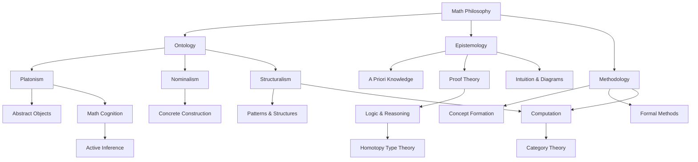

---

title: Philosophy of Mathematics

type: philosophy

status: stable

tags: [philosophy, mathematics]

semantic_relations:

  - type: relates

    links: [probability_theory, category_theory, information_theory]

---

# Philosophy of Mathematics

The philosophy of mathematics examines the nature of mathematical entities, knowledge, and practice. It addresses fundamental questions about what mathematics is, how mathematical knowledge is possible, and what mathematical objects (if any) exist. These questions have significant implications for understanding cognition, computation, and the relationship between mind and reality.

## Ontology: What Exists Mathematically?

### Platonism (Realism)
Mathematical objects exist independently of human minds and culture.

**Key Claims:**
- Numbers, sets, and geometric objects have objective existence
- Mathematical truth is discovered, not invented
- Mathematics describes a realm of abstract objects

**Implications:**
- Mathematical knowledge is a form of perception of abstract entities
- Explains apparent necessity and apriority of mathematical truths
- Challenges naturalism (how can abstract objects affect physical minds?)

### Nominalism
Denies the existence of abstract mathematical objects.

**Variants:**
- **Predicativism**: Mathematical objects are constructed from concrete entities
- **Fictionalism**: Mathematical statements are metaphorical, not literally true
- **Modal Structuralism**: Focuses on possible structures rather than actual objects

**Arguments:**
- Ockham's Razor: Don't multiply entities unnecessarily
- Causal Closure: Abstract objects cannot affect physical world
- Epistemological Access: How can minds access abstract realm?

### Structuralism
Mathematics is primarily about structures and patterns, not individual objects.

**Core Idea:**
- Mathematical objects are positions in structures
- Identity determined by structural role, not intrinsic properties
- Explains why different systems can instantiate same mathematics

## Epistemology: How Do We Know Mathematics?

### A Priori Knowledge
Mathematical knowledge appears independent of sensory experience.

**Challenges:**
- **Benacerraf's Problem**: Causal theory of knowledge can't account for abstract objects
- **Reliability**: How can evolution produce reliable mathematical intuition?
- **Modal Knowledge**: How do we know what would be true in all possible worlds?

### Proof and Understanding
The nature of mathematical proof and comprehension.

**Key Questions:**
- What makes a proof convincing?
- Role of intuition vs formal deduction
- Computer proofs and mathematical understanding

### Informal Reasoning
The role of diagrams, analogies, and heuristic methods.

**Cognitive Aspects:**
- Visual reasoning in geometry and topology
- Analogical thinking in concept formation
- Intuition as guide to formal proof

## Practice and Methodology

### Concept Formation
How mathematical concepts are created and defined.

**Processes:**
- Abstraction from concrete examples
- Generalization from specific cases
- Idealization and limiting processes

### Formal vs Informal Mathematics

**Tension Between:**
- Rigorous formal systems (axiomatic method)
- Intuitive informal understanding
- Computer-assisted proofs and verification

### Explanatory Proofs
Not all proofs are equal - some explain while others merely verify.

**Explanatory Power:**
- Reveals why theorems are true
- Connects concepts in illuminating ways
- Provides insight beyond mere verification

## Relationship to Cognitive Modeling

### Mathematical Cognition
Philosophy of mathematics informs theories of how minds represent and manipulate mathematical concepts.

**Key Connections:**
- **Symbol Grounding**: How mathematical symbols acquire meaning
- **Intuitive Foundations**: Role of innate mathematical abilities
- **Cultural Transmission**: How mathematical knowledge spreads

### Computation and Logic
Foundations for understanding computation and logical reasoning.

**Implications:**
- **Church-Turing Thesis**: Philosophical status of computational limits
- **Gödel's Theorems**: Limits of formal systems and their philosophical meaning
- **Type Theory**: Foundations for programming languages and cognitive architectures

## Contemporary Developments

### Category Theory Foundations
Category theory as alternative foundation to set theory.

**Advantages:**
- More general and flexible than set-theoretic foundations
- Better suited for modern mathematics
- Natural fit with structuralist philosophy

### Univalent Foundations
Homotopy Type Theory as foundation for mathematics.

**Features:**
- Combines logic, type theory, and homotopy theory
- Constructive approach to mathematics
- Computational interpretation

## Connections to This Repository

### Probabilistic Foundations
- [[../mathematics/probability_theory|Probability Theory]] - Philosophical foundations of uncertainty
- Bayesian epistemology and rational belief

### Structural Perspectives
- [[../mathematics/category_theory|Category Theory]] - Structural approach to mathematics
- Functorial relationships between mathematical domains

### Information-Theoretic Viewpoints
- [[../mathematics/information_theory|Information Theory]] - Mathematics of communication and computation
- Algorithmic information theory and complexity

## Conceptual Map

