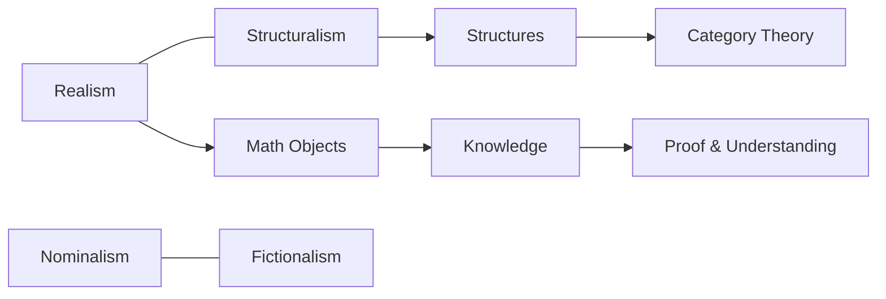

---

title: Philosophy of Mathematics

type: philosophy

status: stable

tags: [philosophy, mathematics]

semantic_relations:

  - type: relates

    links: [probability_theory, category_theory, information_theory]

---

# Philosophy of Mathematics

The philosophy of mathematics examines the nature of mathematical entities, knowledge, and practice.

## Ontology

- Realism (Platonism): mathematical objects exist independently

- Nominalism/fictionalism: deny abstract objects

- Structuralism: structures are primary; positions in structures

## Epistemology

- A priori knowledge, proof, and understanding

- Informal reasoning and the role of diagrams and intuition

## Practice and methodology

- Concept formation, definition, and explanatory proofs

- Formal vs informal mathematics; computer-assisted proofs

## Connections to this repository

- Probabilistic foundations: [[probability_theory]]

- Structural perspectives: [[category_theory]]

- Information-theoretic viewpoints: [[information_theory]]

## Conceptual map

