# Philosophical Topics Index

## Overview

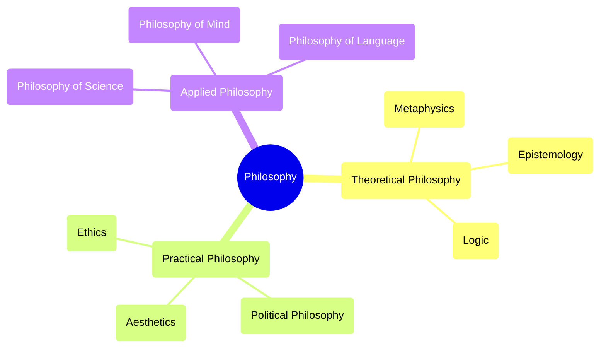

## Core Domains

### 1. Theoretical Philosophy

#### Metaphysics
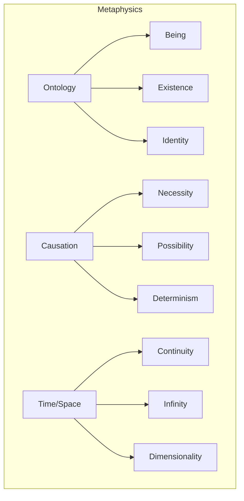

- [[ontology]]
  - [[being_and_nothingness]]
  - [[existence]]
  - [[identity_and_difference]]
- [[causation]]
  - [[necessity_and_contingency]]
  - [[possibility_and_actuality]]
  - [[determinism_and_free_will]]
- [[time_and_space]]
  - [[continuity]]
  - [[infinity]]
  - [[dimensionality]]

#### Epistemology
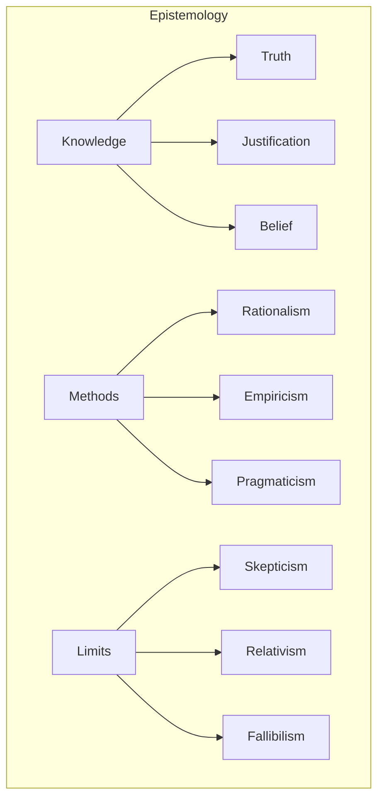

- [[knowledge_theory]]
  - [[truth_theories]]
  - [[justification]]
  - [[belief_systems]]
- [[epistemological_methods]]
  - [[rationalism]]
  - [[empiricism]]
  - [[pragmaticism]]
- [[epistemic_limits]]
  - [[skepticism]]
  - [[relativism]]
  - [[fallibilism]]

#### Logic
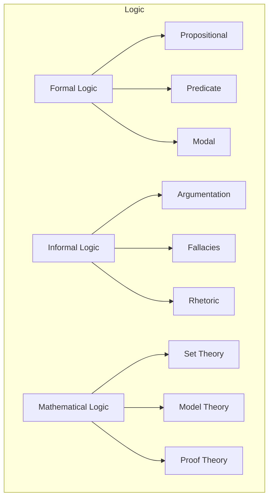

- [[formal_logic]]
  - [[propositional_logic]]
  - [[predicate_logic]]
  - [[modal_logic]]
- [[informal_logic]]
  - [[argumentation_theory]]
  - [[fallacies]]
  - [[rhetoric]]
- [[mathematical_logic]]
  - [[set_theory]]
  - [[model_theory]]
  - [[proof_theory]]

### 2. Practical Philosophy

#### Ethics
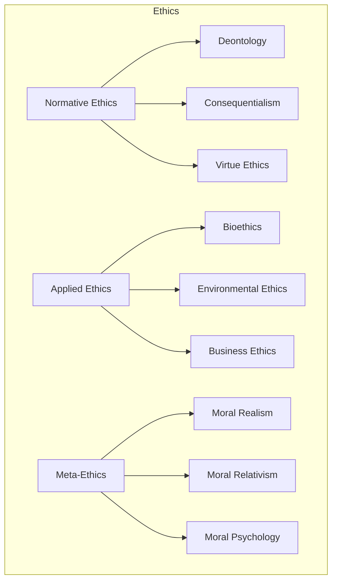

- [[normative_ethics]]
  - [[deontological_ethics]]
  - [[consequentialism]]
  - [[virtue_ethics]]
- [[applied_ethics]]
  - [[bioethics]]
  - [[environmental_ethics]]
  - [[business_ethics]]
- [[meta_ethics]]
  - [[moral_realism]]
  - [[moral_relativism]]
  - [[moral_psychology]]

#### Political Philosophy
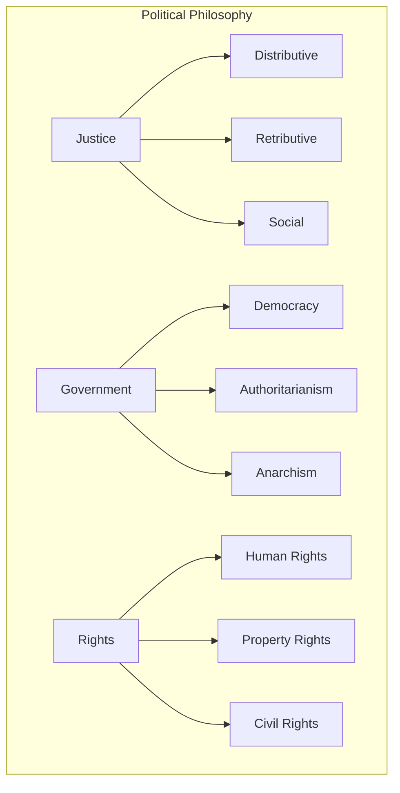

- [[justice]]
  - [[distributive_justice]]
  - [[retributive_justice]]
  - [[social_justice]]
- [[government]]
  - [[democracy]]
  - [[authoritarianism]]
  - [[anarchism]]
- [[rights]]
  - [[human_rights]]
  - [[property_rights]]
  - [[civil_rights]]

#### Aesthetics
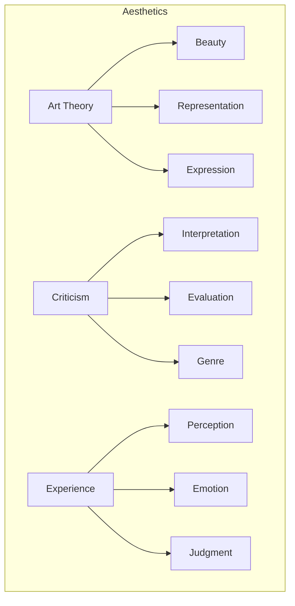

- [[art_theory]]
  - [[beauty]]
  - [[representation]]
  - [[expression]]
- [[criticism]]
  - [[interpretation]]
  - [[evaluation]]
  - [[genre_theory]]
- [[aesthetic_experience]]
  - [[perception]]
  - [[emotion]]
  - [[judgment]]

### 3. Applied Philosophy

#### Philosophy of Science
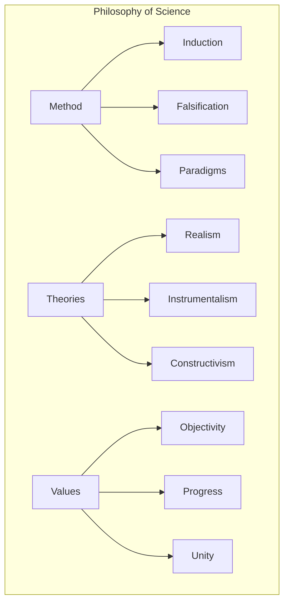

- [[scientific_method]]
  - [[induction]]
  - [[falsification]]
  - [[paradigm_shifts]]
- [[scientific_theories]]
  - [[scientific_realism]]
  - [[instrumentalism]]
  - [[constructivism]]
- [[scientific_values]]
  - [[objectivity]]
  - [[scientific_progress]]
  - [[unity_of_science]]

#### Philosophy of Mind
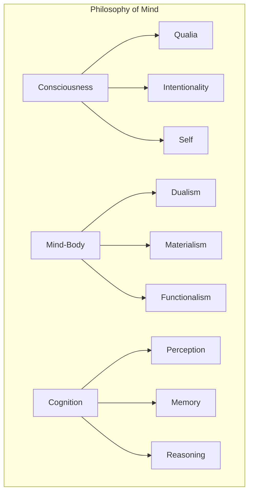

- [[consciousness]]
  - [[qualia]]
  - [[intentionality]]
  - [[self]]
- [[mind_body_problem]]
  - [[dualism]]
  - [[materialism]]
  - [[functionalism]]
- [[cognitive_processes]]
  - [[perception_theory]]
  - [[memory_theory]]
  - [[reasoning_theory]]

#### Philosophy of Language
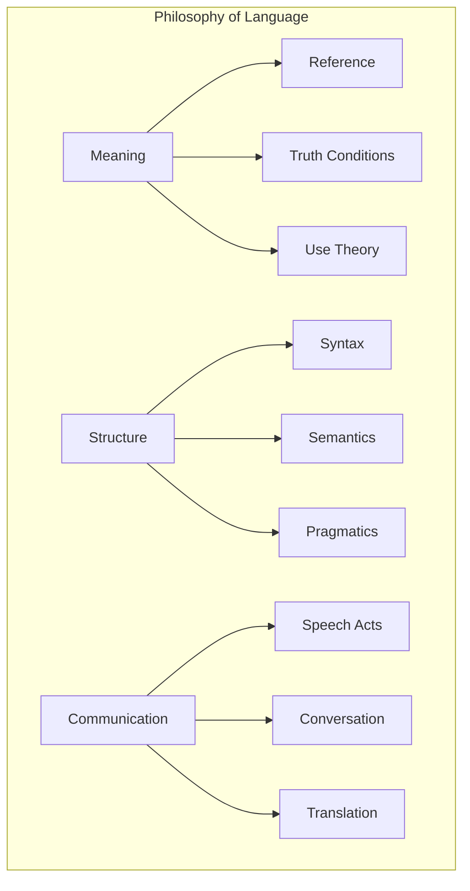

- [[meaning]]
  - [[reference]]
  - [[truth_conditions]]
  - [[use_theory]]
- [[linguistic_structure]]
  - [[syntax]]
  - [[semantics]]
  - [[pragmatics]]
- [[communication]]
  - [[speech_acts]]
  - [[conversation_theory]]
  - [[translation_theory]]

## Interdisciplinary Connections

### Philosophy and Science
- [[cognitive_science]]
- [[neurophilosophy]]
- [[philosophy_of_physics]]
- [[philosophy_of_biology]]
- [[philosophy_of_mathematics]]

### Philosophy and Society
- [[social_philosophy]]
- [[philosophy_of_law]]
- [[philosophy_of_economics]]
- [[philosophy_of_education]]

### Philosophy and Technology
- [[philosophy_of_technology]]
- [[computer_ethics]]
- [[artificial_intelligence_ethics]]
- [[information_ethics]]

## Historical Traditions

### Western Philosophy
- [[ancient_philosophy]]
- [[medieval_philosophy]]
- [[modern_philosophy]]
- [[contemporary_philosophy]]

### Eastern Philosophy
- [[buddhist_philosophy]]
- [[hindu_philosophy]]
- [[chinese_philosophy]]
- [[islamic_philosophy]]

### Contemporary Movements
- [[phenomenology]]
- [[existentialism]]
- [[critical_theory]]
- [[postmodernism]]

## Methodological Approaches

### Analysis
- [[conceptual_analysis]]
- [[logical_analysis]]
- [[linguistic_analysis]]
- [[phenomenological_analysis]]

### Synthesis
- [[dialectical_method]]
- [[hermeneutics]]
- [[systems_theory]]
- [[complexity_theory]]

### Critical Methods
- [[deconstruction]]
- [[genealogy]]
- [[critical_theory]]
- [[feminist_philosophy]]

## Advanced Philosophical Topics

### Philosophy of Action
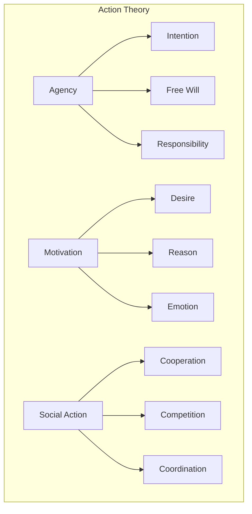

- [[action_theory]]
  - [[agency]]
  - [[intention]]
  - [[responsibility]]
- [[motivation_theory]]
  - [[desire_theory]]
  - [[practical_reason]]
  - [[emotion_theory]]
- [[social_action]]
  - [[cooperation_theory]]
  - [[game_theory]]
  - [[collective_action]]

### Philosophy of Information
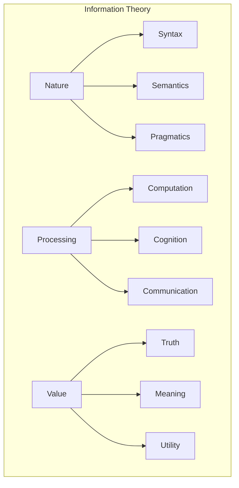

- [[information_philosophy]]
  - [[information_nature]]
  - [[information_dynamics]]
  - [[information_ethics]]
- [[computational_theory]]
  - [[algorithmic_information]]
  - [[complexity_theory]]
  - [[quantum_information]]
- [[semantic_information]]
  - [[data_semantics]]
  - [[information_content]]
  - [[semantic_value]]

### Environmental Philosophy
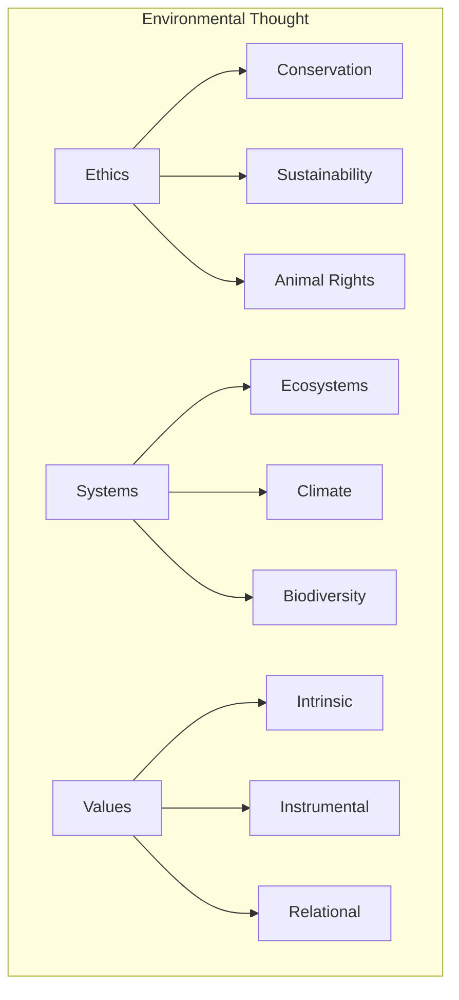

- [[environmental_ethics]]
  - [[deep_ecology]]
  - [[ecofeminism]]
  - [[animal_ethics]]
- [[environmental_systems]]
  - [[ecosystem_theory]]
  - [[climate_ethics]]
  - [[biodiversity_value]]
- [[environmental_values]]
  - [[nature_value]]
  - [[future_generations]]
  - [[environmental_justice]]

## Emerging Philosophical Fields

### Digital Philosophy
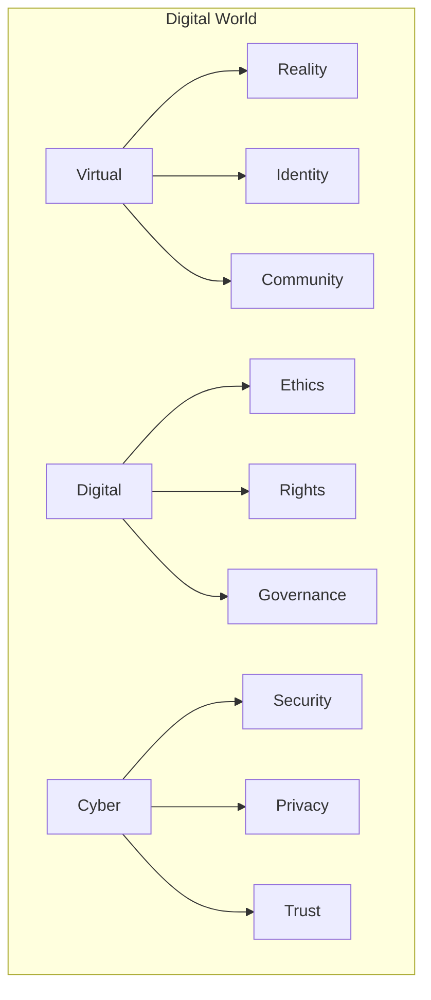

- [[digital_metaphysics]]
  - [[virtual_reality]]
  - [[digital_identity]]
  - [[cyberspace]]
- [[digital_ethics]]
  - [[privacy_theory]]
  - [[digital_rights]]
  - [[algorithmic_ethics]]
- [[digital_society]]
  - [[virtual_communities]]
  - [[digital_governance]]
  - [[cyber_culture]]

### Cognitive Philosophy
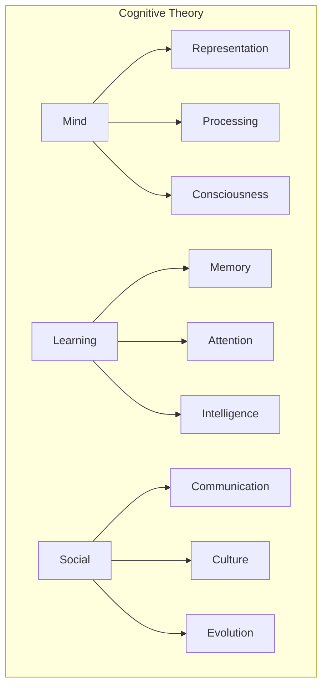

- [[cognitive_theory]]
  - [[mental_representation]]
  - [[information_processing]]
  - [[consciousness_studies]]
- [[learning_theory]]
  - [[memory_systems]]
  - [[attention_mechanisms]]
  - [[intelligence_theory]]
- [[social_cognition]]
  - [[cultural_cognition]]
  - [[evolutionary_psychology]]
  - [[social_learning]]

### Quantum Philosophy
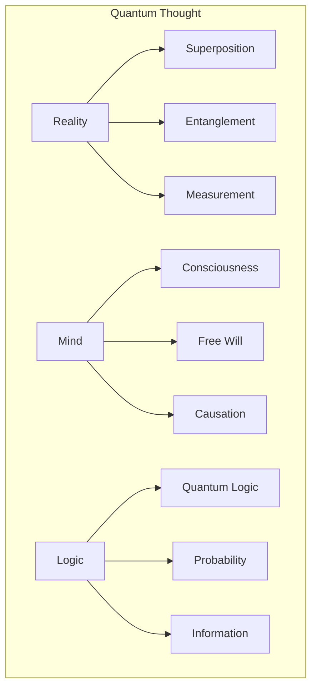

- [[quantum_metaphysics]]
  - [[quantum_reality]]
  - [[quantum_causation]]
  - [[quantum_mind]]
- [[quantum_epistemology]]
  - [[measurement_problem]]
  - [[quantum_probability]]
  - [[quantum_information]]
- [[quantum_logic]]
  - [[quantum_computation]]
  - [[quantum_foundations]]
  - [[quantum_semantics]]

## Philosophical Methods and Tools

### Formal Methods
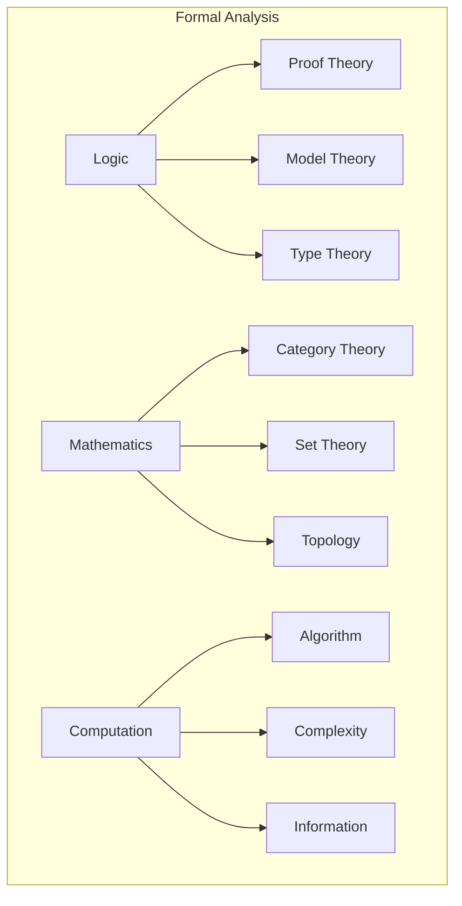

- [[formal_methods]]
  - [[proof_theory]]
  - [[model_theory]]
  - [[type_theory]]
- [[mathematical_methods]]
  - [[category_theory]]
  - [[set_theory]]
  - [[topology]]
- [[computational_methods]]
  - [[algorithmic_analysis]]
  - [[complexity_analysis]]
  - [[information_theory]]

### Experimental Philosophy
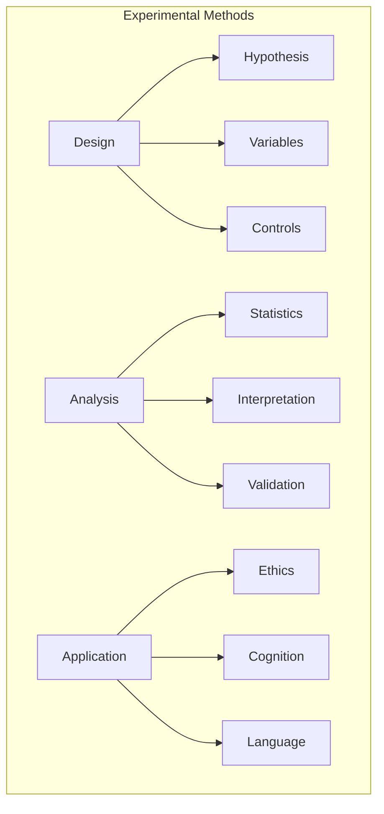

- [[experimental_philosophy]]
  - [[philosophical_experiments]]
  - [[empirical_methods]]
  - [[data_analysis]]
- [[experimental_design]]
  - [[variable_control]]
  - [[statistical_analysis]]
  - [[validation_methods]]
- [[experimental_domains]]
  - [[moral_psychology]]
  - [[cognitive_science]]
  - [[linguistic_analysis]]

## Integrative Approaches

### Systems Philosophy
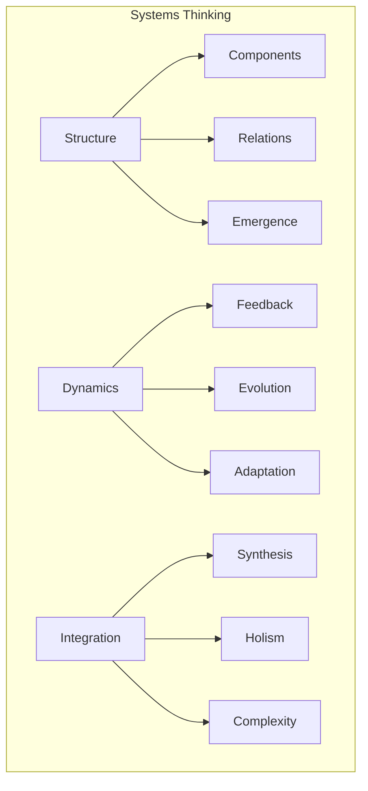

- [[systems_philosophy]]
  - [[system_structure]]
  - [[system_dynamics]]
  - [[emergence_theory]]
- [[cybernetics]]
  - [[feedback_systems]]
  - [[control_theory]]
  - [[information_flow]]
- [[complexity_philosophy]]
  - [[complex_systems]]
  - [[self_organization]]
  - [[adaptive_systems]]

### Transdisciplinary Philosophy
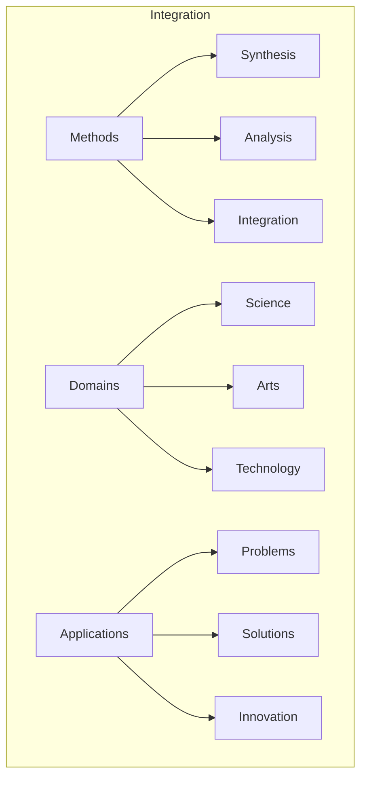

- [[transdisciplinary_methods]]
  - [[integrative_methods]]
  - [[boundary_crossing]]
  - [[synthesis_approaches]]
- [[knowledge_integration]]
  - [[interdisciplinary_synthesis]]
  - [[knowledge_translation]]
  - [[boundary_objects]]
- [[practical_applications]]
  - [[problem_solving]]
  - [[innovation_theory]]
  - [[social_transformation]]

## Cultural Philosophical Traditions

### Comparative Philosophy
```mermaid
graph TD
    subgraph Cross-Cultural 
        A[Methodologies] --> B[Comparison]
        A --> C[Translation]
        A --> D[Interpretation]
        E[Traditions] --> F[Western]
        E --> G[Eastern]
        E --> H[Indigenous]
        I[Dialogue] --> J[Engagement]
        I --> K[Integration]
        I --> L[Critique]
    end
```

- [[comparative_methodology]]
  - [[cross_cultural_hermeneutics]]
  - [[philosophical_translation]]
  - [[cultural_interpretation]]
- [[tradition_bridging]]
  - [[east_west_dialogue]]
  - [[african_philosophy_comparative]]
  - [[latin_american_thought]]
- [[global_philosophy]]
  - [[world_philosophies]]
  - [[intercultural_philosophy]]
  - [[decolonial_philosophy]]

### African Philosophy
```mermaid
graph TD
    subgraph African Thought
        A[Ubuntu] --> B[Community]
        A --> C[Personhood]
        A --> D[Ethics]
        E[Knowledge] --> F[Sage Philosophy]
        E --> G[Orality]
        E --> H[Liberation]
        I[Traditions] --> J[Ethnophilosophy]
        I --> K[Political]
        I --> L[Contemporary]
    end
```

- [[ubuntu_philosophy]]
  - [[african_communitarianism]]
  - [[personhood_theory]]
  - [[relational_ethics]]
- [[african_epistemology]]
  - [[sage_philosophy]]
  - [[oral_tradition]]
  - [[liberation_epistemology]]
- [[african_traditions]]
  - [[ethnophilosophy]]
  - [[political_philosophy_africa]]
  - [[contemporary_african_thought]]

### Latin American Philosophy
```mermaid
graph TD
    subgraph Latin American Thought
        A[Liberation] --> B[Theology]
        A --> C[Pedagogy]
        A --> D[Ethics]
        E[Identity] --> F[Mestizaje]
        E --> G[Coloniality]
        E --> H[Authenticity]
        I[Traditions] --> J[Indigenous]
        I --> K[Hispanic]
        I --> L[Contemporary]
    end
```

- [[liberation_philosophy]]
  - [[liberation_theology]]
  - [[pedagogy_of_oppressed]]
  - [[ethics_of_liberation]]
- [[latin_american_identity]]
  - [[mestizaje]]
  - [[coloniality_of_power]]
  - [[philosophy_of_authenticity]]
- [[latin_american_traditions]]
  - [[indigenous_philosophies]]
  - [[hispanic_scholasticism]]
  - [[positivism_latin_america]]

## Specialized Philosophical Fields

### Philosophy of Economics
```mermaid
graph TD
    subgraph Economic Philosophy
        A[Value] --> B[Labor]
        A --> C[Utility]
        A --> D[Exchange]
        E[Systems] --> F[Capitalism]
        E --> G[Socialism]
        E --> H[Markets]
        I[Methods] --> J[Models]
        I --> K[Prediction]
        I --> L[Explanation]
    end
```

- [[economic_value]]
  - [[labor_theory]]
  - [[utility_theory]]
  - [[exchange_value]]
- [[economic_systems]]
  - [[capitalism_philosophy]]
  - [[socialist_thought]]
  - [[market_theory]]
- [[economic_methodology]]
  - [[economic_models]]
  - [[prediction_theory]]
  - [[economic_explanation]]

### Philosophy of History
```mermaid
graph TD
    subgraph Historical Thought
        A[Time] --> B[Linearity]
        A --> C[Cyclicality]
        A --> D[Progress]
        E[Causation] --> F[Determinism]
        E --> G[Contingency]
        E --> H[Agency]
        I[Interpretation] --> J[Hermeneutics]
        I --> K[Narrative]
        I --> L[Evidence]
    end
```

- [[philosophy_of_time]]
  - [[linear_history]]
  - [[cyclical_theory]]
  - [[progress_theory]]
- [[historical_causation]]
  - [[historical_determinism]]
  - [[contingency_theory]]
  - [[historical_agency]]
- [[historical_methodology]]
  - [[historical_hermeneutics]]
  - [[narrative_theory]]
  - [[historical_evidence]]

### Philosophy of Religion
```mermaid
graph TD
    subgraph Religious Philosophy
        A[Existence] --> B[God]
        A --> C[Soul]
        A --> D[Afterlife]
        E[Knowledge] --> F[Revelation]
        E --> G[Faith]
        E --> H[Religious Experience]
        I[Diversity] --> J[Pluralism]
        I --> K[Exclusivism]
        I --> L[Inclusivism]
    end
```

- [[divine_nature]]
  - [[arguments_for_god]]
  - [[arguments_against_god]]
  - [[divine_attributes]]
- [[religious_epistemology]]
  - [[revelation]]
  - [[faith_and_reason]]
  - [[religious_experience]]
- [[religious_diversity]]
  - [[religious_pluralism]]
  - [[religious_exclusivism]]
  - [[comparative_theology]]

## Contemporary Philosophical Innovations

### Neuroethics
```mermaid
graph TD
    subgraph Neuroethics
        A[Science] --> B[Brain Intervention]
        A --> C[Enhancement]
        A --> D[Neuroimaging]
        E[Identity] --> F[Personality]
        E --> G[Memory]
        E --> H[Free Will]
        I[Society] --> J[Privacy]
        I --> K[Justice]
        I --> L[Policy]
    end
```

- [[neuroscientific_ethics]]
  - [[brain_intervention]]
  - [[cognitive_enhancement]]
  - [[neuroimaging_ethics]]
- [[neuroidentity]]
  - [[personality_modification]]
  - [[memory_manipulation]]
  - [[neural_free_will]]
- [[neurosociety]]
  - [[neurotechnology_privacy]]
  - [[neurojustice]]
  - [[neurolaw]]

### Philosophy of Embodiment
```mermaid
graph TD
    subgraph Embodiment
        A[Body] --> B[Phenomenology]
        A --> C[Corporeality]
        A --> D[Enactivism]
        E[Experience] --> F[Perception]
        E --> G[Emotion]
        E --> H[Action]
        I[Critiques] --> J[Gender]
        I --> K[Disability]
        I --> L[Technology]
    end
```

- [[embodied_cognition]]
  - [[body_phenomenology]]
  - [[corporeal_experience]]
  - [[enactivism]]
- [[embodied_experience]]
  - [[embodied_perception]]
  - [[somatic_emotions]]
  - [[embodied_action]]
- [[body_politics]]
  - [[gendered_embodiment]]
  - [[disability_theory]]
  - [[technological_embodiment]]

### Speculative Realism
```mermaid
graph TD
    subgraph Speculation
        A[Ontology] --> B[Objects]
        A --> C[Relations]
        A --> D[Processes]
        E[Critique] --> F[Correlationism]
        E --> G[Anthropocentrism]
        E --> H[Idealism]
        I[Methods] --> J[Speculation]
        I --> K[Materialism]
        I --> L[Realism]
    end
```

- [[object_oriented_ontology]]
  - [[flat_ontology]]
  - [[withdrawn_objects]]
  - [[hyperobjects]]
- [[ontological_critique]]
  - [[anti_correlationism]]
  - [[non_anthropocentrism]]
  - [[speculative_materialism]]
- [[new_realisms]]
  - [[transcendental_realism]]
  - [[speculative_method]]
  - [[weird_realism]]

## Cross-Disciplinary Philosophical Topics

### Philosophy of Mathematics
```mermaid
graph TD
    subgraph Mathematical Philosophy
        A[Foundations] --> B[Set Theory]
        A --> C[Logic]
        A --> D[Category Theory]
        E[Ontology] --> F[Platonism]
        E --> G[Formalism]
        E --> H[Constructivism]
        I[Practice] --> J[Proof]
        I --> K[Abstraction]
        I --> L[Application]
    end
```

- [[mathematical_foundations]]
  - [[set_theoretical_foundations]]
  - [[logical_foundations]]
  - [[categorical_foundations]]
- [[mathematical_ontology]]
  - [[mathematical_platonism]]
  - [[mathematical_formalism]]
  - [[mathematical_constructivism]]
- [[mathematical_practice]]
  - [[proof_theory]]
  - [[mathematical_abstraction]]
  - [[applied_mathematics_philosophy]]

### Philosophy of Art and Aesthetics
```mermaid
graph TD
    subgraph Aesthetics
        A[Experience] --> B[Beauty]
        A --> C[Sublime]
        A --> D[Taste]
        E[Creation] --> F[Expression]
        E --> G[Imagination]
        E --> H[Creativity]
        I[Critique] --> J[Interpretation]
        I --> K[Evaluation]
        I --> L[Standards]
    end
```

- [[aesthetic_experience]]
  - [[theories_of_beauty]]
  - [[sublime_theory]]
  - [[aesthetic_taste]]
- [[artistic_creation]]
  - [[artistic_expression]]
  - [[imagination]]
  - [[creative_process]]
- [[art_critique]]
  - [[interpretation_theory]]
  - [[aesthetic_value]]
  - [[aesthetic_standards]]

### Philosophy of Education
```mermaid
graph TD
    subgraph Educational Philosophy
        A[Aims] --> B[Knowledge]
        A --> C[Virtue]
        A --> D[Growth]
        E[Methods] --> F[Pedagogy]
        E --> G[Dialogue]
        E --> H[Experience]
        I[Context] --> J[Society]
        I --> K[Politics]
        I --> L[Culture]
    end
```

- [[educational_aims]]
  - [[knowledge_acquisition]]
  - [[virtue_development]]
  - [[personal_growth]]
- [[pedagogical_methods]]
  - [[critical_pedagogy]]
  - [[dialogical_education]]
  - [[experiential_learning]]
- [[educational_contexts]]
  - [[social_reproduction]]
  - [[political_education]]
  - [[cultural_transmission]]

## Meta-Philosophical Topics

### Philosophy of Philosophy
```mermaid
graph TD
    subgraph Meta-Philosophy
        A[Nature] --> B[Method]
        A --> C[Purpose]
        A --> D[Progress]
        E[Critique] --> F[Analytic]
        E --> G[Continental]
        E --> H[Cross-Cultural]
        I[Future] --> J[Integration]
        I --> K[Specialization]
        I --> L[Application]
    end
```

- [[philosophical_methodology]]
  - [[metaphilosophical_method]]
  - [[philosophical_progress]]
  - [[philosophical_purpose]]
- [[tradition_critique]]
  - [[analytic_critique]]
  - [[continental_critique]]
  - [[cross_cultural_critique]]
- [[future_philosophy]]
  - [[philosophical_integration]]
  - [[philosophical_specialization]]
  - [[applied_philosophy]]

### Philosophical Anthropology
```mermaid
graph TD
    subgraph Human Nature
        A[Being] --> B[Identity]
        A --> C[Agency]
        A --> D[Finitude]
        E[Relation] --> F[Cultural]
        E --> G[Natural]
        E --> H[Technological]
        I[Development] --> J[Evolution]
        I --> K[History]
        I --> L[Potential]
    end
```

- [[human_nature]]
  - [[personal_identity]]
  - [[human_agency]]
  - [[existential_finitude]]
- [[human_relations]]
  - [[cultural_being]]
  - [[natural_being]]
  - [[technological_being]]
- [[human_development]]
  - [[evolutionary_anthropology]]
  - [[historical_anthropology]]
  - [[future_humanity]]

## Emerging Philosophical Topics

### Future Ethics
```mermaid
graph TD
    subgraph Future Ethics
        A[Generations] --> B[Responsibility]
        A --> C[Justice]
        A --> D[Rights]
        E[Existential] --> F[Risks]
        E --> G[Survival]
        E --> H[Flourishing]
        I[Technologies] --> J[Modification]
        I --> K[Enhancement]
        I --> L[Superintelligence]
    end
```

- [[future_generations]]
  - [[intergenerational_responsibility]]
  - [[intergenerational_justice]]
  - [[future_rights]]
- [[existential_risk]]
  - [[existential_ethics]]
  - [[human_survival]]
  - [[collective_flourishing]]
- [[emerging_technologies_ethics]]
  - [[genetic_modification]]
  - [[human_enhancement]]
  - [[artificial_superintelligence]]

### Philosophy of Complexity
```mermaid
graph TD
    subgraph Complexity
        A[Systems] --> B[Emergence]
        A --> C[Self-Organization]
        A --> D[Networks]
        E[Epistemology] --> F[Uncertainty]
        E --> G[Unpredictability]
        E --> H[Integration]
        I[Methods] --> J[Simulation]
        I --> K[Network Analysis]
        I --> L[Pattern Recognition]
    end
```

- [[complex_systems]]
  - [[emergence_theory]]
  - [[self_organization_principles]]
  - [[network_ontology]]
- [[complexity_epistemology]]
  - [[uncertainty_principles]]
  - [[prediction_limitations]]
  - [[knowledge_integration]]
- [[complexity_methods]]
  - [[computational_modeling]]
  - [[network_theory]]
  - [[pattern_recognition]]

## Asian Philosophical Traditions

### Chinese Philosophy
```mermaid
graph TD
    subgraph Chinese Thought
        A[Confucianism] --> B[Ritual]
        A --> C[Harmony]
        A --> D[Virtue]
        E[Daoism] --> F[Naturalness]
        E --> G[Non-action]
        E --> H[Balance]
        I[Buddhism] --> J[Emptiness]
        I --> K[Impermanence]
        I --> L[Compassion]
    end
```

- [[confucian_philosophy]]
  - [[ritual_li]]
  - [[harmony_he]]
  - [[virtue_de]]
  - [[filial_piety]]
- [[daoist_thought]]
  - [[dao_way]]
  - [[wuwei]]
  - [[ziran_naturalness]]
  - [[yin_yang_theory]]
- [[chinese_buddhism]]
  - [[chan_zen]]
  - [[huayan]]
  - [[tiantai]]
  - [[pure_land]]

### Indian Philosophy
```mermaid
graph TD
    subgraph Indian Thought
        A[Vedic] --> B[Rituals]
        A --> C[Cosmology]
        A --> D[Dharma]
        E[Orthodox] --> F[Nyaya]
        E --> G[Samkhya]
        E --> H[Vedanta]
        I[Heterodox] --> J[Buddhism]
        I --> K[Jainism]
        I --> L[Charvaka]
    end
```

- [[vedic_philosophy]]
  - [[upanishadic_thought]]
  - [[brahman_atman]]
  - [[karma_theory]]
  - [[dharma_ethics]]
- [[orthodox_darshanas]]
  - [[nyaya_logic]]
  - [[vaisheshika_ontology]]
  - [[samkhya_dualism]]
  - [[yoga_discipline]]
  - [[mimamsa_hermeneutics]]
  - [[vedanta_metaphysics]]
- [[heterodox_schools]]
  - [[buddhist_philosophy_india]]
  - [[jain_philosophy]]
  - [[charvaka_materialism]]
  - [[ajivika_determinism]]

### Japanese Philosophy
```mermaid
graph TD
    subgraph Japanese Thought
        A[Buddhist] --> B[Zen]
        A --> C[Pure Land]
        A --> D[Nichiren]
        E[Native] --> F[Shinto]
        E --> G[Bushido]
        E --> H[Kokugaku]
        I[Modern] --> J[Kyoto School]
        I --> K[Modernism]
        I --> L[Aesthetics]
    end
```

- [[japanese_buddhism]]
  - [[zen_thought]]
  - [[pure_land_thought]]
  - [[nichiren_buddhism]]
  - [[shingon_esoteric]]
- [[japanese_traditions]]
  - [[shinto_philosophy]]
  - [[bushido_ethics]]
  - [[kokugaku_nativism]]
  - [[mono_no_aware]]
- [[modern_japanese_philosophy]]
  - [[kyoto_school]]
  - [[japanese_phenomenology]]
  - [[philosophy_of_nothingness]]
  - [[comparative_philosophy_east_west]]

## Indigenous Philosophical Traditions

### Native American Philosophy
```mermaid
graph TD
    subgraph Indigenous North American
        A[Cosmology] --> B[Sacred Space]
        A --> C[Time Cycles]
        A --> D[Origin Stories]
        E[Ethics] --> F[Relationality]
        E --> G[Reciprocity]
        E --> H[Harmony]
        I[Knowledge] --> J[Oral Tradition]
        I --> K[Experiential]
        I --> L[Ceremonial]
    end
```

- [[native_american_thought]]
  - [[indigenous_cosmologies]]
  - [[sacred_ecology]]
  - [[cyclical_time]]
  - [[creation_stories]]
- [[indigenous_ethics]]
  - [[relational_ethics_indigenous]]
  - [[reciprocity_principle]]
  - [[harmony_with_nature]]
  - [[seven_generations]]
- [[indigenous_epistemology]]
  - [[oral_knowledge_systems]]
  - [[experiential_knowledge]]
  - [[ceremonial_knowledge]]
  - [[indigenous_science]]

### Oceanic Philosophy
```mermaid
graph TD
    subgraph Pacific Thought
        A[Relationality] --> B[Kinship]
        A --> C[Sea Connections]
        A --> D[Ancestral Ties]
        E[Values] --> F[Community]
        E --> G[Reciprocity]
        E --> H[Land/Sea Rights]
        I[Knowledge] --> J[Navigation]
        I --> K[Ecological]
        I --> L[Genealogical]
    end
```

- [[oceanic_philosophy]]
  - [[polynesian_thought]]
  - [[melanesian_philosophy]]
  - [[aboriginal_philosophy]]
  - [[maori_thought]]
- [[pacific_relationality]]
  - [[va_relationships]]
  - [[moana_epistemology]]
  - [[ancestral_knowledge]]
  - [[land_sea_connection]]
- [[indigenous_pacific_values]]
  - [[mana_concept]]
  - [[tapu_sacred]]
  - [[reciprocity_systems]]
  - [[community_ethics]]

## Process Philosophy

### Process Metaphysics
```mermaid
graph TD
    subgraph Process Thought
        A[Becoming] --> B[Flux]
        A --> C[Creativity]
        A --> D[Novelty]
        E[Relations] --> F[Internal]
        E --> G[Prehension]
        E --> H[Connection]
        I[Reality] --> J[Events]
        I --> K[Processes]
        I --> L[Occasions]
    end
```

- [[process_metaphysics]]
  - [[becoming_ontology]]
  - [[flux_theory]]
  - [[creativity_principle]]
  - [[actual_occasions]]
- [[process_relations]]
  - [[internal_relations]]
  - [[prehension_theory]]
  - [[causal_efficacy]]
  - [[symbolic_reference]]
- [[process_ontology]]
  - [[event_ontology]]
  - [[panexperientialism]]
  - [[concrescence]]
  - [[nexus_theory]]

### Temporality Studies
```mermaid
graph TD
    subgraph Temporal Philosophy
        A[Time] --> B[Duration]
        A --> C[Succession]
        A --> D[Simultaneity]
        E[Experience] --> F[Memory]
        E --> G[Anticipation]
        E --> H[Present]
        I[Metaphysics] --> J[Becoming]
        I --> K[Eternalism]
        I --> L[Presentism]
    end
```

- [[philosophy_of_temporality]]
  - [[durational_time]]
  - [[succession_theory]]
  - [[simultaneity_concept]]
  - [[temporal_parts]]
- [[temporal_experience]]
  - [[memory_theory_time]]
  - [[anticipation_phenomenology]]
  - [[specious_present]]
  - [[time_consciousness]]
- [[temporal_metaphysics]]
  - [[becoming_theory]]
  - [[eternalism]]
  - [[presentism]]
  - [[growing_block_theory]]

## Phenomenological Traditions

### Existential Phenomenology
```mermaid
graph TD
    subgraph Existential Phenomenology
        A[Existence] --> B[Authenticity]
        A --> C[Facticity]
        A --> D[Transcendence]
        E[Being] --> F[Being-in-world]
        E --> G[Being-with]
        E --> H[Being-toward-death]
        I[Experience] --> J[Anxiety]
        I --> K[Freedom]
        I --> L[Nothingness]
    end
```

- [[existential_phenomenology]]
  - [[authenticity]]
  - [[facticity]]
  - [[transcendence]]
  - [[existence_precedence]]
- [[heideggerian_ontology]]
  - [[dasein]]
  - [[being_in_the_world]]
  - [[being_with_others]]
  - [[being_toward_death]]
- [[existential_themes]]
  - [[anxiety_angst]]
  - [[radical_freedom]]
  - [[nothingness]]
  - [[absurdity]]

### Hermeneutic Phenomenology
```mermaid
graph TD
    subgraph Hermeneutic Phenomenology
        A[Interpretation] --> B[Pre-understanding]
        A --> C[Hermeneutic Circle]
        A --> D[Fusion of Horizons]
        E[Language] --> F[Dialogue]
        E --> G[Linguisticality]
        E --> H[Tradition]
        I[Truth] --> J[Disclosure]
        I --> K[Historicity]
        I --> L[Effective History]
    end
```

- [[hermeneutic_phenomenology]]
  - [[pre_understanding]]
  - [[hermeneutic_circle]]
  - [[fusion_of_horizons]]
  - [[effective_historical_consciousness]]
- [[linguistic_hermeneutics]]
  - [[dialogical_understanding]]
  - [[linguisticality_of_experience]]
  - [[tradition_concept]]
  - [[language_as_medium]]
- [[hermeneutic_truth]]
  - [[truth_as_disclosure]]
  - [[historicity_of_understanding]]
  - [[effective_history]]
  - [[application_principle]]

### Feminist Phenomenology
```mermaid
graph TD
    subgraph Feminist Phenomenology
        A[Embodiment] --> B[Lived Body]
        A --> C[Sexual Difference]
        A --> D[Situated Knowledge]
        E[Experience] --> F[Oppression]
        E --> G[Agency]
        E --> H[Relationality]
        I[Method] --> J[Standpoint]
        I --> K[Intersectionality]
        I --> L[Critique]
    end
```

- [[feminist_phenomenology]]
  - [[lived_body]]
  - [[sexual_difference]]
  - [[situated_experience]]
  - [[embodied_subjectivity]]
- [[feminist_experience]]
  - [[oppression_analysis]]
  - [[agency_under_oppression]]
  - [[relational_autonomy]]
  - [[gender_experience]]
- [[feminist_methodology]]
  - [[standpoint_theory]]
  - [[intersectionality]]
  - [[phenomenological_critique]]
  - [[feminist_epistemology]]

## Critical Theories

### Postcolonial Philosophy
```mermaid
graph TD
    subgraph Postcolonial Thought
        A[Colonialism] --> B[Imperialism]
        A --> C[Hegemony]
        A --> D[Resistance]
        E[Identity] --> F[Hybridity]
        E --> G[Subaltern]
        E --> H[Authenticity]
        I[Knowledge] --> J[Epistemic Violence]
        I --> K[De-westernization]
        I --> L[Counter-discourse]
    end
```

- [[postcolonial_theory]]
  - [[colonial_discourse]]
  - [[cultural_imperialism]]
  - [[hegemony_analysis]]
  - [[resistance_theory]]
- [[postcolonial_identity]]
  - [[cultural_hybridity]]
  - [[subaltern_studies]]
  - [[authenticity_critique]]
  - [[diaspora_theory]]
- [[postcolonial_epistemology]]
  - [[epistemic_violence]]
  - [[dewesternizing_knowledge]]
  - [[counter_discourse]]
  - [[border_thinking]]

### Critical Race Philosophy
```mermaid
graph TD
    subgraph Critical Race Theory
        A[Race] --> B[Construction]
        A --> C[Intersectionality]
        A --> D[Racialization]
        E[Justice] --> F[Recognition]
        E --> G[Reparation]
        E --> H[Transformation]
        I[Method] --> J[Counterstory]
        I --> K[Critique]
        I --> L[Praxis]
    end
```

- [[critical_race_theory]]
  - [[race_as_construction]]
  - [[racial_formation]]
  - [[racialization_process]]
  - [[whiteness_studies]]
- [[racial_justice]]
  - [[recognition_theory]]
  - [[reparative_justice]]
  - [[transformative_justice]]
  - [[epistemic_justice]]
- [[critical_race_methodology]]
  - [[counterstorytelling]]
  - [[interest_convergence]]
  - [[racial_realism]]
  - [[critical_praxis]]

### Queer Philosophy
```mermaid
graph TD
    subgraph Queer Theory
        A[Sexuality] --> B[Heteronormativity]
        A --> C[Performativity]
        A --> D[Desire]
        E[Gender] --> F[Construction]
        E --> G[Fluidity]
        E --> H[Embodiment]
        I[Politics] --> J[Recognition]
        I --> K[Subversion]
        I --> L[Coalition]
    end
```

- [[queer_theory]]
  - [[heteronormativity_critique]]
  - [[performativity_theory]]
  - [[desire_theory]]
  - [[sexual_subjectivity]]
- [[gender_philosophy]]
  - [[gender_construction]]
  - [[gender_fluidity]]
  - [[embodiment_gender]]
  - [[transgender_studies]]
- [[queer_politics]]
  - [[recognition_politics]]
  - [[subversion_strategies]]
  - [[coalition_politics]]
  - [[queer_futurity]]

## Contemporary Philosophical Methodologies

### Experimental Philosophy
```mermaid
graph TD
    subgraph X-Phi
        A[Methods] --> B[Surveys]
        A --> C[Experiments]
        A --> D[Statistical Analysis]
        E[Domains] --> F[Ethics]
        E --> G[Epistemology]
        E --> H[Mind]
        I[Critique] --> J[Intuitions]
        I --> K[Concepts]
        I --> L[Folk Psychology]
    end
```

- [[experimental_philosophy]]
  - [[survey_methods]]
  - [[psychological_experiments]]
  - [[statistical_philosophy]]
  - [[empirical_evidence]]
- [[x_phi_domains]]
  - [[experimental_ethics]]
  - [[experimental_epistemology]]
  - [[experimental_metaphysics]]
  - [[folk_intuitions]]
- [[philosophical_psychology]]
  - [[intuition_critique]]
  - [[concept_empiricism]]
  - [[folk_psychology]]
  - [[conceptual_analysis_experimental]]

### Analytic-Continental Bridge
```mermaid
graph TD
    subgraph Bridge Philosophy
        A[Methods] --> B[Clarification]
        A --> C[Phenomenology]
        A --> D[Hermeneutics]
        E[Topics] --> F[Meaning]
        E --> G[Subjectivity]
        E --> H[Critical Theory]
        I[Figures] --> J[Late Wittgenstein]
        I --> K[Ricoeur]
        I --> L[Habermas]
    end
```

- [[analytic_continental_bridges]]
  - [[post_analytic_philosophy]]
  - [[naturalized_phenomenology]]
  - [[hermeneutic_analyticity]]
  - [[methodological_pluralism]]
- [[bridging_topics]]
  - [[meaning_theory_bridges]]
  - [[subjectivity_analysis]]
  - [[critical_theory_analytics]]
  - [[consciousness_studies]]
- [[bridging_figures]]
  - [[late_wittgenstein]]
  - [[ricoeur_hermeneutics]]
  - [[habermas_theory]]
  - [[davidson_interpretation]]

### New Materialisms
```mermaid
graph TD
    subgraph New Materialism
        A[Matter] --> B[Agency]
        A --> C[Vitality]
        A --> D[Immanence]
        E[Critique] --> F[Anthropocentrism]
        E --> G[Dualism]
        E --> H[Representation]
        I[Method] --> J[Diffraction]
        I --> K[Entanglement]
        I --> L[Post-humanism]
    end
```

- [[new_materialisms]]
  - [[material_agency]]
  - [[vital_materialism]]
  - [[immanent_materialism]]
  - [[material_feminism]]
- [[materialist_critique]]
  - [[anthropocentrism_critique]]
  - [[dualism_critique]]
  - [[representationalism_critique]]
  - [[matter_discourse]]
- [[new_materialist_methods]]
  - [[diffractive_methodology]]
  - [[entanglement_theory]]
  - [[posthumanist_performativity]]
  - [[agential_realism]]

## Philosophy and Other Disciplines

### Philosophy of Cognitive Science
```mermaid
graph TD
    subgraph Cognitive Philosophy
        A[Mind] --> B[Representation]
        A --> C[Computation]
        A --> D[Embodiment]
        E[Methods] --> F[Naturalism]
        E --> G[Reduction]
        E --> H[Integration]
        I[Issues] --> J[Consciousness]
        I --> K[Intentionality]
        I --> L[Extended Mind]
    end
```

- [[philosophy_cognitive_science]]
  - [[mental_representation]]
  - [[computational_theory_mind]]
  - [[embodied_cognition]]
  - [[enactivism]]
- [[cognitive_methods]]
  - [[naturalized_epistemology]]
  - [[reductionism_critique]]
  - [[disciplinary_integration]]
  - [[levels_of_analysis]]
- [[cognitive_issues]]
  - [[consciousness_explanation]]
  - [[intentionality_theories]]
  - [[extended_mind]]
  - [[predictive_processing]]

### Philosophy of Medicine
```mermaid
graph TD
    subgraph Medical Philosophy
        A[Health] --> B[Disease]
        A --> C[Normality]
        A --> D[Well-being]
        E[Practice] --> F[Evidence]
        E --> G[Care]
        E --> H[Decision-making]
        I[Ethics] --> J[Autonomy]
        I --> K[Justice]
        I --> L[Enhancement]
    end
```

- [[philosophy_of_medicine]]
  - [[health_concepts]]
  - [[disease_theory]]
  - [[normality_abnormality]]
  - [[medical_well_being]]
- [[medical_practice]]
  - [[evidence_based_medicine]]
  - [[care_ethics_medicine]]
  - [[clinical_judgment]]
  - [[medical_decision_making]]
- [[biomedical_ethics]]
  - [[patient_autonomy]]
  - [[healthcare_justice]]
  - [[human_enhancement]]
  - [[medical_paternalism]]

### Philosophy of Media
```mermaid
graph TD
    subgraph Media Philosophy
        A[Medium] --> B[Materiality]
        A --> C[Technology]
        A --> D[Mediation]
        E[Content] --> F[Representation]
        E --> G[Simulation]
        E --> H[Virtuality]
        I[Effects] --> J[Perception]
        I --> K[Society]
        I --> L[Subjectivity]
    end
```

- [[philosophy_of_media]]
  - [[media_materiality]]
  - [[media_technology]]
  - [[mediation_theory]]
  - [[medium_specificity]]
- [[media_content]]
  - [[representation_theory]]
  - [[simulation_theory]]
  - [[virtuality_studies]]
  - [[hyperreality]]
- [[media_effects]]
  - [[media_perception]]
  - [[media_society]]
  - [[technological_subjectivity]]
  - [[attention_economy]]

## Frontier Philosophical Topics

### Biophilosophy
```mermaid
graph TD
    subgraph Biological Philosophy
        A[Life] --> B[Definition]
        A --> C[Organization]
        A --> D[Emergence]
        E[Evolution] --> F[Selection]
        E --> G[Function]
        E --> H[Teleology]
        I[Biosemiotics] --> J[Codes]
        I --> K[Interpretation]
        I --> L[Umwelt]
    end
```

- [[philosophy_of_biology]]
  - [[life_definition]]
  - [[biological_organization]]
  - [[emergence_in_biology]]
  - [[organism_concept]]
- [[evolutionary_philosophy]]
  - [[selection_theories]]
  - [[biological_function]]
  - [[teleology_in_biology]]
  - [[evo_devo_philosophy]]
- [[biosemiotics]]
  - [[biological_codes]]
  - [[interpretation_in_nature]]
  - [[umwelt_theory]]
  - [[organic_meaning]]

### Philosophy of Artificial Intelligence
```mermaid
graph TD
    subgraph AI Philosophy
        A[Intelligence] --> B[Computation]
        A --> C[Embodiment]
        A --> D[Emergence]
        E[Ethics] --> F[Alignment]
        E --> G[Autonomy]
        E --> H[Rights]
        I[Futures] --> J[Singularity]
        I --> K[Coexistence]
        I --> L[Transformation]
    end
```

- [[philosophy_of_ai]]
  - [[computational_intelligence]]
  - [[embodied_ai]]
  - [[emergent_intelligence]]
  - [[artificial_minds]]
- [[ai_ethics]]
  - [[value_alignment]]
  - [[ai_autonomy]]
  - [[machine_rights]]
  - [[responsibility_gaps]]
- [[ai_futures]]
  - [[technological_singularity]]
  - [[human_ai_coexistence]]
  - [[intelligence_explosion]]
  - [[mind_uploading]]

### Interspecies Philosophy
```mermaid
graph TD
    subgraph Interspecies Thought
        A[Relations] --> B[Communication]
        A --> C[Ethics]
        A --> D[Cooperation]
        E[Minds] --> F[Animal Cognition]
        E --> G[Plant Intelligence]
        E --> H[Alien Minds]
        I[Politics] --> J[Multispecies]
        I --> K[Rights]
        I --> L[Justice]
    end
```

- [[interspecies_philosophy]]
  - [[interspecies_communication]]
  - [[interspecies_ethics]]
  - [[multispecies_cooperation]]
  - [[kinship_beyond_species]]
- [[nonhuman_minds]]
  - [[animal_cognition]]
  - [[plant_intelligence]]
  - [[alien_cognition]]
  - [[fungal_intelligence]]
- [[multispecies_politics]]
  - [[multispecies_communities]]
  - [[animal_rights]]
  - [[interspecies_justice]]
  - [[ecological_democracy]]