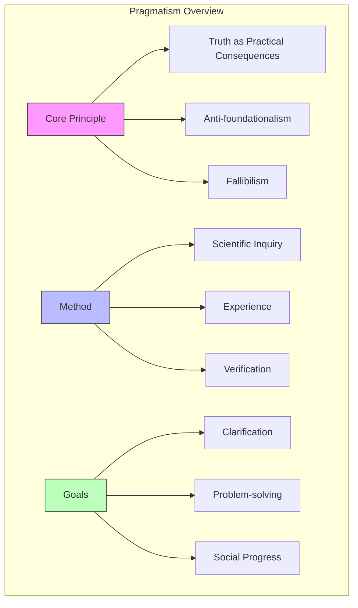
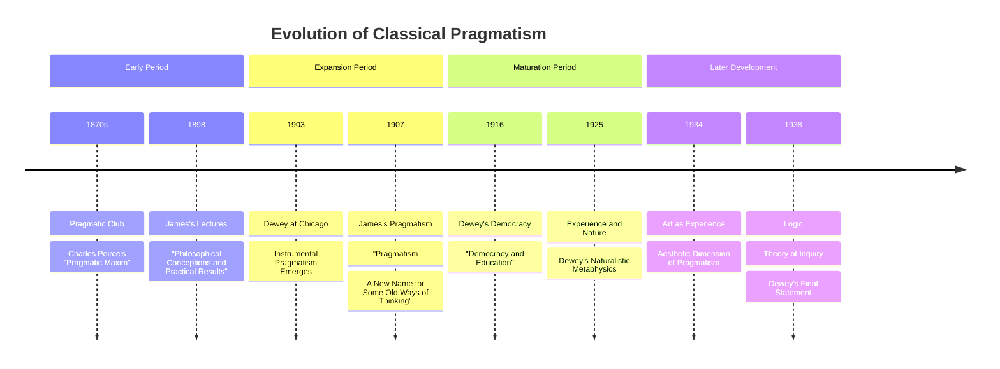
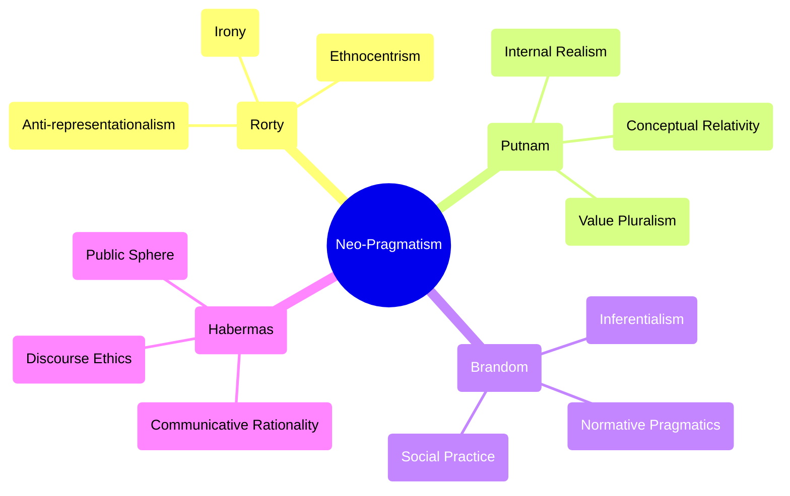
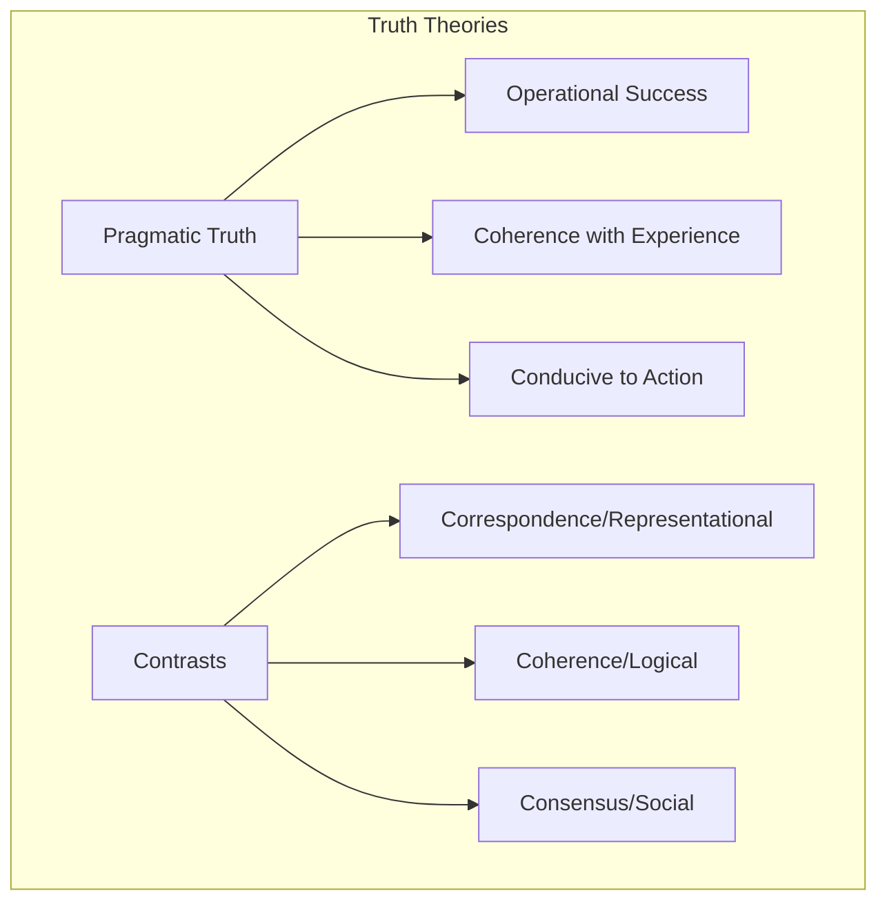
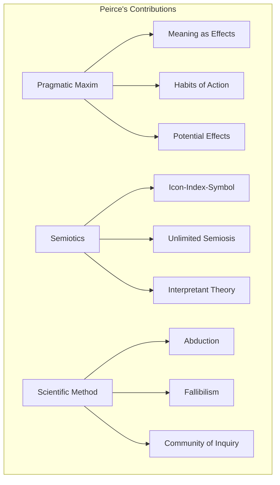
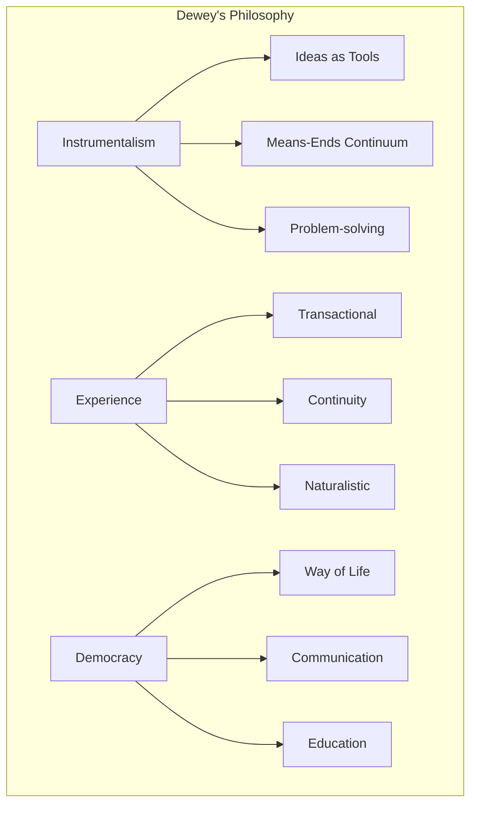
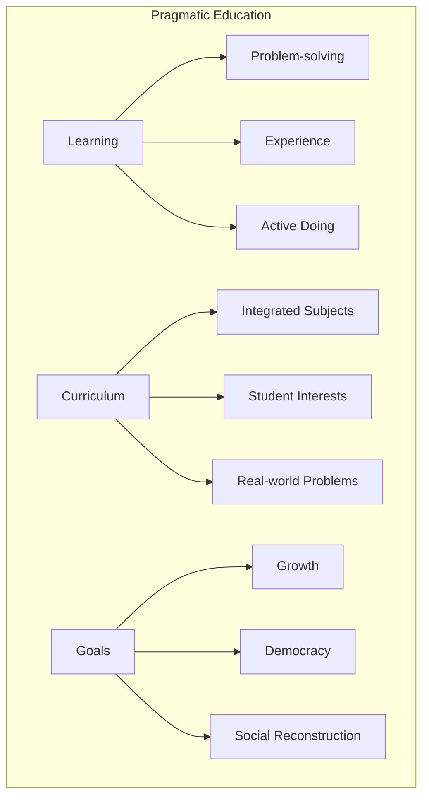

# Pragmatism

## Overview

Pragmatism is a philosophical tradition that emerged in the United States in the late 19th century, emphasizing the practical consequences of ideas as the criterion for meaning, truth, and value. By focusing on the effects of beliefs in guiding action, pragmatism offers a distinctive approach to [[epistemology]], ethics, and [[metaphysics]] that mediates between [[rationalism]] and [[empiricism]] while emphasizing the contextual, practical, and evolutionary character of knowledge.



## Historical Development

### Classical Pragmatism (1870s-1940s)



Classical pragmatism emerged from the "Metaphysical Club" discussions in Cambridge, Massachusetts, where [[Charles Sanders Peirce]], [[William James]], and others developed alternatives to Cartesian approaches to knowledge. This period established pragmatism as America's distinctive philosophical contribution, challenging European philosophical traditions by emphasizing the practical, experiential basis of knowledge and truth.

### Neo-Pragmatism (1970s-Present)

The revival of pragmatist themes in late 20th century philosophy, especially in the works of [[Richard Rorty]], [[Hilary Putnam]], and [[Robert Brandom]], brought pragmatism into dialogue with [[analytic philosophy]], [[continental philosophy]], and [[post-modernism]].



Neo-pragmatism significantly departed from classical pragmatism in several ways:

1. **Linguistic Turn**: Shifting focus from experience to language and discourse
2. **Social Practices**: Emphasizing the normative dimensions of social practices
3. **Anti-foundationalism**: Developing more radical critiques of epistemological foundations
4. **Cultural Politics**: Connecting philosophical inquiry to cultural and political criticism
5. **Interdisciplinary Engagement**: Engaging with developments in cognitive science, linguistics, and social theory

## Core Principles

### The Pragmatic Maxim

Peirce's original formulation of the pragmatic maxim establishes the central insight of pragmatism:

```
"Consider what effects, which might conceivably have practical bearings, we conceive the object of our conception to have. Then, our conception of these effects is the whole of our conception of the object."
```

This maxim ties meaning to practical consequences and sets the foundation for pragmatic theories of truth, knowledge, and inquiry. It shares methodological affinities with [[operationalism]] in [[philosophy_of_science]] and anticipates aspects of [[verification_theory|verification]] in [[logical_positivism]], though with important differences in philosophical commitments.

### Pragmatic Theory of Truth



According to pragmatism, truth is not a static property of ideas that mirror reality, but rather:

1. **James's View**: Truth is what "works" in guiding successful action
2. **Peirce's View**: Truth is the opinion that would be agreed upon by an ideal community of inquirers given sufficient time and evidence
3. **Dewey's View**: Truth (or "warranted assertibility") is the outcome of successful inquiry that resolves problematic situations

The pragmatic theory of truth differs from both [[correspondence_theory|correspondence theories]] and [[coherence_theory|coherence theories]] by focusing on the functional role of truth in inquiry and action rather than abstract relations between propositions and reality.

### Fallibilism and Anti-foundationalism

Pragmatists reject [[foundationalism|foundationalist epistemology]], advocating instead:

- Knowledge claims are always provisional and subject to revision
- No beliefs are immune from potential revision
- Certainty is not a prerequisite for knowledge
- Inquiry is an ongoing social process without a determinate endpoint

This [[fallibilism]] connects pragmatism to [[karl_popper|Popper's]] philosophy of science and contemporary [[bayesian_epistemology]], though with different emphasis on the social and practical dimensions of knowledge.

### Experience and Experimentalism

```math
\begin{aligned}
\text{Inquiry Process:} \\
1. \text{Indeterminate Situation} \\
2. \text{Problem Definition} \\
3. \text{Hypothesis Formation} \\
4. \text{Reasoning/Elaboration} \\
5. \text{Testing in Experience} \\
6. \text{Resolution or Redefinition}
\end{aligned}
```

For pragmatists, especially Dewey, experience is not merely passive reception of sense data but an active transaction between organism and environment:

1. **Primary Experience**: Immediate, qualitative engagement with the environment
2. **Secondary/Reflective Experience**: Conceptual, scientific, philosophical reflection on primary experience
3. **Experimental Method**: Application of [[scientific_method]] to all domains of human experience

This conception of experience shares important connections with [[phenomenology]], [[ecological_psychology]], and [[embodied_cognition]], though from a distinctly naturalistic perspective.

### Social and Political Dimensions

Pragmatism has significant social and political implications:

- **Community of Inquiry**: Knowledge as social achievement
- **Democratic Experimentalism**: Democracy as a way of life, not merely a political system
- **Meliorism**: The belief that humans can improve their condition through intelligent action
- **Social Reform**: Commitment to addressing concrete social problems

These aspects of pragmatism connect it to [[social_epistemology]], [[deliberative_democracy]], and various forms of [[progressivism]] in social and political thought.

## Key Figures

### Charles Sanders Peirce (1839-1914)



Peirce, the founder of pragmatism, made substantial contributions to:

- **Logic**: Developed a theory of logical graphs and contributed to [[symbolic_logic]]
- **[[peircean_semiotics|Semiotics]]**: Created a comprehensive theory of signs and meaning
- **Scientific Method**: Articulated the logic of scientific discovery and emphasized [[abductive_reasoning|abduction]]
- **Categories**: Developed a system of universal categories ([[firstness]], [[secondness]], [[thirdness]])
- **Metaphysics**: Advocated evolutionary cosmology and synechism (continuity)

Peirce's work has experienced a significant revival in contemporary [[biosemiotics]], [[cognitive_science]], and [[systems_theory]].

### William James (1842-1910)

James popularized pragmatism and applied it to:

- **Psychology**: Pioneer of functional psychology, emphasizing adaptive function of consciousness
- **Religious Experience**: Defended the right to believe in his "Will to Believe" doctrine
- **[[radical_empiricism|Radical Empiricism]]**: Developed a metaphysics where relations are as real as substances
- **Pluralism**: Rejected absolute idealism in favor of a pluralistic universe
- **Stream of Consciousness**: Described the continuous flow of mental life

James's psychological insights anticipated developments in [[cognitive_psychology]], [[phenomenology_of_consciousness]], and [[4e_cognition|4E cognition]].

### John Dewey (1859-1952)



Dewey extended pragmatism into:

- **Education**: Developed [[progressive_education]] theory emphasizing learning by doing
- **Aesthetics**: Theorized art as consummatory experience integrated with everyday life
- **Social Philosophy**: Advocated for participatory [[democracy]] and social reform
- **Ethics**: Developed a theory of valuation based on critical intelligence
- **Naturalism**: Reconstructed traditional philosophical problems within a [[naturalism|naturalistic]] framework

Dewey's work continues to influence [[educational_philosophy]], [[democratic_theory]], and approaches to [[social_inquiry]].

### Jane Addams (1860-1935)

Though often overlooked in philosophical histories, Addams developed pragmatism in directions that emphasized:

- **Social Ethics**: Extended pragmatism into [[social_ethics]] and [[feminist_theory]]
- **Democratic Experimentalism**: Practical social reform through settlement houses
- **Sympathetic Understanding**: Knowledge through engaged participation
- **Peace Activism**: Applied pragmatism to [[international_relations]]

Addams's work represents an important bridge between pragmatism and [[feminist_philosophy]], [[care_ethics]], and [[social_work]] theory.

## Applications and Methodology

### Epistemology and Inquiry

```python
class PragmaticInquiry:
    def __init__(self,
                 problematic_situation: Situation,
                 community: CommunityOfInquirers):
        """Initialize pragmatic inquiry process.
        
        Args:
            problematic_situation: The indeterminate situation
            community: The community of inquirers
        """
        self.situation = problematic_situation
        self.community = community
        self.hypotheses = []
        self.experimental_results = []
        self.resolved = False
        
    def define_problem(self) -> Problem:
        """Transform indeterminate situation into a defined problem."""
        return self.situation.identify_constituents()
        
    def generate_hypotheses(self) -> List[Hypothesis]:
        """Abductively generate possible solutions."""
        self.hypotheses = self.community.brainstorm_solutions(self.situation)
        return self.hypotheses
        
    def test_hypothesis(self, hypothesis: Hypothesis) -> Result:
        """Test hypothesis through experiential consequences."""
        result = hypothesis.predict_and_test(self.situation)
        self.experimental_results.append(result)
        return result
        
    def evaluate_results(self) -> bool:
        """Determine if problematic situation is resolved."""
        if any(result.resolves_situation for result in self.experimental_results):
            self.resolved = True
            return True
        # If not resolved, continue inquiry with revised hypotheses
        self.hypotheses = self.refine_hypotheses()
        return False
```

Pragmatic epistemology holds that:

1. Knowledge emerges from active inquiry into problematic situations
2. Truth is what survives the test of experience
3. Beliefs are instruments for action, not passive representations
4. Inquiry is a communal, self-correcting process

This approach resonates with contemporary [[situated_cognition]], [[extended_mind_theory]], and [[predictive_processing]] frameworks.

### Ethics and Values

Pragmatic ethics sees values as:

- **Naturalistic**: Emerging from human needs and social contexts
- **Experimental**: Subject to testing and revision based on consequences
- **Contextual**: Sensitive to specific situations rather than absolute principles
- **Melioristic**: Oriented toward improving human conditions

Value judgments involve:
1. Recognizing a problem or conflict of values
2. Imaginatively projecting possible resolutions
3. Evaluating likely consequences
4. Testing proposed solutions in experience

This perspective shares affinities with [[virtue_ethics]], [[consequentialism]], and [[moral_particularism]], while offering distinctive contributions to [[environmental_ethics]] and [[bioethics]].

### Scientific Method

For pragmatists, the [[scientific_method]] represents the most successful form of inquiry:

1. **Abduction**: Creative generation of explanatory hypotheses
2. **Deduction**: Working out the experiential consequences of hypotheses
3. **Induction**: Testing hypotheses against experience
4. **Community Verification**: Intersubjective testing and criticism

This perspective on science anticipates aspects of [[kuhn_paradigms|Kuhn's paradigm theory]], [[theory_ladenness]] of observation, and social aspects of [[scientific_realism]].

### Education



Dewey's educational philosophy emphasizes:

1. Education as growth and reconstruction of experience
2. Learning by doing rather than passive absorption
3. School as a democratic community
4. Integration of subjects around problems
5. Scientific method as educational paradigm

These ideas continue to influence [[constructivist_learning_theory]], [[project_based_learning]], and [[democratic_education]] approaches.

## Contemporary Relevance

### Neopragmatism

Contemporary pragmatism has diversified into several strands:

1. **Linguistic Pragmatism**: Focuses on language and social practices (Rorty, Brandom)
2. **Scientific Pragmatism**: Emphasizes continuity with natural sciences (Quine, Sellars)
3. **Feminist Pragmatism**: Develops pragmatist insights in feminist directions (Seigfried, Sullivan)
4. **Environmental Pragmatism**: Applies pragmatic method to environmental problems (Norton, Light)
5. **Analytic Pragmatism**: Combines pragmatist insights with analytic precision (Misak, Price)
6. **Global Pragmatism**: Explores connections with non-Western philosophical traditions (Shusterman, Koopman)

These diverse strands have extended pragmatism's influence across philosophical subdisciplines and into interdisciplinary dialogues with [[cognitive_science]], [[cultural_studies]], and [[political_theory]].

### Pragmatism and Cognitive Science

```math
\begin{aligned}
\text{Pragmatic Cognitive Model:} \\
& \text{Knowledge} = f(\text{Successful Action}) \\
& \text{Meaning} = \text{Sensorimotor Consequences} \\
& \text{Concepts} = \text{Action Possibilities} \\
& \text{Truth} = \text{Predictive Success}
\end{aligned}
```

Pragmatism has influenced cognitive science through:

1. **[[embodied_cognition|Embodied Cognition]]**: Mind as embodied, embedded, extended, and enactive
2. **[[predictive_processing|Predictive Processing]]**: Mind as prediction machine, minimizing surprise
3. **[[active_inference|Active Inference]]**: Knowledge through action and prediction
4. **[[ecological_psychology|Ecological Psychology]]**: Perception as detection of affordances for action

The pragmatist emphasis on the action-oriented nature of cognition aligns particularly well with the [[free_energy_principle]] and [[active_inference]] frameworks developed by Karl Friston and colleagues. Both approaches emphasize that:

- Knowledge is fundamentally for guiding adaptive action
- Perception and cognition are active processes of hypothesis testing
- Truth is evaluated through successful prediction and interaction
- Mind and world are dynamically coupled in sensorimotor loops

### Pragmatism and Active Inference

The relationship between pragmatism and [[active_inference]] represents a particularly fruitful interdisciplinary convergence:

1. **Pragmatic Maxim → Policy Selection**: Both frameworks evaluate beliefs in terms of their action-guiding consequences
2. **Fallibilism → Bayesian Updating**: Both embrace ongoing belief revision in light of new evidence
3. **Inquiry Process → Perception-Action Cycles**: Both characterize cognition as cyclical testing of hypotheses
4. **Experience → Embodied Prediction**: Both emphasize the bodily, situated nature of knowledge
5. **Community Verification → Cultural Learning**: Both recognize the social dimensions of knowledge generation

```python
class PragmaticActiveInference:
    def __init__(self,
                 generative_model: GenerativeModel,
                 action_repertoire: ActionRepertoire,
                 precision: float):
        """Initialize pragmatic active inference agent.
        
        Args:
            generative_model: Internal model of world dynamics
            action_repertoire: Available actions
            precision: Confidence parameter
        """
        self.model = generative_model
        self.actions = action_repertoire
        self.precision = precision
        
    def update_beliefs(self,
                      observation: Observation) -> None:
        """Update beliefs based on new evidence (perception)."""
        # Compute prediction errors
        prediction_errors = self.model.compute_prediction_errors(observation)
        
        # Update model parameters to minimize prediction errors
        self.model.parameters = self.model.parameters - self.precision * prediction_errors
        
    def select_policy(self) -> Policy:
        """Select policy based on expected free energy (pragmatic value)."""
        policies = self.actions.generate_policies()
        
        # For each policy, compute expected consequences
        expected_free_energies = []
        for policy in policies:
            # Pragmatic value = epistemic value + pragmatic value
            efe = self.model.compute_expected_free_energy(policy)
            expected_free_energies.append(efe)
            
        # Select policy with lowest expected free energy
        best_policy_idx = np.argmin(expected_free_energies)
        return policies[best_policy_idx]
```

### Pragmatism and Contemporary Philosophy

Pragmatism continues to influence:

- **Philosophy of Science**: Emphasis on practices rather than abstract theories
- **Epistemology**: Social epistemology and virtue epistemology
- **Ethics**: Context-sensitive ethics and democratic theory
- **Metaphilosophy**: Questioning traditional philosophical methods and problems

Additionally, pragmatism has seen renewed engagement with:

1. **[[analytic_philosophy]]**: Through work on normativity, truth, and justification
2. **[[phenomenology]]**: Through shared interests in embodiment and lived experience
3. **[[critical_theory]]**: Through concerns with social critique and progressive change
4. **[[american_philosophy]]**: As the cornerstone of a distinctive philosophical tradition

## Critiques and Responses

### Major Critiques

1. **Relativism Charge**: Does pragmatism reduce truth to mere utility?
2. **Verificationism Problem**: Is meaning reducible to verification procedures?
3. **Scientism Concern**: Does pragmatism privilege scientific over other forms of knowledge?
4. **Radical Individualism**: Does pragmatism's emphasis on consequences support egoism?
5. **Conservatism Critique**: Does pragmatism's emphasis on existing practices reinforce status quo?
6. **Incoherence Objection**: Can pragmatism's account of truth avoid circularity?

### Pragmatist Responses

1. **Against Relativism**: Pragmatism distinguishes between what works momentarily and what works in the long run
2. **Against Verificationism**: Verification is holistic, not reducible to simple observational tests
3. **Against Scientism**: Scientific method is extended to all domains, but diverse methods are recognized
4. **Against Individualism**: Pragmatism emphasizes community and social consequences
5. **Against Conservatism**: Pragmatism emphasizes creative intelligence and social reconstruction
6. **Against Incoherence**: Pragmatism offers a functional, not foundational, account of truth

## Implementation Framework

### Pragmatic Method of Analysis

```python
def pragmatic_analysis(concept: Concept, context: Context) -> Meaning:
    """Apply pragmatic method to clarify a concept.
    
    Args:
        concept: The concept to analyze
        context: The context of inquiry
        
    Returns:
        meaning: The practical meaning of the concept
    """
    # Identify practical bearings
    practical_effects = []
    for possible_scenario in context.generate_scenarios():
        if concept.applies_to(possible_scenario):
            effects = possible_scenario.get_consequences()
            practical_effects.append(effects)
    
    # Synthesize effects into meaning
    meaning = Meaning(practical_effects)
    
    return meaning
```

### Pragmatic Decision-Making

```python
class PragmaticDecisionMaking:
    def __init__(self,
                 values: List[Value],
                 situation: Situation):
        """Initialize pragmatic decision process.
        
        Args:
            values: Relevant values
            situation: Current problematic situation
        """
        self.values = values
        self.situation = situation
        self.alternatives = []
        
    def generate_alternatives(self) -> List[Alternative]:
        """Generate possible courses of action."""
        self.alternatives = self.situation.generate_possibilities()
        return self.alternatives
        
    def project_consequences(self,
                            alternative: Alternative) -> List[Consequence]:
        """Project likely consequences of an alternative."""
        return alternative.predict_consequences(self.situation)
        
    def evaluate_alternatives(self) -> RankedAlternatives:
        """Evaluate alternatives based on consequences and values."""
        evaluations = []
        for alt in self.alternatives:
            consequences = self.project_consequences(alt)
            value_alignment = self.assess_value_alignment(consequences)
            evaluations.append((alt, value_alignment))
        
        return sorted(evaluations, key=lambda x: x[1], reverse=True)
        
    def assess_value_alignment(self,
                              consequences: List[Consequence]) -> float:
        """Assess how well consequences align with values."""
        score = 0
        for value in self.values:
            score += value.rate_consequences(consequences)
        return score / len(self.values)
```

### Pragmatic Communication Framework

```python
class PragmaticCommunication:
    def __init__(self,
                 community: Community,
                 shared_context: Context):
        """Initialize pragmatic communication framework.
        
        Args:
            community: Community of communicators
            shared_context: Shared background context
        """
        self.community = community
        self.context = shared_context
        
    def interpret_utterance(self,
                          utterance: Utterance,
                          speaker: Agent) -> Meaning:
        """Interpret utterance in terms of practical effects.
        
        Args:
            utterance: The speech act
            speaker: The speaker
            
        Returns:
            meaning: Pragmatic meaning
        """
        # Consider speaker intentions
        intentions = self.infer_intentions(utterance, speaker)
        
        # Consider practical effects
        effects = self.project_effects(utterance, self.context)
        
        # Integrate into coherent meaning
        meaning = self.synthesize_meaning(intentions, effects)
        
        return meaning
        
    def evaluate_communication(self,
                             utterance: Utterance,
                             effects: Effects) -> bool:
        """Evaluate communication success pragmatically.
        
        Args:
            utterance: The speech act
            effects: Resulting effects
            
        Returns:
            success: Whether communication succeeded
        """
        # Did communication resolve problematic situation?
        return effects.resolves_situation(self.context.situation)
```

## Best Practices

### Applying Pragmatism

1. **Focus on Consequences**: Evaluate ideas based on their practical effects
2. **Dissolve Pseudo-Problems**: Identify and bypass questions with no practical difference
3. **Maintain Fallibilism**: Hold all beliefs open to revision
4. **Embrace Experimentalism**: Test ideas through action
5. **Prioritize Concrete Problems**: Address real problems over abstract theories
6. **Consider Multiple Perspectives**: Value diverse viewpoints in inquiry
7. **Connect Theory and Practice**: Ensure theoretical work addresses practical concerns
8. **Promote Democratic Values**: Foster inclusive community inquiry
9. **Embrace Pluralism**: Recognize multiple valid approaches to problems
10. **Balance Individual and Social**: Consider both personal and communal consequences

### Common Issues

1. **Overly Subjective**: Confusing "what works for me" with pragmatic truth
2. **Short-Term Focus**: Emphasizing immediate consequences over long-term effects
3. **Neglecting Theory**: Dismissing theoretical work that lacks obvious practical application
4. **Naive Experimentalism**: Failing to recognize the theory-laden nature of experience
5. **Reductive Instrumentalism**: Reducing all values to utilitarian calculus
6. **Methodological Vagueness**: Lack of specific procedures for inquiry
7. **Conflating Descriptive/Normative**: Confusing what works with what ought to work
8. **Democratic Romanticism**: Idealizing democratic processes without addressing power dynamics

## Related Topics

- [[empiricism]]
- [[process_philosophy]]
- [[american_philosophy]]
- [[operationalism]]
- [[instrumentalism]]
- [[fallibilism]]
- [[naturalism]]
- [[scientific_method]]
- [[active_inference]]
- [[embodied_cognition]]
- [[social_epistemology]]
- [[democratic_theory]]
- [[peircean_semiotics]]

## References

- [[peirce_1878]] - "How to Make Our Ideas Clear"
- [[james_1907]] - "Pragmatism: A New Name for Some Old Ways of Thinking"
- [[dewey_1938]] - "Logic: The Theory of Inquiry"
- [[addams_1902]] - "Democracy and Social Ethics"
- [[rorty_1979]] - "Philosophy and the Mirror of Nature"
- [[putnam_1995]] - "Pragmatism: An Open Question"
- [[brandom_1994]] - "Making It Explicit"
- [[misak_2013]] - "The American Pragmatists"
- [[menand_2001]] - "The Metaphysical Club"
- [[bernstein_2010]] - "The Pragmatic Turn"
- [[sullivan_2001]] - "Living Across and Through Skins: Transactional Bodies, Pragmatism, and Feminism"
- [[clark_2016]] - "Surfing Uncertainty: Prediction, Action, and the Embodied Mind" 