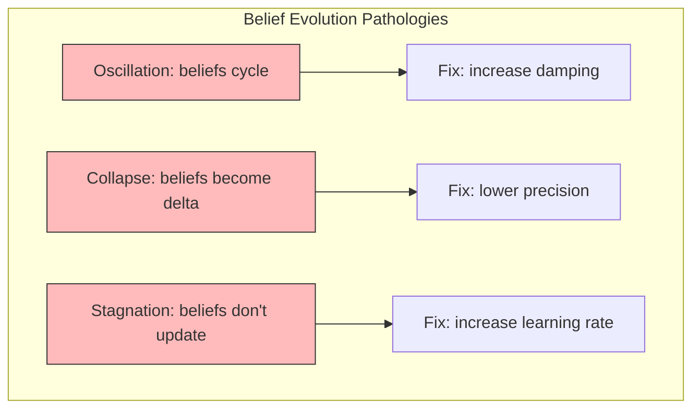

# Belief Evolution

Belief evolution tracks how an Active Inference agent's approximate posterior $q(s)$ changes over time as new observations arrive. Understanding belief dynamics is essential for diagnosing inference quality, characterizing agent behavior, and identifying pathological states.

## Temporal Dynamics

### Continuous-Time Belief Dynamics

In continuous Active Inference, beliefs evolve via gradient descent on free energy:

```math
\dot{\mu} = -\kappa \frac{\partial F}{\partial \mu} = \kappa \left( \Pi_o \varepsilon_o + \Pi_s \varepsilon_s \right)
```

where $\varepsilon_o = o - g(\mu)$ is the observation prediction error and $\varepsilon_s = \mu' - f(\mu)$ is the dynamics prediction error.

### Discrete-Time Update

```math
q(s_t) \propto p(o_t|s_t) \sum_{s_{t-1}} p(s_t|s_{t-1}, a_{t-1}) q(s_{t-1})
```

This combines the observation likelihood with the predicted belief from the previous time step via the transition model.

### Multi-Step Belief Trajectory

```python
def track_belief_evolution(agent, observations, T):
    """Track belief evolution over T timesteps with diagnostic measures."""
    beliefs = np.zeros((T, agent.num_states))
    free_energies = np.zeros(T)
    kl_divergences = np.zeros(T)
    entropies = np.zeros(T)

    for t in range(T):
        beliefs[t] = agent.infer_states(observations[t])
        free_energies[t] = agent.compute_free_energy(observations[t])
        entropies[t] = -np.sum(beliefs[t] * np.log(beliefs[t] + 1e-16))
        if t > 0:
            kl_divergences[t] = np.sum(beliefs[t] * np.log(
                (beliefs[t] + 1e-16) / (beliefs[t-1] + 1e-16)))

    return {
        'beliefs': beliefs,
        'free_energies': free_energies,
        'kl_divergences': kl_divergences,
        'entropies': entropies,
    }
```

## Diagnostic Measures

| Measure | Formula | Interpretation |
| --- | --- | --- |
| Belief entropy | $H[q(s_t)] = -\sum_i q_i \ln q_i$ | Uncertainty in current beliefs |
| KL from prior | $D_{KL}[q(s_t)||p(s_t)]$ | Divergence from prior model |
| Belief volatility | $\frac{1}{T}\sum_t D_{KL}[q(s_t)||q(s_{t-1})]$ | Rate of belief change |
| Convergence rate | $\lambda = \lim_{t\to\infty} \frac{\ln ||q_t - q^*||}{t}$ | Speed of convergence |
| Surprise | $-\ln p(o_t)$ | Unexpectedness of observation |

## Pathological Belief Dynamics



### Detection Criteria

- **Oscillation**: $\text{Var}(D_{KL}[q_t||q_{t-1}]) > \theta_{osc}$
- **Collapse**: $H[q(s_t)] < \epsilon_{collapse}$
- **Stagnation**: $\max_t D_{KL}[q_t||q_{t-1}] < \epsilon_{stag}$

## Related Topics

- [[knowledge_base/cognitive/belief_updating]] — Belief updating mechanisms
- [[convergence_analysis]] — Convergence properties
- [[state_estimation]] — State inference methods
- [[stability_analysis]] — Stability of belief dynamics
- [[knowledge_base/cognitive/active_inference]] — Core framework
