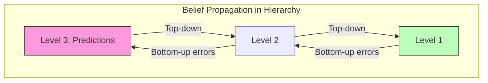

# Belief Propagation

Belief propagation is a message-passing algorithm for performing inference in graphical models. In Active Inference, it provides the computational substrate for hierarchical predictive coding and variational message passing.

## Algorithm

### Sum-Product Message Passing

```math
\begin{aligned}
& \text{Variable to factor:} \quad \mu_{x \to f}(x) = \prod_{g \in N(x) \setminus f} \mu_{g \to x}(x) \\
& \text{Factor to variable:} \quad \mu_{f \to x}(x) = \sum_{\sim x} f(X) \prod_{y \in N(f) \setminus x} \mu_{y \to f}(y)
\end{aligned}
```

### Marginal Computation

```math
p(x_i) \propto \prod_{f \in N(x_i)} \mu_{f \to x_i}(x_i)
```

### Connection to Predictive Coding

In hierarchical predictive coding, belief propagation implements:
- **Bottom-up messages**: Precision-weighted prediction errors
- **Top-down messages**: Predictions from higher levels
- **Lateral messages**: Precision updates



## Implementation

```python
def belief_propagation(factors, variables, max_iter=100, tol=1e-6):
    messages = initialize_messages(factors, variables)
    for iteration in range(max_iter):
        old_messages = messages.copy()
        for factor in factors:
            for var in factor.neighbors:
                messages[factor, var] = compute_factor_to_var(factor, var, messages)
        for var in variables:
            for factor in var.neighbors:
                messages[var, factor] = compute_var_to_factor(var, factor, messages)
        if converged(messages, old_messages, tol):
            break
    marginals = compute_marginals(variables, messages)
    return marginals
```

## Related Topics

- [[knowledge_base/mathematics/message_passing]] — General message passing
- [[knowledge_base/mathematics/factor_graphs]] — Factor graph structures
- [[knowledge_base/mathematics/graphical_models]] — Graphical model theory
- [[knowledge_base/cognitive/predictive_coding]] — Predictive coding architecture
