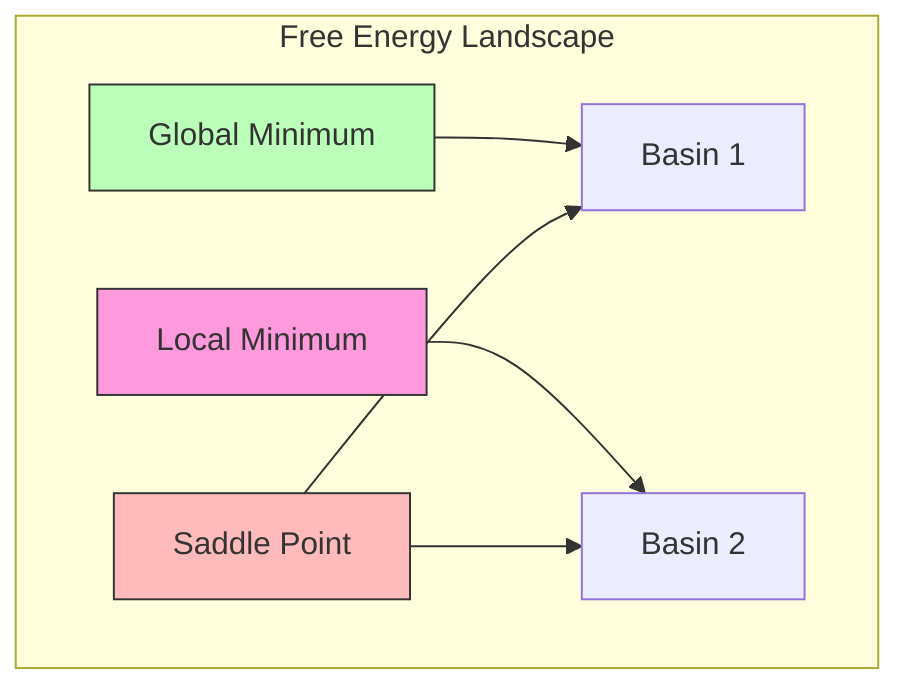

# Free Energy Landscape

The free energy landscape characterizes the topology of the variational free energy function over belief space, revealing attractors, basins, and transition paths that determine agent behavior.

## Landscape Topology

### Free Energy as a Function of Beliefs

```math
F(\mu) = -\ln p(o|\mu) + D_{KL}[q(s|\mu)||p(s)]
```

where $\mu$ parameterizes the approximate posterior $q(s|\mu)$.

### Critical Points

```math
\begin{aligned}
& \text{Gradient:} \quad \nabla_\mu F = 0 \quad \text{(stationary points)} \\
& \text{Hessian:} \quad H_{ij} = \frac{\partial^2 F}{\partial \mu_i \partial \mu_j} \\
& \text{Minimum:} \quad H \succ 0 \quad \text{(positive definite)}
\end{aligned}
```

### Landscape Features



## Visualization

```python
def plot_free_energy_landscape(F_func, mu_range, resolution=100):
    mu1 = np.linspace(*mu_range, resolution)
    mu2 = np.linspace(*mu_range, resolution)
    MU1, MU2 = np.meshgrid(mu1, mu2)
    F_vals = np.array([[F_func([m1, m2]) for m1 in mu1] for m2 in mu2])
    fig = plt.figure(figsize=(12, 8))
    ax = fig.add_subplot(111, projection='3d')
    ax.plot_surface(MU1, MU2, F_vals, cmap='viridis', alpha=0.8)
    ax.set_xlabel('μ₁'); ax.set_ylabel('μ₂'); ax.set_zlabel('F(μ)')
    return fig
```

## Related Topics

- [[knowledge_base/mathematics/free_energy]] — Free energy theory
- [[knowledge_base/mathematics/variational_free_energy]] — Variational free energy
- [[stability_analysis]] — Stability around minima
- [[knowledge_base/cognitive/free_energy_minimization]] — Minimization algorithms
