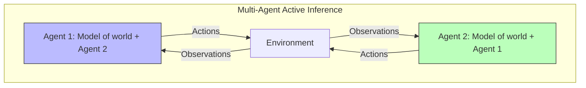

# Game Theory

Game-theoretic analysis of multi-agent Active Inference systems, including strategic interactions, equilibria, and the emergence of cooperation and competition through free energy minimization.

## Active Inference and Games

### Agents as Generative Models

Each agent $i$ maintains a generative model that includes beliefs about other agents' states and intentions:

```math
p_i(o, s, \pi, s_{-i}) = p_i(o|s) p_i(s|\pi, s_{-i}) p_i(\pi) p_i(s_{-i})
```

### Nash Equilibrium as Free Energy Minimum

At equilibrium, no agent can reduce its expected free energy by unilaterally changing its policy:

```math
\pi_i^* = \argmin_{\pi_i} G_i(\pi_i, \pi_{-i}^*) \quad \forall i
```

This connects to the free energy principle: at equilibrium, both agents have minimized their surprise about each other's behavior.

## Game Types in Active Inference

| Game Type | Payoff Structure | Active Inference Analogue | Example |
| --- | --- | --- | --- |
| Coordination | Aligned preferences | Shared generative models | Joint foraging |
| Prisoner's dilemma | Conflict temptation | Competing free energy minima | Resource sharing |
| Stag hunt | Risk dominance | Precision-dependent cooperation | Collective hunting |
| Matching pennies | Zero-sum | Adversarial inference | Predator-prey |
| Public goods | Free-rider problem | Common pool surprise | Group defense |

## Theory of Mind in Games

Active Inference agents can model other agents' beliefs, creating recursive belief hierarchies:

```math
\begin{aligned}
& \text{Level 0:} \quad q_i(s_{-i}) \quad \text{(beliefs about others' states)} \\
& \text{Level 1:} \quad q_i(q_{-i}(s_i)) \quad \text{(beliefs about others' beliefs about me)} \\
& \text{Level k:} \quad q_i(q_{-i}^{(k-1)}(...))
\end{aligned}
```



## Implementation

```python
class MultiAgentGame:
    def __init__(self, agents, payoff_matrix):
        self.agents = agents
        self.payoff = payoff_matrix
        self.history = []

    def play_round(self):
        actions = [a.select_action() for a in self.agents]
        rewards = self.payoff[tuple(actions)]
        for i, agent in enumerate(self.agents):
            agent.observe_outcome(rewards[i])
        self.history.append({'actions': actions, 'rewards': rewards})
        return actions, rewards

    def compute_cooperation_rate(self, cooperative_actions):
        total = len(self.history)
        cooperative = sum(1 for h in self.history
                         if all(a in cooperative_actions for a in h['actions']))
        return cooperative / total if total > 0 else 0
```

## Emergence of Cooperation

Through repeated interactions, Active Inference agents can develop cooperative strategies:
1. **Reputation tracking**: Building model of others' cooperativeness
2. **Reciprocity**: Tit-for-tat via learned transition models
3. **Communication**: Sharing generative models to align beliefs
4. **Niche construction**: Modifying environment to promote cooperation

## Related Topics

- [[knowledge_base/mathematics/game_theory]] — Mathematical game theory
- [[knowledge_base/cognitive/multi_agent_active_inference]] — Multi-agent Active Inference
- [[knowledge_base/cognitive/social_cognition]] — Social inference mechanisms
- [[knowledge_base/cognitive/collective_behavior]] — Collective behavior dynamics\n