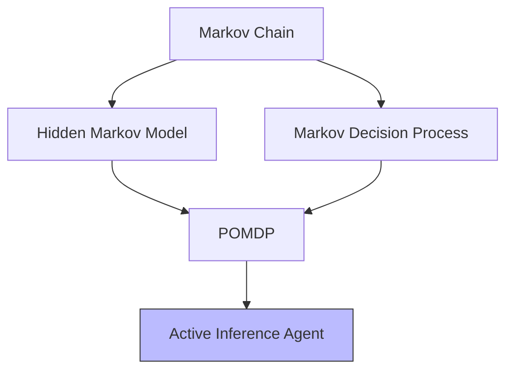

# Markov Models

Markov models provide the stochastic process foundation for Active Inference generative models, from simple Markov chains to Hidden Markov Models and Partially Observable Markov Decision Processes.

## Hierarchy of Markov Models



### Markov Chain

```math
p(s_{t+1} | s_t, s_{t-1}, ...) = p(s_{t+1} | s_t)
```

### Hidden Markov Model

```math
\begin{aligned}
& p(s_{t+1} | s_t) = B_{s_{t+1}, s_t} \quad \text{(transition)} \\
& p(o_t | s_t) = A_{o_t, s_t} \quad \text{(emission)}
\end{aligned}
```

### POMDP (Active Inference)

```math
\begin{aligned}
& s_{t+1} \sim B(a_t) \cdot s_t \\
& o_t \sim A \cdot s_t \\
& \pi^* = \argmin_\pi G(\pi)
\end{aligned}
```

## Implementation

```python
class MarkovChain:
    def __init__(self, transition_matrix, initial_state):
        self.T = transition_matrix
        self.state = initial_state

    def step(self):
        self.state = np.random.choice(len(self.T), p=self.T[:, self.state])
        return self.state

    def stationary_distribution(self):
        eigenvalues, eigenvectors = np.linalg.eig(self.T)
        idx = np.argmin(np.abs(eigenvalues - 1.0))
        pi = np.real(eigenvectors[:, idx])
        return pi / pi.sum()
```

## Related Topics

- [[state_spaces]] — State space structures
- [[hidden_states]] — Hidden state inference
- [[knowledge_base/mathematics/stochastic_processes]] — Stochastic process theory
- [[knowledge_base/mathematics/active_inference_pomdp]] — POMDP formulation
- [[knowledge_base/mathematics/markov_blanket]] — Markov blanket theory
