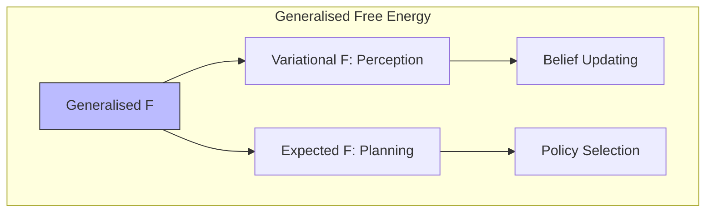

# Parr & Friston (2019): Generalised Free Energy and Active Inference

## Citation

Parr, T., & Friston, K. J. (2019). Generalised free energy and active inference. *Biological Cybernetics*, 113(5-6), 495-513.

## Motivation

The original Active Inference framework used two distinct objectives—variational free energy ($F$) for perception and expected free energy ($G$) for planning—creating a theoretical asymmetry. This paper resolves that by introducing generalised free energy as a single unifying objective.

## Key Contributions

1. **Generalised free energy** $\mathcal{F}$ that unifies variational and expected free energy
2. **Formal proof** that $G$ arises naturally from $\mathcal{F}$ when marginalizing over future observations
3. **Temporal depth**: Multi-step policy evaluation as iterated free energy minimization
4. **Risk-sensitive planning**: Natural incorporation of risk aversion through precision over policies
5. **Connection to information geometry**: Generalised free energy as a natural gradient flow

## Core Equations

### Generalised Free Energy

```math
\mathcal{F}(\pi) = \underbrace{F(q(s_\tau|\pi), o_{\leq t})}_{\text{past: variational FE}} + \underbrace{\mathbb{E}_{q(o_{>t}|\pi)}[F(q(s_\tau|\pi), o_{>t})]}_{\text{future: expected FE}}
```

### Epistemic-Pragmatic Decomposition

```math
\begin{aligned}
G(\pi, \tau) &= \underbrace{-\mathbb{E}_{q(o_\tau|\pi)}[D_{KL}[q(s_\tau|o_\tau, \pi)||q(s_\tau|\pi)]]}_{\text{negative epistemic value (info gain)}} \\
&+ \underbrace{\mathbb{E}_{q(s_\tau|\pi)}[H[p(o_\tau|s_\tau)]]}_{\text{ambiguity}} + \underbrace{D_{KL}[q(o_\tau|\pi)||p(o_\tau)]}_{\text{risk (pragmatic)}}
\end{aligned}
```

### Unified Objective for Perception and Planning



## Theoretical Impact

This work resolves a key theoretical gap: prior formulations required separate justifications for perceptual inference (minimize $F$) and action selection (minimize $G$). The generalised formulation shows both emerge from a single variational principle applied at different temporal scales.

### Implications for Implementation

| Aspect | Before (2017) | After (2019) |
| --- | --- | --- |
| Perception | Minimize $F$ | Minimize $\mathcal{F}$ (present) |
| Planning | Minimize $G$ | Minimize $\mathcal{F}$ (future) |
| Theoretical basis | Two objectives | One unified objective |
| Risk sensitivity | Ad hoc | Naturally emerges |
| Temporal depth | Fixed | Flexible |

## Frequently Used in Conjunction With

- [[friston_2017]] — Original process theory that this paper extends
- [[knowledge_base/cognitive/active_inference]] — Core Active Inference framework
- [[knowledge_base/mathematics/expected_free_energy]] — Expected free energy derivation
- [[knowledge_base/mathematics/variational_free_energy]] — Variational free energy
- [[knowledge_base/mathematics/free_energy_principle]] — Free energy principle

## References

- Parr, T., & Friston, K. J. (2019). Generalised free energy and active inference. *Biological Cybernetics*, 113(5-6), 495-513.
- Friston, K. J., et al. (2017). Active inference: A process theory. *Neural Computation*, 29(1), 1-49.
- Da Costa, L., et al. (2020). Active inference on discrete state-spaces.
