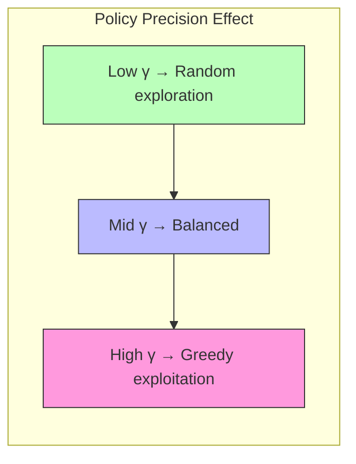

# Policy Optimization

Methods for optimizing policy selection in Active Inference, from exhaustive evaluation of discrete policy sets to gradient-based continuous policy optimization, and their computational trade-offs.

## Discrete Policy Evaluation

### Expected Free Energy

```math
\begin{aligned}
& G(\pi) = \sum_{\tau=t+1}^{T} G(\pi, \tau) \\
& G(\pi, \tau) = \underbrace{\mathbb{E}_{q(s_\tau|\pi)}[H[p(o_\tau|s_\tau)]]}_{\text{ambiguity}} + \underbrace{D_{KL}[q(o_\tau|\pi)||p(o_\tau)]}_{\text{risk}}
\end{aligned}
```

Equivalently decomposed as:

```math
G(\pi, \tau) = \underbrace{-I[o_\tau; s_\tau | \pi]}_{\text{negative info gain}} + \underbrace{\mathbb{E}_{q(o_\tau|\pi)}[-\ln p(o_\tau)]}_{\text{expected surprise}}
```

### Policy Posterior (Softmax Selection)

```math
q(\pi) = \sigma(-\gamma G(\pi)) \cdot E(\pi) = \frac{\exp(-\gamma G(\pi)) \cdot E(\pi)}{\sum_{\pi'} \exp(-\gamma G(\pi')) \cdot E(\pi')}
```

where $E(\pi)$ encodes policy habits (prior over policies) and $\gamma$ is the policy precision.

### Policy Precision and Behavior



## Policy Search Methods

### Exhaustive Search (Small Action Spaces)

```python
class PolicyOptimizer:
    def __init__(self, model, gamma=4.0):
        self.model = model
        self.gamma = gamma

    def evaluate_policies(self, beliefs, policies):
        G = np.zeros(len(policies))
        for i, pi in enumerate(policies):
            G[i] = self.expected_free_energy(beliefs, pi)
        posterior = self.softmax(-self.gamma * G)
        return posterior, G

    def expected_free_energy(self, beliefs, policy):
        G_total = 0
        predicted_states = beliefs.copy()
        for action in policy:
            predicted_states = self.model.B[action] @ predicted_states
            predicted_obs = self.model.A @ predicted_states
            ambiguity = -np.sum(predicted_states *
                np.sum(self.model.A * np.log(self.model.A + 1e-16), axis=0))
            risk = np.sum(predicted_obs * np.log(
                (predicted_obs + 1e-16) / (np.exp(self.model.C) + 1e-16)))
            G_total += ambiguity + risk
        return G_total

    @staticmethod
    def softmax(x):
        e_x = np.exp(x - np.max(x))
        return e_x / e_x.sum()
```

### Scalability Challenges

| Horizon $T$ | Actions $|A|$ | Policies $|A|^T$ | Feasibility |
| --- | --- | --- | --- |
| 1 | 4 | 4 | Trivial |
| 3 | 4 | 64 | Easy |
| 5 | 4 | 1024 | Moderate |
| 10 | 4 | ~1M | Requires pruning |
| 20 | 4 | ~1T | Intractable exhaustive |

### Approximate Policy Search

For large action spaces, use:
1. **Monte Carlo tree search**: Sample promising policy branches
2. **Policy gradient methods**: Optimize parameterized policy directly
3. **Habit learning**: Use $E(\pi)$ to prune unlikely policies
4. **Hierarchical policies**: Decompose into sub-goals

## Related Topics

- [[knowledge_base/mathematics/policy_selection]] — Policy selection theory
- [[knowledge_base/cognitive/policy_selection]] — Cognitive policy selection
- [[knowledge_base/cognitive/action_selection]] — Action selection mechanisms
- [[knowledge_base/mathematics/expected_free_energy]] — Expected free energy
- [[knowledge_base/mathematics/exploration_exploitation]] — Exploration-exploitation trade-off\n