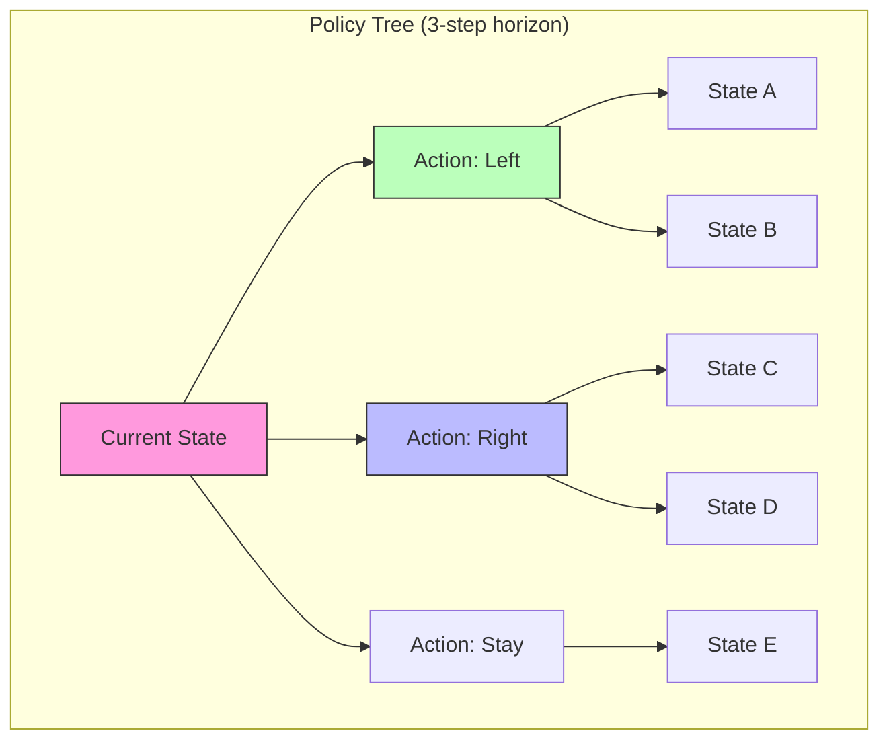

# Policy Visualization

Methods for visualizing policy evaluation, selection, and execution in Active Inference agents. Effective policy visualization reveals the information-theoretic structure of decision-making, including the epistemic and pragmatic components of expected free energy.

## Core Visualizations

### Expected Free Energy Decomposition

```python
import matplotlib.pyplot as plt
import numpy as np

def plot_efe_decomposition(G_epistemic, G_pragmatic, policy_labels=None):
    """Plot epistemic and pragmatic components of expected free energy."""
    n_policies = len(G_epistemic)
    x = np.arange(n_policies)
    width = 0.35

    fig, ax = plt.subplots(figsize=(12, 6))
    bars1 = ax.bar(x - width/2, G_epistemic, width, label='Epistemic (info gain)',
                   color='#3498db', alpha=0.8)
    bars2 = ax.bar(x + width/2, G_pragmatic, width, label='Pragmatic (preference)',
                   color='#e74c3c', alpha=0.8)

    ax.set_ylabel('Free Energy Component', fontsize=12)
    ax.set_title('Expected Free Energy Decomposition by Policy', fontsize=14)
    ax.set_xticks(x)
    ax.set_xticklabels(policy_labels or [f'π{i}' for i in range(n_policies)])
    ax.legend(fontsize=11)
    ax.axhline(y=0, color='black', linewidth=0.5)
    plt.tight_layout()
    return fig
```

### Policy Tree Visualization



### Action Probability Timeline

```python
def plot_action_timeline(action_probs, action_labels, title="Policy Selection Over Time"):
    """Plot how action probabilities evolve over time."""
    T, n_actions = action_probs.shape
    fig, ax = plt.subplots(figsize=(14, 6))
    colors = plt.cm.Set2(np.linspace(0, 1, n_actions))

    ax.stackplot(range(T), action_probs.T, labels=action_labels,
                 colors=colors, alpha=0.8)
    ax.set_xlabel('Time Step', fontsize=12)
    ax.set_ylabel('Action Probability', fontsize=12)
    ax.set_title(title, fontsize=14)
    ax.legend(loc='upper right')
    ax.set_xlim(0, T-1)
    ax.set_ylim(0, 1)
    plt.tight_layout()
    return fig
```

### Belief-Action Phase Space

```python
def plot_belief_action_phase(beliefs, actions, state_labels=None):
    """2D phase plot showing belief-action trajectories."""
    fig, ax = plt.subplots(figsize=(10, 10))
    n_states = beliefs.shape[1]
    if n_states >= 2:
        scatter = ax.scatter(beliefs[:, 0], beliefs[:, 1],
                           c=actions, cmap='viridis', s=30, alpha=0.7)
        ax.plot(beliefs[:, 0], beliefs[:, 1], 'k-', alpha=0.2)
        ax.set_xlabel(state_labels[0] if state_labels else 'Belief dim 0', fontsize=12)
        ax.set_ylabel(state_labels[1] if state_labels else 'Belief dim 1', fontsize=12)
        plt.colorbar(scatter, label='Action')
    ax.set_title('Belief-Action Phase Space', fontsize=14)
    plt.tight_layout()
    return fig
```

## Dashboard Integration

A comprehensive policy visualization dashboard combines multiple views:

1. **EFE bar chart**: Per-policy expected free energy with decomposition
2. **Policy posterior**: Softmax distribution over policies
3. **Action timeline**: How selected actions change across trials
4. **Belief trajectory**: State beliefs evolving with policy execution
5. **Cumulative reward**: Task performance over time

## Related Topics

- [[data_visualization]] — General visualization techniques
- [[knowledge_base/cognitive/visualization_suite]] — Comprehensive visualization tools
- [[knowledge_base/cognitive/policy_selection]] — Policy selection mechanisms
- [[knowledge_base/mathematics/expected_free_energy]] — Expected free energy theory
