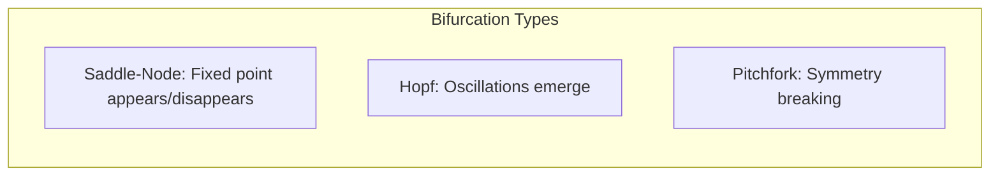

# Stability Analysis

Analysis of stability properties in Active Inference agents, including Lyapunov stability of belief dynamics, attractor analysis, and robustness to perturbations.

## Lyapunov Stability

### Free Energy as Lyapunov Function

The variational free energy $F$ serves as a natural Lyapunov function for Active Inference systems:

```math
\begin{aligned}
& V(\mu) = F(\mu, o) \geq 0 \quad \text{(positive definite)} \\
& \dot{V}(\mu) = \frac{dF}{dt} = \nabla_\mu F \cdot \dot{\mu} = -\kappa ||\nabla_\mu F||^2 \leq 0 \quad \text{(negative semi-definite)}
\end{aligned}
```

This guarantees that gradient descent on free energy converges to a stationary point.

### Stability Conditions

```math
\begin{aligned}
& \text{Stable equilibrium:} \quad \text{all eigenvalues of } J \text{ have negative real parts} \\
& \text{Jacobian:} \quad J_{ij} = \frac{\partial f_i}{\partial \mu_j}\bigg|_{\mu^*} \\
& \text{where } f(\mu) = -\kappa \nabla_\mu F
\end{aligned}
```

### Basin of Attraction

```python
def estimate_basin_of_attraction(F_func, equilibrium, perturbation_range, 
                                  n_samples=1000, threshold=0.1):
    """Estimate basin of attraction around an equilibrium point."""
    in_basin = 0
    for _ in range(n_samples):
        perturbation = np.random.uniform(-perturbation_range, perturbation_range, 
                                         len(equilibrium))
        initial = equilibrium + perturbation
        trajectory = simulate_gradient_descent(F_func, initial, max_steps=1000)
        final = trajectory[-1]
        if np.linalg.norm(final - equilibrium) < threshold:
            in_basin += 1
    return in_basin / n_samples
```

## Bifurcation Analysis

Changes in model parameters can cause qualitative changes in system behavior:



### Parameter Sensitivity

Key bifurcation parameters in Active Inference:
- **Policy precision** $\gamma$: Determines sharpness of policy selection
- **Observation precision** $\Pi_o$: Affects belief update stability
- **Learning rate** $\kappa$: Controls adaptation speed vs. stability

## Related Topics

- [[convergence_analysis]] — Convergence properties
- [[free_energy_landscape]] — Free energy topology
- [[knowledge_base/mathematics/dynamical_systems]] — Dynamical systems theory
- [[knowledge_base/cognitive/homeostatic_control_theory]] — Homeostatic stability
