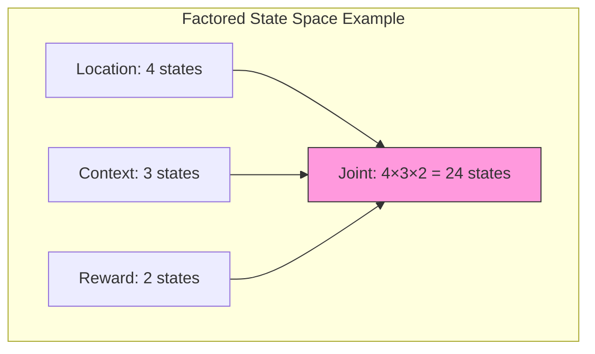

# State Spaces

State space design and analysis for Active Inference generative models, covering discrete, continuous, factored, and hierarchical state representations.

## State Space Types

### Discrete State Spaces

```math
\mathcal{S} = \{s_1, s_2, ..., s_N\}, \quad |\mathcal{S}| = N
```

Used in POMDP-based Active Inference. States are represented as one-hot or probabilistic vectors.

### Continuous State Spaces

```math
\mathcal{S} \subseteq \mathbb{R}^d
```

Used in continuous-time Active Inference with generalized coordinates.

### Factored State Spaces

```math
\mathcal{S} = \mathcal{S}_1 \times \mathcal{S}_2 \times ... \times \mathcal{S}_K
```

Each factor represents an independent state dimension. Total states: $|\mathcal{S}| = \prod_k |\mathcal{S}_k|$.



## Design Considerations

### Granularity vs Tractability

| States | Inference Cost | Representational Power | Typical Use |
| --- | --- | --- | --- |
| 2-10 | Very low | Limited | Toy problems |
| 10-100 | Low | Moderate | Standard tasks |
| 100-1000 | Medium | High | Complex domains |
| 1000+ | High | Very high | Real-world (use factoring) |

### State Space Design Principles

```python
class StateSpaceDesigner:
    def __init__(self, domain_description):
        self.domain = domain_description

    def design(self):
        factors = self.identify_independent_factors()
        for factor in factors:
            factor['labels'] = self.enumerate_levels(factor)
            factor['transitions'] = self.specify_dynamics(factor)
        return FactoredStateSpace(factors)

    def identify_independent_factors(self):
        return [
            {'name': 'location', 'type': 'spatial', 'n_levels': None},
            {'name': 'context', 'type': 'categorical', 'n_levels': None},
            {'name': 'internal', 'type': 'physiological', 'n_levels': None},
        ]
```

## Related Topics

- [[hidden_states]] — Hidden state inference
- [[knowledge_base/cognitive/state_space_abstraction]] — State space abstraction
- [[knowledge_base/mathematics/active_inference_pomdp]] — POMDP state spaces
- [[markov_models]] — Markov model state structures
