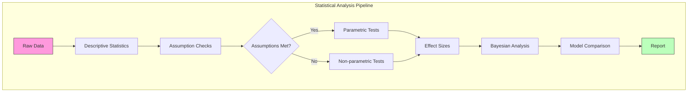

# Statistical Analysis

Comprehensive statistical analysis methods for evaluating Active Inference experiments and simulations, integrating both Bayesian and frequentist approaches.

## Analysis Pipeline



## Descriptive Statistics

```python
def descriptive_summary(data, group_var='condition', metric_var='free_energy'):
    """Compute descriptive statistics for Active Inference experiment data."""
    summary = data.groupby(group_var)[metric_var].agg([
        'mean', 'std', 'median', 'count',
        lambda x: x.quantile(0.25),
        lambda x: x.quantile(0.75),
        lambda x: stats.sem(x)
    ])
    summary.columns = ['mean', 'std', 'median', 'n', 'Q1', 'Q3', 'SEM']
    return summary
```

## Inferential Statistics

### For Comparing Agent Conditions

| Scenario | Recommended Test | Bayesian Alternative |
| --- | --- | --- |
| 2 groups, normal | Independent t-test | Bayesian t-test |
| 2 groups, non-normal | Mann-Whitney U | Bayesian rank test |
| >2 groups, normal | One-way ANOVA | Bayesian ANOVA |
| >2 groups, non-normal | Kruskal-Wallis | Bayesian rank test |
| Repeated measures | Repeated-measures ANOVA | Bayesian RM-ANOVA |
| Time series | Linear mixed model | Bayesian mixed model |

### Complete Analysis Function

```python
from scipy import stats
import numpy as np

def analyze_experiment(conditions, metric='cumulative_reward', alpha=0.05):
    results = {}
    groups = [conditions[c][metric] for c in conditions]
    
    # Normality check
    normality = {c: stats.shapiro(conditions[c][metric])[1] for c in conditions}
    all_normal = all(p > alpha for p in normality.values())
    
    # Homogeneity of variance
    _, levene_p = stats.levene(*groups)
    
    if len(groups) == 2:
        if all_normal and levene_p > alpha:
            stat, p = stats.ttest_ind(*groups)
            test_name = 'Independent t-test'
        else:
            stat, p = stats.mannwhitneyu(*groups)
            test_name = 'Mann-Whitney U'
        d = (np.mean(groups[0]) - np.mean(groups[1])) / np.sqrt(
            (np.var(groups[0]) + np.var(groups[1])) / 2)
        results['effect_size'] = d
    else:
        if all_normal and levene_p > alpha:
            stat, p = stats.f_oneway(*groups)
            test_name = 'One-way ANOVA'
        else:
            stat, p = stats.kruskal(*groups)
            test_name = 'Kruskal-Wallis'
    
    results.update({'test': test_name, 'statistic': stat, 'p_value': p,
                    'normality': normality, 'equal_variance': levene_p > alpha})
    return results
```

## Reporting Standards

For Active Inference experiments, report:
1. **Sample sizes** per condition (seeds × trials)
2. **Descriptive statistics** (mean, SD, 95% CI)
3. **Test statistic and p-value**
4. **Effect size with interpretation**
5. **Bayes factor** (when possible)
6. **Free energy convergence curves**

## Related Topics

- [[bayesian_analysis]] — Bayesian statistical methods
- [[frequentist_analysis]] — Frequentist methods
- [[hypothesis_testing]] — Hypothesis testing framework
- [[power_analysis]] — Sample size planning
- [[model_comparison]] — Model comparison methods
