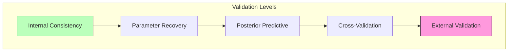

# Validation Methods

Methods for validating Active Inference models, including cross-validation, simulation-based calibration, posterior predictive checks, and parameter recovery.

## Validation Framework

### Model Validation Hierarchy



## Core Methods

### Parameter Recovery

Tests whether the model can recover known parameters from simulated data:

```python
def parameter_recovery(model_class, true_params, n_simulations=100):
    """Test if model can recover its own parameters from generated data."""
    recovered = {p: [] for p in true_params}
    
    for _ in range(n_simulations):
        model = model_class(**true_params)
        synthetic_data = model.generate_data(n_trials=200)
        fitted = model_class.fit(synthetic_data)
        for p in true_params:
            recovered[p].append(getattr(fitted, p))
    
    results = {}
    for p in true_params:
        rec = np.array(recovered[p])
        results[p] = {
            'true': true_params[p],
            'mean_recovered': np.mean(rec),
            'std_recovered': np.std(rec),
            'correlation': np.corrcoef([true_params[p]]*len(rec), rec)[0, 1],
            'bias': np.mean(rec) - true_params[p],
        }
    return results
```

### Posterior Predictive Check

```math
p(o^{rep}|o) = \int p(o^{rep}|\theta) p(\theta|o) d\theta
```

### Cross-Validation

```python
def k_fold_cross_validation(model_class, data, k=5):
    fold_size = len(data) // k
    scores = []
    for i in range(k):
        test_data = data[i*fold_size:(i+1)*fold_size]
        train_data = np.concatenate([data[:i*fold_size], data[(i+1)*fold_size:]])
        model = model_class.fit(train_data)
        score = -model.compute_free_energy(test_data)
        scores.append(score)
    return {'mean_score': np.mean(scores), 'std_score': np.std(scores), 'scores': scores}
```

### Simulation-Based Calibration

```math
\text{SBC rank} = \sum_{l=1}^{L} \mathbb{1}[\theta_l^{sim} < \theta^{true}]
```

If calibrated, SBC ranks should be uniformly distributed.

## Validation Checklist

| Check | Method | Pass Criterion |
| --- | --- | --- |
| Internal consistency | Unit tests | All pass |
| Parameter recovery | Simulation | $r > 0.9$ for all params |
| Posterior calibration | SBC | Uniform rank distribution |
| Predictive accuracy | Cross-validation | Competitive evidence |
| Convergence | Multiple seeds | Consistent results |
| Sensitivity | Perturbation analysis | Stable under noise |

## Related Topics

- [[goodness_of_fit]] — Model fit assessment
- [[model_comparison]] — Model selection
- [[knowledge_base/cognitive/quality_metrics]] — Quality metrics
- [[knowledge_base/cognitive/performance_metrics]] — Performance evaluation
